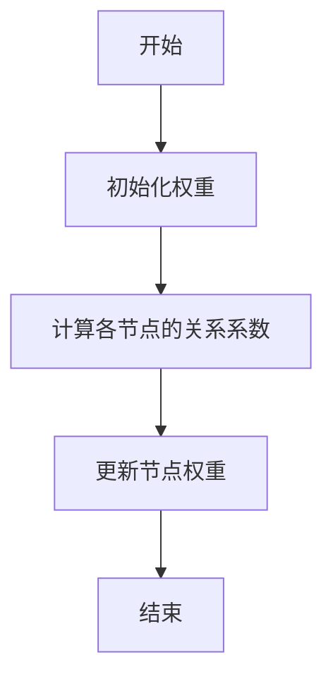
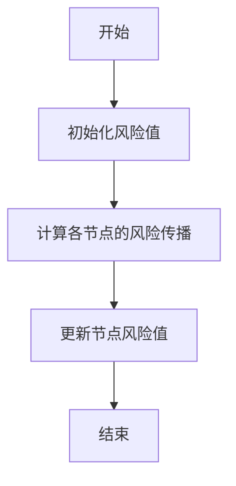
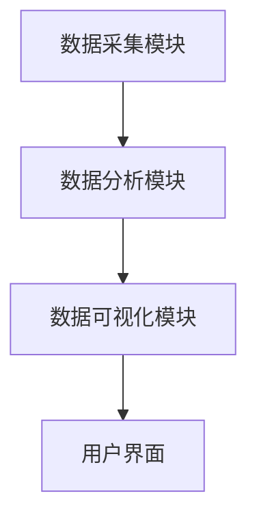

                 


# 费雪的供应链分析在投资中的应用

## 关键词：供应链分析，投资，费雪，节点分析，流程优化，风险评估

## 摘要：费雪的供应链分析是一种通过评估企业供应链的各个节点和流程，来预测和优化企业运营效率和投资回报的方法。本文详细介绍了供应链分析的核心概念、算法原理、系统架构设计以及实际项目案例，帮助投资者更好地理解如何将供应链分析应用于投资决策中。

---

## 第一部分: 费雪的供应链分析基础

## 第1章: 供应链分析的定义与背景

### 1.1 供应链分析的定义

供应链分析是一种通过对供应链的各个节点和流程进行系统性分析，以评估企业运营效率、成本控制和风险抵御能力的方法。费雪的供应链分析方法将供应链视为一个复杂的网络，通过量化各节点的权重和风险，为企业提供更精准的投资决策支持。

#### 1.1.1 供应链的基本概念
供应链是指从原材料采购到产品交付给最终用户的整个过程，包括供应商、制造商、分销商和客户等多个环节。供应链管理的目标是优化流程、降低成本、提高效率和增强灵活性。

#### 1.1.2 费雪的供应链分析方法
费雪的供应链分析方法强调从整体网络的角度分析供应链的各个节点，通过量化节点的重要性来评估其对整体供应链的影响。这种方法不仅关注单个节点的表现，还关注节点之间的相互作用和协同效应。

#### 1.1.3 供应链分析在投资中的应用价值
供应链分析在投资中的应用可以帮助投资者识别企业的核心竞争力，评估企业的运营效率和抗风险能力，从而做出更明智的投资决策。通过分析供应链的节点权重和风险传播，投资者可以更好地预测企业的未来表现。

### 1.2 供应链分析的核心要素

供应链分析的核心要素包括供应商分析、生产过程分析和分配与物流分析。这些要素共同构成了供应链的完整网络，影响企业的运营效率和投资回报。

#### 1.2.1 供应商分析
供应商分析是供应链分析的重要组成部分。通过分析供应商的稳定性、供货能力和成本优势，投资者可以评估企业在供应链中的议价能力和成本控制能力。

#### 1.2.2 生产过程分析
生产过程分析关注企业的生产效率、成本控制和质量管理水平。通过分析生产过程中的瓶颈和浪费，投资者可以评估企业的生产效率和运营能力。

#### 1.2.3 分配与物流分析
分配与物流分析关注产品的分销和物流效率。通过分析物流网络的覆盖范围、运输成本和交付时间，投资者可以评估企业在市场中的竞争力和客户满意度。

### 1.3 供应链分析的背景与发展趋势

#### 1.3.1 全球化背景下的供应链复杂性
全球化使得供应链更加复杂，企业需要面对更多的供应商、分销商和物流渠道。供应链的复杂性增加了管理难度，同时也为投资者提供了更多的分析维度。

#### 1.3.2 数字化与智能化供应链的发展趋势
随着信息技术的发展，供应链管理正在向数字化和智能化方向发展。通过大数据分析、人工智能和物联网技术，投资者可以更精准地分析供应链的各个环节，优化投资决策。

#### 1.3.3 供应链分析对投资决策的影响
供应链分析可以帮助投资者识别企业的竞争优势和潜在风险，从而做出更明智的投资决策。通过分析供应链的节点权重和风险传播，投资者可以更好地预测企业的未来表现。

## 第2章: 供应链分析的核心概念与联系

### 2.1 核心概念原理

供应链分析的核心概念包括节点分析、流程优化和风险评估。这些概念共同构成了供应链分析的理论基础，指导投资者在实际操作中进行分析和决策。

#### 2.1.1 费雪供应链分析的理论基础
费雪的供应链分析方法基于网络理论和系统工程学，将供应链视为一个复杂的网络，通过量化各节点的权重和风险，评估供应链的整体性能。

#### 2.1.2 供应链网络的构建与优化
供应链网络的构建与优化是供应链分析的核心任务。通过分析各节点之间的关系，投资者可以优化供应链的结构和流程，提高企业的运营效率。

#### 2.1.3 供应链节点的权重计算方法
节点权重计算方法是供应链分析的重要工具。通过量化各节点的重要性，投资者可以识别供应链中的关键节点，制定更有效的管理策略。

### 2.2 核心概念对比表

通过对比供应链分析与传统财务分析，可以帮助投资者更好地理解供应链分析的独特价值。

#### 2.2.1 供应链节点分析与传统财务分析对比
供应链节点分析关注供应链的各个节点及其相互作用，而传统财务分析关注企业的财务指标和财务报表。供应链节点分析提供了更全面的企业分析视角。

#### 2.2.2 供应链流程优化与企业运营效率对比
供应链流程优化关注供应链各环节的效率，而企业运营效率关注企业的整体运营能力。供应链流程优化是提高企业运营效率的重要手段。

#### 2.2.3 供应链风险评估与投资风险控制对比
供应链风险评估关注供应链中的潜在风险，而投资风险控制关注投资活动中的风险。供应链风险评估是投资风险控制的重要组成部分。

### 2.3 实体关系图（ER图）

通过实体关系图（ER图），投资者可以更清晰地理解供应链的结构和各节点之间的关系。

#### 2.3.1 供应链节点的实体关系
供应链节点包括供应商、制造商、分销商和客户。通过ER图可以清晰地展示各节点之间的关系。

#### 2.3.2 供应链流程的实体关系
供应链流程包括采购、生产、仓储和配送。通过ER图可以展示各流程之间的关系和数据流。

#### 2.3.3 供应链风险的实体关系
供应链风险包括供应商风险、生产风险和物流风险。通过ER图可以展示各风险之间的关系和相互影响。

## 第3章: 供应链分析的算法原理

### 3.1 节点权重计算算法

节点权重计算算法是供应链分析的重要工具，通过量化各节点的重要性，投资者可以识别供应链中的关键节点。

#### 3.1.1 节点权重计算的数学模型
节点权重计算的数学模型可以通过线性回归或网络模型来实现。例如，可以使用以下公式计算节点权重：

$$
w_i = \sum_{j=1}^{n} a_{ij} \cdot w_j
$$

其中，$w_i$ 是节点 $i$ 的权重，$a_{ij}$ 是节点 $i$ 和节点 $j$ 之间的关系系数，$w_j$ 是节点 $j$ 的权重。

#### 3.1.2 节点权重计算的流程图
节点权重计算的流程图如下：



#### 3.1.3 节点权重计算的Python代码实现

```python
def calculate_node_weights(nodes, relationships):
    weights = {node: 1 for node in nodes}
    for i in range(len(nodes)):
        for node in nodes:
            if node in relationships[i]:
                weights[node] += relationships[i][node]
    return weights
```

### 3.2 风险传播模型

风险传播模型是供应链分析的重要工具，通过量化供应链中的风险传播，投资者可以更好地评估投资风险。

#### 3.2.1 风险传播模型的数学公式
风险传播模型可以通过以下公式表示：

$$
R_i = \sum_{j=1}^{n} w_{ij} \cdot R_j
$$

其中，$R_i$ 是节点 $i$ 的风险值，$w_{ij}$ 是节点 $i$ 和节点 $j$ 之间的关系系数，$R_j$ 是节点 $j$ 的风险值。

#### 3.2.2 风险传播模型的流程图
风险传播模型的流程图如下：



#### 3.2.3 风险传播模型的Python代码实现

```python
def calculateRiskPropagation(nodes, relationships, initial_risks):
    risks = {node: initial_risks[node] for node in nodes}
    for i in range(len(nodes)):
        for node in nodes:
            if node in relationships[i]:
                risks[node] += relationships[i][node]
    return risks
```

## 第4章: 供应链分析的系统架构设计

### 4.1 系统功能设计

供应链分析系统的功能设计包括数据采集、数据分析和数据可视化。

#### 4.1.1 数据采集模块
数据采集模块负责从供应链的各个节点收集数据，包括供应商数据、生产数据和物流数据。

#### 4.1.2 数据分析模块
数据分析模块负责对收集的数据进行分析，包括节点权重计算和风险传播模型。

#### 4.1.3 数据可视化模块
数据可视化模块负责将分析结果以图表形式展示，帮助投资者更直观地理解供应链的结构和风险。

### 4.2 系统架构图

供应链分析系统的架构图如下：



### 4.3 系统接口设计

系统接口设计包括数据接口、用户接口和报告生成接口。

#### 4.3.1 数据接口
数据接口负责与供应链各节点的数据源进行交互，确保数据的准确性和实时性。

#### 4.3.2 用户接口
用户接口负责与用户的交互，包括数据输入、分析结果展示和用户反馈。

#### 4.3.3 报告生成接口
报告生成接口负责将分析结果生成报告，供投资者参考。

## 第5章: 供应链分析的项目实战

### 5.1 项目背景与目标

#### 5.1.1 项目背景
本项目旨在通过供应链分析方法，帮助投资者评估某制造企业的供应链表现，优化其供应链管理，提高投资回报。

#### 5.1.2 项目目标
项目的目標包括：
1. 分析企业的供应链结构，识别关键节点。
2. 评估供应链中的潜在风险，制定风险控制策略。
3. 优化供应链流程，提高企业的运营效率。

### 5.2 数据收集与预处理

#### 5.2.1 数据来源
数据来源包括企业的财务报表、供应链各节点的运营数据和市场数据。

#### 5.2.2 数据清洗
数据清洗包括去除重复数据、处理缺失值和异常值。

#### 5.2.3 数据转换
数据转换包括将数据转换为适合分析的形式，如标准化和归一化。

### 5.3 模型实现与结果分析

#### 5.3.1 模型实现
模型实现包括节点权重计算和风险传播模型的实现。

#### 5.3.2 结果分析
通过分析节点权重和风险传播，识别供应链中的关键节点和潜在风险，制定优化策略。

#### 5.3.3 案例分析
以某制造企业为例，详细分析其供应链结构，识别关键节点，评估潜在风险，并提出优化建议。

## 第6章: 最佳实践与小结

### 6.1 小结

供应链分析是一种重要的投资分析方法，通过分析供应链的各个节点和流程，投资者可以更好地评估企业的运营效率和抗风险能力，从而做出更明智的投资决策。

### 6.2 注意事项

在进行供应链分析时，投资者需要注意数据的准确性和实时性，确保分析结果的可靠性和有效性。

### 6.3 拓展阅读

建议投资者进一步阅读供应链管理相关的书籍和文献，深入了解供应链分析的理论和实践，提升分析能力。

---

通过本文的详细讲解，投资者可以更好地理解费雪的供应链分析方法，并将其应用于实际投资决策中，提高投资收益和风险管理能力。

