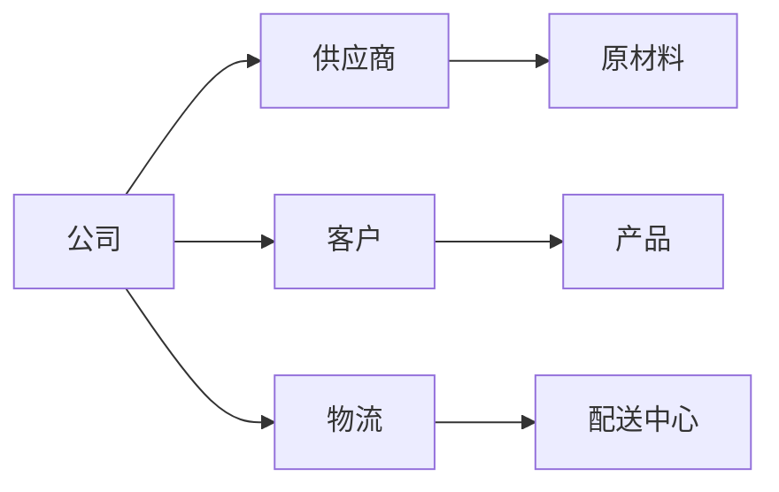

                 

# 费雪的供应链分析：了解公司在产业链中的地位

---

## 关键词：供应链分析，企业定位，产业链，费雪理论，优化策略，系统架构

---

## 摘要：  
供应链分析是企业在现代经济中保持竞争力的关键工具。通过费雪的供应链分析方法，企业可以清晰了解自身在产业链中的位置，优化资源配置，提升效率。本文从供应链的基本概念出发，结合费雪理论的核心思想，详细探讨供应链分析的算法原理、系统架构设计、项目实战案例，以及如何通过最佳实践提升企业供应链管理能力。文章内容丰富，结构清晰，旨在为企业提供实用的供应链分析方法和优化策略。

---

## 目录

### 第一章：供应链分析概述

1.1 供应链的基本概念  
1.1.1 供应链的定义与组成部分  
1.1.2 供应链的重要性与作用  
1.1.3 费雪供应链分析的核心思想  

1.2 供应链分析的背景与现状  
1.2.1 当前供应链管理的发展趋势  
1.2.2 企业供应链分析的必要性  
1.2.3 费雪分析方法的起源与演变  

1.3 供应链分析的核心目标  
1.3.1 提升企业竞争力  
1.3.2 优化资源配置效率  
1.3.3 增强企业抗风险能力  

1.4 本章小结  

---

### 第二章：供应链分析的核心概念与联系

2.1 核心概念原理  
2.1.1 供应链的结构特征  
2.1.2 供应链的关键节点  
2.1.3 供应链的驱动因素  

2.2 核心概念属性对比  
2.2.1 供应链节点的属性特征  
2.2.2 供应链流程的特征对比  
2.2.3 供应链效率与成本的平衡  

2.3 ER实体关系图架构  

2.4 本章小结  

---

### 第三章：供应链分析的算法原理

3.1 供应链分析的常用算法  
3.1.1 线性规划模型  
3.1.2 网络流模型  
3.1.3 动态规划模型  

3.2 算法原理的数学模型  
3.2.1 线性规划模型的数学表达  
$$
\text{目标函数：} \min \sum_{i} c_i x_i
$$  
$$
\text{约束条件：} \sum_{i} a_{ij} x_i = b_j \quad \forall j
$$  

3.3 算法实现与案例分析  
3.3.1 算法实现步骤  
3.3.2 案例分析：某制造企业的供应链优化  

3.4 本章小结  

---

### 第四章：供应链分析的系统架构设计

4.1 系统功能设计  
4.1.1 数据采集与处理模块  
4.1.2 供应链网络优化模块  
4.1.3 供应链风险评估模块  

4.2 系统架构设计  

4.3 系统接口设计  
4.3.1 数据接口规范  
4.3.2 API设计与调用  

4.4 系统交互流程  

4.5 本章小结  

---

### 第五章：供应链分析的项目实战

5.1 项目背景与目标  
5.1.1 项目需求分析  
5.1.2 项目目标设定  

5.2 项目实施步骤  
5.2.1 数据收集与清洗  
5.2.2 模型建立与优化  
5.2.3 结果分析与改进  

5.3 项目案例分析  
5.3.1 某制造企业的供应链优化案例  
5.3.2 案例分析与经验总结  

5.4 本章小结  

---

### 第六章：供应链分析的总结与展望

6.1 本章总结  
6.1.1 核心知识点回顾  
6.1.2 关键收获与启示  

6.2 未来展望  
6.2.1 供应链分析的未来发展趋势  
6.2.2 新技术在供应链分析中的应用  

6.3 本章小结  

---

## 附录

A. 供应链分析的常用工具与平台  
B. 供应链分析的数学模型扩展  
C. 供应链分析的行业最佳实践  

---

## 参考文献

（此处列出相关书籍、论文、技术文档等参考资料）  

---

通过以上目录结构，文章将从供应链分析的背景、核心概念、算法原理、系统设计、项目实战到总结展望进行全面而深入的探讨，帮助读者全面理解费雪的供应链分析方法，并能够实际应用到企业供应链管理中。

