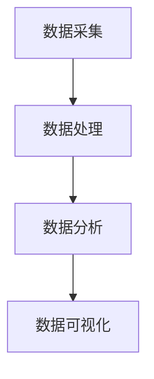

                 


```markdown
# 费雪的供应链分析：了解公司的上下游

> 关键词：供应链分析，供应商分析，客户分析，企业价值，投资策略，数据分析

> 摘要：本文将介绍费雪的供应链分析方法，从供应商和客户的视角深入探讨其对投资决策的影响。通过分析供应链的各个要素，包括生产过程、物流和库存管理，帮助企业更好地评估和优化其上下游关系。本文还将结合实际案例，详细讲解如何通过供应链分析发现投资机会和风险。

---

## 第一部分：供应链分析的背景与概述

### 第1章：供应链的基本概念与重要性

#### 1.1 供应链的定义与组成部分
供应链是指从原材料采购到产品交付给最终用户的整个过程，包括供应商、制造商、分销商、零售商和消费者。其主要组成部分包括：
- **供应商**：提供原材料或零部件的企业。
- **制造商**：负责生产产品的主体。
- **分销商**：负责产品分发和销售的中间商。
- **零售商**：直接面向消费者的销售终端。
- **消费者**：最终使用产品的用户。

供应链的高效运作直接影响企业的成本、交付能力和客户满意度。

#### 1.2 费雪供应链分析法的起源与核心思想
费雪供应链分析法由投资专家彼得·费雪提出，是一种通过分析企业上下游关系来评估其投资价值的方法。其核心思想在于，企业与其供应商和客户的关系越稳固，企业的经营风险越小，投资价值越高。

#### 1.3 供应链分析的必要性与应用场景
供应链分析对于企业优化运营、降低成本和提高效率至关重要。在投资领域，供应链分析可以帮助投资者识别企业的竞争优势和潜在风险。

---

## 第二部分：供应链分析的核心要素

### 第2章：供应商分析

#### 2.1 供应商的选择标准
- **质量**：供应商提供的产品或服务是否符合企业标准。
- **成本**：供应商的价格是否具有竞争力。
- **交货时间**：供应商能否按时交付。
- **可靠性**：供应商的历史表现和信誉。

#### 2.2 供应商的稳定性与可靠性
- 稳定的供应商关系有助于减少供应链中断的风险。
- 可靠的供应商能够提供高质量的产品，降低企业的质量控制成本。

#### 2.3 供应商的议价能力分析
- 供应商的议价能力与其市场地位、产品稀缺性和替代品可获得性有关。
- 企业应尽量选择议价能力较低的供应商，以保持成本优势。

### 第3章：客户分析

#### 3.1 客户的需求与偏好
- 理解客户需求是制定有效市场策略的基础。
- 客户的偏好直接影响产品的设计和功能。

#### 3.2 客户的忠诚度与满意度
- 忠诚的客户是企业长期发展的基石。
- 提高客户满意度是提升客户忠诚度的关键。

#### 3.3 客户的市场影响力
- 重要客户的需求变化可能影响企业的生产计划。
- 客户的市场影响力越大，企业对供应链的依赖性越强。

---

## 第三部分：供应链分析的方法论

### 第4章：数据分析与可视化

#### 4.1 数据收集与整理
- 数据来源包括企业的财务报表、供应链管理软件和市场调研。
- 数据清洗是确保分析结果准确性的关键步骤。

#### 4.2 数据分析工具
- 使用Excel进行基础数据分析。
- 通过Python和Pandas进行高级数据处理。

#### 4.3 数据可视化
- 使用Tableau或Power BI进行数据可视化。
- 图表类型包括柱状图、折线图和饼图，用于直观展示分析结果。

### 第5章：算法与模型

#### 5.1 供应链优化模型
- 使用线性规划模型优化库存管理和生产计划。
- 示例代码：
  ```python
  import pandas as pd
  import numpy as np

  # 假设有一个简单的生产计划问题
  # 目标是最小化生产成本
  # 约束条件包括生产能力和需求量
  ```

#### 5.2 供应链风险评估模型
- 通过蒙特卡洛模拟评估供应链的不确定性。
- 示例代码：
  ```python
  import numpy as np
  import matplotlib.pyplot as plt

  # 模拟供应链中断的概率
  np.random.seed(42)
  disruptions = np.random.binomial(1, 0.1, 1000)
  plt.hist(disruptions, bins=5, alpha=0.7)
  ```

---

## 第四部分：投资应用与案例分析

### 第6章：投资决策中的供应链分析

#### 6.1 供应链对投资价值的影响
- 供应链的稳定性和效率直接影响企业的盈利能力。
- 通过分析供应链，投资者可以识别企业的竞争优势和潜在风险。

#### 6.2 投资案例分析
- 案例1：某汽车制造商的供应链优化如何提升其投资价值。
- 案例2：某科技公司通过优化供应商关系降低生产成本。

---

## 第五部分：系统设计与实现

### 第7章：系统架构设计

#### 7.1 系统功能模块
- 数据采集模块：负责收集供应链相关的数据。
- 数据处理模块：对数据进行清洗和转换。
- 数据分析模块：应用算法进行供应链分析。
- 数据可视化模块：生成易于理解的图表。

#### 7.2 系统架构图


### 第8章：系统实现与优化

#### 8.1 数据采集与处理
- 使用Python的`requests`库获取供应链数据。
- 使用`pandas`进行数据清洗和转换。

#### 8.2 系统优化
- 通过缓存技术减少数据获取时间。
- 使用分布式计算提高数据分析效率。

---

## 第六部分：项目实战与总结

### 第9章：项目实施步骤

#### 9.1 确定分析目标
- 明确供应链分析的具体目标，如优化库存管理或降低生产成本。

#### 9.2 数据收集与处理
- 收集相关数据，清洗并转换为适合分析的格式。

#### 9.3 数据分析与建模
- 应用适当的算法进行供应链分析，生成初步结果。

#### 9.4 结果可视化与解读
- 使用图表展示分析结果，帮助决策者理解。

### 第10章：案例分析与总结

#### 10.1 案例分析
- 通过具体案例展示供应链分析的实际应用。
- 分析案例中的成功经验与教训。

#### 10.2 总结与展望
- 总结供应链分析的重要性和实际应用效果。
- 展望未来供应链分析的发展方向。

---

## 第七部分：总结与展望

### 第11章：总结

供应链分析是企业优化运营和提升投资价值的重要工具。通过分析供应商和客户的关系，企业可以更好地理解其供应链的优劣势，制定有效的优化策略。

### 第12章：展望

随着大数据和人工智能技术的发展，供应链分析将更加智能化和精准化。未来，企业可以通过实时数据分析和预测模型，进一步提升供应链的效率和应对市场变化的能力。

---

通过以上结构，您可以系统地了解和应用费雪的供应链分析方法，从而更好地评估和优化企业的上下游关系，提升投资价值和运营效率。
```

