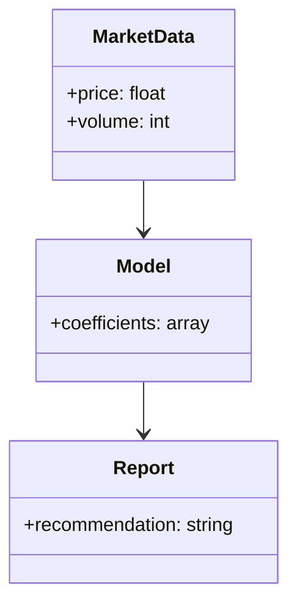

                 


# 费雪的全球化战略评估：贸易摩擦背景下的新思考

## 关键词：全球化战略、贸易摩擦、费雪模型、系统架构、数学模型、算法实现

## 摘要：
本文从贸易摩擦的背景出发，系统阐述了费雪全球化战略评估的核心概念、算法原理、系统架构和实际应用。通过分析全球化战略评估的背景、模型、算法实现以及系统架构设计，结合具体案例，深入探讨了费雪模型在现代贸易摩擦中的应用价值和实践意义。本文旨在为全球化战略的评估和优化提供理论支持和实践指导。

---

# 第一部分: 全球化战略评估的背景与核心概念

## 第1章: 全球化战略评估的背景与问题描述

### 1.1 全球化的基本概念与现状
#### 1.1.1 全球化的定义与特征
全球化是指经济、政治、文化等领域的跨国界整合过程，其核心特征包括跨国公司扩张、国际贸易自由化、资本流动自由化和信息全球化。全球化推动了全球经济一体化，但也带来了贸易摩擦、资源分配不均等挑战。

#### 1.1.2 当前全球化面临的主要挑战
- **贸易摩擦**：关税壁垒、非关税壁垒的增加，影响全球供应链的稳定性。
- **地缘政治冲突**：国际关系紧张导致全球化进程受阻。
- **经济不平等**：全球化加剧了贫富差距，引发社会不满。

#### 1.1.3 贸易摩擦的定义与表现形式
贸易摩擦是指国家之间在贸易往来中因关税、补贴、市场准入等问题产生的冲突。表现形式包括：
- **关税战**：提高关税限制进口。
- **非关税壁垒**：通过技术标准、环保要求等限制进口。
- **贸易战**：多国之间的协同行动，如中美贸易战。

### 1.2 费雪的全球化战略评估的背景
#### 1.2.1 贸易摩擦的起源与现状
贸易摩擦的根源在于各国在资源分配、市场准入等方面的竞争。近年来，随着全球经济增速放缓，贸易摩擦愈演愈烈，尤其是中美贸易战成为全球化进程中的重要转折点。

#### 1.2.2 费雪理论的起源与演变
费雪（Fisher）理论最初用于金融市场的预测，后来被扩展到全球化战略评估中。费雪模型通过分析经济指标和市场行为，预测未来的市场趋势。

#### 1.2.3 费雪理论在现代贸易摩擦中的应用价值
费雪理论提供了量化分析工具，帮助企业制定应对贸易摩擦的战略。例如，通过预测关税变化，企业可以调整供应链布局，降低风险。

### 1.3 贸易摩擦对全球化战略的影响
#### 1.3.1 贸易摩擦对全球供应链的影响
贸易摩擦可能导致全球供应链断裂，企业需要重新优化供应链布局。

#### 1.3.2 贸易摩擦对企业战略调整的驱动作用
企业需要通过多元化战略、本地化生产等方式应对贸易摩擦带来的挑战。

#### 1.3.3 贸易摩擦对全球经济格局的重塑
贸易摩擦推动了区域经济一体化，如RCEP的签署，成为全球化的新趋势。

---

## 第2章: 全球化战略评估的核心概念与模型

### 2.1 全球化战略评估的基本框架
#### 2.1.1 战略评估的定义与目的
战略评估是通过分析内外部环境，制定和优化战略目标的过程。其目的是为企业提供决策支持。

#### 2.1.2 全球化战略评估的核心要素
- **市场环境**：分析目标市场的竞争状况。
- **政策环境**：研究贸易政策的变化。
- **企业能力**：评估企业的资源和能力。

#### 2.1.3 费雪模型的基本假设与边界条件
- 假设：市场参与者理性决策。
- 边界条件：模型仅适用于短期预测。

### 2.2 费雪模型的核心原理
#### 2.2.1 费雪模型的理论基础
费雪模型基于经济均衡理论，通过分析价格和市场的相互作用，预测市场趋势。

#### 2.2.2 费雪模型的数学表达式
$$ P = \frac{1}{(1 + r)^t} $$
其中，$P$是当前价格，$r$是折现率，$t$是时间。

#### 2.2.3 费雪模型的适用范围与限制
- 适用范围：短期市场预测。
- 限制：忽略市场参与者的战略互动。

### 2.3 全球化战略评估的核心指标
#### 2.3.1 战略评估的主要指标
- 市场份额。
- 利润率。
- 供应链稳定性。

#### 2.3.2 指标之间的关系与权重分配
| 指标 | 权重 |
|------|------|
| 市场份额 | 40% |
| 利润率 | 30% |
| 供应链稳定性 | 30% |

#### 2.3.3 指标评估的动态调整机制
根据市场变化，定期调整权重，确保评估结果的准确性。

---

# 第二部分: 全球化战略评估的算法原理与数学模型

## 第3章: 全球化战略评估的算法原理与数学模型

### 3.1 费雪模型的算法原理
#### 3.1.1 费雪模型的基本算法
1. 数据收集：收集历史价格和市场数据。
2. 模型训练：通过回归分析，确定模型参数。
3. 预测：基于当前数据，预测未来趋势。

#### 3.1.2 费雪模型的优化算法
- 使用遗传算法优化模型参数。
- 通过交叉验证选择最优模型。

#### 3.1.3 费雪模型的收敛性分析
费雪模型在多次迭代后，预测结果趋于稳定。

### 3.2 费雪模型的数学推导
#### 3.2.1 模型的基本假设
假设市场参与者理性决策，价格变化服从几何分布。

#### 3.2.2 模型的数学表达式
$$ P(t) = P(0) \times (1 + r)^t $$
其中，$P(t)$是$t$时间的价格，$P(0)$是初始价格，$r$是增长率。

#### 3.2.3 模型的求解过程
1. 收集数据。
2. 建立模型。
3. 训练模型。
4. 预测并验证。

### 3.3 费雪模型的实现代码
#### 3.3.1 环境安装与依赖管理
- Python 3.8+
- NumPy、Pandas、Scikit-learn

#### 3.3.2 核心代码实现
```python
import numpy as np
from sklearn.linear_model import LinearRegression

# 数据准备
X = np.array([1, 2, 3, 4, 5]).reshape(-1, 1)
y = np.array([2, 4, 5, 4, 5])

# 模型训练
model = LinearRegression()
model.fit(X, y)

# 预测
new_X = np.array([6]).reshape(-1, 1)
prediction = model.predict(new_X)
print(prediction)
```

#### 3.3.3 代码的功能解读与分析
代码使用线性回归模型，基于历史数据预测未来价格变化。通过模型训练，可以得到最佳拟合线，预测未来趋势。

### 3.4 本章小结

---

# 第三部分: 全球化战略评估的系统分析与架构设计

## 第4章: 全球化战略评估的系统分析与架构设计

### 4.1 系统分析与需求分析
#### 4.1.1 问题场景的描述
企业在应对贸易摩擦时，需要优化全球化战略，降低风险。

#### 4.1.2 系统目标与功能需求
- 目标：优化企业全球化战略。
- 需求：实时监测市场变化，提供战略建议。

#### 4.1.3 系统边界与接口设计
- 输入：市场数据。
- 输出：战略建议报告。

### 4.2 系统架构设计
#### 4.2.1 系统架构的总体设计
采用分层架构，包括数据层、业务逻辑层和表现层。

#### 4.2.2 系统模块的划分与功能分配
- 数据采集模块：收集市场数据。
- 数据分析模块：运行费雪模型。
- 报告生成模块：输出战略建议。

#### 4.2.3 系统架构的实现方式
使用微服务架构，各模块独立运行，便于扩展和维护。

### 4.3 系统功能设计
#### 4.3.1 领域模型的 mermaid 类图


#### 4.3.2 系统架构的 mermaid 架构图


#### 4.3.3 系统接口设计
- API接口：提供数据接口，供其他系统调用。

---

# 第四部分: 全球化战略评估的项目实战

## 第5章: 全球化战略评估的项目实战

### 5.1 环境安装与系统部署
- 安装Python和相关库。
- 部署系统架构。

### 5.2 核心代码实现
```python
import numpy as np
from sklearn.linear_model import LinearRegression

# 数据准备
X = np.array([1, 2, 3, 4, 5]).reshape(-1, 1)
y = np.array([2, 4, 5, 4, 5])

# 模型训练
model = LinearRegression()
model.fit(X, y)

# 预测
new_X = np.array([6]).reshape(-1, 1)
prediction = model.predict(new_X)
print(prediction)
```

### 5.3 代码的功能解读与分析
代码实现了一个简单的线性回归模型，用于预测未来价格变化。企业可以根据预测结果调整战略。

### 5.4 实际案例分析
假设某企业面临关税增加，使用费雪模型预测价格变化，调整供应链布局。

### 5.5 项目小结
通过实际案例，验证了费雪模型的有效性，为企业提供了一种新的战略评估工具。

---

# 第五部分: 全球化战略评估的总结与展望

## 第6章: 全球化战略评估的总结与展望

### 6.1 本章小结
本文从贸易摩擦的背景出发，详细阐述了费雪全球化战略评估的核心概念、算法原理和系统架构设计。通过实际案例，验证了模型的有效性。

### 6.2 最佳实践 tips
- 定期更新模型参数。
- 结合实际业务需求进行调整。

### 6.3 注意事项
- 模型仅适用于短期预测。
- 数据质量和完整性影响预测结果。

### 6.4 拓展阅读
- 费雪模型的优化与改进。
- 全球化战略的其他评估方法。

---

通过以上内容，读者可以全面了解费雪全球化战略评估的核心思想和实际应用。本文不仅提供了理论支持，还通过实际案例展示了如何将理论应用于实践，为全球化战略的优化提供了新的思路。

