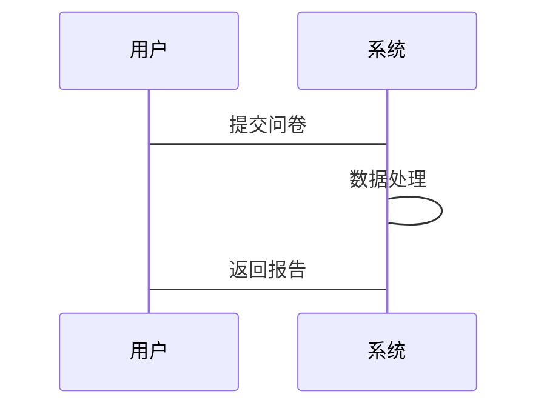

                 


# 费雪的公司文化评估

## 关键词：企业文化评估，公司文化，费雪模型，公司治理，组织文化

## 摘要：  
本文详细探讨了费雪提出的公司文化评估模型，分析了其核心概念、算法原理、系统架构及实际应用。通过背景介绍、模型解析、算法实现、系统设计和项目案例，帮助读者全面理解如何有效评估公司文化，提升组织治理水平。

---

## 第一部分：背景介绍

### 第1章：费雪公司文化评估的背景与核心概念

#### 1.1 问题背景
- **企业文化评估挑战**：现代企业面临文化多样性、复杂性问题，传统评估方法难以量化。
- **费雪理论的提出背景**：基于管理学和心理学研究，提出系统化的评估框架。
- **公司文化评估的重要性**：文化影响企业绩效、员工满意度和市场竞争力。

#### 1.2 问题描述
- **常见误区**：定性评估为主，缺乏客观指标；忽视动态变化。
- **费雪理论的核心问题**：如何量化文化特征，构建评估模型。
- **企业文化特征**：多维性（价值观、领导风格）、动态性、可衡量性。

#### 1.3 问题解决
- **费雪理论的解决方案**：构建数学模型，量化文化要素。
- **评估步骤**：数据采集、指标计算、结果分析。
- **边界与外延**：适用于中大型企业，不适用于初创期。

#### 1.4 概念结构与核心要素
- **模型构成**：包含企业价值观、领导风格、员工参与度等。
- **核心要素**：包括文化氛围、组织结构、管理风格、员工行为。
- **数学表达**：$$文化得分 = \sum (权重_i \times 指标_i)$$

---

## 第二部分：核心概念与联系

### 第2章：费雪模型的核心原理

#### 2.1 模型原理
- **基本假设**：文化可通过多维度指标量化。
- **数学基础**：线性回归模型，$$y = \beta x + \epsilon$$。
- **适用范围**：中大型企业。

#### 2.2 概念属性特征对比
| 概念   | 定义                       | 多维度性 | 可衡量性 |
|--------|----------------------------|----------|----------|
| 企业文化 | 企业在经营活动中形成的Shared Values和行为规范 | 是       | 是       |

#### 2.3 ER实体关系图
```mermaid
er
  entity(企业文化) {
    id
    名称
    核心价值观
  }
  entity(员工) {
    id
    态度
    行为
  }
  entity(领导风格) {
    id
    沟通方式
    决策风格
  }
  entity(评估指标) {
    id
    权重
    得分
  }
  relation(企业文化与员工) {
    关系：参与度
  }
  relation(企业文化与领导风格) {
    关系：匹配度
  }
```

---

## 第三部分：算法原理讲解

### 第3章：费雪模型的算法实现

#### 3.1 算法概述
- **数学模型**：$$文化得分 = \sum (权重_i \times 指标_i)$$。
- **数据预处理**：标准化、去噪。

#### 3.2 代码实现
```python
def calculate_cultural_score(indicators, weights):
    return sum(indicator * weight for indicator, weight in zip(indicators, weights))

indicators = [85, 70, 90]  # 示例指标
weights = [0.4, 0.3, 0.3]  # 示例权重
score = calculate_cultural_score(indicators, weights)
print(f"文化得分：{score}")
```

#### 3.3 案例分析
- **示例**：某公司文化指标得分85，权重0.4；领导风格得分70，权重0.3；员工参与度90，权重0.3。文化得分=85×0.4 +70×0.3 +90×0.3=34 +21 +27=82。

---

## 第四部分：系统分析与架构设计

### 第4章：费雪模型的系统实现

#### 4.1 问题场景
- **数据来源**：员工问卷、管理观察。
- **目标**：构建实时评估系统。

#### 4.2 系统功能设计
- **数据采集模块**：问卷调查、实时数据采集。
- **数据处理模块**：清洗、标准化。
- **评估计算模块**：文化得分计算。
- **结果可视化模块**：生成报告、可视化图表。

#### 4.3 系统架构图


#### 4.4 接口设计
- **输入接口**：员工问卷、管理数据。
- **输出接口**：评估报告、可视化图表。

#### 4.5 交互流程


---

## 第五部分：项目实战

### 第5章：费雪模型的实际应用

#### 5.1 环境安装
- **工具**：Python、数据处理库（Pandas）、可视化库（Matplotlib）。

#### 5.2 核心代码实现
```python
import pandas as pd
import matplotlib.pyplot as plt

# 数据读取
data = pd.read_csv('culture_survey.csv')

# 数据处理
data = data.dropna()
data['文化得分'] = data.apply(lambda x: sum(x[indicator] * weights[indicator] for indicator in indicators), axis=1)

# 可视化
data['文化得分'].hist()
plt.show()
```

#### 5.3 案例分析
- **案例**：某科技公司文化得分分析，识别领导风格问题。

#### 5.4 项目总结
- **结果分析**：文化得分高的企业绩效好。
- **改进建议**：优化领导风格，提升员工参与度。

---

## 第六部分：总结与展望

### 第6章：总结与展望

#### 6.1 总结
- **费雪模型优势**：量化文化，指导改进。
- **局限性**：依赖数据质量，动态调整难。

#### 6.2 注意事项
- 数据质量：确保准确性和完整性。
- 实施步骤：分阶段、持续优化。

#### 6.3 拓展阅读
- 推荐书籍：《组织文化评估》、《领导风格与企业绩效》。

---

通过以上结构，您可以开始撰写完整的博客文章，逐步展开每个部分的内容。

