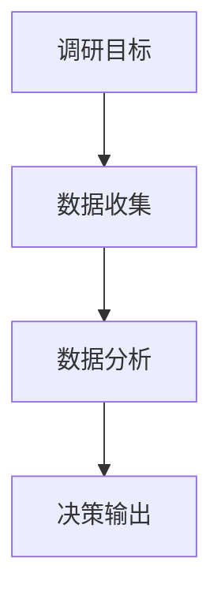

                 


# 费雪的公司调研技巧

> 关键词：费雪、公司调研、投资分析、财务指标、竞争优势、成长潜力

> 摘要：本文详细探讨了费雪的公司调研技巧，从其核心理念到具体分析方法，再到实际项目实战，系统地介绍了如何运用费雪的调研框架进行投资分析。文章通过理论与实践结合的方式，深入剖析了费雪调研方法的数学模型、系统架构和实际应用案例，为投资者提供了实用的指导。

---

## 第一部分：费雪的公司调研技巧概述

### 第1章：费雪的生平与投资理念

#### 1.1 费雪的生平简介

菲利普·费雪（Philip Fisher）是20世纪美国著名的投资大师，被誉为“成长股投资之父”。他出生于1907年，毕业于加州大学伯克利分校，后进入哈佛商学院深造。费雪的投资生涯始于1930年代，他在职业生涯中积累了丰富的投资经验，并总结出一套独特的公司调研方法，尤其在成长股投资领域具有深远影响。

**1.1.1 费雪的早年经历**  
费雪的早年生活并不富裕，但他从小就展现出对投资和金融的浓厚兴趣。他在大学期间就开始研究股票市场，阅读了大量的投资书籍，并尝试通过分析公司财务报表来寻找投资机会。这种扎实的学术背景为他后来的投资成功奠定了基础。

**1.1.2 费雪的投资生涯与成就**  
费雪的职业生涯始于1930年代，当时正值美国经济大萧条时期。他通过分析企业的基本面，发现了一些被市场低估的成长股，这些股票在他的长期持有下实现了巨大的增值。费雪的投资理念强调长期持有优质股票，避免短期市场的波动干扰。

**1.1.3 费雪的投资哲学与核心理念**  
费雪的投资哲学的核心是“投资于企业，而不是市场”。他认为，投资者应该选择那些具有强大竞争优势、良好财务状况和优秀管理团队的企业。他的核心理念是：  
1. **长期投资**：避免频繁交易，专注于寻找能够持续增长的企业。  
2. **深入调研**：通过详细分析企业的财务报表、竞争优势和管理层能力，筛选出具有成长潜力的公司。  
3. **分散投资**：通过投资于多个优质企业来降低风险。

---

### 第2章：费雪公司调研的核心概念

#### 2.1 费雪调研框架的核心要素

费雪的公司调研方法是一个系统化的框架，包含多个核心要素。这些要素相互关联，共同构成了他的投资决策的基础。

**2.1.1 企业竞争优势的识别**  
竞争优势是费雪调研的核心内容之一。他强调，企业必须在某个领域具有独特的竞争优势，才能在长期的市场竞争中占据优势。例如，迪士尼的创意优势、可口可乐的品牌优势等。

**2.1.2 企业成长潜力的评估**  
费雪认为，企业的成长潜力是决定其投资价值的关键因素。他通过分析企业的收入增长率、利润率和市场扩张能力来评估其成长潜力。

**2.1.3 企业财务健康状况的分析**  
财务健康是费雪调研的另一个重要方面。他通过分析企业的财务报表，评估其盈利能力、资产负债情况和现金流健康状况，以确保企业具有稳健的财务基础。

---

### 第3章：费雪公司调研的分析方法

#### 3.1 定性分析方法

定性分析是费雪调研方法的重要组成部分，它帮助投资者更好地理解企业的商业模式和竞争优势。

**3.1.1 企业商业模式的分析**  
商业模式是企业如何创造价值的核心。费雪通过分析企业的商业模式，评估其在市场中的定位和盈利能力。

**3.1.2 企业竞争优势的评估**  
竞争优势是企业长期增长的关键。费雪通过分析企业的市场地位、技术优势、成本优势等因素，评估其竞争优势的强弱。

**3.1.3 企业管理层的考察**  
管理层是企业运营的核心。费雪非常重视企业管理层的能力和诚信，认为优秀的企业管理层能够带领企业实现持续增长。

---

#### 3.2 定量分析方法

定量分析是费雪调研方法的另一重要部分，它通过数学模型和财务指标来评估企业的投资价值。

**3.2.1 财务指标的计算与分析**  
费雪通过分析企业的收入、利润、资产负债和现金流等财务指标，评估其财务健康状况。例如，他常用以下指标：
- 净利润率：$ \text{净利润率} = \frac{\text{净利润}}{\text{营业收入}} $
- 资产负债率：$ \text{资产负债率} = \frac{\text{总负债}}{\text{总资产}} $
- 现金流健康：$ \text{自由现金流} = \text{营业收入} - \text{资本支出} $

**3.2.2 市盈率、市净率等估值指标的应用**  
费雪通过市盈率（P/E）和市净率（P/B）等估值指标，评估企业的市场估值是否合理。例如：
- 市盈率：$ \text{市盈率} = \frac{\text{股价}}{\text{每股收益}} $
- 市净率：$ \text{市净率} = \frac{\text{股价}}{\text{每股净资产}} $

**3.2.3 费雪投资模型的数学公式**  
费雪的投资模型基于企业的未来现金流折现法，公式如下：
$$ \text{投资价值} = \sum_{t=1}^{n} \frac{\text{未来现金流}_t}{(1 + r)^t} $$
其中，\( r \) 是折现率，\( n \) 是投资期限。

---

### 第4章：费雪公司调研的系统架构

#### 4.1 调研系统架构设计

费雪的调研方法可以看作一个系统化的流程，包括数据收集、数据分析和决策输出三个主要环节。

**4.1.1 调研系统架构图**  


#### 4.2 数据收集与处理

**4.2.1 数据来源与采集方法**  
费雪的调研方法依赖于多种数据来源，包括企业的财务报表、行业报告、新闻报道等。数据可以通过公司财报、金融数据库和行业研究报告等渠道获取。

**4.2.2 数据清洗与预处理**  
在数据处理阶段，需要对收集到的数据进行清洗和预处理，确保数据的准确性和完整性。例如：
- 删除缺失值：$ \text{缺失值} = \text{NaN} $
- 填充异常值：$ \text{填充值} = \text{中位数} $

**4.2.3 数据存储与管理**  
数据存储是调研系统的重要组成部分。通常可以使用数据库（如MySQL）或数据分析工具（如Pandas）进行数据存储和管理。

---

### 第5章：费雪公司调研的项目实战

#### 5.1 项目背景与目标

**5.1.1 项目背景介绍**  
本文以投资迪士尼为例，介绍费雪调研方法的实际应用。迪士尼是一家全球知名的娱乐公司，具有强大的竞争优势和成长潜力。

**5.1.2 调研目标设定**  
通过分析迪士尼的财务报表、竞争优势和管理层能力，评估其投资价值。

---

#### 5.2 核心代码实现

**5.2.1 数据收集与处理**  
```python
import pandas as pd

# 数据收集
df = pd.read_csv('disney_finance.csv')

# 数据清洗
df.dropna(inplace=True)
df.fillna(df.mean(), inplace=True)
```

**5.2.2 数据分析与建模**  
```python
def calculate_investment_value(company_financials):
    # 计算未来现金流
    future_cash_flows = company_financials['现金流'].tolist()
    # 折现率
    discount_rate = 0.08
    # 折现现金流
    discounted_flows = [cf / (1 + discount_rate)**i for i, cf in enumerate(future_cash_flows)]
    # 投资价值
    investment_value = sum(discounted_flows)
    return investment_value

# 示例计算
disney_financials = {
    '现金流': [100, 120, 140, 160, 180],
    '折现率': 0.08
}
investment_value = calculate_investment_value(disney_financials)
print(f"迪士尼的投资价值为：{investment_value}")
```

---

#### 5.3 实际案例分析

**5.3.1 投资决策**  
通过上述分析，迪士尼的投资价值被评估为高于其当前股价，因此可以考虑买入。

---

## 第六章：总结与展望

### 6.1 项目小结

通过本文的分析，我们深入探讨了费雪的公司调研技巧，并通过实际案例展示了其方法的应用。费雪的投资理念强调长期持有优质企业，通过深入的定性与定量分析，筛选出具有强大竞争优势和成长潜力的企业。

### 6.2 最佳实践 tips

- **长期投资**：避免短期市场的波动，专注于优质企业的长期增长。
- **深入调研**：通过详细的财务分析和竞争优势分析，确保投资决策的准确性。
- **分散投资**：通过投资于多个优质企业，降低投资风险。

### 6.3 拓展阅读

- 费雪的其他投资理念。
- 其他投资大师的调研方法。

---

# 结语

费雪的公司调研技巧为我们提供了一套系统化的投资分析方法。通过深入分析企业的财务状况、竞争优势和管理层能力，投资者可以更好地识别具有成长潜力的优质企业。希望本文能够为读者在投资分析领域提供有价值的指导。

