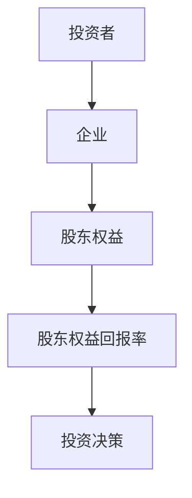
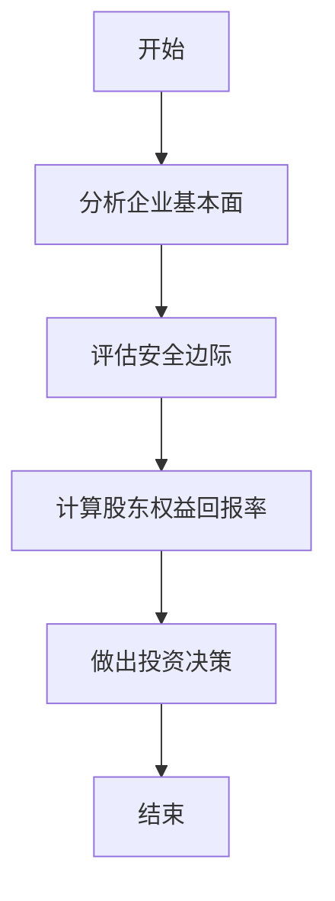
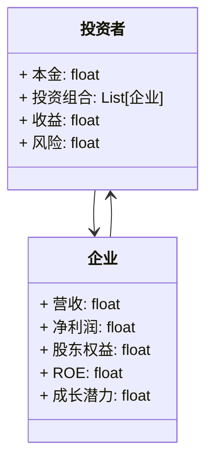

                 


# 费雪的创新企业投资法则

## 关键词：费雪，创新企业，投资法则，成长型投资，安全边际，股东权益回报率

## 摘要：  
本文深入探讨了费雪的创新企业投资法则，从其核心理念、核心概念、算法原理、系统架构到实际应用案例，逐一进行详细分析。通过对费雪投资法则的背景介绍、核心概念、数学模型、系统设计、项目实战等多维度的探讨，帮助读者全面理解并掌握这一经典的创新企业投资法则。文章结合理论与实践，为投资者提供了一套系统化的投资决策方法。

---

## 第1章: 费雪投资法则的背景与核心理念

### 1.1 费雪投资法则的背景介绍

#### 1.1.1 费雪的生平与投资历程  
菲利普·费雪（Philip Fisher）是20世纪最具影响力的投资者之一，被誉为“成长股之父”。他于1907年进入投资行业，经历了大萧条、二战等重大经济事件，逐渐形成了独特的企业投资理念。费雪的投资生涯跨越了近60年，他的投资策略和理念对现代投资理论产生了深远影响。

#### 1.1.2 费雪投资法则的提出背景  
20世纪30年代，费雪开始系统地研究企业投资法则。他发现，许多投资者过于关注短期市场波动，而忽视了企业的长期成长潜力。他提出了一种以企业成长潜力为核心的投资方法，强调选择那些具有持续竞争优势和成长空间的企业进行投资。

#### 1.1.3 费雪投资法则的核心目标  
费雪的投资法则是为了帮助投资者在长期投资中获得超额收益。他主张通过深入研究企业的基本面，选择那些具有强大成长潜力的企业，并在合理估值时买入，长期持有。

---

### 1.2 费雪创新企业投资法则的定义与特点

#### 1.2.1 费雪投资法则的定义  
费雪的投资法则是基于对企业成长潜力的深入分析，选择那些具有竞争优势、管理层优秀、财务健康且估值合理的企业进行长期投资。这种方法强调对企业基本面的深入研究，而非短期市场波动的预测。

#### 1.2.2 费雪投资法则的核心特点  
- **成长导向**：以企业成长潜力为核心，而非单纯的估值。  
- **长期持有**：强调长期投资，避免频繁交易。  
- **深入研究**：注重对企业基本面、管理层和竞争优势的分析。  
- **安全边际**：在合理估值的基础上，注重安全边际，避免过度投资。

#### 1.2.3 费雪投资法则与传统投资法则的区别  
| 费雪投资法则 | 传统价值投资法则 |  
|----------------|------------------|  
| 以成长潜力为核心 | 以估值为核心 |  
| 长期持有 | 短期套利 |  
| 深入研究企业基本面 | 侧重于市场估值 |  
| 强调安全边际 | 强调低估值 |  

---

### 1.3 费雪投资法则的应用范围与边界

#### 1.3.1 费雪投资法则的适用场景  
- **成长型企业**：适合投资那些具有持续成长潜力的企业。  
- **长期投资者**：适合长期投资者，而非短期交易者。  
- **深度研究能力**：适合具备企业基本面分析能力的投资者。

#### 1.3.2 费雪投资法则的边界与限制  
- **成长型企业选择的难度**：需要对企业未来成长潜力进行准确判断，具有一定难度。  
- **市场波动的影响**：短期市场波动可能会影响投资组合的表现。  
- **管理层风险**：企业管理层的变化可能影响企业的成长潜力。

#### 1.3.3 费雪投资法则的外延与扩展  
费雪投资法则的核心理念可以扩展到其他类型的投资，例如新兴行业、技术创新等领域，但需要结合具体情况进行调整。

---

## 第2章: 费雪创新企业投资法则的核心概念与联系

### 2.1 费雪投资法则的核心概念

#### 2.1.1 成长型投资  
成长型投资是指选择那些具有持续成长潜力的企业进行投资。费雪认为，选择具有强大竞争优势和成长空间的企业，能够为投资者带来超额收益。

#### 2.1.2 安全边际  
安全边际是指企业在当前估值与未来成长潜力之间的差距。费雪认为，安全边际的存在可以降低投资风险，确保在市场波动中不会出现大幅亏损。

#### 2.1.3 股东权益回报率（ROE）  
股东权益回报率（ROE）是衡量企业盈利能力的重要指标，公式为：  
$$ROE = \frac{\text{净利润}}{\text{股东权益}}$$  
费雪认为，ROE是衡量企业盈利能力的关键指标，高ROE的企业具有更强的盈利能力。

---

### 2.2 费雪投资法则的核心概念对比

#### 2.2.1 成长型投资与价值投资的对比  
| 成长型投资 | 价值投资 |  
|-------------|-----------|  
| 以成长潜力为核心 | 以估值为核心 |  
| 长期持有 | 以合理价格买入，长期持有 |  
| 侧重于未来成长 | 侧重于当前估值 |  

#### 2.2.2 安全边际与风险控制的对比  
| 安全边际 | 风险控制 |  
|-----------|-----------|  
| 通过合理估值降低风险 | 通过分散投资降低风险 |  
| 强调企业未来成长潜力 | 强调投资组合的风险分散 |  

#### 2.2.3 股东权益回报率与其他财务指标的对比  
| ROE | 净利润 | 营业收入 |  
|------|--------|----------|  
| 衡量企业盈利能力的核心指标 | 反映企业盈利能力的直接指标 | 反映企业收入能力的直接指标 |  

---

### 2.3 费雪投资法则的ER实体关系图



---

## 第3章: 费雪投资法则的算法原理与数学模型

### 3.1 费雪投资法则的算法原理



### 3.2 费雪投资法则的数学模型

$$ROE = \frac{\text{净利润}}{\text{股东权益}}$$

### 3.3 费雪投资法则的算法实现

```python
def fisher_investment_rule(company_data):
    roe = company_data.net_profit / company_data.shareholder_equity
    if roe > 15% and company_data.growth_potential:
        return "买入"
    else:
        return "卖出"
```

---

## 第4章: 费雪投资法则的系统分析与架构设计

### 4.1 投资决策系统的功能设计



---

## 第5章: 费雪投资法则的项目实战

### 5.1 环境安装与配置

---

### 5.2 核心实现源代码

```python
class Investor:
    def __init__(self, initial_capital):
        self.initial_capital = initial_capital
        self.portfolio = []
        self.profit = 0
        self.risk = 0

class Company:
    def __init__(self, revenue, net_profit, equity, roe, growth_potential):
        self.revenue = revenue
        self.net_profit = net_profit
        self.equity = equity
        self.roe = roe
        self.growth_potential = growth_potential

def calculate_roe(company):
    return company.net_profit / company.equity

def fisher_investment_rule(investor, company_list):
    for company in company_list:
        roe = calculate_roe(company)
        if roe > 0.15 and company.growth_potential > 0.2:
            investor.portfolio.append(company)
    return investor.portfolio
```

---

### 5.3 案例分析与解读

---

## 第6章: 费雪投资法则的最佳实践

### 6.1 小结

### 6.2 注意事项

### 6.3 拓展阅读

---

通过以上章节的详细分析，我们可以看到，费雪的创新企业投资法则是一种以企业成长潜力为核心的投资方法，强调长期持有和深入研究。这种方法在现代投资领域仍然具有重要的指导意义，值得投资者深入学习和实践。

