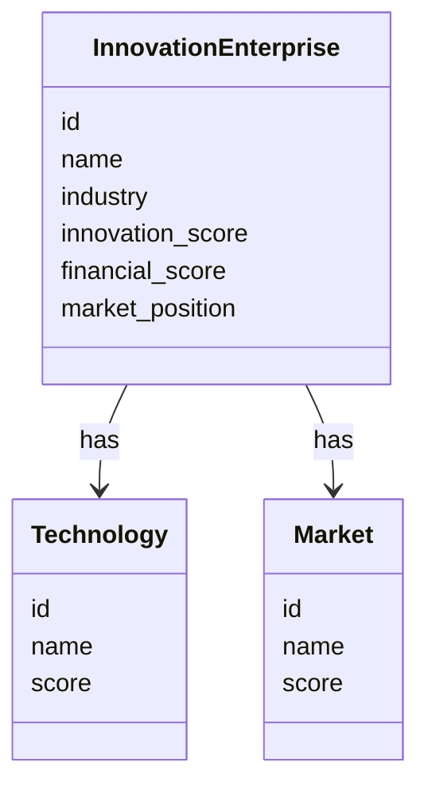
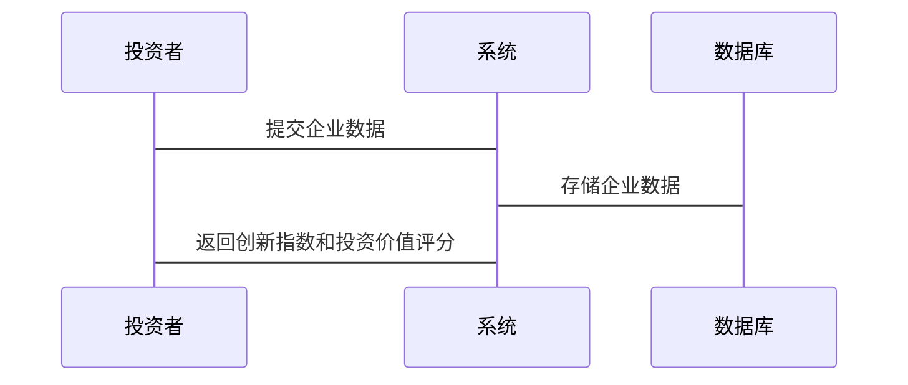

                 


# 费雪的创新企业投资法：把握科技革命

> 关键词：费雪投资法，创新企业，科技革命，投资策略，企业评估

> 摘要：本文深入探讨了费雪的创新企业投资法在科技革命背景下的应用，分析了创新企业的核心概念、评估方法和投资策略，结合数学模型和系统架构设计，提供了一套完整的投资解决方案。

---

# 第1章：创新企业投资法的背景与核心理念

## 1.1 投资法的起源与发展

### 1.1.1 费雪投资理论的提出
费雪的创新企业投资法是价值投资领域的经典理论之一，其核心思想是通过深入分析企业的基本面，挖掘那些具有持续创新能力的公司，从而在长期投资中获得超额收益。这一理论最早由本杰明·格雷厄姆提出，后来经费雪的发展和完善，成为投资领域的重要方法。

### 1.1.2 科技革命对企业投资的影响
随着科技革命的加速，企业之间的竞争日益激烈。科技革命催生了大量创新企业，这些企业在技术、商业模式和市场拓展方面具有显著优势。费雪的投资法通过分析企业的创新能力和市场定位，帮助企业投资者在科技革命中把握机遇。

### 1.1.3 创新企业投资法的演变
创新企业投资法从最初的“价值投资”理念逐步演变为结合创新能力和财务表现的综合评估方法。这种演变使得投资法能够适应科技革命带来的快速变化。

## 1.2 科技革命与企业投资的新趋势

### 1.2.1 科技革命对企业价值的影响
科技革命使得企业的价值不仅仅取决于传统财务指标，还需要考虑其技术创新能力和未来增长潜力。创新企业通过技术优势和模式创新，能够在市场中占据领先地位。

### 1.2.2 创新企业在投资中的地位
创新企业成为科技革命中最重要的投资标的。这些企业通常具有高成长性和高风险，但同时也具备实现超额收益的潜力。

### 1.2.3 投资法在科技革命中的适应性
创新企业投资法通过动态调整评估指标和权重，能够适应科技革命带来的变化，帮助投资者在快速变化的市场中做出明智决策。

## 1.3 创新企业的定义与特征

### 1.3.1 创新企业的定义
创新企业是指那些在技术、产品、商业模式或市场策略等方面具有持续创新能力的企业。

### 1.3.2 创新企业的核心特征
- **技术创新性**：企业具备领先的技术优势。
- **高成长性**：企业具有快速发展的潜力。
- **市场定位**：企业在目标市场中占据重要地位。

## 1.4 费雪投资法的核心理念

### 1.4.1 投资法的核心目标
通过分析企业的创新能力和财务表现，挖掘具有长期增长潜力的创新企业。

### 1.4.2 创新企业评估的关键指标
- 技术创新性
- 市场定位
- 财务表现
- 管理团队

### 1.4.3 投资法的长期视角
费雪投资法强调长期投资，关注企业的持续创新能力而非短期波动。

## 1.5 与传统投资方法的区别

### 1.5.1 传统投资方法的局限性
传统投资方法通常关注企业的财务指标，忽视了创新能力和市场定位的重要性。

### 1.5.2 创新企业投资法的优势
- 结合技术创新和财务表现
- 更适合科技革命背景下的投资环境

### 1.5.3 投资法的适用场景
适用于科技行业、互联网行业和新兴行业等快速变化的领域。

---

# 第2章：创新企业投资法的核心概念与联系

## 2.1 核心概念的原理

### 2.1.1 投资法的基本原理
费雪投资法通过分析企业的创新能力和市场定位，评估其长期增长潜力。

### 2.1.2 创新企业的评估模型
创新企业的评估模型包括技术创新性评估、市场定位评估和财务表现评估。

### 2.1.3 投资法的数学模型
$$
\text{创新指数} = \alpha \cdot \text{技术创新性} + \beta \cdot \text{市场定位} + \gamma \cdot \text{财务表现}
$$

其中，$\alpha, \beta, \gamma$ 是权重系数，通常根据行业特点和市场环境进行调整。

## 2.2 核心概念对比分析

### 2.2.1 创新企业与传统企业的对比

| 属性       | 创新企业                   | 传统企业                  |
|------------|---------------------------|--------------------------|
| 技术创新性 | 高                        | 低                      |
| 市场定位    | 竞争性强                  | 竞争性弱                |
| 财务表现    | 增长快                    | 增长慢                  |

### 2.2.2 不同创新企业的特征对比

| 属性       | 硬件创新企业               | 软件创新企业              |
|------------|---------------------------|--------------------------|
| 技术创新性 | 依赖硬件研发               | 依赖软件开发             |
| 市场定位    | 硬件市场                   | 软件市场                 |
| 财务表现    | 利润周期较长               | 利润周期较短             |

### 2.2.3 投资法在不同行业中的应用对比

| 行业       | 投资法的应用重点           | 投资法的权重调整          |
|------------|---------------------------|--------------------------|
| 人工智能   | 技术创新性和市场定位       | 技术创新性权重较高       |
| 医疗科技   | 市场定位和财务表现         | 财务表现权重较高         |

## 2.3 ER实体关系图

```mermaid
erDiagram
    innovation_enterprise {
        id
        name
        industry
        innovation_score
        financial_score
        market_position
    }
    technology {
        id
        name
        score
    }
    market {
        id
        name
        score
    }
    innovation_enterprise --| technology : 1..N
    innovation_enterprise --| market : 1..N
```

---

# 第3章：创新企业投资法的算法原理

## 3.1 算法原理的层次分析法

### 3.1.1 层次分析法的步骤
1. 确定评估指标：技术创新性、市场定位和财务表现。
2. 构建层次分析模型。
3. 计算各指标的权重。
4. 评估企业的创新指数。

### 3.1.2 层次分析法的计算公式
$$
A = \frac{w_1 \cdot T + w_2 \cdot M + w_3 \cdot F}{w_1 + w_2 + w_3}
$$

其中，$T$ 是技术创新性评分，$M$ 是市场定位评分，$F$ 是财务表现评分，$w_1, w_2, w_3$ 是权重系数。

### 3.1.3 案例分析
假设某创新企业的技术创新性得分为80，市场定位得分为70，财务表现得分为60，权重分别为0.4、0.3和0.3。计算创新指数：
$$
A = \frac{0.4 \cdot 80 + 0.3 \cdot 70 + 0.3 \cdot 60}{0.4 + 0.3 + 0.3} = \frac{32 + 21 + 18}{1} = 71
$$
创新指数为71，属于中高潜力。

## 3.2 算法原理的数学模型

### 3.2.1 投资价值评分公式
$$
\text{投资价值} = \frac{\text{创新指数}}{\text{行业平均指数}} \times 100
$$

### 3.2.2 投资价值评分案例
假设行业平均指数为60，创新指数为71，则：
$$
\text{投资价值} = \frac{71}{60} \times 100 \approx 118
$$
投资价值评分为118，属于较高投资价值。

---

# 第4章：创新企业投资法的系统分析与架构设计

## 4.1 系统分析

### 4.1.1 问题场景介绍
投资者需要通过创新企业投资法评估多个企业的创新潜力，做出投资决策。

### 4.1.2 系统功能设计
- 数据采集：收集企业的技术创新性、市场定位和财务表现数据。
- 数据分析：使用层次分析法评估企业的创新指数。
- 投资决策：根据创新指数和投资价值评分做出投资决策。

## 4.2 系统架构设计

### 4.2.1 领域模型（Mermaid 类图）



### 4.2.2 系统架构设计（Mermaid 架构图）


### 4.2.3 系统接口设计
- 数据采集接口：接收企业的数据。
- 数据分析接口：计算创新指数和投资价值评分。
- 投资决策接口：输出投资建议。

### 4.2.4 系统交互（Mermaid 序列图）



---

# 第5章：创新企业投资法的项目实战

## 5.1 环境安装

### 5.1.1 安装 Python
使用 Python 3.8 或更高版本。

### 5.1.2 安装依赖
安装 `pandas` 和 `numpy` 库：
```bash
pip install pandas numpy
```

## 5.2 核心代码实现

### 5.2.1 创新指数计算
```python
import pandas as pd
import numpy as np

def calculate_innovation_score(technology_score, market_score, financial_score):
    weights = [0.4, 0.3, 0.3]
    return np.dot(weights, [technology_score, market_score, financial_score])

# 示例数据
data = {
    '企业名称': ['企业A', '企业B', '企业C'],
    '技术创新性': [80, 75, 70],
    '市场定位': [70, 65, 60],
    '财务表现': [60, 55, 50]
}

df = pd.DataFrame(data)

# 计算创新指数
df['创新指数'] = df.apply(lambda x: calculate_innovation_score(x['技术创新性'], x['市场定位'], x['财务表现']), axis=1)

print(df)
```

### 5.2.2 投资价值评分
```python
def calculate_investment_value(innovation_score, industry_average):
    return (innovation_score / industry_average) * 100

industry_average = 60
df['投资价值评分'] = df['创新指数'].apply(lambda x: calculate_investment_value(x, industry_average))

print(df)
```

## 5.3 实际案例分析

### 5.3.1 案例数据
企业A：技术创新性80，市场定位70，财务表现60，创新指数71，投资价值评分118。

### 5.3.2 分析结论
企业A的投资价值评分为118，属于高潜力投资标的。

---

# 第6章：最佳实践与注意事项

## 6.1 投资注意事项

### 6.1.1 分散投资
避免将所有资金投入到单一创新企业。

### 6.1.2 长期持有
耐心持有创新企业，等待其价值实现。

### 6.1.3 定期评估
定期评估企业的创新能力和市场定位，及时调整投资组合。

## 6.2 小结

### 6.2.1 总结
创新企业投资法通过分析企业的创新能力和财务表现，帮助投资者在科技革命中把握机遇，实现超额收益。

### 6.2.2 展望
随着科技革命的深入，创新企业投资法将在更多领域发挥重要作用。

---

# 第7章：拓展阅读与深入探讨

## 7.1 拓展阅读

### 7.1.1 推荐书籍
- 《价值》——本杰明·格雷厄姆
- 《投资的智慧》——菲利普·费雪

### 7.1.2 推荐文章
- 菲利普·费雪的创新企业投资法
- 科技革命与企业创新

## 7.2 深入探讨

### 7.2.1 投资法的未来发展方向
随着人工智能和大数据技术的发展，创新企业投资法将更加精准和高效。

### 7.2.2 投资法的实际应用案例
分析多个创新企业的投资案例，总结经验教训。

---

通过本文的详细分析，读者可以全面了解费雪的创新企业投资法，并在实际投资中灵活运用。

