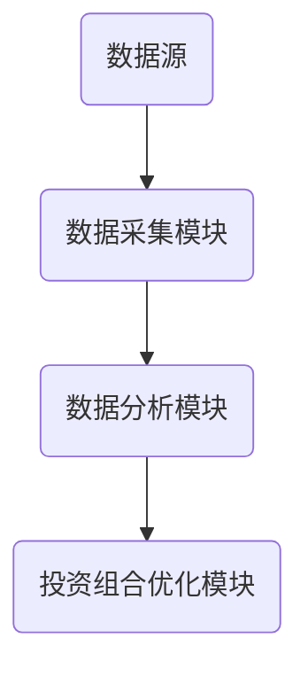
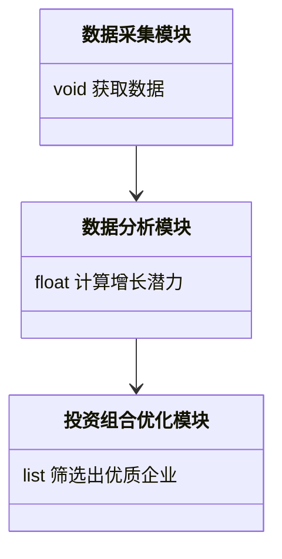

                 


# 费雪的创新企业投资策略

## 关键词：费雪投资策略，成长股，投资算法，系统架构，投资组合优化，风险管理

## 摘要：  
本文深入探讨了费雪的创新企业投资策略，从其核心理念、数学模型、系统架构到实际项目实战，全面分析了这一策略在现代投资中的应用。文章首先介绍了费雪投资策略的背景与发展，接着详细阐述了其核心概念与算法原理，随后通过系统架构设计展示了如何将这一策略应用于实际投资系统中。最后，通过项目实战和最佳实践，为读者提供了在实际投资中应用费雪策略的具体指导。  

---

## 第1章: 费雪投资策略的背景与发展

### 1.1 费雪投资策略的背景  
费雪的投资策略源于20世纪中期，其核心理念是“投资于成长股”。费雪认为，企业的持续盈利能力是股价长期增长的核心驱动力。他强调，投资者应关注企业的基本面，尤其是其盈利能力和成长潜力。  

### 1.2 费雪投资策略的核心理念  
费雪提出了“成长股投资”的概念，即投资于那些具有强大管理团队、持续盈利能力且成长潜力巨大的企业。他主张通过深入研究企业的财务数据和行业地位，找到那些能够长期跑赢市场的优质企业。  

### 1.3 费雪投资策略的发展历程  
随着金融市场的演变，费雪的投资策略不断被优化和扩展。现代投资者结合大数据和机器学习技术，进一步提升了费雪策略的科学性和可操作性。  

---

## 第2章: 费雪投资策略的核心概念与联系

### 2.1 费雪投资策略的核心概念  
#### 2.1.1 管理质量  
管理质量是费雪策略的核心要素之一。优质的企业管理层能够制定正确的战略决策，推动企业持续增长。  

#### 2.1.2 盈利能力  
盈利能力是衡量企业财务健康的重要指标。费雪认为，高盈利能力的企业具有更强的抗风险能力。  

#### 2.1.3 成长潜力  
成长潜力是费雪策略的关键。企业应具备稳定的收入增长和市场扩张能力，才能在未来实现持续增长。  

### 2.2 费雪投资策略与其他投资策略的对比  
#### 2.2.1 与价值投资的对比  
价值投资关注低估值企业，而费雪策略关注高成长性企业。两者在选股标准上有所不同，但都强调基本面分析。  

#### 2.2.2 与趋势投资的对比  
趋势投资基于市场趋势，而费雪策略基于企业基本面。两者的结合可以提高投资的科学性和灵活性。  

#### 2.2.3 与股息投资的对比  
股息投资关注稳定的股息收入，而费雪策略关注企业的长期增长潜力。两者在投资目标上不同，但可以互补。  

---

## 第3章: 费雪投资策略的数学模型与算法原理

### 3.1 费雪投资策略的数学模型  
#### 3.1.1 费雪模型的公式表示  
费雪模型的核心公式如下：  
$$ \text{增长潜力} = \frac{\text{收入增长率} + \text{净利润增长率}}{2} $$  

#### 3.1.2 费雪模型的参数解释  
- 收入增长率：企业收入的年均增长率。  
- 净利润增长率：企业净利润的年均增长率。  
- 市盈率：企业的市盈率，用于衡量估值是否合理。  

#### 3.1.3 费雪模型的优缺点分析  
优点：简单易懂，适用于初步筛选企业。  
缺点：过于简化，可能忽略其他重要因素。  

### 3.2 费雪投资策略的算法流程  
#### 3.2.1 数据采集与处理  
1. 从公开数据源获取企业的财务数据。  
2. 清洗数据，剔除异常值。  

#### 3.2.2 股票筛选算法  
1. 计算收入增长率和净利润增长率。  
2. 计算增长潜力，筛选出潜力大于行业平均的企业。  

#### 3.2.3 投资组合优化算法  
1. 根据增长潜力排序，选择前10%的企业。  
2. 结合市盈率，优化投资组合。  

---

## 第4章: 费雪投资策略的系统架构设计

### 4.1 投资分析系统概述  
#### 4.1.1 系统功能模块划分  
- 数据采集模块：负责获取企业财务数据。  
- 数据分析模块：计算增长潜力和市盈率。  
- 投资组合优化模块：筛选出优质企业并优化组合。  

#### 4.1.2 系统数据流图  


#### 4.1.3 系统架构图  


### 4.2 系统接口设计  
#### 4.2.1 数据接口设计  
1. 数据源接口：连接至股票数据库。  
2. 数据清洗接口：处理异常数据。  

#### 4.2.2 用户接口设计  
1. 输入接口：用户输入筛选条件。  
2. 输出接口：显示筛选结果和投资组合。  

#### 4.2.3 系统日志设计  
1. 记录操作日志。  
2. 记录错误日志。  

---

## 第5章: 费雪投资策略的项目实战

### 5.1 环境安装与配置  
#### 5.1.1 Python环境安装  
安装Python 3.8及以上版本。  

#### 5.1.2 数据分析库安装  
安装Pandas、NumPy、Matplotlib等库。  

#### 5.1.3 数据源获取与处理  
从Yahoo Finance获取股票数据。  

### 5.2 费雪模型的核心实现  
#### 5.2.1 数据清洗与预处理  
```python
import pandas as pd

# 读取数据
df = pd.read_csv('stock_data.csv')

# 清洗数据
df = df.dropna()
df = df[ df['revenue_growth'] > 0 ]
```

#### 5.2.2 股票筛选算法实现  
```python
def fisher_strategy(df):
    # 计算增长潜力
    growth_potential = (df['revenue_growth'] + df['net_profit_growth']) / 2
    # 筛选出潜力大于行业平均的企业
    industry_avg = df['growth_potential'].mean()
    selected = df[growth_potential > industry_avg]
    return selected
```

#### 5.2.3 投资组合优化实现  
```python
def optimize_portfolio(selected):
    # 计算市盈率
    selected['pe_ratio'] = selected['price'] / selected['eps']
    # 优化投资组合
    selected = selected.sort_values('pe_ratio', ascending=True).head(10)
    return selected
```

### 5.3 代码应用解读与分析  
#### 5.3.1 数据分析代码解读  
上述代码展示了如何从数据源获取数据，清洗数据，并计算增长潜力。  

#### 5.3.2 算法实现代码解读  
`fisher_strategy`函数通过计算增长潜力，筛选出符合费雪策略的企业。  

#### 5.3.3 投资组合优化代码解读  
`optimize_portfolio`函数根据市盈率对筛选出的企业进行排序，并选择前10%的企业作为投资组合。  

---

## 第6章: 费雪投资策略的最佳实践与注意事项

### 6.1 费雪投资策略的最佳实践  
#### 6.1.1 理解企业基本面的重要性  
投资者应深入研究企业的财务数据，确保筛选出的企业具有持续增长潜力。  

#### 6.1.2 长期持有优质股票的纪律性  
费雪策略强调长期投资，投资者应保持纪律性，避免频繁交易。  

#### 6.1.3 定期复盘与调整策略  
市场环境不断变化，投资者应定期复盘，及时调整投资组合。  

### 6.2 费雪投资策略的注意事项  
#### 6.2.1 避免过度集中投资  
集中投资风险较高，投资者应分散投资，降低风险。  

#### 6.2.2 注意市场周期性波动  
市场波动是不可避免的，投资者应理性应对，避免盲目跟风。  

#### 6.2.3 防范企业基本面变化风险  
企业基本面的变化可能影响其成长潜力，投资者应密切关注企业动态。  

---

## 第7章: 费雪投资策略的拓展与未来展望

### 7.1 费雪投资策略的拓展  
随着人工智能和大数据技术的发展，费雪策略可以通过机器学习进一步优化。未来，投资者可以利用更复杂的算法，提高选股的准确性和效率。  

### 7.2 费雪投资策略的未来展望  
费雪策略作为一种经典的投资策略，其核心理念仍具有重要的现实意义。未来，随着技术的进步，这一策略将与更多创新方法结合，为投资者提供更有效的工具和思路。  

---

## 总结  
本文从背景、核心概念、数学模型、系统架构到项目实战，全面探讨了费雪的创新企业投资策略。通过深入分析，读者可以理解这一策略的科学性和实用性，并在实际投资中灵活运用。希望本文能为投资者提供有价值的参考，帮助他们在复杂的金融市场中找到优质的投资标的。

