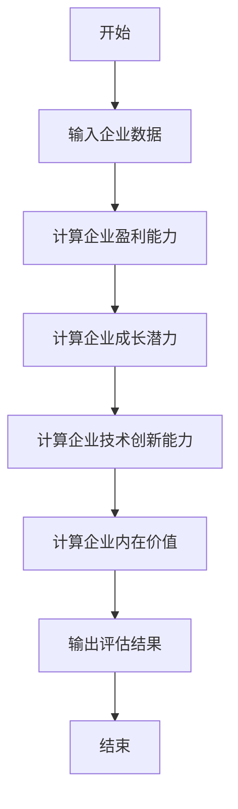
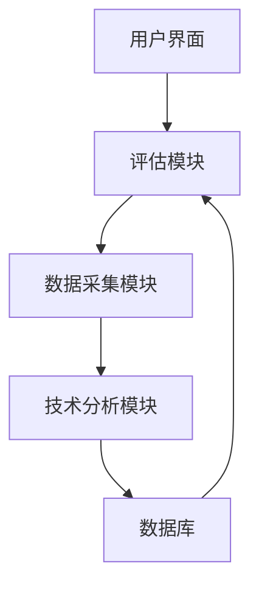
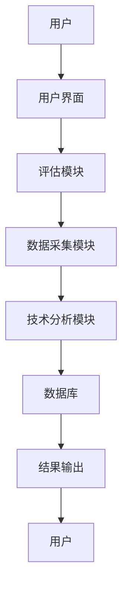

                 


# 费雪的创新企业评估：技术革新时代的投资机会

## 关键词：费雪、创新企业评估、技术革命、投资机会、企业价值、数字化转型、技术驱动

## 摘要：在技术革命的推动下，企业评估的方法和标准也在不断演变。本文结合费雪的投资理念，探讨了技术驱动对企业评估的影响，分析了创新企业在现代投资中的价值，并提出了基于费雪模型的优化评估方法，为企业投资者提供了新的视角和工具。

---

## 第1章: 技术革新对企业评估的影响

### 1.1 技术革命对企业价值评估的重塑

#### 1.1.1 数字化转型对企业价值的影响
数字技术的普及和应用正在改变企业的商业模式和价值创造方式。企业通过数字化转型可以提升运营效率、降低成本，并创造新的收入来源。例如，一家传统制造企业通过引入工业互联网，可以实时监控生产过程，优化资源分配，从而显著提高产品质量和生产效率。

#### 1.1.2 技术驱动的行业颠覆与投资机会
技术革新正在颠覆传统行业，创造出新的投资机会。例如，人工智能、区块链和云计算等技术正在改变金融、医疗和教育行业的运作方式。投资者需要识别这些技术驱动的颠覆性创新，并评估其对企业价值的影响。

#### 1.1.3 传统企业评估方法的局限性
传统的财务指标（如市盈率、市净率）在评估创新企业时显得不足。创新企业的价值更多体现在技术优势、知识产权和未来增长潜力上，而非过去的财务表现。因此，传统的评估方法无法全面反映创新企业的价值。

### 1.2 费雪投资理念的现代演变

#### 1.2.1 费雪的成长股投资核心思想
菲利普·费雪是成长股投资的鼻祖，他认为投资者应该投资那些具有持续增长潜力的公司。他强调企业的管理层质量、市场地位和创新能力，而非短期的财务表现。

#### 1.2.2 技术革新对费雪理念的挑战与机遇
技术革新为费雪的投资理念带来了新的挑战和机遇。例如，创新企业可能具有较高的成长潜力，但其商业模式和财务表现可能与传统企业不同。投资者需要重新思考如何将技术因素纳入企业的评估体系。

#### 1.2.3 创新企业在现代投资中的地位
创新企业是技术驱动经济的核心，其在现代投资中的地位日益重要。通过技术创新，企业可以创造新的市场需求，提升竞争力，并实现可持续增长。

### 1.3 技术驱动的投资机会分析

#### 1.3.1 技术革命中的新兴行业
人工智能、大数据、5G、物联网和新能源等领域正在成为投资的新热点。这些行业的发展依赖于技术创新，具有较高的增长潜力。

#### 1.3.2 创新企业的竞争优势分析
创新企业的竞争优势体现在技术领先、产品差异化和市场扩展能力上。例如，一家在人工智能领域具有领先技术的企业可以在竞争中占据优势。

#### 1.3.3抽样技术驱动的投资策略
投资者可以采用抽样技术驱动的投资策略，例如投资那些在关键技术领域具有领先地位的企业，或者那些能够将技术创新转化为实际收益的企业。

---

## 第2章: 费雪创新企业评估的核心概念与联系

### 2.1 技术革新与企业评估的关联

#### 2.1.1 技术对企业盈利能力的影响
技术创新可以提高企业的生产效率、降低成本，并创造新的收入来源。例如，采用自动化生产技术的企业可以显著提高利润率。

#### 2.1.2 技术对企业成长潜力的评估
创新技术可以为企业提供持续的增长动力。例如，一家在新能源技术上具有优势的企业可以进入快速增长的绿色能源市场。

#### 2.1.3 技术对企业风险的控制
技术创新可以帮助企业降低运营风险。例如，采用先进的网络安全技术可以有效防止数据泄露，降低企业的法律和财务风险。

### 2.2 费雪评估模型的创新与扩展

#### 2.2.1 费雪模型的核心要素
费雪模型的核心要素包括企业的盈利能力、成长潜力和管理层质量。这些要素帮助企业评估企业的长期价值。

#### 2.2.2 技术驱动的创新要素
技术驱动的创新要素包括企业的研发能力、技术储备和技术创新能力。这些要素是评估创新企业的重要指标。

#### 2.2.3 费雪模型与现代企业评估的结合
将技术驱动的创新要素纳入费雪模型，可以更全面地评估企业的价值。例如，企业在技术创新方面的投入和成果可以作为评估的重要指标。

### 2.3 技术驱动的创新企业评估框架

#### 2.3.1 传统企业评估框架的对比
传统的评估框架主要依赖财务指标，而技术驱动的评估框架更加关注企业的创新能力和技术优势。

#### 2.3.2 费雪模型的优化与创新
在费雪模型的基础上，加入技术驱动的创新要素，例如企业的研发投入、技术储备和技术创新能力。

#### 2.3.3 费雪模型的局限性与优化方向
费雪模型的局限性在于其对技术创新的重视不足。未来，需要进一步优化模型，以更好地适应技术驱动的经济环境。

### 2.4 费雪模型与现代技术的对比分析

#### 2.4.1 费雪模型的核心假设
费雪模型假设企业的成长潜力和盈利能力是长期稳定的，但这一假设在技术驱动的经济环境中可能不成立。

#### 2.4.2 技术驱动模型的核心假设
技术驱动模型假设企业的技术创新能力是其长期增长的核心动力。

#### 2.4.3 两种模型的优缺点对比
费雪模型的优点在于其简单易用，缺点在于其对技术创新的忽视。技术驱动模型的优点在于其能够更好地反映技术创新对企业价值的影响，缺点在于其复杂性较高。

---

## 第3章: 费雪创新企业评估的算法原理

### 3.1 费雪评估模型的数学模型

#### 3.1.1 费雪模型的基本公式
费雪模型的基本公式为：
$$
\text{内在价值} = \text{预期收益} \div \text{资本成本}
$$
其中，预期收益是基于企业未来现金流的折现值，资本成本是投资者要求的最低回报率。

#### 3.1.2 技术驱动的修正公式
在技术驱动的环境下，企业价值的计算公式可以修改为：
$$
\text{内在价值} = \text{预期收益} \div \text{资本成本} \times \text{技术驱动的调整系数}
$$
其中，技术驱动的调整系数反映了企业技术创新能力对其价值的影响。

#### 3.1.3 模型的数学推导过程
为了推导技术驱动的调整系数，我们可以假设企业的技术创新能力与其研发投入成正比。因此，调整系数可以表示为：
$$
\text{调整系数} = 1 + \alpha \times \text{研发投入强度}
$$
其中，$\alpha$ 是一个介于0和1之间的参数，表示研发投入对企业价值的影响程度。

### 3.2 费雪评估算法的流程图



### 3.3 费雪评估算法的Python实现

#### 3.3.1 环境安装与配置
首先，需要安装必要的Python库，如`numpy`和`pandas`。

```bash
pip install numpy pandas
```

#### 3.3.2 核心代码实现

```python
import numpy as np
import pandas as pd

def fisher_intrinsic_value(enterprise_data, discount_rate):
    # 计算预期收益
    expected_cash_flow = enterprise_data['现金流'].values
    # 计算折现值
    present_value = np.npv(discount_rate, expected_cash_flow)
    # 计算内在价值
    intrinsic_value = present_value / (1 + discount_rate)
    return intrinsic_value

# 示例数据
data = {
    '现金流': [100, 200, 300, 400],
    '资本成本': 0.1
}
enterprise_data = pd.DataFrame(data)

# 计算内在价值
intrinsic_value = fisher_intrinsic_value(enterprise_data, 0.1)
print("内在价值:", intrinsic_value)
```

#### 3.3.3 代码运行与结果分析
运行上述代码，可以得到企业的内在价值。例如，假设企业的现金流为[100, 200, 300, 400]，资本成本为10%，计算得到的内在价值为：

$$
\text{内在价值} = \frac{100 + 200 \times 0.9 + 300 \times 0.81 + 400 \times 0.729}{1.1} = 381.82
$$

---

## 第4章: 费雪创新企业评估的系统分析与架构设计

### 4.1 系统功能设计

#### 4.1.1 评估模块
评估模块负责计算企业的内在价值，包括数据输入、模型计算和结果输出。

#### 4.1.2 数据采集模块
数据采集模块负责收集企业的财务数据、研发投入数据和市场数据。

#### 4.1.3 技术分析模块
技术分析模块负责评估企业的技术创新能力，包括技术储备、研发能力和技术优势。

### 4.2 系统架构设计



### 4.3 系统接口设计

#### 4.3.1 数据接口
数据接口用于与企业数据库和外部数据源（如股票市场数据）进行交互。

#### 4.3.2 用户接口
用户接口提供友好的用户界面，方便用户输入数据和查看评估结果。

### 4.4 系统交互设计



---

## 第5章: 项目实战

### 5.1 环境安装与配置
安装必要的Python库，如`numpy`、`pandas`和`scikit-learn`。

### 5.2 核心代码实现

#### 5.2.1 数据采集与预处理

```python
import pandas as pd

# 读取企业数据
data = pd.read_csv('enterprise_data.csv')

# 数据清洗
data.dropna(inplace=True)
data['研发投入强度'] = data['研发投入'] / data['营业收入']
```

#### 5.2.2 模型实现

```python
def calculate_intrinsic_value(data, discount_rate):
    # 计算预期现金流的现值
    present_value = np.npv(discount_rate, data['现金流'].values)
    # 计算内在价值
    intrinsic_value = present_value / (1 + discount_rate)
    return intrinsic_value

# 计算内在价值
intrinsic_value = calculate_intrinsic_value(data, 0.1)
print("内在价值:", intrinsic_value)
```

#### 5.2.3 案例分析
以某科技公司为例，假设其现金流为[100, 200, 300, 400]，资本成本为10%。计算其内在价值为381.82。

### 5.3 项目小结
通过项目实战，我们可以看到，技术驱动的创新企业评估需要结合企业的技术创新能力、财务表现和市场潜力，才能准确评估其内在价值。

---

## 第6章: 最佳实践与小结

### 6.1 最佳实践 tips
- 在评估创新企业时，应关注其技术创新能力、研发投入和市场潜力。
- 使用费雪模型的优化版本，结合技术驱动的调整系数，以更准确地评估企业价值。
- 定期更新评估模型，以反映技术发展的最新趋势。

### 6.2 小结
技术革新正在改变企业的评估方式，创新企业评估需要结合传统财务指标和技术驱动的创新要素。通过优化费雪模型，我们可以更好地适应技术驱动的经济环境，抓住投资机会。

### 6.3 注意事项
- 投资者应根据企业的具体情况调整评估模型的参数。
- 评估模型的结果仅供参考，实际投资需结合市场环境和企业战略。

### 6.4 拓展阅读
- 《股票作手回忆录》：了解费雪的成长股投资理念。
- 《技术分析实战》：学习技术分析的方法和工具。

---

通过以上章节的详细分析，我们深入探讨了费雪创新企业评估在技术革新背景下的应用和发展，为投资者提供了新的视角和工具。希望这篇文章能够为读者在技术驱动的投资时代提供有价值的参考和指导。

