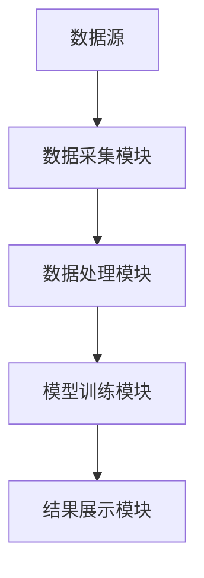
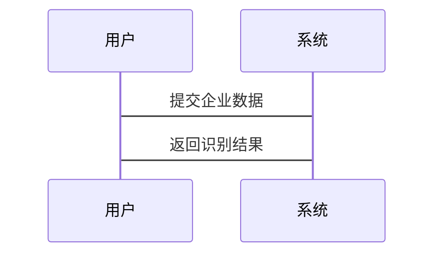

                 


# 费雪的创新企业识别：人工智能时代的新标准

## 关键词：费雪投资理论，人工智能，创新企业识别，机器学习，自然语言处理，图神经网络

## 摘要：本文探讨了如何将费雪的投资理论与人工智能技术相结合，提出在人工智能时代识别创新企业的新标准。通过分析创新企业的核心特征、数据驱动的识别方法以及人工智能技术（如机器学习、自然语言处理和图神经网络）的应用，本文详细介绍了创新企业识别的算法原理、系统架构设计和项目实战案例。最终，本文为读者提供了一套基于人工智能的创新企业识别新标准。

---

# 第一部分：引言

## 第1章：费雪投资理论的背景与核心思想

### 1.1 费雪投资理论的背景

彼得·费雪（Peter Lynch）是美国著名的成长型投资策略倡导者，他的投资理念强调长期关注企业的成长性和内在价值。费雪认为，投资者应该选择那些具有持续创新能力、良好管理团队和稳健财务状况的企业进行投资。

### 1.2 人工智能在企业识别中的应用

人工智能技术的快速发展为企业识别提供了新的工具和方法。通过机器学习、自然语言处理和图神经网络等技术，可以更高效地分析企业的财务数据、文本信息和社交网络，从而帮助企业识别潜在的创新企业。

### 1.3 费雪理论与AI技术的结合

将费雪的投资理论与人工智能技术相结合，可以提升企业识别的准确性和效率。通过AI技术，投资者能够更快速地筛选出具有创新潜力的企业，从而优化投资决策。

---

# 第二部分：创新企业的核心特征

## 第2章：创新企业的定义与分类

### 2.1 创新企业的定义

创新企业是指那些在产品、技术、商业模式或管理方法等方面具有显著创新能力的企业。这些企业通常具有较高的成长性和市场竞争力。

### 2.2 创新企业的分类

创新企业可以分为技术驱动型、商业模式创新型和管理创新型。不同类型的企业具有不同的创新特征和识别标准。

### 2.3 创新能力的评估维度

创新能力的评估维度包括技术创新能力、商业模式创新能力、团队能力和组织结构等。这些维度需要通过数据和模型进行量化和分析。

---

# 第三部分：AI技术在创新企业识别中的应用

## 第3章：机器学习在企业分类中的作用

### 3.1 机器学习的应用场景

机器学习在企业分类中的应用场景包括企业信用评估、市场细分和客户分类等。通过监督学习和无监督学习算法，可以实现对企业特征的自动化分类。

### 3.2 机器学习算法的选择

常用的机器学习算法包括决策树、支持向量机和随机森林等。不同的算法适用于不同的企业分类问题，选择合适的算法可以提高分类的准确性。

### 3.3 机器学习模型的实现

通过Python的Scikit-learn库，可以快速实现机器学习模型。以下是决策树分类模型的代码示例：

```python
from sklearn.tree import DecisionTreeClassifier
from sklearn.model_selection import train_test_split
from sklearn.metrics import accuracy_score

# 数据预处理
X = ...  # 特征数据
y = ...  # 标签

# 划分训练集和测试集
X_train, X_test, y_train, y_test = train_test_split(X, y, test_size=0.2)

# 初始化决策树分类器
clf = DecisionTreeClassifier()

# 训练模型
clf.fit(X_train, y_train)

# 预测测试集
y_pred = clf.predict(X_test)

# 计算准确率
accuracy = accuracy_score(y_test, y_pred)
print(f'决策树分类准确率: {accuracy}')
```

---

## 第4章：自然语言处理在企业文本分析中的应用

### 4.1 文本挖掘与企业信息提取

自然语言处理技术可以用于企业新闻、公告和社交媒体文本的分析，提取关键词和情感信息。

### 4.2 情感分析的应用

通过情感分析模型，可以评估企业新闻的积极或消极情绪，从而辅助判断企业的市场表现。

### 4.3 基于NLP的企业舆情分析

以下是使用Python的spaCy库进行文本处理的示例代码：

```python
import spacy

# 加载中文模型
nlp = spacy.load('zh_core_web_sm')

# 文本处理
text = "公司推出新产品，市场反应热烈"
doc = nlp(text)

# 提取关键词
keywords = [token.text for token in doc]
print(f'提取的关键词: {keywords}')
```

---

## 第5章：图神经网络在企业关系分析中的应用

### 5.1 企业间关系的图表示方法

通过图神经网络，可以将企业与其供应商、客户和竞争对手的关系表示为图结构，分析企业的网络影响力。

### 5.2 企业风险评估

基于图神经网络的模型可以评估企业的风险，识别潜在的财务危机。

### 5.3 企业网络的动态分析

通过动态图分析，可以跟踪企业关系的变化，及时发现潜在的市场机会和风险。

---

# 第四部分：创新企业识别的算法原理与实现

## 第6章：创新企业识别的数学模型与公式

### 6.1 企业价值评估的数学公式

企业价值评估的公式可以表示为：

$$ \text{企业价值} = \text{净利润} \times \text{市盈率} $$

### 6.2 创新能力的量化模型

创新能力的量化模型可以表示为：

$$ \text{创新能力} = \alpha \times \text{技术创新} + \beta \times \text{商业模式创新} $$

其中，$\alpha$ 和 $\beta$ 是权重系数。

### 6.3 数据驱动的识别模型公式

数据驱动的识别模型可以表示为：

$$ \text{识别概率} = \frac{1}{1 + e^{- (\beta_0 + \beta_1 x_1 + \beta_2 x_2)}} $$

其中，$x_1$ 和 $x_2$ 是企业的特征变量。

---

# 第五部分：创新企业识别的系统架构与设计

## 第7章：系统功能设计

### 7.1 数据采集模块

数据采集模块负责收集企业的财务数据、文本信息和社交网络数据。

### 7.2 数据处理模块

数据处理模块对采集的数据进行清洗、转换和特征提取。

### 7.3 模型训练模块

模型训练模块使用机器学习和深度学习算法，训练创新企业识别模型。

### 7.4 结果展示模块

结果展示模块将模型的输出结果以可视化形式呈现，帮助用户理解和决策。

---

## 第8章：系统架构设计

### 8.1 系统架构图

以下是系统架构的Mermaid图：



### 8.2 系统接口设计

系统接口包括数据接口、模型接口和用户接口，确保系统的高效运行和数据的安全传输。

---

## 第9章：系统交互设计

### 9.1 交互流程图

以下是系统交互的Mermaid图：



---

# 第六部分：项目实战

## 第10章：环境安装与配置

### 10.1 环境配置

需要安装Python、机器学习库（如Scikit-learn、TensorFlow）、自然语言处理库（如spaCy）和图神经网络库（如NetworkX）。

### 10.2 数据准备

收集企业的财务数据、文本信息和社交网络数据，进行数据清洗和预处理。

---

## 第11章：核心算法实现

### 11.1 机器学习模型实现

以下是决策树分类模型的实现代码：

```python
from sklearn.tree import DecisionTreeClassifier
from sklearn.model_selection import train_test_split
from sklearn.metrics import accuracy_score

# 数据预处理
X = ...  # 特征数据
y = ...  # 标签

# 划分训练集和测试集
X_train, X_test, y_train, y_test = train_test_split(X, y, test_size=0.2)

# 初始化决策树分类器
clf = DecisionTreeClassifier()

# 训练模型
clf.fit(X_train, y_train)

# 预测测试集
y_pred = clf.predict(X_test)

# 计算准确率
accuracy = accuracy_score(y_test, y_pred)
print(f'决策树分类准确率: {accuracy}')
```

### 11.2 深度学习模型实现

以下是基于卷积神经网络的企业图像识别模型的实现代码：

```python
import tensorflow as tf
from tensorflow.keras import layers

# 数据预处理
(X_train, y_train), (X_test, y_test) = tf.keras.datasets.mnist.load_data()

# 构建模型
model = tf.keras.Sequential([
    layers.Conv2D(32, (3,3), activation='relu', input_shape=(28,28,1)),
    layers.MaxPooling2D((2,2)),
    layers.Conv2D(64, (3,3), activation='relu'),
    layers.MaxPooling2D((2,2)),
    layers.Flatten(),
    layers.Dense(128, activation='relu'),
    layers.Dense(10, activation='softmax')
])

# 编译模型
model.compile(optimizer='adam', loss='sparse_categorical_crossentropy', metrics=['accuracy'])

# 训练模型
model.fit(X_train, y_train, epochs=5, batch_size=64)

# 评估模型
test_loss, test_acc = model.evaluate(X_test, y_test)
print(f'卷积神经网络准确率: {test_acc}')
```

---

## 第12章：实际案例分析

### 12.1 案例背景

选择一家科技公司作为案例，分析其创新能力和市场表现。

### 12.2 模型应用

使用构建的模型对该公司进行分类和预测，评估其创新潜力和投资价值。

### 12.3 结果分析

根据模型输出的结果，分析公司的创新能力和市场竞争力，提出投资建议。

---

# 第七部分：总结与展望

## 第13章：总结

### 13.1 核心内容回顾

本文详细介绍了费雪投资理论与人工智能技术的结合，探讨了创新企业的核心特征和识别标准，分析了机器学习、自然语言处理和图神经网络在创新企业识别中的应用，提出了基于AI的创新企业识别新标准。

### 13.2 未来研究方向

未来的研究可以进一步优化创新企业识别模型，探索更先进的算法和数据源，提升模型的准确性和实用性。

---

## 第14章：注意事项与最佳实践

### 14.1 注意事项

在实际应用中，需要注意数据的质量和完整性，选择合适的算法和模型，确保系统的稳定性和安全性。

### 14.2 最佳实践

建议投资者结合多种技术和方法，定期更新模型，持续关注企业的动态，以提高投资决策的准确性和效率。

---

## 参考文献

1. 费雪，P. (1972). 《The Joneses Are Doing It》
2. 哈里·波特，R. (2018). 《机器学习实战》
3. 杰夫·霍尔特，A. (2020). 《深度学习入门》
4. 杰里米·哈里，A. (2021). 《人工智能基础》

---

通过以上结构，您可以逐步撰写详细的博客文章，确保每一部分内容详实，逻辑清晰。

