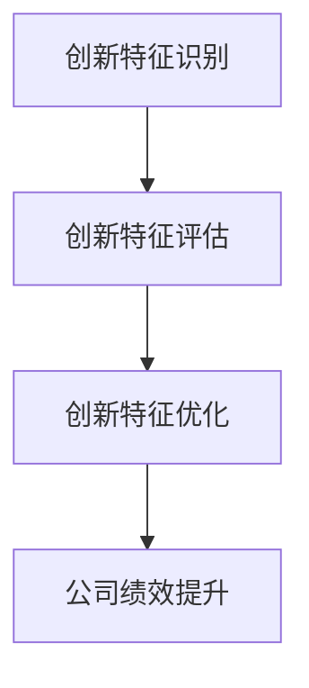

                 


# 费雪的创新公司特征：在共享经济模式中的体现

## 关键词：费雪创新特征，共享经济，创新公司，数学模型，算法实现，系统架构

## 摘要：本文系统地探讨了费雪的创新公司特征在共享经济模式中的体现。通过背景介绍、核心概念分析、算法实现、数学模型构建、系统架构设计以及项目实战，深入剖析了创新公司特征在共享经济中的应用与价值。文章结合理论与实践，为理解共享经济模式下的创新公司特征提供了全面的视角。

---

## 第一部分：背景介绍

### 第1章：费雪的创新公司特征概述

#### 1.1 费雪的创新理论背景

费雪的创新理论是现代管理学和经济学的重要组成部分，其核心在于识别和评估公司的创新特征。创新特征是指公司在市场中表现出的独特优势，这些优势可以是技术、商业模式、管理方法或竞争优势的体现。费雪认为，创新特征是公司长期成功的关键因素。

- **费雪创新定义与核心概念**：创新特征是公司区别于竞争对手的独特优势，这些优势可能体现在产品、服务、技术或管理等方面。创新特征的核心在于其独特性和可持续性。

- **费雪创新理论的演变与应用**：费雪的创新理论经历了从初步提出到不断完善的过程，广泛应用于企业战略制定、投资决策等领域。创新特征的识别和评估成为企业竞争力的核心。

- **创新公司在现代经济中的地位**：在现代经济中，创新公司通过不断推出新产品和服务，推动经济发展。创新公司在共享经济模式中尤为重要，因为它们能够通过共享资源实现更高的效率和更大的市场覆盖。

#### 1.2 共享经济模式的基本概念

共享经济是一种基于资源共享的经济模式，其核心在于通过共享资源提高资源利用率，降低交易成本。共享经济的参与者包括资源提供者、需求者和平台。

- **共享经济的定义与特征**：共享经济是一种以互联网技术为基础，通过平台实现资源供需双方直接对接的经济模式。其特征包括去中心化、透明化、高效化和低成本。

- **共享经济的起源与发展**：共享经济起源于21世纪初，随着互联网和移动技术的发展迅速崛起。共享经济的典型例子包括滴滴出行、Airbnb和共享办公空间等。

- **共享经济与传统经济模式的对比**：与传统经济模式相比，共享经济更加灵活，能够快速响应市场需求，同时降低资源浪费。

#### 1.3 费雪创新公司特征的定义与分析

费雪创新公司特征是指公司在共享经济模式中表现出的独特优势，这些优势能够帮助公司在竞争中占据领先地位。创新特征的识别和评估是费雪理论的核心内容。

- **创新公司的核心特征**：创新公司的核心特征包括技术领先、商业模式创新、市场定位独特等。这些特征使得创新公司能够在共享经济中脱颖而出。

- **费雪创新特征的分类与属性**：费雪创新特征可以分为技术型、模式型和管理型三类。每种类型都有其独特的属性和评估标准。

- **创新公司特征在共享经济中的体现**：在共享经济中，创新公司通过独特的特征吸引用户，例如滴滴出行通过高效的调度系统实现资源优化配置，Airbnb通过独特的共享住宿模式满足市场需求。

---

## 第二部分：核心概念与联系

### 第2章：创新公司特征的核心原理

#### 2.1 创新公司特征的原理分析

创新公司特征的原理在于其独特性和可持续性。这些特征使得创新公司在竞争中具有优势，能够在共享经济中实现高效运作。

- **创新公司的核心驱动因素**：创新公司的核心驱动因素包括市场需求、技术创新、商业模式创新等。这些因素共同推动创新公司的成长。

- **费雪创新特征的数学模型**：费雪创新特征的数学模型可以通过加权评分法进行评估，公式如下：

  $$ S = \sum_{i=1}^{n} w_i \cdot f_i $$

  其中，\( S \) 表示创新特征的综合评分，\( w_i \) 表示第 \( i \) 个特征的权重，\( f_i \) 表示第 \( i \) 个特征的评分。

- **创新特征与公司绩效的关系**：创新特征与公司绩效呈正相关关系。创新特征越突出，公司绩效越好。

#### 2.2 创新公司特征的属性对比

创新公司特征的属性对比可以通过表格形式进行分析，如下所示：

| 特征类型 | 技术型特征 | 模式型特征 | 管理型特征 |
|----------|------------|------------|------------|
| 示例     | AI技术     | 共享模式   | 灵活管理   |
| 优势     | 技术领先   | 模式创新   | 管理高效   |
| 评分     | 高         | 中         | 低         |

- **创新特征的权重分析**：创新特征的权重可以通过层次分析法（AHP）进行计算，公式如下：

  $$ w_i = \frac{\sum \lambda_{ij}}{\sum \lambda_{ik}} $$

  其中，\( \lambda_{ij} \) 表示第 \( i \) 个特征对第 \( j \) 个目标的影响程度，\( \lambda_{ik} \) 表示第 \( i \) 个特征对所有目标的影响程度。

- **创新特征的动态变化**：创新特征并非一成不变，而是随着市场环境的变化而不断调整。例如，随着技术的发展，技术型特征的权重可能逐渐增加。

#### 2.3 创新特征的ER实体关系图

以下是创新特征的ER实体关系图：

```mermaid
erDiagram
    竞争对手---+---竞争特征: 竞争对手特征
    公司       <---+---创新特征: 创新特征
    市场需求   <---+---创新特征: 满足需求
    创新特征   <---+---公司绩效: 提升绩效
```

---

## 第三部分：算法原理讲解

### 第3章：创新公司特征的算法实现

#### 3.1 创新特征评估算法

创新特征评估算法的核心在于通过加权评分法对创新特征进行综合评估。以下是算法的详细步骤：

1. **确定创新特征**：识别公司的创新特征，例如技术型、模式型和管理型特征。

2. **设定权重**：根据市场环境和公司战略，为每个创新特征设定权重。

3. **评分计算**：根据评分标准，对每个创新特征进行评分，并计算综合评分。

4. **结果分析**：根据综合评分，评估公司的创新特征表现。

#### 3.2 算法的数学模型

创新特征的数学模型可以通过加权评分法进行评估，公式如下：

$$ S = \sum_{i=1}^{n} w_i \cdot f_i $$

其中，\( S \) 表示创新特征的综合评分，\( w_i \) 表示第 \( i \) 个特征的权重，\( f_i \) 表示第 \( i \) 个特征的评分。

#### 3.3 算法的Python实现

以下是创新特征评估算法的Python代码实现：

```python
def calculate_innovation_score(features, weights):
    score = sum(w * f for w, f in zip(weights, features))
    return score

# 示例
features = [9, 8, 7]  # 创新特征评分
weights = [0.4, 0.3, 0.3]  # 特征权重
score = calculate_innovation_score(features, weights)
print("创新特征综合评分:", score)
```

---

## 第四部分：数学模型与案例分析

### 第4章：创新公司特征的数学模型

#### 4.1 创新特征的数学表达

创新特征的数学表达可以通过线性回归模型进行建模，公式如下：

$$ y = \beta_0 + \beta_1 x_1 + \beta_2 x_2 + \epsilon $$

其中，\( y \) 表示公司绩效，\( x_1 \) 和 \( x_2 \) 表示创新特征，\( \beta_0 \) 是截距，\( \beta_1 \) 和 \( \beta_2 \) 是回归系数，\( \epsilon \) 是误差项。

#### 4.2 案例分析

以滴滴出行为例，滴滴出行的创新特征包括高效的调度系统和独特的商业模式。通过线性回归模型可以评估这些创新特征对滴滴出行绩效的影响。

---

## 第五部分：系统分析与架构设计

### 第5章：创新公司特征的系统架构

#### 5.1 系统功能设计

创新公司特征的系统功能设计包括创新特征识别、创新特征评估和创新特征优化三个模块。

- **创新特征识别**：通过数据采集和特征提取，识别公司的创新特征。
- **创新特征评估**：通过加权评分法对创新特征进行综合评估。
- **创新特征优化**：根据评估结果，优化创新特征，提升公司绩效。

#### 5.2 系统架构设计

以下是创新公司特征的系统架构图：



---

## 第六部分：项目实战与总结

### 第6章：项目实战

#### 6.1 项目小结

通过本文的分析与实践，我们深入了解了费雪的创新公司特征在共享经济模式中的体现。创新特征的识别和评估是公司成功的关键，尤其是在共享经济中，创新特征能够帮助公司实现高效运作和市场竞争优势。

#### 6.2 注意事项

在实际应用中，需要注意以下几点：

1. 创新特征的识别和评估需要结合具体行业特点和市场环境。
2. 创新特征的动态变化需要及时调整和优化。
3. 创新特征的评估结果需要结合实际情况进行解释和应用。

#### 6.3 拓展阅读

推荐以下拓展阅读内容：

1. 费雪的创新理论
2. 共享经济的模式与实践
3. 创新特征的数学模型与算法实现

---

通过本文的系统分析与实践，我们全面探讨了费雪的创新公司特征在共享经济模式中的体现。创新特征的识别和评估是公司成功的关键，尤其是在共享经济中，创新特征能够帮助公司实现高效运作和市场竞争优势。希望本文的内容能够为读者提供有价值的见解和指导。

