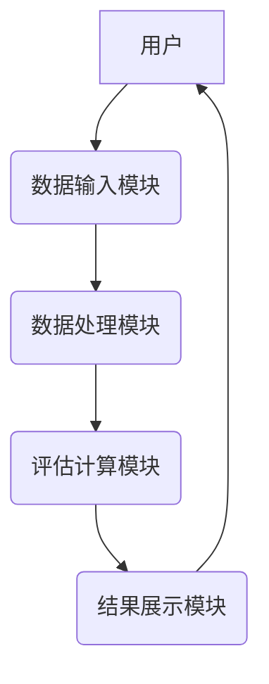

                 


# 费雪的判断公司质量的15个要点

> 关键词：费雪投资理念，公司质量评估，财务分析，管理层评估，投资策略

> 摘要：本文深入分析了费雪提出的15个判断公司质量的关键要点，涵盖了从管理层质量到财务状况的多个方面。通过逻辑清晰的结构和详细的案例分析，帮助读者掌握如何系统地评估公司的质量和投资潜力。

---

## 第一部分：背景介绍

### 第1章：费雪投资理念与方法论

#### 1.1 费雪投资理念的背景与发展

菲利普·费雪（Philip Fisher）是20世纪的投资大师，以其“成长型投资”理念闻名。他在1949年出版的《共同wealth: A New Approach to the Stock Market》一书中提出了15个判断公司质量的关键要点。这些要点不仅帮助投资者筛选出具有长期增长潜力的公司，还为现代投资理论奠定了基础。

#### 1.2 费雪投资理念的核心观点

费雪的理念强调选择那些具备持续增长潜力和优秀管理团队的公司。他提出，投资者应该关注公司的基本面，尤其是管理层的质量、财务健康状况以及行业地位。这种“买好公司，长期持有的”策略与现代价值投资理念有诸多相似之处。

#### 1.3 费雪15个要点的核心要素

费雪的15个要点可以归纳为以下几个核心要素：

- 管理层的能力与诚信
- 财务状况的稳健性
- 行业地位与竞争优势
- 成长潜力与未来前景

---

## 第二部分：核心概念与联系

### 第2章：15个要点的详细分析

#### 2.1 管理层能力与诚信

- **管理层能力**：管理层的能力决定了公司的战略方向和执行效率。优秀管理层通常具备行业经验、决策能力和创新思维。
- **管理层诚信**：管理层的诚信是公司长期发展的基础。投资者应选择那些道德标准高、透明度强的管理层。

#### 2.2 财务状况的稳健性

- **盈利能力**：通过分析公司的净利润、毛利率等指标，评估其盈利能力。
- **资产负债表**：关注公司的资产结构、负债水平和现金流状况，判断其财务健康度。

#### 2.3 行业地位与竞争优势

- **行业地位**：公司所处行业的生命周期、市场容量和竞争格局直接影响其发展前景。
- **竞争优势**：公司是否具备技术壁垒、品牌优势或成本优势等核心竞争力。

#### 2.4 成长潜力与未来前景

- **行业趋势**：分析行业的发展趋势，判断公司是否处于增长期。
- **公司战略**：评估公司的战略规划是否合理，能否抓住市场机遇。

---

## 第三部分：算法原理与数学模型

### 第3章：费雪评估算法的数学模型

费雪的评估方法可以转化为一个数学模型，用于量化公司的质量评分。以下是具体的数学模型：

#### 3.1 费雪评估模型的构建

$$
\text{公司质量评分} = \sum_{i=1}^{15} w_i \times s_i
$$

其中：
- \(w_i\) 是第i个评估要点的权重
- \(s_i\) 是第i个评估要点的评分（1-5分）

#### 3.2 评估要点权重分配

根据费雪的理念，管理层质量（40%）、财务状况（30%）、行业地位（20%）和成长潜力（10%）是四个主要评估维度。

---

## 第四部分：系统分析与架构设计

### 第4章：公司质量评估系统的架构

#### 4.1 系统功能设计

- **数据输入**：收集公司的财务数据、管理层信息和行业报告。
- **评估计算**：根据费雪的15个要点，计算公司质量评分。
- **结果展示**：以图表形式展示评估结果。

#### 4.2 系统架构设计



#### 4.3 接口设计

- 数据输入接口：接收公司数据。
- 评估接口：计算公司质量评分。
- 展示接口：输出评估结果。

---

## 第五部分：项目实战

### 第5章：基于费雪15个要点的公司质量评估案例

#### 5.1 环境安装

- 安装Python和必要的库（如pandas、numpy）。

#### 5.2 核心代码实现

```python
import pandas as pd
import numpy as np

def calculate_company_quality(company_data):
    # 简化计算，仅考虑部分要点
    quality_score = 0
    # 管理层能力评分（权重40%）
    quality_score += 0.4 * (company_data['管理层能力'] / 5)
    # 财务状况评分（权重30%）
    quality_score += 0.3 * (company_data['财务状况'] / 5)
    # 行业地位评分（权重20%）
    quality_score += 0.2 * (company_data['行业地位'] / 5)
    # 成长潜力评分（权重10%）
    quality_score += 0.1 * (company_data['成长潜力'] / 5)
    return quality_score

# 示例数据
data = {
    '公司名称': '示例公司',
    '管理层能力': 4,
    '财务状况': 3,
    '行业地位': 4,
    '成长潜力': 2
}
df = pd.DataFrame(data)
print("公司质量评分：", calculate_company_quality(df))
```

#### 5.3 实际案例分析

以某科技公司为例，分析其在费雪15个要点中的表现，计算其质量评分并提出投资建议。

---

## 第六部分：最佳实践与总结

### 第6章：费雪评估法的总结与建议

#### 6.1 小结

费雪的15个要点为投资者提供了一套系统化的公司评估方法。通过结合管理层质量、财务状况和行业地位等因素，投资者可以更准确地判断公司的投资价值。

#### 6.2 注意事项

- 数据来源的可靠性
- 持续关注公司动态
- 结合市场环境进行调整

#### 6.3 拓展阅读

推荐阅读费雪的原著《共同wealth》以及其他投资经典书籍，深入理解其投资理念。

---

## 结语

费雪的15个要点不仅是投资决策的重要参考，也为现代公司评估提供了宝贵的思路。通过系统化的分析和实际案例的分析，读者可以更好地掌握这一方法，并在实际投资中灵活运用。

