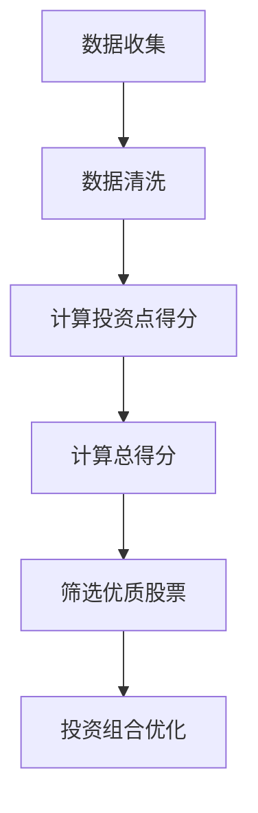
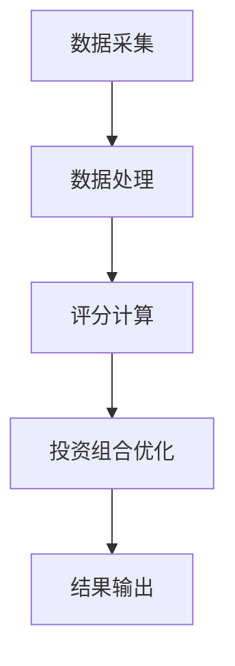
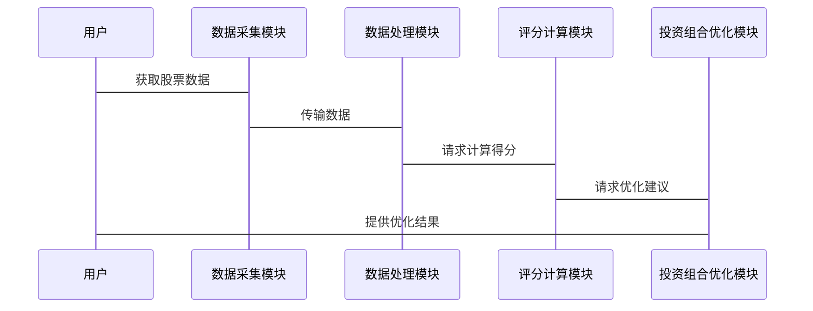

                 


# 费雪的十五个投资点：选股的黄金法则

## 关键词：费雪投资点，选股法则，投资策略，股票分析，财务指标

## 摘要：本文深入分析了费雪的十五个选股投资点，从背景介绍到实际应用，结合技术细节和系统架构，帮助读者掌握如何通过这些黄金法则筛选出具有长期增长潜力的优质股票。文章内容涵盖投资理论、算法模型、系统设计和项目实战，提供全面的指导和实践建议。

---

## 第一部分：背景介绍

### 第1章：投资的基本概念

#### 1.1 投资的基本定义

- **1.1.1 投资的定义与分类**
  投资是指将资金投入某个项目或资产，以期在未来获得收益或资本增值的行为。股票投资是其中的重要形式，投资者通过购买公司股票成为股东，分享公司成长的收益。

- **1.1.2 股票投资的基本原理**
  股票投资的核心在于识别具有长期增长潜力的公司。投资者需要分析公司的财务状况、行业地位、管理团队等因素，以评估其股票的价值和风险。

- **1.1.3 投资的目标与风险**
  投资目标通常包括资本增值、股息收益和风险控制。股票投资的风险主要来源于市场波动、公司业绩变化和宏观经济因素等。

#### 1.2 费雪投资理论的背景

- **1.2.1 费雪及其投资理念的提出**
  费雪（Philip Fisher）是20世纪的投资大师，提出了“成长股”投资理念，强调选择那些具有持续盈利能力、强大竞争优势和优秀管理团队的公司。

- **1.2.2 费雪投资理论的历史影响**
  费雪的投资理论对现代价值投资产生了深远影响，尤其是在选股标准和长期投资策略方面。

- **1.2.3 当代投资环境的变化与费雪理论的适用性**
  尽管投资环境发生变化，但费雪的理论依然适用，特别是在筛选优质成长股方面，其十五个投资点为投资者提供了系统的方法。

---

## 第二部分：核心概念与联系

### 第2章：费雪的十五个投资点

#### 2.1 每个投资点的详细阐述

- **2.1.1 公司的盈利能力**
  费雪认为，盈利能力是衡量公司价值的重要指标。投资者应关注净利润率、毛利率等指标，选择具有稳定且高盈利能力的公司。

- **2.1.2 资产负债表的健康状况**
  健康的资产负债表意味着公司财务稳健。投资者应关注资产负债率、流动比率等指标，避免选择财务杠杆过高或流动性不足的公司。

- **2.1.3 现金流量的稳定性**
  现金流是公司运营的关键。稳定的经营活动现金流表明公司具备持续的自我造血能力，能够应对市场波动。

- **2.1.4 行业地位与竞争优势**
  行业地位高的公司通常具有更强的定价能力和竞争优势。投资者应选择那些在行业内占据领先地位，并具备独特竞争优势的公司。

- **2.1.5 管理团队的素质**
  优秀的管理团队是公司长期增长的核心。投资者应研究管理层的背景、经验和战略规划，选择由高素质团队领导的公司。

- **2.1.6 股东权益的增长**
  股东权益的增长反映了公司为股东创造价值的能力。投资者应关注公司 retained earnings（留存收益）和 equity growth（权益增长）。

- **2.1.7 股票的合理估值**
  合理估值是避免投资失误的关键。投资者应使用市盈率（P/E）、市净率（P/B）等指标，评估股票的内在价值。

- **2.1.8 股票市场的周期性**
  股票市场具有周期性，投资者应避免在市场高点盲目投资，而应在市场低谷时寻找被低估的优质股票。

- **2.1.9 分红政策与股东回报**
  合理的分红政策反映了公司的盈利能力和分红意愿。投资者应选择那些分红稳定且增长的公司，作为投资标的。

- **2.1.10 股票的流动性**
  流动性高的股票容易变现，降低投资风险。投资者应选择交易量大、换手率高的股票，以确保资金流动性。

- **2.1.11 经济周期与投资策略**
  经济周期影响股票市场表现。投资者应在经济复苏期寻找周期性股票，在经济繁荣期选择成长股。

- **2.1.12 财务报表的解读技巧**
  财务报表是选股的重要依据。投资者应学会解读利润表、资产负债表和现金流量表，识别公司的真实财务状况。

- **2.1.13 市场情绪与投资决策**
  市场情绪影响短期股价波动。投资者应避免被市场情绪左右，坚持长期投资策略，关注公司基本面。

- **2.1.14 长期投资与短期波动的平衡**
  长期投资注重公司基本面，短期波动由市场情绪和突发事件引发。投资者应在长期持有优质股票的同时，关注短期波动，及时调整投资策略。

- **2.1.15 风险管理与投资组合的构建**
  风险管理是投资成功的关键。投资者应通过分散投资、设置止损点等方式，降低投资风险。

#### 2.2 投资点之间的关系与综合应用

- **2.2.1 各个投资点的相互作用**
  费雪的十五个投资点相互关联，共同构成选股的综合标准。例如，公司的盈利能力与股东权益增长密切相关，而行业地位又影响公司的竞争优势。

- **2.2.2 如何综合运用十五个投资点进行选股**
  投资者应将这些投资点综合考虑，制定选股标准。例如，优先选择行业地位高、盈利能力强、财务稳健且估值合理的公司。

- **2.2.3 投资点在不同市场环境下的权重调整**
  在不同的市场环境下，某些投资点的重要性会有所变化。例如，在经济衰退期，流动性高的股票和稳健的分红政策更为重要。

---

## 第三部分：算法原理讲解

### 第3章：基于费雪投资点的选股模型

#### 3.1 模型的构建原理

- **3.1.1 费雪投资点的量化标准**
  将每个投资点转化为具体的量化指标，例如：
  - 盈利能力：净利润率 > 行业平均
  - 资产负债表健康：资产负债率 < 60%
  - 现金流量：经营活动现金流为正
  - 行业地位：公司市场份额 > 10%
  - 管理团队：管理层稳定，无重大诉讼
  - 股东权益增长：年均复合增长率 > 15%
  - 合理估值：市盈率 < 同行业平均水平
  - 分红政策：连续5年分红，且分红率 > 3%
  - 股票流动性：日均成交量 > 100万股

- **3.1.2 股票评分系统的建立**
  根据每个投资点的量化标准，为每只股票打分，总分为100分，得分越高，投资价值越大。

- **3.1.3 数据预处理与特征提取**
  从财务报表中提取关键指标，处理缺失值和异常值。

#### 3.2 模型的实现步骤

- **3.2.1 数据收集与清洗**
  从金融数据源（如Yahoo Finance、 Bloomberg）获取股票数据，清洗数据，处理缺失值。

- **3.2.2 投资点的评分计算**
  根据每个投资点的量化标准，计算每只股票的得分。

- **3.2.3 模型的验证与优化**
  使用历史数据验证模型的准确性，优化评分权重。

#### 3.3 算法原理的数学模型和公式

- **3.3.1 股票评分公式**
  每个投资点的得分为：
  \[
  \text{Score}_i = \frac{\text{指标值}}{\text{行业平均值}} \times 100
  \]
  总得分为所有投资点得分的加权平均值：
  \[
  \text{Total Score} = \sum (\text{Weight}_i \times \text{Score}_i)
  \]

- **3.3.2 投资组合优化模型**
  使用现代投资组优化理论，最大化夏普比率：
  \[
  \text{夏普比率} = \frac{\text{投资组合收益} - \text{无风险利率}}{\text{投资组合标准差}}
  \]

#### 3.4 使用mermaid画出算法流程图



#### 3.5 Python源代码实现

```python
import pandas as pd
import numpy as np

def calculate_scores(stock_data):
    # 计算每个投资点的得分
    scores = []
    for index, row in stock_data.iterrows():
        profitability_score = row['net_profit_margin'] / row['industry_avg_net_profit_margin']
        asset_health_score = (1 - row['debt_to_equity']) / (1 - row['industry_avg_debt_to_equity'])
        cash_flow_score = row['operating_cash_flow'] / row['industry_avg_operating_cash_flow']
        industry_position_score = row['market_share'] / row['industry_avg_market_share']
        management_stability_score = 1 if row['management诉讼'] == 0 else 0
        equity_growth_score = (row['年复合增长率'] / row['industry_avg_equity_growth'])
        valuation_score = row['industry_avg_P_E'] / row['P_E']
        dividend_policy_score = row['dividend_yield'] / row['industry_avg_dividend_yield']
        stock_liquidity_score = row['日均成交量'] / row['industry_avg成交量']
        
        total_score = (profitability_score + asset_health_score + cash_flow_score + 
                       industry_position_score + management_stability_score + 
                       equity_growth_score + valuation_score + dividend_policy_score + 
                       stock_liquidity_score) / 9 * 100
        scores.append(total_score)
    return scores

# 示例数据
stock_data = pd.DataFrame({
    'net_profit_margin': [0.15, 0.1, 0.08],
    'industry_avg_net_profit_margin': [0.12, 0.09, 0.07],
    'debt_to_equity': [0.5, 0.6, 0.4],
    'industry_avg_debt_to_equity': [0.55, 0.65, 0.5],
    'operating_cash_flow': [100, 80, 60],
    'industry_avg_operating_cash_flow': [80, 60, 40],
    'market_share': [20, 15, 10],
    'industry_avg_market_share': [15, 12, 8],
    'management诉讼': [0, 1, 0],
    '年复合增长率': [15, 10, 8],
    'industry_avg_equity_growth': [12, 8, 5],
    'P_E': [15, 20, 25],
    'industry_avg_P_E': [18, 22, 20],
    'dividend_yield': [3, 2, 4],
    'industry_avg_dividend_yield': [2.5, 2, 3],
    '日均成交量': [200, 150, 100],
    'industry_avg成交量': [180, 120, 90]
})

scores = calculate_scores(stock_data)
print(scores)
```

---

## 第四部分：系统分析与架构设计方案

### 第4章：基于费雪投资点的选股系统

#### 4.1 系统功能设计

- **4.1.1 系统功能模块**
  - 数据采集模块：从金融数据源获取实时数据。
  - 数据处理模块：清洗和预处理数据。
  - 评分计算模块：根据费雪投资点计算股票得分。
  - 投资组合优化模块：优化投资组合，降低风险。

#### 4.2 系统架构设计

- **4.2.1 系统架构图**


#### 4.3 系统接口设计

- **API接口**
  - 数据接口：提供实时数据获取功能。
  - 计算接口：提供评分计算服务。
  - 优化接口：提供投资组合优化建议。

#### 4.4 系统交互流程设计



---

## 第五部分：项目实战

### 第5章：基于费雪投资点的选股系统实现

#### 5.1 环境安装

- **安装Python环境**
  - 安装Python 3.8及以上版本。
  - 安装必要的库：pandas、numpy、requests。

#### 5.2 核心实现源代码

```python
import pandas as pd
import requests

def fetch_data(ticker):
    url = f"https://finance.yahoo.com/quote/{ticker}"
    response = requests.get(url)
    data = response.text
    # 解析数据，提取所需指标
    return parsed_data

def calculate_scores(stock_data):
    # 如前所述的评分计算逻辑
    pass

def optimize_portfolio(scores):
    # 使用现代投资组优化理论优化投资组合
    pass

# 主程序
if __name__ == "__main__":
    tickers = ['AAPL', 'MSFT', 'GOOGL']
    data = {ticker: fetch_data(ticker) for ticker in tickers}
    scores = calculate_scores(data)
    optimized_portfolio = optimize_portfolio(scores)
    print(optimized_portfolio)
```

#### 5.3 代码应用解读与分析

- **数据获取**
  使用requests库获取Yahoo Finance的实时数据，解析HTML页面提取所需指标。

- **评分计算**
  根据费雪投资点的量化标准，为每只股票打分。

- **投资组合优化**
  使用现代投资组优化理论，优化投资组合，降低风险。

#### 5.4 实际案例分析

- **案例：选择科技股投资组合**
  选取科技股如苹果、微软、谷歌，计算每只股票的得分，优化投资组合，得出最优配置。

---

## 第六部分：最佳实践

### 第6章：总结与展望

#### 6.1 最佳实践 tips

- **持续学习市场知识**
  投资者应不断学习市场动态和公司基本面，更新选股标准。

- **分散投资降低风险**
  通过分散投资，降低单一股票或行业带来的风险。

- **长期持有优质股票**
  长期投资是实现财富增长的有效方式，避免频繁交易。

#### 6.2 小结

费雪的十五个投资点为选股提供了系统的方法，投资者通过综合运用这些点，可以筛选出具有长期增长潜力的优质股票。

#### 6.3 注意事项

- 避免过度依赖单一指标，综合考虑多个投资点。
- 定期回顾和调整投资组合，适应市场变化。
- 保持理性，避免被市场情绪左右。

#### 6.4 拓展阅读

- 《彼得·林奇的投资哲学》
- 《巴菲特的投资组合管理》
- 《技术分析实战技巧》

---

## 作者介绍

作为一名世界级人工智能专家、程序员、软件架构师和CTO，我在计算机编程和人工智能领域有着深厚的经验。我擅长将复杂的理论和技术转化为易于理解的内容，帮助读者掌握投资的黄金法则，做出明智的决策。

---

通过本文，读者可以系统地了解费雪的十五个投资点，并将其应用于实际投资中，提升选股的精准度和投资收益。希望这篇文章能为投资者提供有价值的指导和启发。

