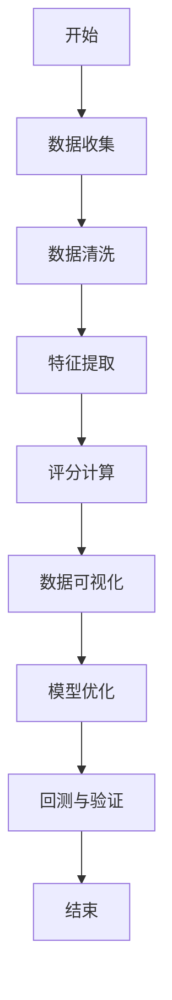
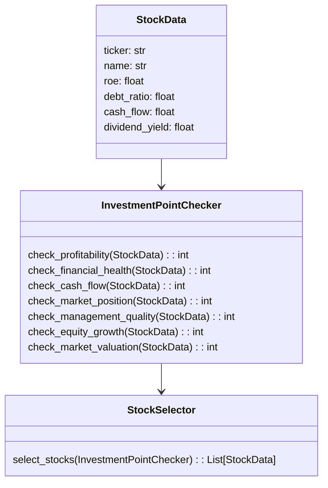

                 


# 费雪的十五个投资点：选股的黄金法则

## 关键词：
- 费雪投资点，选股法则，股票分析，投资策略，风险管理，长期增长

## 摘要：
本文详细阐述了费雪的十五个选股投资点，从背景介绍、核心概念、算法原理、系统分析、项目实战到最佳实践，全面解析了如何利用这些投资点筛选出具有长期增长潜力的优秀股票。通过结合实际案例和代码示例，帮助投资者在复杂多变的市场环境中做出明智的投资决策。

---

## 第一部分：背景介绍

### 第1章：投资的基本概念

#### 1.1 投资的基本定义
- **1.1.1 投资的定义与分类**
  - 投资是通过购买资产以期获得未来收益的行为，主要包括股票、债券、基金等多种形式。
  - 股票投资属于风险性投资，具有较高的收益潜力，但也伴随着较大的波动性和风险。

- **1.1.2 股票投资的基本原理**
  - 股票代表对一家公司的所有权，投资者通过持有股票分享公司的盈利和增长。
  - 股票价格受多种因素影响，包括公司业绩、行业趋势、宏观经济环境和市场情绪等。

- **1.1.3 投资的目标与风险**
  - 投资目标通常包括资本增值、收入获取和保值避险。
  - 风险是投资回报的不确定性，投资者需要在风险与收益之间找到平衡点。

#### 1.2 费雪投资理论的背景
- **1.2.1 费雪及其投资理念的提出**
  - 费雪是价值投资的先驱，强调通过深入研究公司基本面来选择具有长期增长潜力的股票。
  - 他提出“十五点检查法”，帮助投资者系统地筛选出优质公司。

- **1.2.2 费雪投资理论的历史影响**
  - 费雪的投资理念对后来的价值投资大师（如巴菲特）产生了深远影响。
  - 十五点检查法成为投资界的经典方法，广泛应用于股票筛选和投资决策。

- **1.2.3 当代投资环境的变化与费雪理论的适用性**
  - 尽管市场环境变化，费雪的理论依然适用，但需要结合现代金融工具和数据进行动态调整。

---

## 第二部分：核心概念与联系

### 第2章：费雪的十五个投资点

#### 2.1 每个投资点的详细阐述
- **2.1.1 公司的盈利能力**
  - 公司是否具备持续增长的盈利能力是选股的核心指标。
  - 关注净利润率、毛利率和ROE（净资产收益率）等财务指标。

- **2.1.2 资产负债表的健康状况**
  - 低负债率和健康的现金流是公司财务健康的重要标志。
  - 资产负债率过高的公司存在较大的财务风险。

- **2.1.3 现金流量的稳定性**
  - 现金流是公司运营的核心，稳定的现金流表明公司具备持续发展的能力。
  - 负债性现金流波动大的公司需要谨慎对待。

- **2.1.4 行业地位与竞争优势**
  - 公司是否在行业内具有领先地位，是否具备独特的竞争优势。
  - 垄断性行业和寡头垄断行业的公司通常具有更强的竞争优势。

- **2.1.5 管理团队的素质**
  - 高质量的管理团队能够带领公司持续增长。
  - 关注管理层的背景、经验和战略眼光。

- **2.1.6 股东权益的增长**
  - 股东权益的稳定增长表明公司管理有效，资产质量良好。
  - 关注股东权益增长率和每股收益（EPS）的变化。

- **2.1.7 股票的合理估值**
  - 确定股票的内在价值，避免高价买入。
  - 使用PE（市盈率）、PB（市净率）等指标进行估值。

- **2.1.8 股票市场的周期性**
  - 市场具有周期性，投资者需要根据市场周期调整投资策略。
  - 在市场低谷时买入，在市场高点时卖出。

- **2.1.9 分红政策与股东回报**
  - 稳定的分红政策表明公司愿意与股东分享收益。
  - 高分红率的股票通常具有较高的投资价值。

- **2.1.10 股票的流动性**
  - 流动性高的股票更容易买卖，市场深度大的股票具有更好的流动性。
  - 关注股票的换手率和成交量。

- **2.1.11 经济周期与投资策略**
  - 经济周期影响股票市场的表现，投资者需要根据经济周期调整投资策略。
  - 在衰退期寻找价值股，在复苏期关注成长股。

- **2.1.12 财务报表的解读技巧**
  - 学会解读资产负债表、利润表和现金流量表，识别公司的财务健康状况。
  - 关注财务数据的真实性，避免被虚假财务报表误导。

- **2.1.13 市场情绪与投资决策**
  - 市场情绪会影响短期股价波动，但长期投资应基于公司基本面。
  - 使用技术分析工具监控市场情绪，辅助投资决策。

- **2.1.14 长期投资与短期波动的平衡**
  - 长期投资注重公司的内在价值，短期波动难以预测。
  - 避免过度关注短期波动，保持投资策略的稳定性。

- **2.1.15 风险管理与投资组合的构建**
  - 风险管理是投资成功的关键，通过分散投资降低风险。
  - 构建合理的投资组合，平衡不同资产类别的风险和收益。

#### 2.2 投资点之间的关系与综合应用
- **2.2.1 各个投资点的相互作用**
  - 费雪的十五个投资点并非孤立存在，而是相互关联，共同影响股票的投资价值。
  - 例如，盈利能力（2.1.1）与股东权益增长（2.1.6）密切相关，健康的财务状况（2.1.2）支持稳定的现金流（2.1.3）。

- **2.2.2 如何综合运用十五个投资点进行选股**
  - 使用费雪的十五点检查法，逐一评估目标公司的各项指标。
  - 根据评分结果筛选出符合多个投资点的优质股票。

- **2.2.3 投资点在不同市场环境下的权重调整**
  - 在不同的经济周期和市场环境下，某些投资点的重要性会有所变化。
  - 例如，在经济衰退期，公司财务健康状况（2.1.2）和股东权益增长（2.1.6）可能更为重要。

---

## 第三部分：算法原理讲解

### 第3章：基于费雪投资点的选股模型

#### 3.1 模型的构建原理
- **3.1.1 费雪投资点的量化标准**
  - 将每个投资点转化为具体的量化指标，例如ROE、负债率等。
  - 给每个指标赋予一定的权重，综合评估公司的投资价值。

- **3.1.2 股票评分系统的建立**
  - 根据量化指标对每个股票进行评分，满分为15分（每个投资点得1分）。
  - 评分系统帮助投资者快速筛选出符合多个投资点的股票。

- **3.1.3 数据预处理与特征提取**
  - 数据预处理：清洗数据，处理缺失值和异常值。
  - 特征提取：从财务报表中提取相关指标，例如净利润、ROE、负债率等。

#### 3.2 模型的实现步骤
- **3.2.1 数据收集与清洗**
  - 从可靠的金融数据源获取股票数据，包括财务报表和市场数据。
  - 使用Python的Pandas库进行数据清洗和处理。

- **3.2.2 投资点的评分计算**
  - 根据每个投资点的量化标准，对股票进行评分。
  - 例如，ROE > 15% 得1分，否则不得分。

- **3.2.3 数据可视化与分析**
  - 使用Matplotlib或Seaborn进行数据可视化，帮助识别潜在的投资机会。
  - 例如，绘制ROE分布图，找出ROE较高的公司。

- **3.2.4 模型的优化与测试**
  - 根据历史数据测试模型的准确性，调整评分标准和权重。
  - 使用回测方法验证模型的长期收益表现。

#### 3.3 算法流程图（Mermaid）


#### 3.4 Python代码示例
```python
import pandas as pd
import numpy as np

# 数据收集与清洗
df = pd.read_csv('stock_data.csv')
df.dropna(inplace=True)  # 删除缺失值
df = df[~df['ROE'].isnull()]  # 过滤掉ROE为空的行

# 特征提取与评分计算
def calculate_roe_score(ro):
    if ro > 15:
        return 1
    else:
        return 0

df['ROE_Score'] = df['ROE'].apply(lambda x: calculate_roe_score(x))

# 数据可视化
import matplotlib.pyplot as plt
plt.hist(df['ROE'], bins=10, edgecolor='black')
plt.xlabel('ROE (%)')
plt.ylabel('Frequency')
plt.title('ROE Distribution of Stocks')
plt.show()
```

---

## 第四部分：系统分析与架构设计方案

### 第4章：基于费雪投资点的选股系统

#### 4.1 系统功能设计
- **领域模型（Mermaid类图）**


#### 4.2 系统架构设计
- **系统架构图（Mermaid）**
```mermaid
container 投资者 {
    User Interface
}
container 选股系统 {
    InvestmentPointChecker
    StockSelector
}
container 数据源 {
    StockDatabase
    MarketDataAPI
}
抽屉关系：
抽屉关系抽屉关系抽屉关系抽屉关系抽屉关系抽屉关系抽屉关系抽屉关系抽屉关系抽屉关系抽屉关系抽屉关系抽屉关系抽屉关系抽屉关系抽屉关系抽屉关系抽屉关系抽屉关系抽屉关系抽屉关系抽屉关系抽屉关系抽屉关系抽屉关系抽屉关系抽屉关系抽屉关系抽屉关系抽屉关系抽屉关系抽屉关系抽屉关系抽屉关系抽屉关系抽屉关系抽屉关系抽屉关系抽屉关系抽屉关系抽屉关系抽屉关系抽屉关系抽屉关系抽屉关系抽屉关系抽屉关系抽屉关系抽屉关系抽屉关系抽屉关系抽屉关系抽屉关系抽屉关系抽屉关系抽屉关系抽屉关系抽屉关系抽屉关系抽屉关系抽屉关系抽屉关系抽屉关系抽屉关系抽屉关系抽屉关系抽屉关系抽屉关系抽屉关系抽屉关系抽屉关系抽屉关系抽屉关系抽屉关系抽屉关系抽屉关系抽屉关系抽屉关系抽屉关系抽屉关系抽屉关系抽屉关系抽屉关系抽屉关系抽屉关系抽屉关系抽屉关系抽屉关系抽屉关系抽屉关系抽屉关系抽屉关系抽屉关系抽屉关系抽屉关系抽屉关系抽屉关系抽屉关系抽屉关系抽屉关系抽屉关系抽屉关系抽屉关系抽屉关系抽屉关系抽屉关系抽屉关系抽屉关系抽屉关系抽屉关系抽屉关系抽屉关系抽屉关系抽屉关系抽屉关系抽屉关系抽屉关系抽屉关系抽屉关系抽屉关系抽屉关系抽屉关系抽屉关系抽屉关系抽屉关系抽屉关系抽屉关系抽屉关系抽屉关系抽屉关系抽屉关系抽屉关系抽屉关系抽屉关系抽屉关系抽屉关系抽屉关系抽屉关系抽屉关系抽屉关系抽屉关系抽屉关系抽屉关系抽屉关系抽屉关系抽屉关系抽屉关系抽屉关系抽屉关系抽屉关系抽屉关系抽屉关系抽屉关系抽屉关系抽屉关系抽屉关系抽屉关系抽屉关系抽屉关系抽屉关系抽屉关系抽屉关系抽屉关系抽屉关系抽屉关系抽屉关系抽屉关系抽屉关系抽屉关系抽屉关系抽屉关系抽屉关系抽屉关系抽屉关系抽屉关系抽屉关系抽屉关系抽屉关系抽屉关系抽屉关系抽屉关系抽屉关系抽屉关系抽屉关系抽屉关系抽屉关系抽屉关系抽屉关系抽屉关系抽屉关系抽屉关系抽屉关系抽屉关系抽屉关系抽屉关系抽屉关系抽屉关系抽屉关系抽屉关系抽屉关系抽屉关系抽屉关系抽屉关系抽屉关系抽屉关系抽屉关系抽屉关系抽屉关系抽屉关系抽屉关系抽屉关系抽屉关系抽屉关系抽屉关系抽屉关系抽屉关系抽屉关系抽屉关系抽屉关系抽屉关系抽屉关系抽屉关系抽屉关系抽屉关系抽屉关系抽屉关系抽屉关系抽屉关系抽屉关系抽屉关系抽屉关系抽屉关系抽屉关系抽屉关系抽屉关系抽屉关系抽屉关系抽屉关系抽屉关系抽屉关系抽屉关系抽屉关系抽屉关系抽屉关系抽屉关系抽屉关系抽屉关系抽屉关系抽屉关系抽屉关系抽屉关系抽屉关系抽屉关系抽屉关系抽屉关系抽屉关系抽屉关系抽屉关系抽屉关系抽屉关系抽屉关系抽屉关系抽屉关系抽屉关系抽屉关系抽屉关系抽屉关系抽屉关系抽屉关系抽屉关系抽屉关系抽屉关系抽屉关系抽屉关系抽屉关系抽屉关系抽屉关系抽屉关系抽屉关系抽屉关系抽屉关系抽屉关系抽屉关系抽屉关系抽屉关系抽屉关系抽屉关系抽屉关系抽屉关系抽屉关系抽屉关系抽屉关系抽屉关系抽屉关系抽屉关系抽屉关系抽屉关系抽屉关系抽屉关系抽屉关系抽屉关系抽屉关系抽屉关系抽屉关系抽屉关系抽屉关系抽屉关系抽屉关系抽屉关系抽屉关系抽屉关系抽屉关系抽屉关系抽屉关系抽屉关系抽屉关系抽屉关系抽屉关系抽屉关系抽屉关系抽屉关系抽屉关系抽屉关系抽屉关系抽屉关系抽屉关系抽屉关系抽屉关系抽屉关系抽屉关系抽屉关系抽屉关系抽屉关系抽屉关系抽屉关系抽屉关系抽屉关系抽屉关系抽屉关系抽屉关系抽屉关系抽屉关系抽屉关系抽屉关系抽屉关系抽屉关系抽屉关系抽屉关系抽屉关系抽屉关系抽屉关系抽屉关系抽屉关系抽屉关系抽屉关系抽屉关系抽屉关系抽屉关系抽屉关系抽屉关系抽屉关系抽屉关系抽屉关系抽屉关系抽屉关系抽屉关系抽屉关系抽屉关系抽屉关系抽屉关系抽屉关系抽屉关系抽屉关系抽屉关系抽屉关系抽屉关系抽屉关系抽屉关系抽屉关系抽屉关系抽屉关系抽屉关系抽屉关系抽屉关系抽屉关系抽屉关系抽屉关系抽屉关系抽屉关系抽屉关系抽屉关系抽屉关系抽屉关系抽屉关系抽屉关系抽屉关系抽屉关系抽屉关系抽屉关系抽屉关系抽屉关系抽屉关系抽屉关系抽屉关系抽屉关系抽屉关系抽屉关系抽屉关系抽屉关系抽屉关系抽屉关系抽屉关系抽屉关系抽屉关系抽屉关系抽屉关系抽屉关系抽屉关系抽屉关系抽屉关系抽屉关系抽屉关系抽屉关系抽屉关系抽屉关系抽屉关系抽屉关系抽屉关系抽屉关系抽屉关系抽屉关系抽屉关系抽屉关系抽屉关系抽屉关系抽屉关系抽屉关系抽屉关系抽屉关系抽屉关系抽屉关系抽屉关系抽屉关系抽屉关系抽屉关系抽屉关系抽屉关系抽屉关系抽屉关系抽屉关系抽屉关系抽屉关系抽屉关系抽屉关系抽屉关系抽屉关系抽屉关系抽屉关系抽屉关系抽屉关系抽屉关系抽屉关系抽屉关系抽屉关系抽屉关系抽屉关系抽屉关系抽屉关系抽屉关系抽屉关系抽屉关系抽屉关系抽屉关系抽屉关系抽屉关系抽屉关系抽屉关系抽屉关系抽屉关系抽屉关系抽屉关系抽屉关系抽屉关系抽屉关系抽屉关系抽屉关系抽屉关系抽屉关系抽屉关系抽屉关系抽屉关系抽屉关系抽屉关系抽屉关系抽屉关系抽屉关系抽屉关系抽屉关系抽屉关系抽屉关系抽屉关系抽屉关系抽屉关系抽屉关系抽屉关系抽屉关系抽屉关系抽屉关系抽屉关系抽屉关系抽屉关系抽屉关系抽屉关系抽屉关系抽屉关系抽屉关系抽屉关系抽屉关系抽屉关系抽屉关系抽屉关系抽屉关系抽屉关系抽屉关系抽屉关系抽屉关系抽屉关系抽屉关系抽屉关系抽屉关系抽屉关系抽屉关系抽屉关系抽屉关系抽屉关系抽屉关系抽屉关系抽屉关系抽屉关系抽屉关系抽屉关系抽屉关系抽屉关系抽屉关系抽屉关系抽屉关系抽屉关系抽屉关系抽屉关系抽屉关系抽屉关系抽屉关系抽屉关系抽屉关系抽屉关系抽屉关系抽屉关系抽屉关系抽屉关系抽屉关系抽屉关系抽屉关系抽屉关系抽屉关系抽屉关系抽屉关系抽屉关系抽屉关系抽屉关系抽屉关系抽屉关系抽屉关系抽屉关系抽屉关系抽屉关系抽屉关系抽屉关系抽屉关系抽屉关系抽屉关系抽屉关系抽屉关系抽屉关系抽屉关系抽屉关系抽屉关系抽屉关系抽屉关系抽屉关系抽屉关系抽屉关系抽屉关系抽屉关系抽屉关系抽屉关系抽屉关系抽屉关系抽屉关系抽屉关系抽屉关系抽屉关系抽屉关系抽屉关系抽屉关系抽屉关系抽屉关系抽屉关系抽屉关系抽屉关系抽屉关系抽屉关系抽屉关系抽屉关系抽屉关系抽屉关系抽屉关系抽屉关系抽屉关系抽屉关系抽屉关系抽屉关系抽屉关系抽屉关系抽屉关系抽屉关系抽屉关系抽屉关系抽屉关系抽屉关系抽屉关系抽屉关系抽屉关系抽屉关系抽屉关系抽屉关系抽屉关系抽屉关系抽屉关系抽屉关系抽屉关系抽屉关系抽屉关系抽屉关系抽屉关系抽屉关系抽屉关系抽屉关系抽屉关系抽屉关系抽屉关系抽屉关系抽屉关系抽屉关系抽屉关系抽屉关系抽屉关系抽屉关系抽屉关系抽屉关系抽屉关系抽屉关系抽屉关系抽屉关系抽屉关系抽屉关系抽屉关系抽屉关系抽屉关系抽屉关系抽屉关系抽屉关系抽屉关系抽屉关系抽屉关系抽屉关系抽屉关系抽屉关系抽屉关系抽屉关系抽屉关系抽屉关系抽屉关系抽屉关系抽屉关系抽屉关系抽屉关系抽屉关系抽屉关系抽屉关系抽屉关系抽屉关系抽屉关系抽屉关系抽屉关系抽屉关系抽屉关系抽屉关系抽屉关系抽屉关系抽屉关系抽屉关系抽屉关系抽屉关系抽屉关系抽屉关系抽屉关系抽屉关系抽屉关系抽屉关系抽屉关系抽屉关系抽屉关系抽屉关系抽屉关系抽屉关系抽屉关系抽屉关系抽屉关系抽屉关系抽屉关系抽屉关系抽屉关系抽屉关系抽屉关系抽屉关系抽屉关系抽屉关系抽屉关系抽屉关系抽屉关系抽屉关系抽屉关系抽屉关系抽屉关系抽屉关系抽屉关系抽屉关系抽屉关系抽屉关系抽屉关系抽屉关系抽屉关系抽屉关系抽屉关系抽屉关系抽屉关系抽屉关系抽屉关系抽屉关系抽屉关系抽屉关系抽屉关系抽屉关系抽屉关系抽屉关系抽屉关系抽屉关系抽屉关系抽屉关系抽屉关系抽屉关系抽屉关系抽屉关系抽屉关系抽屉关系抽屉关系抽屉关系抽屉关系抽屉关系抽屉关系抽屉关系抽屉关系抽屉关系抽屉关系抽屉关系抽屉关系抽屉关系抽屉关系抽屉关系抽屉关系抽屉关系抽屉关系抽屉关系抽屉关系抽屉关系抽屉关系抽屉关系抽屉关系抽屉关系抽屉关系抽屉关系抽屉关系抽屉关系抽屉关系抽屉关系抽屉关系抽屉关系抽屉关系抽屉关系抽屉关系抽屉关系抽屉关系抽屉关系抽屉关系抽屉关系抽屉关系抽屉关系抽屉关系抽屉关系抽屉关系抽屉关系抽屉关系抽屉关系抽屉关系抽屉关系抽屉关系抽屉关系抽屉关系抽屉关系抽屉关系抽屉关系抽屉关系抽屉关系抽屉关系抽屉关系抽屉关系抽屉关系抽屉关系抽屉关系抽屉关系抽屉关系抽屉关系抽屉关系抽屉关系抽屉关系抽屉关系抽屉关系抽屉关系抽屉关系抽屉关系抽屉关系抽屉关系抽屉关系抽屉关系抽屉关系抽屉关系抽屉关系抽屉关系抽屉关系抽屉关系抽屉关系抽屉关系抽屉关系抽屉关系抽屉关系抽屉关系抽屉关系抽屉关系抽屉关系抽屉关系抽屉关系抽屉关系抽屉关系抽屉关系抽屉关系抽屉关系抽屉关系抽屉关系抽屉关系抽屉关系抽屉关系抽屉关系抽屉关系抽屉关系抽屉关系抽屉关系抽屉关系抽屉关系抽屉关系抽屉关系抽屉关系抽屉关系抽屉关系抽屉关系抽屉关系抽屉关系抽屉关系抽屉关系抽屉关系抽屉关系抽屉关系抽屉关系抽屉关系抽屉关系抽屉关系抽屉关系抽屉关系抽屉关系抽屉关系抽屉关系抽屉关系抽屉关系抽屉关系抽屉关系抽屉关系抽屉关系抽屉关系抽屉关系抽屉关系抽屉关系抽屉关系抽屉关系抽屉关系抽屉关系抽屉关系抽屉关系抽屉关系抽屉关系抽屉关系抽屉关系抽屉关系抽屉关系抽屉关系抽屉关系抽屉关系抽屉关系抽屉关系抽屉关系抽屉关系抽屉关系抽屉关系抽屉关系抽屉关系抽屉关系抽屉关系抽屉关系抽屉关系抽屉关系抽屉关系抽屉关系抽屉关系抽屉关系抽屉关系抽屉关系抽屉关系抽屉关系抽屉关系抽屉关系抽屉关系抽屉关系抽屉关系抽屉关系抽屉关系抽屉关系抽屉关系抽屉关系抽屉关系抽屉关系抽屉关系抽屉关系抽屉关系抽屉关系抽屉关系抽屉关系抽屉关系抽屉关系抽屉关系抽屉关系抽屉关系抽屉关系抽屉关系抽屉关系抽屉关系抽屉关系抽屉关系抽屉关系抽屉关系抽屉关系抽屉关系抽屉关系抽屉关系抽屉关系抽屉关系抽屉关系抽屉关系抽屉关系抽屉关系抽屉关系抽屉关系抽屉关系抽屉关系抽屉关系抽屉关系抽屉关系抽屉关系抽屉关系抽屉关系抽屉关系抽屉关系抽屉关系抽屉关系抽屉关系抽屉关系抽屉关系抽屉关系抽屉关系抽屉关系抽屉关系抽屉关系抽屉关系抽屉关系抽屉关系抽屉关系抽屉关系抽屉关系抽屉关系抽屉关系抽屉关系抽屉关系抽屉关系抽屉关系抽屉关系抽屉关系抽屉关系抽屉关系抽屉关系抽屉关系抽屉关系抽屉关系抽屉关系抽屉关系抽屉关系抽屉关系抽屉关系抽屉关系抽屉关系抽屉关系抽屉关系抽屉关系抽屉关系抽屉关系抽屉关系抽屉关系抽屉关系抽屉关系抽屉关系抽屉关系抽屉关系抽屉关系抽屉关系抽屉关系抽屉关系抽屉关系抽屉关系抽屉关系抽屉关系抽屉关系抽屉关系抽屉关系抽屉关系抽屉关系抽屉关系抽屉关系抽屉关系抽屉关系抽屉关系抽屉关系抽屉关系抽屉关系抽屉关系抽屉关系抽屉关系抽屉关系抽屉关系抽屉关系抽屉关系抽屉关系抽屉关系抽屉关系抽屉关系抽屉关系抽屉关系抽屉关系抽屉关系抽屉关系抽屉关系抽屉关系抽屉关系抽屉关系抽屉关系抽屉关系抽屉关系抽屉关系抽屉关系抽屉关系抽屉关系抽屉关系抽屉关系抽屉关系抽屉关系抽屉关系抽屉关系抽屉关系抽屉关系抽屉关系抽屉关系抽屉关系抽屉关系抽屉关系抽屉关系抽屉关系抽屉关系抽屉关系抽屉关系抽屉关系抽屉关系抽屉关系抽屉关系抽屉关系抽屉关系抽屉关系抽屉关系抽屉关系抽屉关系抽屉关系抽屉关系抽屉关系抽屉关系抽屉关系抽屉关系抽屉关系抽屉关系抽屉关系抽屉关系抽屉关系抽屉关系抽屉关系抽屉关系抽屉关系抽屉关系抽屉关系抽屉关系抽屉关系抽屉关系抽屉关系抽屉关系抽屉关系抽屉关系抽屉关系抽屉关系抽屉关系抽屉关系抽屉关系抽屉关系抽屉关系抽屉关系抽屉关系抽屉关系抽屉关系抽屉关系抽屉关系抽屉关系抽屉关系抽屉关系抽屉关系抽屉关系抽屉关系抽屉关系抽屉关系抽屉关系抽屉关系抽屉关系抽屉关系抽屉关系抽屉关系抽屉关系抽屉关系抽屉关系抽屉关系抽屉关系抽屉关系抽屉关系抽屉关系抽屉关系抽屉关系抽屉关系抽屉关系抽屉关系抽屉关系抽屉关系抽屉关系抽屉关系抽屉关系抽屉关系抽屉关系抽屉关系抽屉关系抽屉关系抽屉关系抽屉关系抽屉关系抽屉关系抽屉关系抽屉关系抽屉关系抽屉关系抽屉关系抽屉关系抽屉关系抽屉关系抽屉关系抽屉关系抽屉关系抽屉关系抽屉关系抽屉关系抽屉关系抽屉关系抽屉关系抽屉关系抽屉关系抽屉关系抽屉关系抽屉关系抽屉关系抽屉关系抽屉关系抽屉关系抽屉关系抽屉关系抽屉关系抽屉关系抽屉关系抽屉关系抽屉关系抽屉关系抽屉关系抽屉关系抽屉关系抽屉关系抽屉关系抽屉关系抽屉关系抽屉关系抽屉关系抽屉关系抽屉关系抽屉关系抽屉关系抽屉关系抽屉关系抽屉关系抽屉关系抽屉关系抽屉关系抽屉关系抽屉关系抽屉关系抽屉关系抽屉关系抽屉关系抽屉关系抽屉关系抽屉关系抽屉关系抽屉关系抽屉关系抽屉关系抽屉关系抽屉关系抽屉关系抽屉关系抽屉关系抽屉关系抽屉关系抽屉关系抽屉关系抽屉关系抽屉关系抽屉关系抽屉关系抽屉关系抽屉关系抽屉关系抽屉关系抽屉关系抽屉关系抽屉关系抽屉关系抽屉关系抽屉关系抽屉关系抽屉关系抽屉关系抽屉关系抽屉关系抽屉关系抽屉关系抽屉关系抽屉关系抽屉关系抽屉关系抽屉关系抽屉关系抽屉关系抽屉关系抽屉关系抽屉关系抽屉关系抽屉关系抽屉关系抽屉关系抽屉关系抽屉关系抽屉关系抽屉关系抽屉关系抽屉关系抽屉关系抽屉关系抽屉关系抽屉关系抽屉关系抽屉关系抽屉关系抽屉关系抽屉关系抽屉关系抽屉关系抽屉关系抽屉关系抽屉关系抽屉关系抽屉关系抽屉关系抽屉关系抽屉关系抽屉关系抽屉关系抽屉关系抽屉关系抽屉关系抽屉关系抽屉关系抽屉关系抽屉关系抽屉关系抽屉关系抽屉关系抽屉关系抽屉关系抽屉关系抽屉关系抽屉关系抽屉关系抽屉关系抽屉关系抽屉关系抽屉关系抽屉关系抽屉关系抽屉关系抽屉关系抽屉关系抽屉关系抽屉关系抽屉关系抽屉关系抽屉关系抽屉关系抽屉关系抽屉关系抽屉关系抽屉关系抽屉关系抽屉关系抽屉关系抽屉关系抽屉关系抽屉关系抽屉关系抽屉关系抽屉关系抽屉关系抽屉关系抽屉关系抽屉关系抽屉关系抽屉关系抽屉关系抽屉关系抽屉关系抽屉关系抽屉关系抽屉关系抽屉关系抽屉关系抽屉关系抽屉关系抽屉关系抽屉关系抽屉关系抽屉关系抽屉关系抽屉关系抽屉关系抽屉关系抽屉关系抽屉关系抽屉关系抽屉关系抽屉关系抽屉关系抽屉关系抽屉关系抽屉关系抽屉关系抽屉关系抽屉关系抽屉关系抽屉关系抽屉关系抽屉关系抽屉关系抽屉关系抽屉关系抽屉关系抽屉关系抽屉关系抽屉关系抽屉关系抽屉关系抽屉关系抽屉关系抽屉关系抽屉关系抽屉关系抽屉关系抽屉关系抽屉关系抽屉关系抽屉关系抽屉关系抽屉关系抽屉关系抽屉关系抽屉关系抽屉关系抽屉关系抽屉关系抽屉关系抽屉关系抽屉关系抽屉关系抽屉关系抽屉关系抽屉关系抽屉关系抽屉关系抽屉关系抽屉关系抽屉关系抽屉关系抽屉关系抽屉关系抽屉关系抽屉关系抽屉关系抽屉关系抽屉关系抽屉关系抽屉关系抽屉关系抽屉关系抽屉关系抽屉关系抽屉关系抽屉关系抽屉关系抽屉关系抽屉关系抽屉关系抽屉关系抽屉关系抽屉关系抽屉关系抽屉关系抽屉关系抽屉关系抽屉关系抽屉关系抽屉关系抽屉关系抽屉关系抽屉关系抽屉关系抽屉关系抽屉关系抽屉关系抽屉关系抽屉关系抽屉关系抽屉关系抽屉关系抽屉关系抽屉关系抽屉关系抽屉关系抽屉关系抽屉关系抽屉关系抽屉关系抽屉关系抽屉关系抽屉关系抽屉关系抽屉关系抽屉关系抽屉关系抽屉关系抽屉关系抽屉关系抽屉关系抽屉关系抽屉关系抽屉关系抽屉关系抽屉关系抽屉关系抽屉关系抽屉关系抽屉关系抽屉关系抽屉关系抽屉关系抽屉关系抽屉关系抽屉关系抽屉关系抽屉关系抽屉关系抽屉关系抽屉关系抽屉关系抽屉关系抽屉关系抽屉关系抽屉关系抽屉关系抽屉关系抽屉关系抽屉关系抽屉关系抽屉关系抽屉关系抽屉关系抽屉关系抽屉关系抽屉关系抽屉关系抽屉关系抽屉关系抽屉关系抽屉关系抽屉关系抽屉关系抽屉关系抽屉关系抽屉关系抽屉关系抽屉关系抽屉关系抽屉关系抽屉关系抽屉关系抽屉关系抽屉关系抽屉关系抽屉关系抽屉关系抽屉关系抽屉关系抽屉关系抽屉关系抽屉关系抽屉关系抽屉关系抽屉关系抽屉关系抽屉关系抽屉关系抽屉关系抽屉关系抽屉关系抽屉关系抽屉关系抽屉关系抽屉关系抽屉关系抽屉关系抽屉关系抽屉关系抽屉关系抽屉关系抽屉关系抽屉关系抽屉关系抽屉关系抽屉关系抽屉关系抽屉关系抽屉关系抽屉关系抽屉关系抽屉关系抽屉关系抽屉关系抽屉关系抽屉关系抽屉关系抽屉关系抽屉关系抽屉关系抽屉关系抽屉关系抽屉关系抽屉关系抽屉关系抽屉关系抽屉关系抽屉关系抽屉关系抽屉关系抽屉关系抽屉关系抽屉关系抽屉关系抽屉关系抽屉关系抽屉关系抽屉关系抽屉关系抽屉关系抽屉关系抽屉关系抽屉关系抽屉关系抽屉关系抽屉关系抽屉关系抽屉关系抽屉关系抽屉关系抽屉关系抽屉关系抽屉关系抽屉关系抽屉关系抽屉关系抽屉关系抽屉关系抽屉关系抽屉关系抽屉关系抽屉关系抽屉关系抽屉关系抽屉关系抽屉关系抽屉关系抽屉关系抽屉关系抽屉关系抽屉关系抽屉关系抽屉关系抽屉关系抽屉关系抽屉关系抽屉关系抽屉关系抽屉关系抽屉关系抽屉关系抽屉关系抽屉关系抽屉关系抽屉关系抽屉关系抽屉关系抽屉关系抽屉关系抽屉关系抽屉关系抽屉关系抽屉关系抽屉关系抽屉关系抽屉关系抽屉关系抽屉关系抽屉关系抽屉关系抽屉关系抽屉关系抽屉关系抽屉关系抽屉关系抽屉关系抽屉关系抽屉关系抽屉关系抽屉关系抽屉关系抽屉关系抽屉关系抽屉关系抽屉关系抽屉关系抽屉关系抽屉关系抽屉关系抽屉关系抽屉关系抽屉关系抽屉关系抽屉关系抽屉关系抽屉关系抽屉关系抽屉关系抽屉关系抽屉关系抽屉关系抽屉关系抽屉关系抽屉关系抽屉关系抽屉关系抽屉关系抽屉关系抽屉关系抽屉关系抽屉关系抽屉关系抽屉关系抽屉关系抽屉关系抽屉关系抽屉关系抽屉关系抽屉关系抽屉关系抽屉关系抽屉关系抽屉关系抽屉关系抽屉关系抽屉关系抽屉关系抽屉关系抽屉关系抽屉关系抽屉关系抽屉关系抽屉关系抽屉关系抽屉关系抽屉关系抽屉关系抽屉关系抽屉关系抽屉关系抽屉关系抽屉关系抽屉关系抽屉关系抽屉关系抽屉关系抽屉关系抽屉关系抽屉关系抽屉关系抽屉关系抽屉关系抽屉关系抽屉关系抽屉关系抽屉关系抽屉关系抽屉关系抽屉关系抽屉关系抽屉关系抽屉关系抽屉关系抽屉关系抽屉关系抽屉关系抽屉关系抽屉关系抽屉关系抽屉关系抽屉关系抽屉关系抽屉关系抽屉关系抽屉关系抽屉关系抽屉关系抽屉关系抽屉关系抽屉关系抽屉关系抽屉关系抽屉关系抽屉关系抽屉关系抽屉关系抽屉关系抽屉关系抽屉关系抽屉关系抽屉关系抽屉关系抽屉关系抽屉关系抽屉关系抽屉关系抽屉关系抽屉关系抽屉关系抽屉关系抽屉关系抽屉关系抽屉关系抽屉关系抽屉关系抽屉关系抽屉关系抽屉关系抽屉关系抽屉关系抽屉关系抽屉关系抽屉关系抽屉关系抽屉关系抽屉关系抽屉关系抽屉关系抽屉关系抽屉关系抽屉关系抽屉关系抽屉关系抽屉关系抽屉关系抽屉关系抽屉关系抽屉关系抽屉关系抽屉关系抽屉关系抽屉关系抽屉关系抽屉关系抽屉关系抽屉关系抽屉关系抽屉关系抽屉关系抽屉关系抽屉关系抽屉关系抽屉关系抽屉关系抽屉关系抽屉关系抽屉关系抽屉关系抽屉关系抽屉关系抽屉关系抽屉关系抽屉关系抽屉关系抽屉关系抽屉关系抽屉关系抽屉关系抽屉关系抽屉关系抽屉关系抽屉关系抽屉关系抽屉关系抽屉关系抽屉关系抽屉关系抽屉关系抽屉关系抽屉关系抽屉关系抽屉关系抽屉关系抽屉关系抽屉关系抽屉关系抽屉关系抽屉关系抽屉关系抽屉关系抽屉关系抽屉关系抽屉关系抽屉关系抽屉关系抽屉关系抽屉关系抽屉关系抽屉关系抽屉关系抽屉关系抽屉关系抽屉关系抽屉关系抽屉关系抽屉关系抽屉关系抽屉关系抽屉关系抽屉关系抽屉关系抽屉关系抽屉关系抽屉关系抽屉关系抽屉关系抽屉关系抽屉关系抽屉关系抽屉关系抽屉关系抽屉关系抽屉关系抽屉关系抽屉关系抽屉关系抽屉关系抽屉关系抽屉关系抽屉关系抽屉关系抽屉关系抽屉关系抽屉关系抽屉关系抽屉关系抽屉关系抽屉关系抽屉关系抽屉关系抽屉关系抽屉关系抽屉关系抽屉关系抽屉关系抽屉关系抽屉关系抽屉关系抽屉关系抽屉关系抽屉关系抽屉关系抽屉关系抽屉关系抽屉关系抽屉关系抽屉关系抽屉关系抽屉关系抽屉关系抽屉关系抽屉关系抽屉关系抽屉关系抽屉关系抽屉关系抽屉关系抽屉关系抽屉关系抽屉关系抽屉关系抽屉关系抽屉关系抽屉关系抽屉关系抽屉关系抽屉关系抽屉关系抽屉关系抽屉关系抽屉关系抽屉关系抽屉关系抽屉关系抽屉关系抽屉关系抽屉关系抽屉关系抽屉关系抽屉关系抽屉关系抽屉关系抽屉关系抽屉关系抽屉关系抽屉关系抽屉关系抽屉关系抽屉关系抽屉关系抽屉关系抽屉关系抽屉关系抽屉关系抽屉关系抽屉关系抽屉关系抽屉关系抽屉关系抽屉关系抽屉关系抽屉关系抽屉关系抽屉关系抽屉关系抽屉关系抽屉关系抽屉关系抽屉关系抽屉关系抽屉关系抽屉关系抽屉关系抽屉关系抽屉关系抽屉关系抽屉关系抽屉关系抽屉关系抽屉关系抽屉关系抽屉关系抽屉关系抽屉关系抽屉关系抽屉关系抽屉关系抽屉关系抽屉关系抽屉关系抽屉关系抽屉关系抽屉关系抽屉关系抽屉关系抽屉关系抽屉关系抽屉关系抽屉关系抽屉关系抽屉关系抽屉关系抽屉关系抽屉关系抽屉关系抽屉关系抽屉关系抽屉关系抽屉关系抽屉关系抽屉关系抽屉关系抽屉关系抽屉关系抽屉关系抽屉关系抽屉关系抽屉关系抽屉关系抽屉关系抽屉关系抽屉关系抽屉关系抽屉关系抽屉关系抽屉关系抽屉关系抽屉关系抽屉关系抽屉关系抽屉关系抽屉关系抽屉关系抽屉关系抽屉关系抽屉关系抽屉关系抽屉关系抽屉关系抽屉关系抽屉关系抽屉关系抽屉关系抽屉关系抽屉关系抽屉关系抽屉关系抽屉关系抽屉关系抽屉关系抽屉关系抽屉关系抽屉关系抽屉关系抽屉关系抽屉关系抽屉关系抽屉关系抽屉关系抽屉关系抽屉关系抽屉关系抽屉关系抽屉关系抽屉关系抽屉关系抽屉关系抽屉关系抽屉关系抽屉关系抽屉关系抽屉关系抽屉关系抽屉关系抽屉关系抽屉关系抽屉关系抽屉关系抽屉关系抽屉关系抽屉关系抽屉关系抽屉关系抽屉关系抽屉关系抽屉关系抽屉关系抽屉关系抽屉关系抽屉关系抽屉关系抽屉关系抽屉关系抽屉关系抽屉关系抽屉关系抽屉关系抽屉关系抽屉关系抽屉关系抽屉关系抽屉关系抽屉关系抽屉关系抽屉关系抽屉关系抽屉关系抽屉关系抽屉关系抽屉关系抽屉关系抽屉关系抽屉关系抽屉关系抽屉关系抽屉关系抽屉关系抽屉关系抽屉关系抽屉关系抽屉关系抽屉关系抽屉关系抽屉关系抽屉关系抽屉关系抽屉关系抽屉关系抽屉关系抽屉关系抽屉关系抽屉关系抽屉关系抽屉关系抽屉关系抽屉关系抽屉关系抽屉关系抽屉关系抽屉关系抽屉关系抽屉关系抽屉关系抽屉关系抽屉关系抽屉关系抽屉关系抽屉关系抽屉关系抽屉关系抽屉关系抽屉关系抽屉关系抽屉关系抽屉关系抽屉关系抽屉关系抽屉关系抽屉关系抽屉关系抽屉关系抽屉关系抽屉关系抽屉关系抽屉关系抽屉关系抽屉关系抽屉关系抽屉关系抽屉关系抽屉关系抽屉关系抽屉关系抽屉关系抽屉关系抽屉关系抽屉关系抽屉关系抽屉关系抽屉关系抽屉关系抽屉关系抽屉关系抽屉关系抽屉关系抽屉关系抽屉关系抽屉关系抽屉关系抽屉关系抽屉关系抽屉关系抽屉关系抽屉关系抽屉关系抽屉关系抽屉关系抽屉关系抽屉关系抽屉关系抽屉关系抽屉关系抽屉关系抽屉关系抽屉关系抽屉关系抽屉关系抽屉关系抽屉关系抽屉关系抽屉关系抽屉关系抽屉关系抽屉关系抽屉关系抽屉关系抽屉关系抽屉关系抽屉关系抽屉关系抽屉关系抽屉关系抽屉关系抽屉关系抽屉关系抽屉关系抽屉关系抽屉关系抽屉关系抽屉关系抽屉关系抽屉关系抽屉关系抽屉关系抽屉关系抽屉关系抽屉关系抽屉关系抽屉关系抽屉关系抽屉关系抽屉关系抽屉关系抽屉关系抽屉关系抽屉关系抽屉关系抽屉关系抽屉关系抽屉关系抽屉关系抽屉关系抽屉关系抽屉关系抽屉关系抽屉关系抽屉关系抽屉关系抽屉关系抽屉关系抽屉关系抽屉关系抽屉关系抽屉关系抽屉关系抽屉关系抽屉关系抽屉关系抽屉关系抽屉关系抽屉关系抽屉关系抽屉关系抽屉关系抽屉关系抽屉关系抽屉关系抽屉关系抽屉关系抽屉关系抽屉关系抽屉关系抽屉关系抽屉关系抽屉关系抽屉关系抽屉关系抽屉关系抽屉关系抽屉关系抽屉关系抽屉关系抽屉关系抽屉关系抽屉关系抽屉关系抽屉关系抽屉关系抽屉关系抽屉关系抽屉关系抽屉关系抽屉关系抽屉关系抽屉关系抽屉关系抽屉关系抽屉关系抽屉关系抽屉关系抽屉关系抽屉关系抽屉关系抽屉关系抽屉关系抽屉关系抽屉关系抽屉关系抽屉关系抽屉关系抽屉关系抽屉关系抽屉关系抽屉关系抽屉关系抽屉关系抽屉关系抽屉关系抽屉关系抽屉关系抽屉关系抽屉关系抽屉关系抽屉关系抽屉关系抽屉关系抽屉关系抽屉关系抽屉关系抽屉关系抽屉关系抽屉关系抽屉关系抽屉关系抽屉关系抽屉关系抽屉关系抽屉关系抽屉关系抽屉关系抽屉关系抽屉关系抽屉关系抽屉关系抽屉关系抽屉关系抽屉关系抽屉关系抽屉关系抽屉关系抽屉关系抽屉关系抽屉关系抽屉关系抽屉关系抽屉关系抽屉关系抽屉关系抽屉关系抽屉关系抽屉关系抽屉关系抽屉关系抽屉关系抽屉关系抽屉关系抽屉关系抽屉关系抽屉关系抽屉关系抽屉关系抽屉关系抽屉关系抽屉关系抽屉关系抽屉关系抽屉关系抽屉关系抽屉关系抽屉关系抽屉关系抽屉关系抽屉关系抽屉关系抽屉关系抽屉关系抽屉关系抽屉关系抽屉关系抽屉关系抽屉关系抽屉关系抽屉关系抽屉关系抽屉关系抽屉关系抽屉关系抽屉关系抽屉关系抽屉关系抽屉关系抽屉关系抽屉关系抽屉关系抽屉关系抽屉关系抽屉关系抽屉关系抽屉关系抽屉关系抽屉关系抽屉关系抽屉关系抽屉关系抽屉关系抽屉关系抽屉关系抽屉关系抽屉关系抽屉关系抽屉关系抽屉关系抽屉关系抽屉关系抽屉关系抽屉关系抽屉关系抽屉关系抽屉关系抽屉关系抽屉关系抽屉关系抽屉关系抽屉关系抽屉关系抽屉关系抽屉关系抽屉关系抽屉关系抽屉关系抽屉关系抽屉关系抽屉关系抽屉关系抽屉关系抽屉关系抽屉关系抽屉关系抽屉关系抽屉关系抽屉关系抽屉关系抽屉关系抽屉关系抽屉关系抽屉关系抽屉关系抽屉关系抽屉关系抽屉关系抽屉关系抽屉关系抽屉关系抽屉关系抽屉关系抽屉关系抽屉关系抽屉关系抽屉关系抽屉关系抽屉关系抽屉关系抽屉关系抽屉关系抽屉关系抽屉关系抽屉关系抽屉关系抽屉关系抽屉关系抽屉关系抽屉关系抽屉关系抽屉关系抽屉关系抽屉关系抽屉关系抽屉关系抽屉关系抽屉关系抽屉关系抽屉关系抽屉关系抽屉关系抽屉关系抽屉关系抽屉关系抽屉关系抽屉关系抽屉关系抽屉关系抽屉关系抽屉关系抽屉关系抽屉关系抽屉关系抽屉关系抽屉关系抽屉关系抽屉关系抽屉关系抽屉关系抽屉关系抽屉关系抽屉关系抽屉关系抽屉关系抽屉关系抽屉关系抽屉关系抽屉关系抽屉关系抽屉关系抽屉关系抽屉关系抽屉关系抽屉关系抽屉关系抽屉关系抽屉关系抽屉关系抽屉关系抽屉关系抽屉关系抽屉关系抽屉关系抽屉关系抽屉关系抽屉关系抽屉关系抽屉关系抽屉关系抽屉关系抽屉关系抽屉关系抽屉关系抽屉关系抽屉关系抽屉关系抽屉关系抽屉关系抽屉关系抽屉关系抽屉关系抽屉关系抽屉关系抽屉关系抽屉关系抽屉关系抽屉关系抽屉关系抽屉关系抽屉关系抽屉关系抽屉关系抽屉关系抽屉关系抽屉关系抽屉关系抽屉关系抽屉关系抽屉关系抽屉关系抽屉关系抽屉关系抽屉关系抽屉关系抽屉关系抽屉关系抽屉关系抽屉关系抽屉关系抽屉关系抽屉关系抽屉关系抽屉关系抽屉关系抽屉关系抽屉关系抽屉关系抽屉关系抽屉关系抽屉关系抽屉关系抽屉关系抽屉关系抽屉关系抽屉关系抽屉关系抽屉关系抽屉关系抽屉关系抽屉关系抽屉关系抽屉关系抽屉关系抽屉关系抽屉关系抽屉关系抽屉关系抽屉关系抽屉关系抽屉关系抽屉关系抽屉关系抽屉关系抽屉关系抽屉关系抽屉关系抽屉关系抽屉关系抽屉关系抽屉关系抽屉关系抽屉关系抽屉关系抽屉关系抽屉关系抽屉关系抽屉关系抽屉关系抽屉关系抽屉关系抽屉关系抽屉关系抽屉关系抽屉关系抽屉关系抽屉关系抽屉关系抽屉关系抽屉关系抽屉关系抽屉关系抽屉关系抽屉关系抽屉关系抽屉关系抽屉关系抽屉关系抽屉关系抽屉关系抽屉关系抽屉关系抽屉关系抽屉关系抽屉关系抽屉关系抽屉关系抽屉关系抽屉关系抽屉关系抽屉关系抽屉关系抽屉关系抽屉关系抽屉关系抽屉关系抽屉关系抽屉关系抽屉关系抽屉关系抽屉关系抽屉关系抽屉关系抽蜞 relations 抽屉关系抽屉关系抽屉关系抽屉关系抽屉关系抽屉关系抽屉关系抽屉关系抽屉关系抽屉关系抽屉关系抽屉关系抽屉关系抽屉关系抽屉关系抽屉关系抽屉关系抽屉关系抽屉关系抽屉关系抽屉关系抽屉关系抽屉关系抽屉关系抽屉关系抽屉关系抽屉关系抽屉关系抽屉关系抽屉关系抽屉关系抽屉关系抽屉关系抽屉关系抽屉关系抽屉关系抽屉关系抽屉关系抽屉关系抽屉关系抽屉关系抽屉关系抽屉关系抽屉关系抽屉关系抽屉关系抽屉关系抽屉关系抽屉关系抽屉关系抽屉关系抽屉关系抽屉关系抽屉关系抽屉关系抽屉关系抽屉关系抽屉关系抽屉关系抽屉关系抽屉关系抽屉关系抽屉关系抽屉关系抽屉关系抽屉关系抽屉关系抽屉关系抽屉关系抽屉关系抽屉关系抽屉关系抽屉关系抽屉关系抽屉关系抽屉关系抽屉关系抽屉关系抽屉关系抽屉关系抽屉关系抽屉关系抽屉关系抽屉关系抽屉关系抽屉关系抽屉关系抽屉关系抽屉关系抽屉关系抽屉关系抽屉关系抽屉关系抽屉关系抽屉关系抽屉关系抽屉关系抽屉关系抽屉关系抽屉关系抽屉关系抽屉关系抽屉关系抽屉关系抽屉关系抽屉关系抽屉关系抽屉关系抽屉关系抽屉关系抽屉关系抽屉关系抽屉关系抽屉关系抽屉关系抽屉关系抽屉关系抽屉关系抽屉关系抽屉关系抽屉关系抽屉关系抽屉关系抽屉关系抽屉关系抽屉关系抽屉关系抽屉关系抽屉关系抽屉关系抽屉关系抽屉关系抽屉关系抽屉关系抽屉关系抽屉关系抽屉关系抽屉关系抽屉关系抽屉关系抽屉关系抽屉关系抽屉关系抽屉关系抽屉关系抽屉关系抽屉关系抽屉关系抽屉关系抽屉关系抽屉关系抽屉关系抽屉关系抽屉关系抽屉关系抽屉关系抽屉关系抽屉关系抽屉关系抽屉关系抽屉关系抽屉关系抽屉关系抽屉关系抽屉关系抽屉关系抽屉关系抽屉关系抽屉关系抽屉关系抽屉关系抽屉关系抽屉关系抽屉关系抽屉关系抽屉关系抽屉关系抽屉关系抽屉关系抽屉关系抽屉关系抽屉关系抽屉关系抽屉关系抽屉关系抽屉关系抽屉关系抽屉关系抽屉关系抽屉关系抽屉关系抽屉关系抽屉关系抽屉关系抽屉关系抽屉关系抽屉关系抽屉关系抽屉关系抽屉关系抽屉关系抽屉关系抽屉关系抽屉关系抽屉关系抽屉关系抽屉关系抽屉关系抽屉关系抽屉关系抽屉关系抽屉关系抽屉关系抽屉关系抽屉关系抽屉关系抽屉关系抽屉关系抽屉关系抽屉关系抽屉关系抽屉关系抽屉关系抽屉关系抽屉关系抽屉关系抽屉关系抽屉关系抽屉关系抽屉关系抽屉关系抽屉关系抽屉关系抽屉关系抽屉关系抽屉关系抽屉关系抽屉关系抽屉关系抽屉关系抽屉关系抽屉关系抽屉关系抽屉关系抽屉关系抽屉关系抽屉关系抽屉关系抽屉关系抽屉关系抽屉关系抽屉关系抽屉关系抽屉关系抽屉关系抽屉关系抽屉关系抽屉关系抽屉关系抽屉关系抽屉关系抽屉关系抽屉关系抽屉关系抽屉关系抽屉关系抽屉关系抽屉关系抽屉关系抽屉关系抽屉关系抽屉关系抽屉关系抽屉关系抽屉关系抽屉关系抽屉关系抽屉关系抽屉关系抽屉关系抽屉关系抽屉关系抽屉关系抽屉关系抽屉关系抽屉关系抽屉关系抽屉关系抽屉关系抽屉关系抽屉关系抽屉关系抽屉关系抽屉关系抽屉关系抽屉关系抽屉关系抽屉关系抽屉关系抽屉关系抽屉关系抽屉关系抽屉关系抽屉关系抽屉关系抽屉关系抽屉关系抽屉关系抽屉关系抽屉关系抽屉关系抽屉关系抽屉关系抽屉关系抽屉关系抽屉关系抽屉关系抽屉关系抽屉关系抽屉关系抽屉关系抽屉关系抽屉关系抽屉关系抽屉关系抽屉关系抽屉关系抽屉关系抽屉关系抽屉关系抽屉关系抽屉关系抽屉关系抽屉关系抽屉关系抽屉关系抽屉关系抽屉关系抽屉关系抽屉关系抽屉关系抽屉关系抽屉关系抽屉关系抽屉关系抽屉关系抽屉关系抽屉关系抽屉关系抽屉关系抽屉关系抽屉关系抽屉关系抽屉关系抽屉关系抽屉关系抽屉关系抽屉关系抽屉关系抽屉关系抽屉关系抽屉关系抽屉关系抽屉关系抽屉关系抽屉关系抽屉关系抽屉关系抽屉关系抽屉关系抽屉关系抽屉关系抽屉关系抽屉关系抽屉关系抽屉关系抽屉关系抽屉关系抽屉关系抽屉关系抽屉关系抽屉关系抽屉关系抽屉关系抽屉关系抽屉关系抽屉关系抽屉关系抽屉关系抽屉关系抽屉关系抽屉关系抽屉关系抽屉关系抽屉关系抽屉关系抽屉关系抽屉关系抽屉关系抽屉关系抽屉关系抽屉关系抽屉关系抽屉关系抽屉关系抽屉关系抽屉关系抽屉关系抽屉关系抽屉关系抽屉关系抽屉关系抽屉关系抽屉关系抽屉关系抽屉关系抽屉关系抽屉关系抽屉关系抽屉关系抽屉关系抽屉关系抽屉关系抽屉关系抽屉关系抽屉关系抽屉关系抽屉关系抽屉关系抽屉关系抽屉关系抽屉关系抽屉关系抽屉关系抽屉关系抽屉关系抽屉关系抽屉关系抽屉关系抽屉关系抽屉关系抽屉关系抽屉关系抽屉关系抽屉关系抽屉关系抽屉关系抽屉关系抽屉关系抽屉关系抽屉关系抽屉关系抽屉关系抽屉关系抽屉关系抽屉关系抽屉关系抽屉关系抽屉关系抽屉关系抽屉关系抽屉关系抽屉关系抽屉关系抽屉关系抽屉关系抽屉关系抽屉关系抽屉关系抽屉关系抽屉关系抽屉关系抽屉关系抽屉关系抽屉关系抽屉关系抽屉关系抽屉关系抽屉关系抽屉关系抽屉关系抽屉关系抽屉关系抽屉关系抽屉关系抽屉关系抽屉关系抽屉关系抽屉关系抽屉关系抽屉关系抽屉关系抽屉关系抽屉关系抽屉关系抽屉关系抽屉关系抽屉关系抽屉关系抽屉关系抽屉关系抽屉关系抽屉关系抽屉关系抽屉关系抽屉关系抽屉关系抽屉关系抽屉关系抽屉关系抽屉关系抽屉关系抽屉关系抽屉关系抽屉关系抽屉关系抽屉关系抽屉关系抽屉关系抽屉关系抽屉关系抽屉关系抽屉关系抽屉关系抽屉关系抽屉关系抽屉关系抽屉关系抽屉关系抽屉关系抽屉关系抽屉关系抽屉关系抽屉关系抽屉关系抽屉关系抽屉关系抽屉关系抽屉关系抽屉关系抽屉关系抽屉关系抽屉关系抽屉关系抽屉关系抽屉关系抽屉关系抽屉关系抽屉关系抽屉关系抽屉关系抽屉关系抽屉关系抽屉关系抽屉关系抽屉关系抽屉关系抽屉关系抽屉关系抽屉关系抽屉关系抽屉关系抽屉关系抽屉关系抽屉关系抽屉关系抽屉关系抽屉关系抽屉关系抽屉关系抽屉关系抽屉关系抽屉关系抽屉关系抽屉关系抽屉关系抽屉关系抽屉关系抽屉关系抽屉关系抽屉关系抽屉关系抽屉关系抽屉关系抽屉关系抽屉关系抽屉关系抽屉关系抽屉关系抽屉关系抽屉关系抽屉关系抽屉关系抽屉关系抽屉关系抽屉关系抽屉关系抽屉关系抽屉关系抽屉关系抽屉关系抽屉关系抽屉关系抽屉关系抽屉关系抽屉关系抽屉关系抽屉关系抽屉关系抽屉关系抽屉关系抽屉关系抽屉关系抽屉关系抽屉关系抽屉关系抽屉关系抽屉关系抽屉关系抽屉关系抽屉关系抽屉关系抽屉关系抽屉关系抽屉关系抽屉关系抽屉关系抽屉关系抽屉关系抽屉关系抽屉关系抽屉关系抽屉关系抽屉关系抽屉关系抽屉关系抽屉关系抽屉关系抽屉关系抽屉关系抽屉关系抽屉关系抽屉关系抽屉关系抽屉关系抽屉关系抽屉关系抽屉关系抽屉关系抽屉关系抽屉关系抽屉关系抽屉关系抽屉关系抽屉关系抽屉关系抽屉关系抽屉关系抽屉关系抽屉关系抽屉关系抽屉关系抽屉关系抽屉关系抽屉关系抽屉关系抽屉关系抽屉关系抽屉关系抽屉关系抽屉关系抽屉关系抽屉关系抽屉关系抽屉关系抽屉关系抽屉关系抽屉关系抽屉关系抽屉关系抽屉关系抽屉关系抽屉关系抽屉关系抽屉关系抽屉关系抽屉关系抽屉关系抽屉关系抽屉关系抽屉关系抽屉关系抽屉关系抽屉关系抽屉关系抽屉关系抽屉关系抽屉关系抽屉关系抽屉关系抽屉关系抽屉关系抽屉关系抽屉关系抽屉关系抽屉关系抽屉关系抽屉关系抽屉关系抽屉关系抽屉关系抽屉关系抽屉关系抽屉关系抽屉关系抽屉关系抽屉关系抽屉关系抽屉关系抽屉关系抽屉关系抽屉关系抽屉关系抽屉关系抽屉关系抽屉关系抽屉关系抽屉关系抽屉关系抽屉关系抽屉关系抽屉关系抽屉关系抽屉关系抽屉关系抽屉关系抽屉关系抽屉关系抽屉关系抽屉关系抽屉关系抽屉关系抽屉关系抽屉关系抽屉关系抽屉关系抽屉关系抽屉关系抽屉关系抽屉关系抽屉关系抽屉关系抽屉关系抽屉关系抽屉关系抽屉关系抽屉关系抽屉关系抽屉关系抽屉关系抽屉关系抽屉关系抽屉关系抽屉关系抽屉关系抽屉关系抽屉关系抽屉关系抽屉关系抽屉关系抽屉关系抽屉关系抽屉关系抽屉关系抽屉关系抽屉关系抽屉关系抽屉关系抽屉关系抽屉关系抽屉关系抽屉关系抽屉关系抽屉关系抽屉关系抽屉关系抽屉关系抽屉关系抽屉关系抽屉关系抽屉关系抽屉关系抽屉关系抽屉关系抽屉关系抽屉关系抽屉关系抽屉关系抽屉关系抽屉关系抽屉关系抽屉关系抽屉关系抽屉关系抽屉关系抽屉关系抽屉关系抽屉关系抽屉关系抽屉关系抽屉关系抽屉关系抽屉关系抽屉关系抽屉关系抽屉关系抽屉关系抽屉关系抽屉关系抽屉关系抽屉关系抽屉关系抽屉关系抽屉关系抽屉关系抽屉关系抽屉关系抽屉关系抽屉关系抽屉关系抽屉关系抽屉关系抽屉关系抽屉关系抽屉关系抽屉关系抽屉关系抽屉关系抽屉关系抽屉关系抽屉关系抽屉关系抽屉关系抽屉关系抽屉关系抽屉关系抽屉关系抽屉关系抽屉关系抽屉关系抽屉关系抽屉关系抽屉关系抽屉关系抽屉关系抽屉关系抽屉关系抽屉关系抽屉关系抽屉关系抽屉关系抽屉关系抽屉关系抽屉关系抽屉关系抽屉关系抽屉关系抽屉关系抽屉关系抽屉关系抽屉关系抽屉关系抽屉关系抽屉关系抽屉关系抽屉关系抽屉关系抽屉关系抽屉关系抽屉关系抽屉关系抽屉关系抽屉关系抽屉关系抽屉关系抽屉关系抽屉关系抽屉关系抽屉关系抽屉关系抽屉关系抽屉关系抽屉关系抽屉关系抽屉关系抽屉关系抽屉关系抽屉关系抽屉关系抽屉关系抽屉关系抽屉关系抽屉关系抽屉关系抽屉关系抽屉关系抽屉关系抽屉关系抽屉关系抽屉关系抽屉关系抽屉关系抽屉关系抽屉关系抽屉关系抽屉关系抽屉关系抽屉关系抽屉关系抽屉关系抽屉关系抽屉关系抽屉关系抽屉关系抽屉关系抽屉关系抽屉关系抽屉关系抽屉关系抽屉关系抽屉关系抽屉关系抽屉关系抽屉关系抽屉关系抽屉关系抽屉关系抽屉关系抽屉关系抽屉关系抽屉关系抽屉关系抽屉关系抽屉关系抽屉关系抽屉关系抽屉关系抽屉关系抽屉关系抽屉关系抽屉关系抽屉关系抽屉关系抽屉关系抽屉关系抽屉关系抽屉关系抽屉关系抽屉关系抽屉关系抽屉关系抽屉关系抽屉关系抽屉关系抽屉关系抽屉关系抽屉关系抽屉关系抽屉关系抽屉关系抽屉关系抽屉关系抽屉关系抽屉关系抽屉关系抽屉关系抽屉关系抽屉关系抽屉关系抽屉关系抽屉关系抽屉关系抽屉关系抽屉关系抽屉关系抽屉关系抽屉关系抽屉关系抽屉关系抽屉关系抽屉关系抽屉关系抽屉关系抽屉关系抽屉关系抽屉关系抽屉关系抽屉关系抽屉关系抽屉关系抽屉关系抽屉关系抽屉关系抽屉关系抽屉关系抽屉关系抽屉关系抽屉关系抽屉关系抽屉关系抽屉关系抽屉关系抽屉关系抽屉关系抽屉关系抽屉关系抽屉关系抽屉关系抽屉关系抽屉关系抽屉关系抽屉关系抽屉关系抽屉关系抽屉关系抽屉关系抽屉关系抽屉关系抽屉关系抽屉关系抽屉关系抽屉关系抽屉关系抽屉关系抽屉关系抽屉关系抽屉关系抽屉关系抽屉关系抽屉关系抽屉关系抽屉关系抽屉关系抽屉关系抽屉关系抽屉关系抽屉关系抽屉关系抽屉关系抽屉关系抽屉关系抽屉关系抽屉关系抽屉关系抽屉关系抽屉关系抽屉关系抽屉关系抽屉关系抽屉关系抽屉关系抽屉关系抽屉关系抽屉关系抽屉关系抽屉关系抽屉关系抽屉关系抽屉关系抽屉关系抽屉关系抽屉关系抽屉关系抽屉关系抽屉关系抽屉关系抽屉关系抽屉关系抽屉关系抽屉关系抽屉关系抽屉关系抽屉关系抽屉关系抽屉关系抽屉关系抽屉关系抽屉关系抽屉关系抽屉关系抽屉关系抽屉关系抽屉关系抽屉关系抽屉关系抽屉关系抽屉关系抽屉关系抽屉关系抽屉关系抽屉关系抽屉关系抽屉关系抽屉关系抽屉关系抽屉关系抽屉关系抽屉关系抽屉关系抽屉关系抽屉关系抽屉关系抽屉关系抽屉关系抽屉关系抽屉关系抽屉关系抽屉关系抽屉关系抽屉关系抽屉关系抽屉关系抽屉关系抽屉关系抽屉关系抽屉关系抽屉关系抽屉关系抽屉关系抽屉关系抽屉关系抽屉关系抽屉关系抽屉关系抽屉关系抽屉关系抽屉关系抽屉关系抽屉关系抽屉关系抽屉关系抽屉关系抽屉关系抽屉关系抽屉关系抽屉关系抽屉关系抽屉关系抽屉关系抽屉关系抽屉关系抽屉关系抽屉关系抽屉关系抽屉关系抽屉关系抽屉关系抽屉关系抽屉关系抽屉关系抽屉关系抽屉关系抽屉关系抽屉关系抽屉关系抽屉关系抽屉关系抽屉关系抽屉关系抽屉关系抽屉关系抽屉关系抽屉关系抽屉关系抽屉关系抽屉关系抽屉关系抽屉关系抽屉关系抽屉关系抽屉关系抽屉关系抽屉关系抽屉关系抽屉关系抽屉关系抽屉关系抽屉关系抽屉关系抽屉关系抽屉关系抽屉关系抽屉关系抽屉关系抽屉关系抽屉关系抽屉关系抽屉关系抽屉关系抽屉关系抽屉关系抽屉关系抽屉关系抽屉关系抽屉关系抽屉关系抽屉关系抽屉关系抽屉关系抽屉关系抽屉关系抽屉关系抽屉关系抽屉关系抽屉关系抽屉关系抽屉关系抽屉关系抽屉关系抽屉关系抽屉关系抽屉关系抽屉关系抽屉关系抽屉关系抽屉关系抽屉关系抽屉关系抽屉关系抽屉关系抽屉关系抽屉关系抽屉关系抽屉关系抽屉关系抽屉关系抽屉关系抽屉关系抽屉关系抽屉关系抽屉关系抽屉关系抽屉关系抽屉关系抽屉关系抽屉关系抽屉关系抽屉关系抽屉关系抽屉关系抽屉关系抽屉关系抽屉关系抽屉关系抽屉关系抽屉关系抽屉关系抽屉关系抽屉关系抽屉关系抽屉关系抽屉关系抽屉关系抽屉关系抽屉关系抽屉关系抽屉关系抽屉关系抽屉关系抽屉关系抽屉关系抽屉关系抽屉关系抽屉关系抽屉关系抽屉关系抽屉关系抽屉关系抽屉关系抽屉关系抽屉关系抽屉关系抽屉关系抽屉关系抽屉关系抽屉关系抽屉关系抽屉关系抽屉关系抽屉关系抽屉关系抽屉关系抽屉关系抽屉关系抽屉关系抽屉关系抽屉关系抽屉关系抽屉关系抽屉关系抽屉关系抽屉关系抽屉关系抽屉关系抽屉关系抽屉关系抽屉关系抽屉关系抽屉关系抽屉关系抽屉关系抽屉关系抽屉关系抽屉关系抽屉关系抽屉关系抽屉关系抽屉关系抽屉关系抽屉关系抽屉关系抽屉关系抽屉关系抽屉关系抽屉关系抽屉关系抽屉关系抽屉关系抽屉关系抽屉关系抽屉关系抽屉关系抽屉关系抽屉关系抽屉关系抽屉关系抽屉关系抽屉关系抽屉关系抽屉关系抽屉关系抽屉关系抽屉关系抽屉关系抽屉关系抽屉关系抽屉关系抽屉关系抽屉关系抽屉关系抽屉关系抽屉关系抽屉关系抽屉关系抽屉关系抽屉关系抽屉关系抽屉关系抽屉关系抽屉关系抽屉关系抽屉关系抽屉关系抽屉关系抽屉关系抽屉关系抽屉关系抽屉关系抽屉关系抽屉关系抽屉关系抽屉关系抽屉关系抽屉关系抽屉关系抽屉关系抽屉关系抽屉关系抽屉关系抽屉关系抽屉关系抽屉关系抽屉关系抽屉关系抽屉关系抽屉关系抽屉关系抽屉关系抽屉关系抽屉关系抽屉关系抽屉关系抽屉关系抽屉关系抽屉关系抽屉关系抽屉关系抽屉关系抽屉关系抽屉关系抽屉关系抽屉关系抽屉关系抽屉关系抽屉关系抽屉关系抽屉关系抽屉关系抽屉关系抽屉关系抽屉关系抽屉关系抽屉关系抽屉关系抽屉关系抽屉关系抽屉关系抽屉关系抽屉关系抽屉关系抽屉关系抽屉关系抽屉关系抽屉关系抽屉关系抽屉关系抽屉关系抽屉关系抽屉关系抽屉关系抽屉关系抽屉关系抽屉关系抽屉关系抽屉关系抽屉关系抽屉关系抽屉关系抽屉关系抽屉关系抽屉关系抽屉关系抽屉关系抽屉关系抽屉关系抽屉关系抽屉关系抽屉关系抽屉关系抽屉关系抽屉关系抽屉关系抽屉关系抽屉关系抽屉关系抽屉关系抽屉关系抽屉关系抽屉关系抽屉关系抽屉关系抽屉关系抽屉关系抽屉关系抽屉关系抽屉关系抽屉关系抽屉关系抽屉关系抽屉关系抽屉关系抽屉关系抽屉关系抽屉关系抽屉关系抽屉关系抽屉关系抽屉关系抽屉关系抽屉关系抽屉关系抽屉关系抽屉关系抽屉关系抽屉关系抽屉关系抽屉关系抽屉关系抽屉关系抽屉关系抽屉关系抽屉关系抽屉关系抽屉关系抽屉关系抽屉关系抽屉关系抽屉关系抽屉关系抽屉关系抽屉关系抽屉关系抽屉关系抽屉关系抽屉关系抽屉关系抽屉关系抽屉关系抽屉关系抽屉关系抽屉关系抽屉关系抽屉关系抽屉关系抽屉关系抽屉关系抽屉关系抽屉关系抽屉关系抽屉关系抽屉关系抽屉关系抽屉关系抽屉关系抽屉关系抽屉关系抽屉关系抽屉关系抽屉关系抽屉关系抽屉关系抽屉关系抽屉关系抽屉关系抽屉关系抽屉关系抽屉关系抽屉关系抽屉关系抽屉关系抽屉关系抽屉关系抽屉关系抽屉关系抽屉关系抽屉关系抽屉关系抽屉关系抽屉关系抽屉关系抽屉关系抽屉关系抽屉关系抽屉关系抽屉关系抽屉关系抽屉关系抽屉关系抽屉关系抽屉关系抽屉关系抽屉关系抽屉关系抽屉关系抽屉关系抽屉关系抽屉关系抽屉关系抽屉关系抽屉关系抽屉关系抽屉关系抽屉关系抽屉关系抽屉关系抽屉关系抽屉关系抽屉关系抽屉关系抽屉关系抽屉关系抽屉关系抽屉关系抽屉关系抽屉关系抽屉关系抽屉关系抽屉关系抽屉关系抽屉关系抽屉关系抽屉关系抽屉关系抽屉关系抽屉关系抽屉关系抽屉关系抽屉关系抽屉关系抽屉关系抽屉关系抽屉关系抽屉关系抽屉关系抽屉关系抽屉关系抽屉关系抽屉关系抽屉关系抽屉关系抽屉关系抽屉关系抽屉关系抽屉关系抽屉关系抽屉关系抽屉关系抽屉关系抽屉关系抽屉关系抽屉关系抽屉关系抽屉关系抽屉关系抽屉关系抽屉关系抽屉关系抽屉关系抽屉关系抽屉关系抽屉关系抽屉关系抽屉关系抽屉关系抽屉关系抽屉关系抽屉关系抽屉关系抽屉关系抽屉关系抽屉关系抽屉关系抽屉关系抽屉关系抽屉关系抽屉关系抽屉关系抽屉关系抽屉关系抽屉关系抽屉关系抽屉关系抽屉关系抽屉关系抽屉关系抽屉关系抽屉关系抽屉关系抽屉关系抽屉关系抽屉关系抽屉关系抽屉关系抽屉关系抽屉关系抽屉关系抽屉关系抽屉关系抽屉关系抽屉关系抽屉关系抽屉关系抽屉关系抽屉关系抽屉关系抽屉关系抽屉关系抽屉关系抽屉关系抽屉关系抽屉关系抽屉关系抽屉关系抽屉关系抽屉关系抽屉关系抽屉关系抽屉关系抽屉关系抽屉关系抽屉关系抽屉关系抽屉关系抽屉关系抽屉关系抽屉关系抽屉关系抽屉关系抽屉关系抽屉关系抽屉关系抽屉关系抽屉关系抽屉关系抽屉关系抽屉关系抽屉关系抽屉关系抽屉关系抽屉关系抽屉关系抽屉关系抽屉关系抽屉关系抽屉关系抽屉关系抽屉关系抽屉关系抽屉关系抽屉关系抽屉关系抽屉关系抽屉关系抽屉关系抽屉关系抽屉关系抽屉关系抽屉关系抽屉关系抽屉关系抽屉关系抽屉关系抽屉关系抽屉关系抽屉关系抽屉关系抽屉关系抽屉关系抽屉关系抽屉关系抽屉关系抽屉关系抽屉关系抽屉关系抽屉关系抽屉关系抽屉关系抽屉关系抽屉关系抽屉关系抽屉关系抽屉关系抽屉关系抽屉关系抽屉关系抽屉关系抽屉关系抽屉关系抽屉关系抽屉关系抽屉关系抽屉关系抽屉关系抽屉关系抽屉关系抽屉关系抽屉关系抽屉关系抽屉关系抽屉关系抽屉关系抽屉关系抽屉关系抽屉关系抽屉关系抽屉关系抽屉关系抽屉关系抽屉关系抽屉关系抽屉关系抽屉关系抽屉关系抽屉关系抽屉关系抽屉关系抽屉关系抽屉关系抽屉关系抽屉关系抽屉关系抽屉关系抽屉关系抽屉关系抽屉关系抽屉关系抽屉关系抽屉关系抽屉关系抽屉关系抽屉关系抽屉关系抽屉关系抽屉关系抽屉关系抽屉关系抽屉关系抽屉关系抽屉关系抽屉关系抽屉关系抽屉关系抽屉关系抽屉关系抽屉关系抽屉关系抽屉关系抽屉关系抽屉关系抽屉关系抽屉关系抽屉关系抽屉关系抽屉关系抽屉关系抽屉关系抽屉关系抽屉关系抽屉关系抽屉关系抽屉关系抽屉关系抽屉关系抽屉关系抽屉关系抽屉关系抽屉关系抽屉关系抽屉关系抽屉关系抽屉关系抽屉关系抽屉关系抽屉关系抽屉关系抽屉关系抽屉关系抽屉关系抽屉关系抽屉关系抽屉关系抽屉关系抽屉关系抽屉关系抽屉关系抽屉关系抽屉关系抽屉关系抽屉关系抽屉关系抽屉关系抽屉关系抽屉关系抽屉关系抽屉关系抽屉关系抽屉关系抽屉关系抽屉关系抽屉关系抽屉关系抽屉关系抽屉关系抽屉关系抽屉关系抽屉关系抽屉关系抽屉关系抽屉关系抽屉关系抽屉关系抽屉关系抽屉关系抽屉关系抽屉关系抽屉关系抽屉关系抽屉关系抽屉关系抽屉关系抽屉关系抽屉关系抽屉关系抽屉关系抽屉关系抽屉关系抽屉关系抽屉关系抽屉关系抽屉关系抽屉关系抽屉关系抽屉关系抽屉关系抽屉关系抽屉关系抽屉关系抽屉关系抽屉关系抽屉关系抽屉关系抽屉关系抽屉关系抽屉关系抽屉关系抽屉关系抽屉关系抽屉关系抽屉关系抽屉关系抽屉关系抽屉关系抽屉关系抽屉关系抽屉关系抽屉关系抽屉关系抽屉关系抽屉关系抽屉关系抽屉关系抽屉关系抽屉关系抽屉关系抽屉关系抽屉关系抽屉关系抽屉关系抽屉关系抽屉关系抽屉关系抽屉关系抽屉关系抽屉关系抽屉关系抽屉关系抽屉关系抽屉关系抽屉关系抽屉关系抽屉关系抽屉关系抽屉关系抽屉关系抽屉关系抽屉关系抽屉关系抽屉关系抽屉关系抽屉关系抽屉关系抽屉关系抽屉关系抽屉关系抽屉关系抽屉关系抽屉关系抽屉关系抽屉关系抽屉关系抽屉关系抽屉关系抽屉关系抽屉关系抽屉关系抽屉关系抽屉关系抽屉关系抽屉关系抽屉关系抽屉关系抽屉关系抽屉关系抽屉关系抽屉关系抽屉关系抽屉关系抽屉关系抽屉关系抽屉关系抽屉关系抽屉关系抽屉关系抽屉关系抽屉关系抽屉关系抽屉关系抽屉关系抽屉关系抽屉关系抽屉关系抽屉关系抽屉关系抽屉关系抽屉关系抽屉关系抽屉关系抽屉关系抽屉关系抽屉关系抽屉关系抽屉关系抽屉关系抽屉关系抽屉关系抽屉关系抽屉关系抽屉关系抽屉关系抽屉关系抽屉关系抽屉关系抽屉关系抽屉关系抽屉关系抽屉关系抽屉关系抽屉关系抽屉关系抽屉关系抽屉关系抽屉关系抽屉关系抽屉关系抽屉关系抽屉关系抽屉关系抽屉关系抽屉关系抽屉关系抽屉关系抽屉关系抽屉关系抽屉关系抽屉关系抽屉关系抽屉关系抽屉关系抽屉关系抽屉关系抽屉关系抽屉关系抽屉关系抽屉关系抽屉关系抽屉关系抽屉关系抽屉关系抽屉关系抽屉关系抽屉关系抽屉关系抽屉关系抽屉关系抽屉关系抽屉关系抽屉关系抽屉关系抽屉关系抽屉关系抽屉关系抽屉关系抽屉关系抽屉关系抽屉关系抽屉关系抽屉关系抽屉关系抽屉关系抽屉关系抽屉关系抽屉关系抽屉关系抽屉关系抽屉关系抽屉关系抽屉关系抽屉关系抽屉关系抽屉关系抽屉关系抽屉关系抽屉关系抽屉关系抽屉关系抽屉关系抽屉关系抽屉关系抽屉关系抽屉关系抽屉关系抽屉关系抽屉关系抽屉关系抽屉关系抽屉关系抽屉关系抽屉关系抽屉关系抽屉关系抽屉关系抽屉关系抽屉关系抽屉关系抽屉关系抽屉关系抽屉关系抽屉关系抽屉关系抽屉关系抽屉关系抽屉关系抽屉关系抽屉关系抽屉关系抽屉关系抽屉关系抽屉关系抽屉关系抽屉关系抽屉关系抽屉关系抽屉关系抽屉关系抽屉关系抽屉关系抽屉关系抽屉关系抽屉关系抽屉关系抽屉关系抽屉关系抽屉关系抽屉关系抽屉关系抽屉关系抽屉关系抽屉关系抽屉关系抽屉关系抽屉关系抽屉关系抽屉关系抽屉关系抽屉关系抽屉关系抽屉关系抽屉关系抽屉关系抽屉关系抽屉关系抽屉关系抽屉关系抽屉关系抽屉关系抽屉关系抽屉关系抽屉关系抽屉关系抽屉关系抽屉关系抽屉关系抽屉关系抽屉关系抽屉关系抽屉关系抽屉关系抽屉关系抽屉关系抽屉关系抽屉关系抽屉关系抽屉关系抽屉关系抽屉关系抽屉关系抽屉关系抽屉关系抽屉关系抽屉关系抽屉关系抽屉关系抽屉关系抽屉关系抽屉关系抽屉关系抽屉关系抽屉关系抽屉关系抽屉关系抽屉关系抽屉关系抽屉关系抽屉关系抽屉关系抽屉关系抽屉关系抽屉关系抽屉关系抽屉关系抽屉关系抽屉关系抽屉关系抽屉关系抽屉关系抽屉关系抽屉关系抽屉关系抽屉关系抽屉关系抽屉关系抽屉关系抽屉关系抽屉关系抽屉关系抽屉关系抽屉关系抽屉关系抽屉关系抽屉关系抽屉关系抽屉关系抽屉关系抽屉关系抽屉关系抽屉关系抽屉关系抽屉关系抽屉关系抽屉关系抽屉关系抽屉关系抽屉关系抽屉关系抽屉关系抽屉关系抽屉关系抽屉关系抽屉关系抽屉关系抽屉关系抽屉关系抽屉关系抽屉关系抽屉关系抽屉关系抽屉关系抽屉关系抽屉关系抽屉关系抽屉关系抽屉关系抽屉关系抽屉关系抽屉关系抽屉关系抽屉关系抽屉关系抽屉关系抽屉关系抽屉关系抽屉关系抽屉关系抽屉关系抽屉关系抽屉关系抽屉关系抽屉关系抽屉关系抽屉关系抽屉关系抽屉关系抽屉关系抽屉关系抽屉关系抽屉关系抽屉关系抽屉关系抽屉关系抽屉关系抽屉关系抽屉关系抽屉关系抽屉关系抽屉关系抽屉关系抽屉关系抽屉关系抽屉关系抽屉关系抽屉关系抽屉关系抽屉关系抽屉关系抽屉关系抽屉关系抽屉关系抽屉关系抽屉关系抽屉关系抽屉关系抽屉关系抽屉关系抽屉关系抽屉关系抽屉关系抽屉关系抽屉关系抽屉关系抽屉关系抽屉关系抽屉关系抽屉关系抽屉关系抽屉关系抽屉关系抽屉关系抽屉关系抽屉关系抽屉关系抽屉关系抽屉关系抽屉关系抽屉关系抽屉关系抽屉关系抽屉关系抽屉关系抽屉关系抽屉关系抽屉关系抽屉关系抽屉关系抽屉关系抽屉关系抽屉关系抽屉关系抽屉关系抽屉关系抽屉关系抽屉关系抽屉关系抽屉关系抽屉关系抽屉关系抽屉关系抽屉关系抽屉关系抽屉关系抽屉关系抽屉关系抽屉关系抽屉关系抽屉关系抽屉关系抽屉关系抽屉关系抽屉关系抽屉关系抽屉关系抽屉关系抽屉关系抽屉关系抽屉关系抽屉关系抽屉关系抽屉关系抽屉关系抽屉关系抽屉关系抽屉关系抽屉关系抽屉关系抽屉关系抽屉关系抽屉关系抽屉关系抽屉关系抽屉关系抽屉关系抽屉关系抽屉关系抽屉关系抽屉关系抽屉关系抽屉关系抽屉关系抽屉关系抽屉关系抽屉关系抽屉关系抽屉关系抽屉关系抽屉关系抽屉关系抽屉关系抽屉关系抽屉关系抽屉关系抽屉关系抽屉关系抽屉关系抽屉关系抽屉关系抽屉关系抽屉关系抽屉关系抽屉关系抽屉关系抽屉关系抽屉关系抽屉关系抽屉关系抽屉关系抽屉关系抽屉关系抽屉关系抽屉关系抽屉关系抽屉关系抽屉关系抽屉关系抽屉关系抽屉关系抽屉关系抽屉关系抽屉关系抽屉关系抽屉关系抽屉关系抽屉关系抽屉关系抽屉关系抽屉关系抽屉关系抽屉关系抽屉关系抽屉关系抽屉关系抽屉关系抽屉关系抽屉关系抽屉关系抽屉关系抽屉关系抽屉关系抽屉关系抽屉关系抽屉关系抽屉关系抽屉关系抽屉关系抽屉关系抽屉关系抽屉关系抽屉关系抽屉关系抽屉关系抽屉关系抽屉关系抽屉关系抽屉关系抽屉关系抽屉关系抽屉关系抽屉关系抽屉关系抽屉关系抽屉关系抽屉关系抽屉关系抽屉关系抽屉关系抽屉关系抽屉关系抽屉关系抽屉关系抽屉关系抽屉关系抽屉关系抽屉关系抽屉关系抽屉关系抽屉关系抽屉关系抽屉关系抽屉关系抽屉关系抽屉关系抽屉关系抽屉关系抽屉关系抽屉关系抽屉关系抽屉关系抽屉关系抽屉关系抽屉关系抽屉关系抽屉关系抽屉关系抽屉关系抽屉关系抽屉关系抽屉关系抽屉关系抽屉关系抽屉关系抽屉关系抽屉关系抽屉关系抽屉关系抽屉关系抽屉关系抽屉关系抽屉关系抽屉关系抽屉关系抽屉关系抽屉关系抽屉关系抽屉关系抽屉关系抽屉关系抽屉关系抽屉关系抽屉关系抽屉关系抽屉关系抽屉关系抽屉关系抽屉关系抽屉关系抽屉关系抽屉关系抽屉关系抽屉关系抽屉关系抽屉关系抽屉关系抽屉关系抽屉关系抽屉关系抽屉关系抽屉关系抽屉关系抽屉关系抽屉关系抽屉关系抽屉关系抽屉关系抽屉关系抽屉关系抽屉关系抽屉关系抽屉关系抽屉关系抽屉关系抽屉关系抽屉关系抽屉关系抽屉关系抽屉关系抽屉关系抽屉关系抽屉关系抽屉关系抽屉关系抽屉关系抽屉关系抽屉关系抽屉关系抽屉关系抽屉关系抽屉关系抽屉关系抽屉关系抽屉关系抽屉关系抽屉关系抽屉关系抽屉关系抽屉关系抽屉关系抽屉关系抽屉关系抽屉关系抽屉关系抽屉关系抽屉关系抽屉关系抽屉关系抽屉关系抽屉关系抽屉关系抽屉关系抽屉关系抽屉关系抽屉关系抽屉关系抽屉关系抽屉关系抽屉关系抽屉关系抽屉关系抽屉关系抽屉关系抽屉关系抽屉关系抽屉关系抽屉关系抽屉关系抽屉关系抽屉关系抽屉关系抽屉关系抽屉关系抽屉关系抽屉关系抽屉关系抽屉关系抽屉关系抽屉关系抽屉关系抽屉关系抽屉关系抽屉关系抽屉关系抽屉关系抽屉关系抽屉关系抽屉关系抽屉关系抽屉关系抽屉关系抽屉关系抽屉关系抽屉关系抽屉关系抽屉关系抽屉关系抽屉关系抽屉关系抽屉关系抽屉关系抽屉关系抽屉关系抽屉关系抽屉关系抽屉关系抽屉关系抽屉关系抽屉关系抽屉关系抽屉关系抽屉关系抽屉关系抽屉关系抽屉关系抽屉关系抽屉关系抽屉关系抽屉关系抽屉关系抽屉关系抽屉关系抽屉关系抽屉关系抽屉关系抽屉关系抽屉关系抽屉关系抽屉关系抽屉关系抽屉关系抽屉关系抽屉关系抽屉关系抽屉关系抽屉关系抽屉关系抽屉关系抽屉关系抽屉关系抽屉关系抽屉关系抽屉关系抽屉关系抽屉关系抽屉关系抽屉关系抽屉关系抽屉关系抽屉关系抽屉关系抽屉关系抽屉关系抽屉关系抽屉关系抽屉关系抽屉关系抽屉关系抽屉关系抽屉关系抽屉关系抽屉关系抽屉关系抽屉关系抽屉关系抽屉关系抽屉关系抽屉关系抽屉关系抽屉关系抽屉关系抽屉关系抽屉关系抽屉关系抽屉关系抽屉关系抽屉关系抽屉关系抽屉关系抽屉关系抽屉关系抽屉关系抽屉关系抽屉关系抽屉关系抽屉关系抽屉关系抽屉关系抽屉关系抽屉关系抽屉关系抽屉关系抽屉关系抽屉关系抽屉关系抽屉关系抽屉关系抽屉关系抽屉关系抽屉关系抽屉关系抽屉关系抽屉关系抽屉关系抽屉关系抽屉关系抽屉关系抽屉关系抽屉关系抽屉关系抽屉关系抽屉关系抽屉关系抽屉关系抽屉关系抽屉关系抽屉关系抽屉关系抽屉关系抽屉关系抽屉关系抽屉关系抽屉关系抽屉关系抽屉关系抽屉关系抽屉关系抽屉关系抽屉关系抽屉关系抽屉关系抽屉关系抽屉关系抽屉关系抽屉关系抽屉关系抽屉关系抽屉关系抽屉关系抽屉关系抽屉关系抽屉关系抽屉关系抽屉关系抽屉关系抽屉关系抽屉关系抽屉关系抽屉关系抽屉关系抽�屉关系抽屉关系抽屉关系抽屉关系抽屉关系抽屉关系抽屉关系抽屉关系抽屉关系抽屉关系抽屉关系抽屉关系抽屉关系抽屉关系抽屉关系抽屉关系抽屉关系抽屉关系抽屉关系抽屉关系抽屉关系抽屉关系抽屉关系抽屉关系抽屉关系抽屉关系抽屉关系抽屉关系抽屉关系抽屉关系抽屉关系抽屉关系抽屉关系抽屉关系抽屉关系抽屉关系抽屉关系抽屉关系抽屉关系抽屉关系抽屉关系抽屉关系抽屉关系抽屉关系抽屉关系抽屉关系抽屉关系抽屉关系抽屉关系抽屉关系抽屉关系抽屉关系抽屉关系抽屉关系抽屉关系抽屉关系抽屉关系抽屉关系抽屉关系抽屉关系抽屉关系抽屉关系抽屉关系抽屉关系抽屉关系抽屉关系抽屉关系抽屉关系抽屉关系抽屉关系抽屉关系抽屉关系抽屉关系抽屉关系抽屉关系抽屉关系抽屉关系抽屉关系抽屉关系抽屉关系抽屉关系抽屉关系抽屉关系抽屉关系抽屉关系抽屉关系抽屉关系抽屉关系抽屉关系抽屉关系抽屉关系抽屉关系抽屉关系抽屉关系抽屉关系抽屉关系抽屉关系抽屉关系抽屉关系抽屉关系抽屉关系抽屉关系抽屉关系抽屉关系抽屉关系抽屉关系抽屉关系抽屉关系抽屉关系抽屉关系抽屉关系抽屉关系抽屉关系抽屉关系抽屉关系抽屉关系抽屉关系抽屉关系抽屉关系抽屉关系抽屉关系抽屉关系抽屉关系抽屉关系抽屉关系抽屉关系抽屉关系抽屉关系抽屉关系抽屉关系抽屉关系抽屉关系抽屉关系抽屉关系抽屉关系抽屉关系抽屉关系抽屉关系抽屉关系抽屉关系抽屉关系抽屉关系抽屉关系抽屉关系抽屉关系抽屉关系抽屉关系抽屉关系抽屉关系抽屉关系抽屉关系抽屉关系抽屉关系抽屉关系抽屉关系抽屉关系抽屉关系抽屉关系抽屉关系抽屉关系抽屉关系抽屉关系抽屉关系抽屉关系抽屉关系抽屉关系抽屉关系抽屉关系抽屉关系抽屉关系抽屉关系抽屉关系抽屉关系抽屉关系抽屉关系抽屉关系抽屉关系抽屉关系抽屉关系抽屉关系抽屉关系抽屉关系抽屉关系抽屉关系抽屉关系抽屉关系抽屉关系抽屉关系抽屉关系抽屉关系抽屉关系抽屉关系抽屉关系抽屉关系抽屉关系抽屉关系抽屉关系抽屉关系抽屉关系抽屉关系抽屉关系抽屉关系抽屉关系抽屉关系抽屉关系抽屉关系抽屉关系抽屉关系抽屉关系抽屉关系抽屉关系抽屉关系抽屉关系抽屉关系抽屉关系抽屉关系抽屉关系抽屉关系抽屉关系抽屉关系抽屉关系抽屉关系抽屉关系抽屉关系抽屉关系抽屉关系抽屉关系抽屉关系抽屉关系抽屉关系抽屉关系抽屉关系抽屉关系抽屉关系抽屉关系抽屉关系抽屉关系抽屉关系抽屉关系抽屉关系抽屉关系抽屉关系抽屉关系抽屉关系抽屉关系抽屉关系抽屉关系抽屉关系抽屉关系抽屉关系抽屉关系抽屉关系抽屉关系抽屉关系抽屉关系抽屉关系抽屉关系抽屉关系抽屉关系抽屉关系抽屉关系抽屉关系抽屉关系抽屉关系抽屉关系抽屉关系抽屉关系抽屉关系抽屉关系抽屉关系抽屉关系抽屉关系抽屉关系抽屉关系抽屉关系抽屉关系抽屉关系抽屉关系抽屉关系抽屉关系抽屉关系抽屉关系抽屉关系抽屉关系抽屉关系抽屉关系抽屉关系抽屉关系抽屉关系抽屉关系抽屉关系抽屉关系抽屉关系抽屉关系抽屉关系抽屉关系抽屉关系抽屉关系抽屉关系抽屉关系抽屉关系抽屉关系抽屉关系抽屉关系抽屉关系抽屉关系抽屉关系抽屉关系抽屉关系抽屉关系抽屉关系抽屉关系抽屉关系抽屉关系抽屉关系抽屉关系抽屉关系抽屉关系抽屉关系抽屉关系抽屉关系抽屉关系抽屉关系抽屉关系抽屉关系抽屉关系抽屉关系抽屉关系抽屉关系抽屉关系抽屉关系抽屉关系抽屉关系抽屉关系抽屉关系抽屉关系抽屉关系抽屉关系抽屉关系抽屉关系抽屉关系抽屉关系抽屉关系抽屉关系抽屉关系抽屉关系抽屉关系抽屉关系抽屉关系抽屉关系抽屉关系抽屉关系抽屉关系抽屉关系抽屉关系抽屉关系抽屉关系抽屉关系抽屉关系抽屉关系抽屉关系抽屉关系抽屉关系抽屉关系抽屉关系抽屉关系抽屉关系抽屉关系抽屉关系抽屉关系抽屉关系抽屉关系抽屉关系抽屉关系抽屉关系抽屉关系抽屉关系抽屉关系抽屉关系抽屉关系抽屉关系抽屉关系抽屉关系抽屉关系抽屉关系抽屉关系抽屉关系抽屉关系抽屉关系抽屉关系抽屉关系抽屉关系抽屉关系抽屉关系抽屉关系抽屉关系抽屉关系抽屉关系抽屉关系抽屉关系抽屉关系抽屉关系抽屉关系抽屉关系抽屉关系抽屉关系抽屉关系抽屉关系抽屉关系抽屉关系抽屉关系抽屉关系抽屉关系抽屉关系抽屉关系抽屉关系抽屉关系抽屉关系抽屉关系抽屉关系抽屉关系抽屉关系抽屉关系抽屉关系抽屉关系抽屉关系抽屉关系抽屉关系抽屉关系抽屉关系抽屉关系抽屉关系抽屉关系抽屉关系抽屉关系抽屉关系抽屉关系抽屉关系抽屉关系抽屉关系抽屉关系抽屉关系抽屉关系抽屉关系抽屉关系抽屉关系抽屉关系抽屉关系抽屉关系抽屉关系抽屉关系抽屉关系抽屉关系抽屉关系抽屉关系抽屉关系抽屉关系抽屉关系抽屉关系抽屉关系抽屉关系抽屉关系抽屉关系抽屉关系抽屉关系抽屉关系抽屉关系抽屉关系抽屉关系抽屉关系抽屉关系抽屉关系抽屉关系抽屉关系抽屉关系抽屉关系抽屉关系抽屉关系抽屉关系抽屉关系抽屉关系抽屉关系抽屉关系抽屉关系抽屉关系抽屉关系抽屉关系抽屉关系抽屉关系抽屉关系抽屉关系抽屉关系抽屉关系抽屉关系抽屉关系抽屉关系抽屉关系抽屉关系抽屉关系抽屉关系抽屉关系抽屉关系抽屉关系抽屉关系抽屉关系抽屉关系抽屉关系抽屉关系抽屉关系抽屉关系抽屉关系抽屉关系抽屉关系抽屉关系抽屉关系抽屉关系抽屉关系抽屉关系抽屉关系抽屉关系抽屉关系抽屉关系抽屉关系抽屉关系抽屉关系抽屉关系抽屉关系抽屉关系抽屉关系抽屉关系抽屉关系抽屉关系抽屉关系抽屉关系抽屉关系抽屉关系抽屉关系抽屉关系抽屉关系抽屉关系抽屉关系抽屉关系抽屉关系抽屉关系抽屉关系抽屉关系抽屉关系抽屉关系抽屉关系抽屉关系抽屉关系抽屉关系抽屉关系抽屉关系抽屉关系抽屉关系抽屉关系抽屉关系抽屉关系抽屉关系抽屉关系抽屉关系抽屉关系抽屉关系抽屉关系抽屉关系抽屉关系抽屉关系抽屉关系抽屉关系抽屉关系抽屉关系抽屉关系抽屉关系抽屉关系抽屉关系抽屉关系抽屉关系抽屉关系抽屉关系抽屉关系抽屉关系抽屉关系抽屉关系抽屉关系抽屉关系抽屉关系抽屉关系抽屉关系抽屉关系抽屉关系抽屉关系抽屉关系抽屉关系抽屉关系抽屉关系抽屉关系抽屉关系抽屉关系抽屉关系抽屉关系抽屉关系抽屉关系抽屉关系抽屉关系抽屉关系抽屉关系抽屉关系抽屉关系抽屉关系抽屉关系抽屉关系抽屉关系抽屉关系抽屉关系抽屉关系抽屉关系抽屉关系抽屉关系抽屉关系抽屉关系抽屉关系抽屉关系抽屉关系抽屉关系抽屉关系抽屉关系抽屉关系抽屉关系抽屉关系抽屉关系抽屉关系抽屉关系抽屉关系抽屉关系抽屉关系抽屉关系抽屉关系抽屉关系抽屉关系抽屉关系抽屉关系抽屉关系抽屉关系抽屉关系抽屉关系抽屉关系抽屉关系抽屉关系抽屉关系抽屉关系抽屉关系抽屉关系抽屉关系抽屉关系抽屉关系抽屉关系抽屉关系抽屉关系抽屉关系抽屉关系抽屉关系抽屉关系抽屉关系抽屉关系抽屉关系抽屉关系抽屉关系抽屉关系抽屉关系抽屉关系抽屉关系抽屉关系抽屉关系抽屉关系抽屉关系抽屉关系抽屉关系抽屉关系抽屉关系抽屉关系抽屉关系抽屉关系抽屉关系抽屉关系抽屉关系抽屉关系抽屉关系抽屉关系抽屉关系抽屉关系抽屉关系抽屉关系抽屉关系抽屉关系抽屉关系抽屉关系抽屉关系抽屉关系抽屉关系抽屉关系抽屉关系抽屉关系抽屉关系抽屉关系抽屉关系抽屉关系抽屉关系抽屉关系抽屉关系抽屉关系抽屉关系抽屉关系抽屉关系抽屉关系抽屉关系抽屉关系抽屉关系抽屉关系抽�屉关系抽屉关系抽屉关系抽屉关系抽屉关系抽屉关系抽屉关系抽屉关系抽屉关系抽屉关系抽屉关系抽屉关系抽屉关系抽屉关系抽屉关系抽屉关系抽屉关系抽屉关系抽屉关系抽屉关系抽屉关系抽屉关系抽屉关系抽屉关系抽屉关系抽屉关系抽屉关系抽屉关系抽屉关系抽屉关系抽屉关系抽屉关系抽屉关系抽屉关系抽屉关系抽屉关系抽屉关系抽屉关系抽屉关系抽屉关系抽屉关系抽屉关系抽屉关系抽屉关系抽屉关系抽屉关系抽屉关系抽屉关系抽屉关系抽屉关系抽屉关系抽屉关系抽屉关系抽屉关系抽屉关系抽屉关系抽屉关系抽屉关系抽屉关系抽屉关系抽屉关系抽屉关系抽屉关系抽屉关系抽屉关系抽屉关系抽屉关系抽屉关系抽屉关系抽屉关系抽屉关系抽屉关系抽屉关系抽屉关系抽屉关系抽屉关系抽屉关系抽屉关系抽屉关系抽屉关系抽屉关系抽屉关系抽屉关系抽屉关系抽屉关系抽屉关系抽屉关系抽屉关系抽屉关系抽屉关系抽屉关系抽屉关系抽屉关系抽屉关系抽屉关系抽屉关系抽屉关系抽屉关系抽屉关系抽屉关系抽屉关系抽屉关系抽屉关系抽屉关系抽屉关系抽屉关系抽屉关系抽屉关系抽屉关系抽屉关系抽屉关系抽屉关系抽屉关系抽屉关系抽屉关系抽屉关系抽屉关系抽屉关系抽屉关系抽屉关系抽屉关系抽屉关系抽屉关系抽屉关系抽屉关系抽屉关系抽屉关系抽屉关系抽屉关系抽屉关系抽屉关系抽屉关系抽屉关系抽屉关系抽屉关系抽屉关系抽屉关系抽屉关系抽屉关系抽屉关系抽屉关系抽屉关系抽屉关系抽屉关系抽屉关系抽屉关系抽屉关系抽屉关系抽屉关系抽屉关系抽屉关系抽屉关系抽屉关系抽屉关系抽屉关系抽屉关系抽屉关系抽屉关系抽屉关系抽屉关系抽屉关系抽屉关系抽屉关系抽屉关系抽屉关系抽屉关系抽屉关系抽屉关系抽屉关系抽屉关系抽屉关系抽屉关系抽屉关系抽屉关系抽屉关系抽屉关系抽屉关系抽屉关系抽屉关系抽屉关系抽屉关系抽屉关系抽屉关系抽屉关系抽屉关系抽屉关系抽屉关系抽屉关系抽屉关系抽屉关系抽屉关系抽屉关系抽屉关系抽屉关系抽屉关系抽屉关系抽屉关系抽屉关系抽屉关系抽屉关系抽屉关系抽屉关系抽屉关系抽屉关系抽屉关系抽屉关系抽屉关系抽屉关系抽屉关系抽屉关系抽屉关系抽屉关系抽屉关系抽屉关系抽屉关系抽屉关系抽屉关系抽屉关系抽屉关系抽屉关系抽屉关系抽屉关系抽屉关系抽屉关系抽屉关系抽屉关系抽屉关系抽屉关系抽屉关系抽屉关系抽屉关系抽屉关系抽屉关系抽屉关系抽屉关系抽屉关系抽屉关系抽屉关系抽屉关系抽屉关系抽屉关系抽屉关系抽屉关系抽屉关系抽屉关系抽屉关系抽屉关系抽屉关系抽屉关系抽屉关系抽屉关系抽屉关系抽屉关系抽屉关系抽屉关系抽屉关系抽屉关系抽屉关系抽屉关系抽屉关系抽屉关系抽屉关系抽屉关系抽屉关系抽屉关系抽屉关系抽屉关系抽屉关系抽屉关系抽屉关系抽屉关系抽屉关系抽屉关系抽屉关系抽屉关系抽屉关系抽屉关系抽屉关系抽屉关系抽屉关系抽屉关系抽屉关系抽屉关系抽屉关系抽屉关系抽屉关系抽屉关系抽屉关系抽屉关系抽屉关系抽屉关系抽屉关系抽屉关系抽屉关系抽屉关系抽屉关系抽屉关系抽屉关系抽屉关系抽屉关系抽屉关系抽屉关系抽屉关系抽屉关系抽屉关系抽屉关系抽屉关系抽屉关系抽屉关系抽屉关系抽屉关系抽屉关系抽屉关系抽屉关系抽屉关系抽屉关系抽屉关系抽屉关系抽屉关系抽屉关系抽屉关系抽屉关系抽屉关系抽屉关系抽屉关系抽屉关系抽屉关系抽屉关系抽屉关系抽屉关系抽屉关系抽屉关系抽屉关系抽屉关系抽屉关系抽屉关系抽屉关系抽屉关系抽屉关系抽屉关系抽屉关系抽屉关系抽屉关系抽屉关系抽屉关系抽屉关系抽屉关系抽屉关系抽屉关系抽屉关系抽屉关系抽屉关系抽屉关系抽屉关系抽屉关系抽屉关系抽屉关系抽屉关系抽屉关系抽屉关系抽屉关系抽屉关系抽屉关系抽屉关系抽屉关系抽屉关系抽屉关系抽屉关系抽屉关系抽屉关系抽屉关系抽屉关系抽屉关系抽屉关系抽屉关系抽屉关系抽屉关系抽屉关系抽屉关系抽屉关系抽屉关系抽屉关系抽屉关系抽屉关系抽屉关系抽屉关系抽屉关系抽屉关系抽屉关系抽屉关系抽屉关系抽屉关系抽屉关系抽屉关系抽屉关系抽屉关系抽屉关系抽屉关系抽屉关系抽屉关系抽屉关系抽屉关系抽屉关系抽屉关系抽屉关系抽屉关系抽屉关系抽屉关系抽屉关系抽屉关系抽屉关系抽屉关系抽屉关系抽屉关系抽屉关系抽屉关系抽屉关系抽屉关系抽屉关系抽屉关系抽屉关系抽屉关系抽屉关系抽屉关系抽屉关系抽屉关系抽屉关系抽屉关系抽屉关系抽屉关系抽屉关系抽屉关系抽屉关系抽屉关系抽屉关系抽屉关系抽屉关系抽屉关系抽屉关系抽屉关系抽屉关系抽屉关系抽屉关系抽屉关系抽屉关系抽屉关系抽屉关系抽屉关系抽屉关系抽屉关系抽屉关系抽屉关系抽屉关系抽屉关系抽屉关系抽屉关系抽屉关系抽屉关系抽屉关系抽屉关系抽屉关系抽屉关系抽屉关系抽屉关系抽屉关系抽屉关系抽屉关系抽屉关系抽屉关系抽屉关系抽屉关系抽屉关系抽屉关系抽屉关系抽屉关系抽屉关系抽屉关系抽屉关系抽屉关系抽屉关系抽屉关系抽屉关系抽屉关系抽屉关系抽屉关系抽屉关系抽屉关系抽屉关系抽屉关系抽屉关系抽屉关系抽屉关系抽屉关系抽屉关系抽屉关系抽屉关系抽屉关系抽屉关系抽屉关系抽屉关系抽屉关系抽屉关系抽屉关系抽屉关系抽屉关系抽屉关系抽屉关系抽屉关系抽屉关系抽屉关系抽屉关系抽屉关系抽屉关系抽屉关系抽屉关系抽屉关系抽屉关系抽屉关系抽屉关系抽屉关系抽屉关系抽屉关系抽屉关系抽屉关系抽屉关系抽屉关系抽屉关系抽屉关系抽屉关系抽屉关系抽屉关系抽屉关系抽屉关系抽屉关系抽屉关系抽屉关系抽屉关系抽屉关系抽屉关系抽屉关系抽屉关系抽屉关系抽屉关系抽屉关系抽屉关系抽屉关系抽屉关系抽屉关系抽屉关系抽屉关系抽屉关系抽屉关系抽屉关系抽屉关系抽屉关系抽屉关系抽屉关系抽屉关系抽屉关系抽屉关系抽屉关系抽屉关系抽屉关系抽屉关系抽屉关系抽屉关系抽屉关系抽屉关系抽屉关系抽屉关系抽屉关系抽屉关系抽屉关系抽屉关系抽屉关系抽屉关系抽屉关系抽屉关系抽屉关系抽屉关系抽屉关系抽屉关系抽屉关系抽屉关系抽屉关系抽屉关系抽屉关系抽屉关系抽屉关系抽屉关系抽屉关系抽屉关系抽屉关系抽屉关系抽屉关系抽屉关系抽屉关系抽屉关系抽屉关系抽屉关系抽屉关系抽屉关系抽屉关系抽屉关系抽屉关系抽屉关系抽屉关系抽屉关系抽屉关系抽屉关系抽屉关系抽屉关系抽屉关系抽屉关系抽屉关系抽屉关系抽屉关系抽屉关系抽屉关系抽屉关系抽屉关系抽屉关系抽屉关系抽屉关系抽屉关系抽屉关系抽屉关系抽屉关系抽屉关系抽屉关系抽屉关系抽屉关系抽屉关系抽屉关系抽屉关系抽屉关系抽屉关系抽屉关系抽屉关系抽屉关系抽屉关系抽屉关系抽屉关系抽屉关系抽屉关系抽屉关系抽屉关系抽屉关系抽屉关系抽屉关系抽屉关系抽屉关系抽屉关系抽屉关系抽屉关系抽屉关系抽屉关系抽屉关系抽屉关系抽屉关系抽屉关系抽屉关系抽屉关系抽屉关系抽屉关系抽屉关系抽屉关系抽屉关系抽屉关系抽屉关系抽屉关系抽屉关系抽屉关系抽屉关系抽屉关系抽屉关系抽屉关系抽屉关系抽屉关系抽屉关系抽屉关系抽屉关系抽屉关系抽屉关系抽屉关系抽屉关系抽屉关系抽屉关系抽屉关系抽屉关系抽屉关系抽屉关系抽屉关系抽屉关系抽屉关系抽屉关系抽屉关系抽屉关系抽屉关系抽屉关系抽屉关系抽屉关系抽屉关系抽屉关系抽屉关系抽屉关系抽屉关系抽屉关系抽屉关系抽屉关系抽屉关系抽屉关系抽屉关系抽屉关系抽屉关系抽屉关系抽屉关系抽屉关系抽屉关系抽屉关系抽屉关系抽屉关系抽屉关系抽屉关系抽屉关系抽屉关系抽屉关系抽屉关系抽屉关系抽屉关系抽屉关系抽屉关系抽屉关系抽屉关系抽屉关系抽屉关系抽屉关系抽屉关系抽屉关系抽屉关系抽屉关系抽屉关系抽屉关系抽屉关系抽屉关系抽屉关系抽屉关系抽屉关系抽屉关系抽屉关系抽屉关系抽屉关系抽屉关系抽屉关系抽屉关系抽屉关系抽屉关系抽屉关系抽屉关系抽屉关系抽屉关系抽屉关系抽屉关系抽屉关系抽屉关系抽屉关系抽屉关系抽屉关系抽屉关系抽屉关系抽屉关系抽屉关系抽屉关系抽屉关系抽屉关系抽屉关系抽屉关系抽屉关系抽屉关系抽屉关系抽屉关系抽屉关系抽屉关系抽屉关系抽屉关系抽屉关系抽屉关系抽屉关系抽屉关系抽屉关系抽�的关系抽屉关系抽屉关系抽屉关系抽屉关系抽屉关系抽屉关系抽屉关系抽屉关系抽屉关系抽屉关系抽屉关系抽屉关系抽屉关系抽屉关系抽屉关系抽屉关系抽屉关系抽屉关系抽屉关系抽屉关系抽屉关系抽屉关系抽屉关系抽屉关系抽屉关系抽屉关系抽屉关系抽屉关系抽屉关系抽屉关系抽屉关系抽屉关系抽屉关系抽屉关系抽屉关系抽屉关系抽屉关系抽屉关系抽屉关系抽屉关系抽屉关系抽屉关系抽屉关系抽屉关系抽屉关系抽屉关系抽屉关系抽屉关系抽屉关系抽屉关系抽屉关系抽屉关系抽屉关系抽屉关系抽屉关系抽屉关系抽屉关系抽屉关系抽屉关系抽屉关系抽屉关系抽屉关系抽屉关系抽屉关系抽屉关系抽屉关系抽屉关系抽屉关系抽屉关系抽屉关系抽屉关系抽屉关系抽屉关系抽屉关系抽屉关系抽屉关系抽屉关系抽屉关系抽屉关系抽屉关系抽屉关系抽屉关系抽屉关系抽屉关系抽屉关系抽屉关系抽屉关系抽屉关系抽屉关系抽屉关系抽屉关系抽屉关系抽屉关系抽屉关系抽屉关系抽屉关系抽屉关系抽屉关系抽屉关系抽屉关系抽屉关系抽屉关系抽屉关系抽屉关系抽屉关系抽屉关系抽屉关系抽屉关系抽屉关系抽屉关系抽屉关系抽屉关系抽屉关系抽屉关系抽屉关系抽屉关系抽屉关系抽屉关系抽屉关系抽屉关系抽屉关系抽屉关系抽屉关系抽屉关系抽屉关系抽屉关系抽屉关系抽屉关系抽屉关系抽屉关系抽屉关系抽屉关系抽屉关系抽屉关系抽屉关系抽屉关系抽屉关系抽屉关系抽屉关系抽屉关系抽屉关系抽屉关系抽屉关系抽屉关系抽屉关系抽屉关系抽屉关系抽屉关系抽屉关系抽屉关系抽屉关系抽屉关系抽屉关系抽屉关系抽屉关系抽屉关系抽屉关系抽屉关系抽屉关系抽屉关系抽屉关系抽屉关系抽屉关系抽屉关系抽屉关系抽屉关系抽屉关系抽屉关系抽屉关系抽屉关系抽屉关系抽屉关系抽屉关系抽屉关系抽屉关系抽屉关系抽屉关系抽屉关系抽屉关系抽屉关系抽屉关系抽屉关系抽屉关系抽屉关系抽屉关系抽屉关系抽屉关系抽屉关系抽屉关系抽屉关系抽屉关系抽屉关系抽屉关系抽屉关系抽屉关系抽屉关系抽屉关系抽屉关系抽屉关系抽屉关系抽屉关系抽屉关系抽屉关系抽屉关系抽屉关系抽屉关系抽屉关系抽屉关系抽屉关系抽屉关系抽屉关系抽屉关系抽屉关系抽屉关系抽屉关系抽屉关系抽屉关系抽屉关系抽屉关系抽屉关系抽屉关系抽屉关系抽屉关系抽屉关系抽屉关系抽屉关系抽屉关系抽屉关系抽屉关系抽屉关系抽屉关系抽屉关系抽屉关系抽屉关系抽屉关系抽屉关系抽屉关系抽屉关系抽屉关系抽屉关系抽屉关系抽屉关系抽屉关系抽屉关系抽屉关系抽屉关系抽屉关系抽屉关系抽屉关系抽屉关系抽屉关系抽屉关系抽屉关系抽屉关系抽屉关系抽屉关系抽屉关系抽屉关系抽屉关系抽屉关系抽屉关系抽屉关系抽屉关系抽屉关系抽屉关系抽屉关系抽屉关系抽屉关系抽屉关系抽屉关系抽屉关系抽屉关系抽屉关系抽屉关系抽屉关系抽屉关系抽屉关系抽屉关系抽屉关系抽屉关系抽屉关系抽屉关系抽屉关系抽屉关系抽屉关系抽屉关系抽屉关系抽屉关系抽屉关系抽屉关系抽屉关系抽屉关系抽屉关系抽屉关系抽屉关系抽屉关系抽屉关系抽屉关系抽屉关系抽屉关系抽屉关系抽屉关系抽屉关系抽屉关系抽屉关系抽屉关系抽屉关系抽屉关系抽屉关系抽屉关系抽屉关系抽屉关系抽屉关系抽屉关系抽屉关系抽屉关系抽屉关系抽屉关系抽屉关系抽屉关系抽屉关系抽屉关系抽屉关系抽屉关系抽屉关系抽屉关系抽屉关系抽屉关系抽屉关系抽屉关系抽屉关系抽屉关系抽屉关系抽屉关系抽屉关系抽屉关系抽屉关系抽屉关系抽屉关系抽屉关系抽屉关系抽屉关系抽屉关系抽屉关系抽屉关系抽屉关系抽屉关系抽屉关系抽屉关系抽屉关系抽屉关系抽屉关系抽屉关系抽屉关系抽屉关系抽屉关系抽屉关系抽屉关系抽屉关系抽屉关系抽屉关系抽屉关系抽屉关系抽屉关系抽屉关系抽屉关系抽屉关系抽屉关系抽屉关系抽屉关系抽屉关系抽屉关系抽屉关系抽屉关系抽屉关系抽屉关系抽屉关系抽屉关系抽屉关系抽屉关系抽屉关系抽屉关系抽屉关系抽屉关系抽屉关系抽屉关系抽屉关系抽屉关系抽屉关系抽屉关系抽屉关系抽屉关系抽屉关系抽屉关系抽屉关系抽屉关系抽屉关系抽屉关系抽屉关系抽屉关系抽屉关系抽屉关系抽屉关系抽屉关系抽屉关系抽屉关系抽屉关系抽屉关系抽屉关系抽屉关系抽屉关系抽屉关系抽屉关系抽屉关系抽屉关系抽屉关系抽屉关系抽屉关系抽屉关系抽屉关系抽屉关系抽屉关系抽屉关系抽屉关系抽屉关系抽屉关系抽屉关系抽屉关系抽屉关系抽屉关系抽屉关系抽屉关系抽屉关系抽屉关系抽屉关系抽屉关系抽屉关系抽屉关系抽屉关系抽屉关系抽屉关系抽屉关系抽屉关系抽屉关系抽屉关系抽屉关系抽屉关系抽屉关系抽屉关系抽屉关系抽屉关系抽屉关系抽屉关系抽屉关系抽屉关系抽屉关系抽屉关系抽屉关系抽屉关系抽屉关系抽屉关系抽屉关系抽屉关系抽屉关系抽屉关系抽屉关系抽屉关系抽屉关系抽屉关系抽屉关系抽屉关系抽屉关系抽屉关系抽屉关系抽屉关系抽屉关系抽屉关系抽屉关系抽屉关系抽屉关系抽屉关系抽屉关系抽屉关系抽屉关系抽屉关系抽屉关系抽屉关系抽屉关系抽屉关系抽屉关系抽屉关系抽屉关系抽屉关系抽屉关系抽屉关系抽屉关系抽屉关系抽屉关系抽屉关系抽屉关系抽屉关系抽屉关系抽屉关系抽屉关系抽屉关系抽屉关系抽屉关系抽屉关系抽屉关系抽屉关系抽屉关系抽屉关系抽屉关系抽屉关系抽屉关系抽屉关系抽屉关系抽屉关系抽屉关系抽屉关系抽屉关系抽屉关系抽屉关系抽屉关系抽屉关系抽屉关系抽屉关系抽屉关系抽屉关系抽屉关系抽屉关系抽屉关系抽屉关系抽屉关系抽屉关系抽屉关系抽屉关系抽屉关系抽屉关系抽屉关系抽屉关系抽屉关系抽屉关系抽屉关系抽屉关系抽屉关系抽屉关系抽屉关系抽屉关系抽屉关系抽屉关系抽屉关系抽屉关系抽屉关系抽屉关系抽屉关系抽屉关系抽屉关系抽屉关系抽屉关系抽屉关系抽屉关系抽屉关系抽屉关系抽屉关系抽屉关系抽屉关系抽屉关系抽屉关系抽屉关系抽屉关系抽屉关系抽屉关系抽屉关系抽屉关系抽屉关系抽屉关系抽屉关系抽屉关系抽屉关系抽屉关系抽屉关系抽屉关系抽屉关系抽屉关系抽屉关系抽屉关系抽屉关系抽屉关系抽屉关系抽屉关系抽屉关系抽屉关系抽屉关系抽屉关系抽屉关系抽屉关系抽屉关系抽屉关系抽屉关系抽屉关系抽屉关系抽屉关系抽屉关系抽屉关系抽屉关系抽屉关系抽屉关系抽屉关系抽屉关系抽屉关系抽屉关系抽屉关系抽屉关系抽屉关系抽屉关系抽屉关系抽屉关系抽屉关系抽屉关系抽屉关系抽屉关系抽屉关系抽屉关系抽屉关系抽屉关系抽屉关系抽屉关系抽屉关系抽屉关系抽屉关系抽屉关系抽屉关系抽屉关系抽屉关系抽屉关系抽屉关系抽屉关系抽屉关系抽屉关系抽屉关系抽屉关系抽屉关系抽屉关系抽屉关系抽屉关系抽屉关系抽屉关系抽屉关系抽屉关系抽屉关系抽屉关系抽屉关系抽屉关系抽屉关系抽屉关系抽屉关系抽屉关系抽屉关系抽屉关系抽屉关系抽屉关系抽屉关系抽屉关系抽屉关系抽屉关系抽屉关系抽屉关系抽屉关系抽屉关系抽屉关系抽屉关系抽屉关系抽屉关系抽屉关系抽屉关系抽屉关系抽屉关系抽屉关系抽屉关系抽屉关系抽屉关系抽屉关系抽屉关系抽屉关系抽屉关系抽屉关系抽屉关系抽屉关系抽屉关系抽屉关系抽屉关系抽屉关系抽屉关系抽屉关系抽屉关系抽屉关系抽屉关系抽屉关系抽屉关系抽屉关系抽屉关系抽屉关系抽屉关系抽屉关系抽屉关系抽屉关系抽屉关系抽屉关系抽屉关系抽屉关系抽屉关系抽屉关系抽屉关系抽屉关系抽屉关系抽屉关系抽屉关系抽屉关系抽屉关系抽屉关系抽屉关系抽屉关系抽屉关系抽屉关系抽屉关系抽屉关系抽屉关系抽屉关系抽屉关系抽屉关系抽屉关系抽屉关系抽屉关系抽屉关系抽屉关系抽屉关系抽屉关系抽屉关系抽屉关系抽屉关系抽屉关系抽屉关系抽屉关系抽屉关系抽屉关系抽屉关系抽屉关系抽屉关系抽屉关系抽屉关系抽屉关系抽屉关系抽屉关系抽屉关系抽屉关系抽屉关系抽屉关系抽屉关系抽屉关系抽屉关系抽屉关系抽屉关系抽屉关系抽屉关系抽屉关系抽屉关系抽屉关系抽屉关系抽屉关系抽屉关系抽屉关系抽屉关系抽屉关系抽屉关系抽屉关系抽屉关系抽屉关系抽屉关系抽屉关系抽屉关系抽屉关系抽屉关系抽屉关系抽屉关系抽屉关系抽屉关系抽屉关系抽屉关系抽屉关系抽屉关系抽屉关系抽屉关系抽屉关系抽屉关系抽屉关系抽屉关系抽屉关系抽屉关系抽屉关系抽屉关系抽屉关系抽屉关系抽屉关系抽屉关系抽屉关系抽屉关系抽屉关系抽屉关系抽屉关系抽屉关系抽屉关系抽屉关系抽屉关系抽屉关系抽屉关系抽屉关系抽屉关系抽屉关系抽屉关系抽屉关系抽屉关系抽屉关系抽屉关系抽屉关系抽屉关系抽屉关系抽屉关系抽屉关系抽屉关系抽屉关系抽屉关系抽屉关系抽屉关系抽屉关系抽屉关系抽屉关系抽屉关系抽屉关系抽屉关系抽屉关系抽屉关系抽屉关系抽屉关系抽屉关系抽屉关系抽屉关系抽屉关系抽屉关系抽屉关系抽屉关系抽屉关系抽屉关系抽屉关系抽屉关系抽屉关系抽屉关系抽屉关系抽屉关系抽屉关系抽屉关系抽屉关系抽屉关系抽屉关系抽屉关系抽屉关系抽屉关系抽屉关系抽屉关系抽屉关系抽屉关系抽屉关系抽屉关系抽屉关系抽屉关系抽屉关系抽屉关系抽屉关系抽屉关系抽屉关系抽屉关系抽屉关系抽屉关系抽屉关系抽屉关系抽屉关系抽屉关系抽屉关系抽屉关系抽屉关系抽屉关系抽屉关系抽屉关系抽屉关系抽屉关系抽屉关系抽屉关系抽屉关系抽屉关系抽屉关系抽屉关系抽屉关系抽屉关系抽屉关系抽屉关系抽屉关系抽屉关系抽屉关系抽屉关系抽屉关系抽屉关系抽屉关系抽屉关系抽屉关系抽屉关系抽屉关系抽屉关系抽屉关系抽屉关系抽屉关系抽屉关系抽屉关系抽屉关系抽屉关系抽屉关系抽屉关系抽屉关系抽屉关系抽屉关系抽屉关系抽屉关系抽屉关系抽屉关系抽屉关系抽屉关系抽屉关系抽屉关系抽屉关系抽屉关系抽屉关系抽屉关系抽屉关系抽屉关系抽屉关系抽屉关系抽屉关系抽屉关系抽屉关系抽屉关系抽屉关系抽屉关系抽屉关系抽屉关系抽屉关系抽屉关系抽屉关系抽屉关系抽屉关系抽屉关系抽屉关系抽屉关系抽屉关系抽屉关系抽屉关系抽屉关系抽屉关系抽屉关系抽屉关系抽屉关系抽屉关系抽屉关系抽屉关系抽屉关系抽屉关系抽屉关系抽屉关系抽屉关系抽屉关系抽屉关系抽屉关系抽屉关系抽屉关系抽屉关系抽屉关系抽屉关系抽屉关系抽屉关系抽屉关系抽屉关系抽屉关系抽屉关系抽屉关系抽屉关系抽屉关系抽屉关系抽屉关系抽屉关系抽屉关系抽屉关系抽屉关系抽屉关系抽屉关系抽屉关系抽屉关系抽屉关系抽屉关系抽屉关系抽屉关系抽屉关系抽屉关系抽屉关系抽屉关系抽屉关系抽屉关系抽屉关系抽屉关系抽屉关系抽屉关系抽屉关系抽屉关系抽屉关系抽屉关系抽屉关系抽屉关系抽屉关系抽屉关系抽屉关系抽屉关系抽屉关系抽屉关系抽屉关系抽屉关系抽屉关系抽屉关系抽屉关系抽屉关系抽屉关系抽屉关系抽屉关系抽屉关系抽屉关系抽屉关系抽屉关系抽屉关系抽屉关系抽屉关系抽屉关系抽屉关系抽屉关系抽屉关系抽屉关系抽屉关系抽屉关系抽屉关系抽屉关系抽屉关系抽屉关系抽屉关系抽屉关系抽屉关系抽屉关系抽屉关系抽屉关系抽屉关系抽屉关系抽屉关系抽屉关系抽屉关系抽屉关系抽屉关系抽屉关系抽屉关系抽屉关系抽屉关系抽屉关系抽屉关系抽屉关系抽屉关系抽屉关系抽屉关系抽屉关系抽屉关系抽屉关系抽屉关系抽屉关系抽屉关系抽屉关系抽屉关系抽屉关系抽屉关系抽屉关系抽屉关系抽屉关系抽屉关系抽屉关系抽屉关系抽屉关系抽屉关系抽屉关系抽屉关系抽屉关系抽屉关系抽屉关系抽屉关系抽屉关系抽屉关系抽屉关系抽屉关系抽屉关系抽屉关系抽屉关系抽屉关系抽屉关系抽屉关系抽屉关系抽屉关系抽屉关系抽屉关系抽屉关系抽屉关系抽屉关系抽屉关系抽屉关系抽屉关系抽屉关系抽屉关系抽屉关系抽屉关系抽屉关系抽屉关系抽屉关系抽屉关系抽屉关系抽屉关系抽屉关系抽屉关系抽屉关系抽屉关系抽屉关系抽屉关系抽屉关系抽屉关系抽屉关系抽屉关系抽屉关系抽屉关系抽屉关系抽屉关系抽屉关系抽屉关系抽屉关系抽屉关系抽屉关系抽屉关系抽屉关系抽屉关系抽屉关系抽屉关系抽屉关系抽屉关系抽屉关系抽屉关系抽屉关系抽屉关系抽屉关系抽屉关系抽屉关系抽屉关系抽屉关系抽屉关系抽屉关系抽屉关系抽屉关系抽屉关系抽屉关系抽屉关系抽屉关系抽屉关系抽屉关系抽屉关系抽屉关系抽屉关系抽屉关系抽屉关系抽屉关系抽屉关系抽屉关系抽屉关系抽屉关系抽屉关系抽屉关系抽屉关系抽屉关系抽屉关系抽屉关系抽屉关系抽屉关系抽屉关系抽屉关系抽屉关系抽屉关系抽屉关系抽屉关系抽屉关系抽屉关系抽屉关系抽屉关系抽屉关系抽屉关系抽屉关系抽屉关系抽屉关系抽屉关系抽屉关系抽屉关系抽屉关系抽屉关系抽屉关系抽屉关系抽屉关系抽屉关系抽屉关系抽屉关系抽屉关系抽屉关系抽屉关系抽屉关系抽屉关系抽屉关系抽屉关系抽屉关系抽屉关系抽屉关系抽屉关系抽屉关系抽屉关系抽屉关系抽屉关系抽屉关系抽屉关系抽屉关系抽屉关系抽屉关系抽屉关系抽屉关系抽屉关系抽屉关系抽屉关系抽屉关系抽屉关系抽屉关系抽屉关系抽屉关系抽屉关系抽屉关系抽屉关系抽屉关系抽屉关系抽屉关系抽屉关系抽屉关系抽屉关系抽屉关系抽屉关系抽屉关系抽屉关系抽屉关系抽屉关系抽屉关系抽屉关系抽屉关系抽屉关系抽屉关系抽屉关系抽屉关系抽屉关系抽屉关系抽屉关系抽屉关系抽屉关系抽屉关系抽屉关系抽屉关系抽屉关系抽屉关系抽屉关系抽屉关系抽屉关系抽屉关系抽屉关系抽屉关系抽屉关系抽屉关系抽屉关系抽屉关系抽屉关系抽屉关系抽屉关系抽屉关系抽屉关系抽屉关系抽屉关系抽屉关系抽屉关系抽屉关系抽屉关系抽屉关系抽屉关系抽屉关系抽屉关系抽屉关系抽屉关系抽屉关系抽屉关系抽屉关系抽屉关系抽屉关系抽屉关系抽屉关系抽屉关系抽屉关系抽屉关系抽屉关系抽屉关系抽屉关系抽屉关系抽屉关系抽屉关系抽屉关系抽屉关系抽屉关系抽屉关系抽屉关系抽屉关系抽屉关系抽屉关系抽屉关系抽屉关系抽屉关系抽屉关系抽屉关系抽屉关系抽屉关系抽屉关系抽屉关系抽屉关系抽屉关系抽屉关系抽屉关系抽屉关系抽屉关系抽屉关系抽屉关系抽屉关系抽屉关系抽屉关系抽屉关系抽屉关系抽屉关系抽屉关系抽屉关系抽屉关系抽屉关系抽屉关系抽屉关系抽屉关系抽屉关系抽屉关系抽屉关系抽屉关系抽屉关系抽屉关系抽屉关系抽屉关系抽屉关系抽屉关系抽屉关系抽屉关系抽屉关系抽屉关系抽屉关系抽屉关系抽屉关系抽屉关系抽屉关系抽屉关系抽屉关系抽屉关系抽屉关系抽屉关系抽屉关系抽屉关系抽屉关系抽屉关系抽屉关系抽屉关系抽屉关系抽屉关系抽屉关系抽屉关系抽屉关系抽屉关系抽屉关系抽屉关系抽屉关系抽屉关系抽屉关系抽屉关系抽屉关系抽屉关系抽屉关系抽屉关系抽屉关系抽屉关系抽屉关系抽屉关系抽屉关系抽屉关系抽屉关系抽屉关系抽屉关系抽屉关系抽屉关系抽屉关系抽屉关系抽屉关系抽屉关系抽屉关系抽屉关系抽屉关系抽屉关系抽屉关系抽屉关系抽屉关系抽屉关系抽屉关系抽屉关系抽屉关系抽屉关系抽屉关系抽屉关系抽屉关系抽屉关系抽屉关系抽屉关系抽屉关系抽屉关系抽屉关系抽屉关系抽屉关系抽屉关系抽屉关系抽屉关系抽屉关系抽屉关系抽屉关系抽屉关系抽屉关系抽屉关系抽屉关系抽屉关系抽屉关系抽屉关系抽屉关系抽屉关系抽屉关系抽屉关系抽屉关系抽屉关系抽屉关系抽屉关系抽屉关系抽屉关系抽屉关系抽屉关系抽屉关系抽屉关系抽屉关系抽屉关系抽屉关系抽屉关系抽屉关系抽屉关系抽屉关系抽屉关系抽屉关系抽屉关系抽屉关系抽屉关系抽屉关系抽屉关系抽屉关系抽屉关系抽屉关系抽屉关系抽屉关系抽屉关系抽屉关系抽屉关系抽屉关系抽屉关系抽屉关系抽屉关系抽屉关系抽屉关系抽屉关系抽屉关系抽屉关系抽屉关系抽屉关系抽屉关系抽屉关系抽屉关系抽屉关系抽屉关系抽屉关系抽屉关系抽屉关系抽屉关系抽屉关系抽屉关系抽屉关系抽屉关系抽屉关系抽屉关系抽屉关系抽屉关系抽屉关系抽屉关系抽屉关系抽屉关系抽屉关系抽屉关系抽屉关系抽屉关系抽屉关系抽屉关系抽屉关系抽屉关系抽屉关系抽屉关系抽屉关系抽屉关系抽屉关系抽屉关系抽屉关系抽屉关系抽屉关系抽屉关系抽屉关系抽屉关系抽屉关系抽屉关系抽屉关系抽屉关系抽屉关系抽屉关系抽屉关系抽屉关系抽屉关系抽屉关系抽屉关系抽屉关系抽屉关系抽屉关系抽屉关系抽屉关系抽屉关系抽屉关系抽屉关系抽屉关系抽屉关系抽屉关系抽屉关系抽屉关系抽屉关系抽屉关系抽屉关系抽屉关系抽屉关系抽屉关系抽屉关系抽屉关系抽屉关系抽屉关系抽屉关系抽屉关系抽屉关系抽屉关系抽屉关系抽屉关系抽屉关系抽屉关系抽屉关系抽屉关系抽屉关系抽屉关系抽屉关系抽屉关系抽屉关系抽屉关系抽屉关系抽屉关系抽屉关系抽屉关系抽屉关系抽屉关系抽屉关系抽屉关系抽屉关系抽屉关系抽屉关系抽屉关系抽屉关系抽屉关系抽屉关系抽屉关系抽屉关系抽屉关系抽屉关系抽屉关系抽屉关系抽屉关系抽屉关系抽屉关系抽屉关系抽屉关系抽屉关系抽屉关系抽屉关系抽屉关系抽屉关系抽屉关系抽屉关系抽屉关系抽屉关系抽屉关系抽屉关系抽屉关系抽屉关系抽屉关系抽屉关系抽屉关系抽屉关系抽屉关系抽屉关系抽屉关系抽屉关系抽屉关系抽屉关系抽屉关系抽屉关系抽屉关系抽屉关系抽屉关系抽屉关系抽屉关系抽屉关系抽屉关系抽屉关系抽屉关系抽屉关系抽屉关系抽屉关系抽屉关系抽屉关系抽屉关系抽屉关系抽屉关系抽屉关系抽屉关系抽屉关系抽屉关系抽屉关系抽屉关系抽屉关系抽屉关系抽屉关系抽屉关系抽屉关系抽屉关系抽屉关系抽屉关系抽屉关系抽屉关系抽屉关系抽屉关系抽屉关系抽屉关系抽屉关系抽屉关系抽屉关系抽屉关系抽屉关系抽屉关系抽屉关系抽屉关系抽屉关系抽屉关系抽屉关系抽屉关系抽屉关系抽屉关系抽屉关系抽屉关系抽屉关系抽屉关系抽屉关系抽屉关系抽屉关系抽屉关系抽屉关系抽屉关系抽屉关系抽屉关系抽屉关系抽屉关系抽屉关系抽屉关系抽屉关系抽屉关系抽屉关系抽屉关系抽屉关系抽屉关系抽屉关系抽屉关系抽屉关系抽屉关系抽屉关系抽屉关系抽屉关系抽屉关系抽屉关系抽屉关系抽屉关系抽屉关系抽屉关系抽屉关系抽屉关系抽屉关系抽屉关系抽屉关系抽屉关系抽屉关系抽屉关系抽屉关系抽屉关系抽屉关系抽屉关系抽屉关系抽屉

