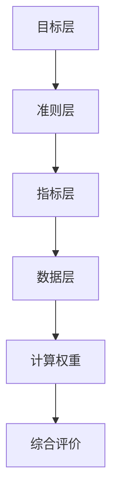
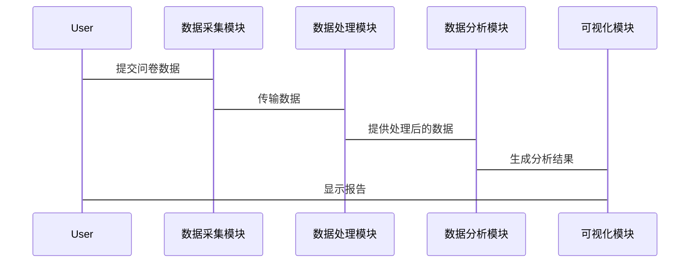

                 


# 第一部分: 品牌忠诚度分析的背景与基础

## 第1章: 品牌忠诚度的基本概念

### 1.1 品牌忠诚度的定义与类型
#### 1.1.1 品牌忠诚度的定义
品牌忠诚度是指消费者在购买产品或服务时，持续选择某个品牌而不是其他竞争对手的程度。它反映了消费者对品牌的偏好、信任和满意度，是品牌与消费者之间长期关系的体现。

#### 1.1.2 品牌忠诚度的类型
品牌忠诚度可以根据消费者行为的不同分为以下几种类型：
- **绝对忠诚**：消费者无论在何种情况下都选择同一个品牌。
- **条件忠诚**：消费者在特定条件下（如价格优惠、便利性）才会选择某个品牌。
- **无品牌忠诚**：消费者在选择产品时，没有特定的品牌偏好，而是基于价格、功能等因素进行选择。
- **转移忠诚**：消费者在某些情况下可能会转向其他品牌，但通常会回到原品牌。

#### 1.1.3 品牌忠诚度的核心要素
品牌忠诚度的核心要素包括：
- **品牌认知**：消费者对品牌的理解和记忆。
- **品牌情感**：消费者对品牌的情感联结和满意度。
- **品牌信任**：消费者对品牌的信任和依赖。
- **品牌行为**：消费者实际购买和使用品牌的行为。

### 1.2 消费者行为的背景与影响因素
#### 1.2.1 消费者行为的定义
消费者行为是指消费者在购买、使用和处置产品或服务的过程中表现出的各种行为，包括认知、情感、决策和购买行为等。

#### 1.2.2 影响消费者行为的主要因素
影响消费者行为的主要因素包括：
- **个人因素**：如年龄、性别、收入、职业、性格等。
- **心理因素**：如需求、动机、认知、态度、价值观等。
- **社会因素**：如家庭、朋友、社会潮流、文化背景等。
- **产品因素**：如产品质量、价格、功能、包装、品牌形象等。
- **营销因素**：如广告、促销、渠道、服务等。

#### 1.2.3 品牌忠诚度与消费者行为的关系
品牌忠诚度与消费者行为密切相关。消费者的行为受到品牌忠诚度的影响，而品牌忠诚度的形成也受到消费者行为的影响。消费者通过购买和使用产品，逐步建立对品牌的认知和信任，进而形成品牌忠诚度。

### 1.3 品牌忠诚度分析的重要性
#### 1.3.1 品牌忠诚度对企业营销的意义
品牌忠诚度是企业营销成功的关键因素之一。具有高品牌忠诚度的消费者更可能重复购买，推荐给他人，并在面对竞争时更倾向于选择原品牌。

#### 1.3.2 品牌忠诚度对消费者价值的影响
品牌忠诚度的消费者通常对品牌有更高的满意度和信任度，能够获得更好的产品和服务体验，从而提升整体消费满意度。

#### 1.3.3 品牌忠诚度分析的商业应用
品牌忠诚度分析可以帮助企业制定有效的市场策略，优化产品和服务，提高客户满意度和忠诚度，增强市场竞争力。

## 第2章: 品牌忠诚度分析的理论基础

### 2.1 消费者行为理论
#### 2.1.1 消费者决策过程
消费者决策过程通常包括五个阶段：认知、情感、决策、行为和结果评估。

#### 2.1.2 消费者认知与情感因素
消费者在决策过程中会受到认知和情感因素的影响，如品牌形象、品牌价值、产品功能、情感联结等。

#### 2.1.3 消费者行为模型
常见的消费者行为模型包括AIDMA模型（注意、兴趣、 desire、记忆、行动）和AISAS模型（注意、兴趣、搜索、评估、行动、分享）。

### 2.2 品牌忠诚度理论模型
#### 2.2.1 品牌忠诚度的层次模型
品牌忠诚度的层次模型将忠诚度分为不同的层次，如认知忠诚、情感忠诚、行为忠诚等。

#### 2.2.2 品牌忠诚度的结构模型
结构模型强调品牌忠诚度与其他品牌相关变量之间的关系，如品牌满意度、品牌信任、品牌形象等。

#### 2.2.3 品牌忠诚度与品牌感知的关系
品牌忠诚度与品牌感知密切相关，消费者对品牌的感知（如质量、服务、创新）直接影响其忠诚度。

### 2.3 品牌忠诚度的核心要素
#### 2.3.1 品牌认同
品牌认同是指消费者对品牌核心价值和理念的认同，是品牌忠诚度的重要基础。

#### 2.3.2 品牌满意度
品牌满意度是消费者对品牌产品或服务的满意程度，直接影响消费者的行为和忠诚度。

#### 2.3.3 品牌信任
品牌信任是指消费者对品牌的信任和依赖，是高品牌忠诚度的重要保障。

## 第3章: 品牌忠诚度分析的方法与工具

### 3.1 定性分析方法
#### 3.1.1 深度访谈
深度访谈是一种通过与消费者进行一对一的深入交流，了解其品牌认知、态度和行为的定性研究方法。

#### 3.1.2 焦点小组讨论
焦点小组讨论是通过组织一组消费者进行讨论，获取关于品牌忠诚度的定性数据。

#### 3.1.3 观察法
观察法是通过直接观察消费者的购买行为和使用行为，获取品牌忠诚度的相关信息。

### 3.2 定量分析方法
#### 3.2.1 调查问卷设计
设计科学合理的调查问卷，收集消费者的品牌认知、满意度、忠诚度等数据，是定量分析的重要手段。

#### 3.2.2 数据分析方法
通过统计分析、回归分析、因子分析等方法，对收集到的数据进行处理和分析，提取品牌忠诚度的相关信息。

#### 3.2.3 统计分析工具
常用的统计分析工具包括SPSS、R、Python等，可以进行描述性统计、推断性统计、相关分析、回归分析等。

### 3.3 品牌忠诚度指数模型
#### 3.3.1 品牌忠诚度指数的定义
品牌忠诚度指数是用来衡量消费者对品牌忠诚程度的量化指标，通常基于调查数据进行计算。

#### 3.3.2 品牌忠诚度指数的计算方法
品牌忠诚度指数的计算方法有多种，常见的有AHP（层次分析法）、因子分析、聚类分析等。

#### 3.3.3 品牌忠诚度指数的应用
品牌忠诚度指数可以用于品牌绩效评估、市场竞争分析、制定营销策略等。

### 3.4 品牌忠诚度分析的系统架构与实现
#### 3.4.1 数据预处理与清洗
在进行品牌忠诚度分析之前，需要对数据进行预处理和清洗，确保数据的准确性和完整性。

#### 3.4.2 数据分析与建模
使用统计分析工具和机器学习算法，对数据进行建模和分析，提取品牌忠诚度的关键指标。

#### 3.4.3 可视化与报告
通过数据可视化工具（如Tableau、Power BI）将分析结果进行可视化展示，生成报告，为企业提供决策支持。

## 第4章: 品牌忠诚度分析的系统分析与实现

### 4.1 系统分析与设计
#### 4.1.1 问题场景介绍
品牌忠诚度分析系统的目标是通过对消费者数据的分析，帮助企业了解消费者行为，评估品牌忠诚度，制定有效的营销策略。

#### 4.1.2 系统功能需求
系统需要具备数据采集、数据处理、数据分析、结果可视化等功能。

#### 4.1.3 系统架构设计
系统架构可以采用分层架构，包括数据层、业务逻辑层和用户界面层。数据层负责数据的存储和管理，业务逻辑层负责数据分析和计算，用户界面层负责与用户的交互。

### 4.2 系统实现与代码示例
#### 4.2.1 数据预处理与清洗
使用Python的pandas库对数据进行清洗和处理，例如处理缺失值、异常值等。

```python
import pandas as pd
# 读取数据
data = pd.read_csv('consumer_survey.csv')
# 处理缺失值
data.dropna(inplace=True)
# 处理异常值
data = data[(data['age'] >= 18) & (data['income'] >= 0)]
```

#### 4.2.2 数据分析与建模
使用层次分析法（AHP）计算品牌忠诚度指数。

```python
import numpy as np
from sklearn.preprocessing import StandardScaler
from sklearn.cluster import KMeans

# 标准化数据
scaler = StandardScaler()
scaled_data = scaler.fit_transform(data[['satisfaction', 'trust', 'recognition']])

# 聚类分析
kmeans = KMeans(n_clusters=3, random_state=0)
clusters = kmeans.fit_predict(scaled_data)
```

#### 4.2.3 可视化与报告
使用seaborn库进行数据可视化，展示品牌忠诚度的分布情况。

```python
import seaborn as sns
import matplotlib.pyplot as plt

# 绘制品牌忠诚度分布图
plt.figure(figsize=(10,6))
sns.histplot(data['loyalty_index'], bins=10, kde=True)
plt.title('Brand Loyalty Index Distribution')
plt.show()
```

### 4.3 算法原理与流程图
#### 4.3.1 层次分析法（AHP）的原理
层次分析法是一种用于多准则决策分析的方法，通过构建层次结构，计算各准则的权重，最终得出综合评价结果。

#### 4.3.2 AHP算法流程图


### 4.4 系统架构与交互图
#### 4.4.1 系统架构图


#### 4.4.2 系统交互图


## 第5章: 品牌忠诚度分析的案例分析与应用

### 5.1 案例分析：快消品行业
#### 5.1.1 数据收集与分析
通过对某快消品企业的消费者调查数据进行分析，评估品牌忠诚度指数。

#### 5.1.2 分析结果与策略制定
分析结果显示，消费者对品牌满意度较高，但忠诚度较低。企业需要通过提升产品质量和服务来提高品牌忠诚度。

### 5.2 案例分析：科技产品行业
#### 5.2.1 数据收集与分析
通过对某科技企业的消费者数据进行分析，发现品牌忠诚度较高的消费者主要集中在高端用户群体。

#### 5.2.2 分析结果与策略制定
建议企业通过技术创新和优质服务来维持和提升品牌忠诚度。

### 5.3 案例分析：奢侈品行业
#### 5.3.1 数据收集与分析
通过对某奢侈品企业的消费者数据进行分析，发现品牌忠诚度较高的消费者主要是高收入群体。

#### 5.3.2 分析结果与策略制定
建议企业通过品牌营销和高端客户服务来巩固品牌忠诚度。

## 第6章: 品牌忠诚度分析的总结与展望

### 6.1 总结
品牌忠诚度分析是理解消费者行为、制定有效营销策略的重要工具。通过定性与定量分析相结合，可以帮助企业更好地了解消费者需求，提升品牌竞争力。

### 6.2 展望
随着大数据和人工智能技术的发展，品牌忠诚度分析将更加智能化和精准化。未来的研究可以结合新兴技术，如机器学习、自然语言处理等，进一步提升品牌忠诚度分析的深度和广度。

### 6.3 最佳实践 tips
- 在进行品牌忠诚度分析时，应结合企业的实际情况，选择合适的分析方法和工具。
- 数据的质量和准确性是分析结果的关键，需重视数据的预处理和清洗。
- 建议企业定期进行品牌忠诚度评估，及时调整营销策略，以适应市场变化。

### 6.4 小结
品牌忠诚度分析是一个复杂而重要的任务，需要结合理论与实践，通过多维度的分析和深入的案例研究，才能真正理解消费者行为，提升品牌竞争力。

### 6.5 注意事项
- 数据分析过程中，需注意保护消费者隐私，遵守相关法律法规。
- 在选择分析方法时，应根据具体问题和数据特点进行合理选择，避免盲目使用复杂算法。
- 分析结果需结合实际情况进行解释，避免过度解读数据。

### 6.6 拓展阅读
- 《消费者行为学》
- 《品牌管理》
- 《数据挖掘与机器学习》

---

通过以上目录大纲，我们可以系统地学习品牌忠诚度分析的理论、方法和实际应用，帮助读者全面理解品牌忠诚度的形成机制，掌握品牌忠诚度分析的核心技术，为企业制定有效的营销策略提供科学依据。

