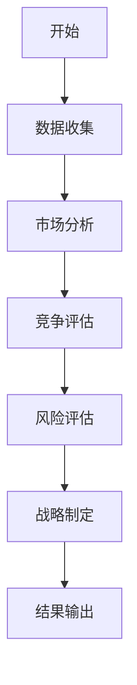
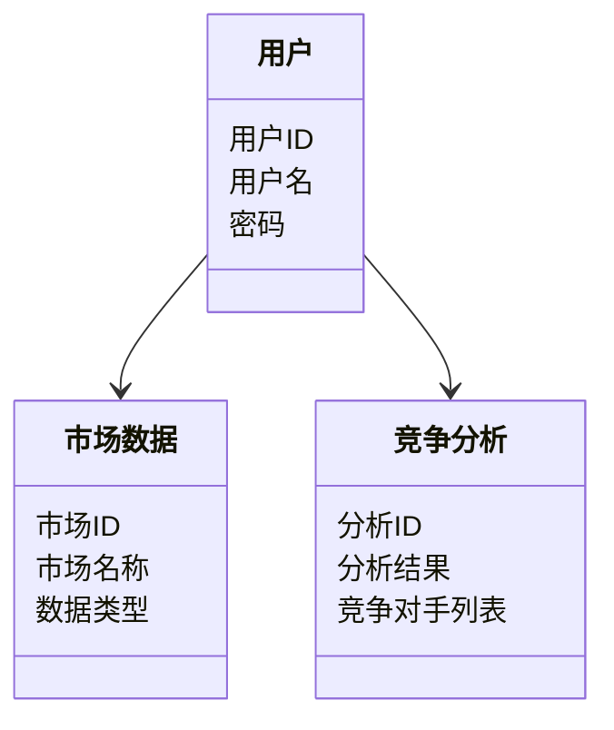
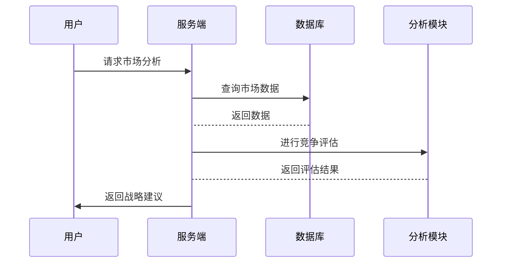

                 


# 费雪的国际化战略评估：全球扩张的潜力

---

## 关键词
- 费雪、国际化战略、全球扩张、市场评估、战略模型

---

## 摘要
本文围绕费雪的国际化战略评估，系统分析其在全球扩张中的潜力。通过背景分析、核心概念、算法原理、系统架构、项目实战等多维度探讨，结合实际案例和代码实现，为读者提供全面的评估方法。文章内容涵盖从理论到实践的全过程，旨在帮助企业在国际化进程中制定科学的战略决策。

---

## 第一部分：背景介绍

### 第1章：费雪的国际化战略评估背景

#### 1.1 费雪公司的背景与国际化战略的重要性
费雪（Fisher）作为一家在特定领域具有影响力的公司，近年来积极拓展国际市场。国际化战略不仅是企业成长的必经之路，更是应对全球化竞争的关键。费雪的国际化战略评估旨在通过科学的方法，分析其在全球市场中的潜力和挑战。

#### 1.2 费雪国际化战略的背景分析
当前全球经济一体化趋势明显，市场竞争日益激烈。费雪需要通过国际化战略在全球范围内寻找新的增长点。本文将从市场环境、竞争格局、政策法规等角度，分析费雪国际化战略的背景。

#### 1.3 问题背景与问题描述
费雪在国际化过程中面临诸多挑战，如文化差异、法律障碍、市场竞争等。本文将通过具体问题的描述，分析如何通过战略评估解决这些问题。

---

## 第二部分：核心概念与联系

### 第2章：国际化战略评估的核心概念

#### 2.1 国际化战略评估的定义与特点
国际化战略评估是对企业在全球市场中的定位、竞争优势、风险因素等进行系统分析的过程。其特点包括全面性、动态性和可操作性。

#### 2.2 核心概念的属性特征对比
以下是国际化战略与本地化战略的对比表：

| 战略类型 | 市场范围 | 资源投入 | 风险程度 |
|----------|----------|----------|----------|
| 国际化   | 全球      | 高       | 高       |
| 本地化   | 单一市场  | 中       | 中       |

#### 2.3 ER实体关系图
以下是国际化战略评估的ER实体关系图：

```mermaid
er
  actor 用户
  actor 竞争对手
  actor 监管机构
  entity 市场数据
  entity 竞争分析
  entity 风险评估
  entity 战略建议
  relation 用户 --> 市场数据
  relation 用户 --> 竞争分析
  relation 用户 --> 风险评估
  relation 用户 --> 战略建议
  relation 竞争对手 --> 竞争分析
  relation 监管机构 --> 风险评估
```

---

## 第三部分：算法原理讲解

### 第3章：费雪国际化战略评估模型

#### 3.1 算法原理概述
费雪国际化战略评估模型基于数据分析和市场竞争分析，通过构建数学模型，评估企业在目标市场的潜力和风险。

#### 3.2 算法流程图
以下是算法的流程图：



#### 3.3 算法实现
以下是Python代码实现：

```python
def fisher_international_strategy():
    # 数据收集与预处理
    data = collect_data()
    # 市场分析
    market_analysis = analyze_market(data)
    # 竞争评估
    competition_score = assess_competit(market_analysis)
    # 风险评估
    risk_level = evaluate_risk(market_analysis, competition_score)
    # 战略制定
    strategy = formulate_strategy(risk_level, competition_score)
    # 结果输出
    output_results(strategy)

fisher_international_strategy()
```

#### 3.4 数学公式
以下是一个简单的市场竞争指数公式：

$$
\text{市场潜力} = \sum_{i=1}^{n} w_i \times x_i
$$

其中，\(w_i\) 是权重，\(x_i\) 是各因素的评分。

---

## 第四部分：系统分析与架构设计

### 第4章：系统架构设计

#### 4.1 系统功能设计
以下是系统功能的领域模型：



#### 4.2 系统架构设计
以下是系统架构图：


#### 4.3 接口设计
以下是接口设计的序列图：



---

## 第五部分：项目实战

### 第5章：项目实战

#### 5.1 环境安装
需要安装以下工具：
- Python
- Mermaid
- 数据分析库（如Pandas）

#### 5.2 核心代码实现
以下是核心代码实现：

```python
import pandas as pd

def collect_data():
    # 数据收集函数
    pass

def analyze_market(data):
    # 市场分析函数
    pass

def assess_competit(market_analysis):
    # 竞争评估函数
    pass

def evaluate_risk(market_analysis, competition_score):
    # 风险评估函数
    pass

def formulate_strategy(risk_level, competition_score):
    # 战略制定函数
    pass

def output_results(strategy):
    # 结果输出函数
    pass
```

#### 5.3 案例分析
以下是案例分析的详细步骤：
1. 数据收集与预处理
2. 市场分析与竞争评估
3. 风险评估与战略制定
4. 结果输出与优化建议

---

## 第六部分：最佳实践与小结

### 第6章：最佳实践

#### 6.1 小结
费雪的国际化战略评估是一个复杂的系统工程，需要从多个维度进行分析和设计。通过本文的分析，读者可以掌握国际化战略评估的核心方法和实践技巧。

#### 6.2 注意事项
- 数据的准确性和完整性
- 模型的可解释性和可操作性
- 风险评估的敏感性和动态性

#### 6.3 拓展阅读
建议读者进一步阅读相关文献，深入了解国际化战略评估的最新进展和实际应用。

---

## 结语
本文通过系统分析和详细讲解，为读者提供了费雪国际化战略评估的全面视角。希望本文能够为企业的国际化战略制定提供有价值的参考和指导。

