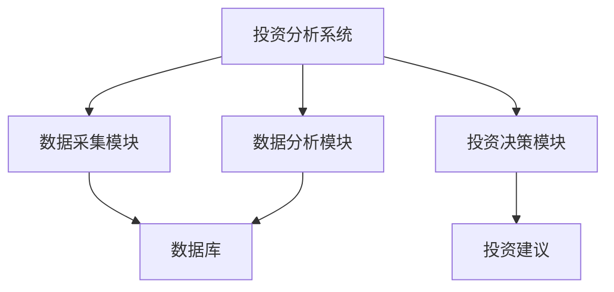
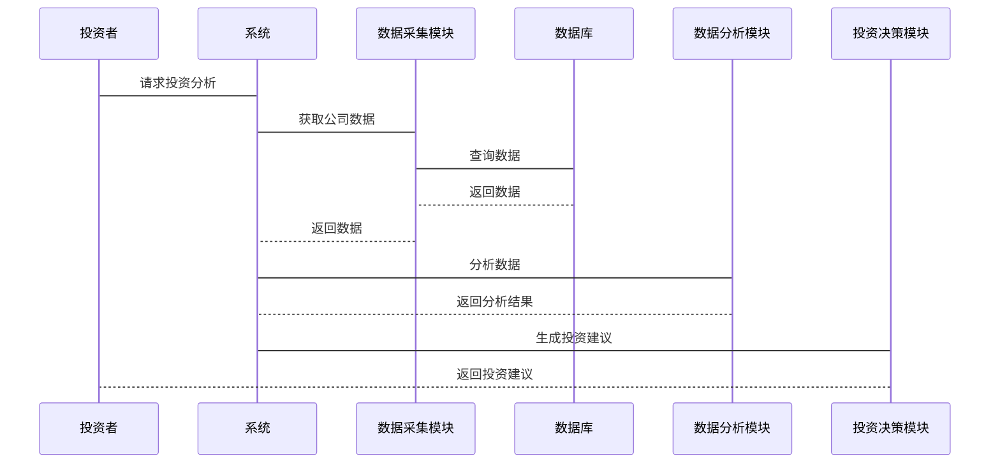

                 

# 费雪的增长型价值投资：平衡当前价值和未来潜力

## 关键词：
- 投资
- 价值投资
- 增长型投资
- 费雪
- 内在价值
- 成长股
- 投资策略

## 摘要：
本文深入探讨了菲利普·费雪（Philip Fisher）的增长型价值投资理念，重点分析了如何在投资决策中平衡当前价值与未来潜力。通过详细解读费雪的投资策略、选股标准及内在价值评估方法，结合实际案例和数学模型，为投资者提供了一套科学的投资分析体系。文章还探讨了现代市场环境下的投资策略，以及如何将费雪的理念应用于实际投资中。

---

# 正文

## 第一部分：背景介绍

### 第1章：投资的基本概念

#### 1.1 投资的定义与分类
投资是指将资金投入某一项目或资产，以期获得未来收益或资本增值的行为。根据投资目标的不同，可以将投资分为以下几类：
- **价值投资**：关注资产的内在价值，寻找市场价格低于内在价值的投资机会。
- **成长型投资**：关注具有高成长潜力的公司，愿意为未来的高增长支付更高的当前价格。
- **平衡型投资**：兼顾当前价值与成长潜力，寻找两者之间的平衡点。

#### 1.2 价值投资与成长型投资的对比
| 对比维度         | 价值投资                          | 成长型投资                          |
|-------------------|-----------------------------------|--------------------------------------|
| 投资目标         | 寻找市场价格低于内在价值的资产   | 寻找具有高成长潜力的公司            |
| 投资期限         | 更倾向于长期持有                 | 更倾向于长期持有，耐心等待成长兑现 |
| 风险承受能力     | 较低                             | 较高                                 |
| 适用场景         | 市场低迷或资产价格被低估时         | 市场增长或新兴行业时                 |

#### 1.3 费雪投资理念的核心要素
菲利普·费雪是20世纪著名的投资大师之一，他的投资理念以“成长股”理论闻名。以下是费雪投资理念的核心要素：
1. **长期投资**：费雪主张长期持有优质资产，避免频繁交易。
2. **选股标准**：选择具有强大成长潜力的公司，尤其是那些能够持续提高每股收益（EPS）的企业。
3. **内在价值**：通过基本面分析估算公司的内在价值，寻找市场价格低于内在价值的投资机会。
4. **分散投资**：通过分散投资降低风险，避免过度集中于某一只股票。

---

## 第二部分：费雪的投资理念

### 第2章：费雪的成长股理论

#### 2.1 成长股的定义与特征
成长股是指那些具有持续增长潜力的公司股票。费雪认为，成长股的核心特征包括：
- **高盈利能力**：公司净利润持续增长。
- **高营业收入增长率**：公司收入持续增长。
- **高净资产收益率（ROE）**：公司盈利能力强。

#### 2.2 费雪对成长股的筛选标准
以下是费雪筛选成长股的几个关键指标：
- **净利润增长率**：公式为：
  $$
  \text{净利润增长率} = \frac{\text{当年净利润} - \text{上年净利润}}{\text{上年净利润}} \times 100\%
  $$
- **营业收入增长率**：公式为：
  $$
  \text{营业收入增长率} = \frac{\text{当年营业收入} - \text{上年营业收入}}{\text{上年营业收入}} \times 100\%
  $$
- **净资产收益率（ROE）**：公式为：
  $$
  \text{ROE} = \frac{\text{净利润}}{\text{净资产}} \times 100\%
  $$

#### 2.3 费雪投资理念的演变与影响
费雪的投资理念对现代投资理论产生了深远影响。他强调了对公司基本面的深入分析，尤其是对公司成长潜力的关注。这种理念为后来的“成长股投资”奠定了基础。

---

## 第三部分：费雪投资理念的核心要素

### 第3章：价值与成长的平衡

#### 3.1 价值投资的核心原则
价值投资的核心原则是寻找市场价格低于内在价值的资产。费雪认为，内在价值是公司未来现金流的现值，可以通过以下公式计算：
$$
\text{内在价值} = \sum_{t=1}^{n} \frac{\text{现金流}}{(1 + r)^t}
$$
其中，$r$ 是折现率，$t$ 是时间单位。

#### 3.2 费雪对成长股风险的控制策略
尽管成长股具有较高的增长潜力，但也伴随着较高的风险。费雪通过以下方式控制风险：
- **分散投资**：将资金分散投资于多只成长股，降低单一股票的风险。
- **长期持有**：耐心等待成长股的价值实现，避免短期波动的影响。
- **持续跟踪**：定期跟踪投资公司的财务状况，及时调整投资组合。

#### 3.3 价值与成长的平衡点在哪里
价值与成长的平衡点取决于市场的整体估值水平。在市场低估时，价值投资占据主导；在市场高估时，成长股的投资机会减少。因此，投资者需要根据市场环境动态调整投资策略。

---

## 第四部分：系统分析与架构设计

### 第4章：投资分析系统的构建

#### 4.1 系统功能设计
以下是投资分析系统的主要功能模块：
- 数据采集模块：收集公司财务数据和市场数据。
- 数据分析模块：计算公司成长性和内在价值。
- 投资决策模块：根据分析结果生成投资建议。

#### 4.2 系统架构设计
以下是投资分析系统的架构图：

#### 4.3 系统接口设计
以下是系统接口设计的序列图：

---

## 第五部分：项目实战

### 第5章：费雪投资理念的实践案例

#### 5.1 苹果公司的投资分析
以苹果公司为例，分析如何应用费雪的投资理念进行投资决策。

1. **财务数据收集**：
   - 净利润：$1000亿美元
   - 营业收入：$3000亿美元
   - 净资产：$1000亿美元

2. **成长性分析**：
   - 净利润增长率：$$\frac{1000 - 800}{800} \times 100\% = 25\%$$
   - 营业收入增长率：$$\frac{3000 - 2500}{2500} \times 100\% = 20\%$$
   - ROE：$$\frac{1000}{1000} \times 100\% = 100\%$$

3. **内在价值计算**：
   假设折现率为5%，未来现金流如下：
   - 第1年：$1000亿美元
   - 第2年：$1250亿美元
   - 第3年：$1500亿美元
   - 之后每年增长率为5%。

   内在价值计算公式：
   $$
   \text{内在价值} = \frac{1000}{(1 + 0.05)^1} + \frac{1250}{(1 + 0.05)^2} + \frac{1500}{(1 + 0.05)^3} + \dots
   $$

4. **投资决策**：
   如果苹果公司的市场价格低于计算出的内在价值，且符合费雪的成长股筛选标准，则可以考虑投资。

---

## 第六部分：总结与展望

### 第6章：总结与展望

#### 6.1 全文总结
费雪的增长型价值投资理念强调了平衡当前价值与未来潜力的重要性。通过深入分析公司的基本面，尤其是成长性和内在价值，投资者可以在市场中找到具有长期增长潜力的优质资产。

#### 6.2 未来投资趋势
随着全球经济的不断发展和技术的进步，新兴行业（如人工智能、大数据、区块链等）将为投资者提供更多成长型投资机会。未来，投资者需要更加关注这些领域的成长潜力。

#### 6.3 投资建议
1. **长期投资**：避免短期波动的影响，耐心持有优质资产。
2. **分散投资**：降低单一资产的风险。
3. **持续学习**：关注市场动态，不断提升自己的投资能力。

---

## 结语
费雪的增长型价值投资理念为投资者提供了一种科学的投资方法。通过平衡当前价值与未来潜力，投资者可以在市场中找到具有长期增长潜力的优质资产。希望本文能够为投资者提供有价值的参考和启示。

