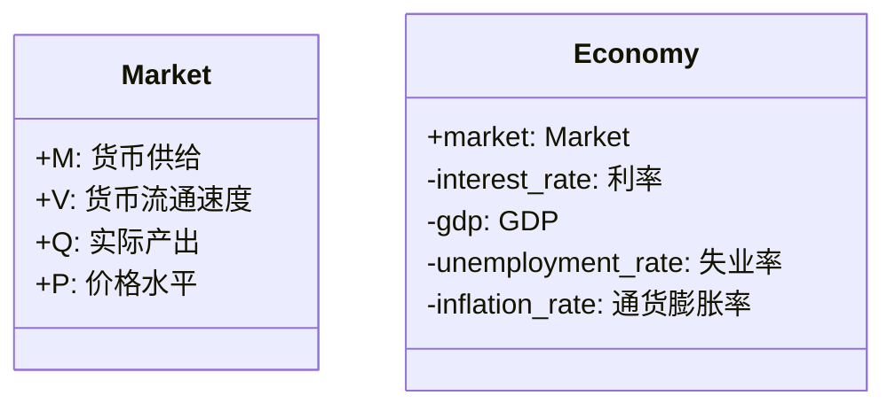
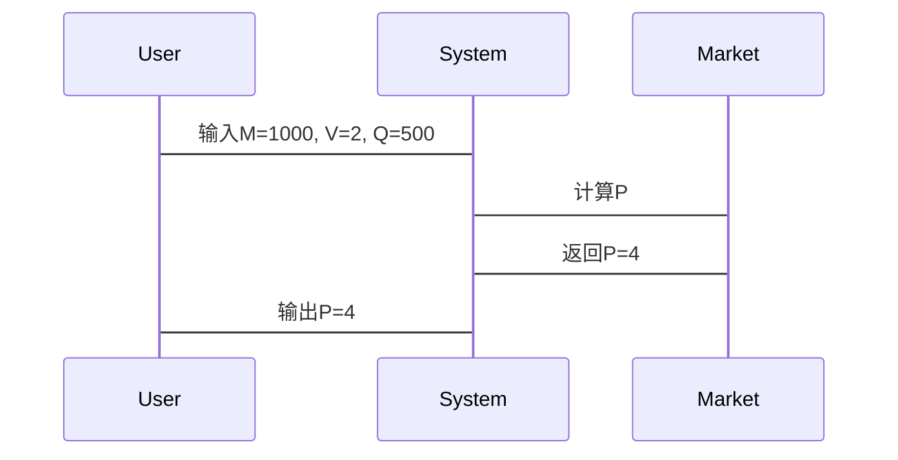

                 


# 《费雪的宏观经济分析：把握大趋势》

## 关键词：费雪宏观经济分析、经济周期、市场均衡、货币政策、经济指标、投资理论

## 摘要：本文深入探讨了费雪的宏观经济分析理论，从其核心概念、数学模型到实际应用，全面解析如何通过费雪的理论把握经济大趋势。文章结合背景介绍、算法原理、系统架构和项目实战，帮助读者理解并应用费雪的宏观经济分析。

---

## 第一部分：费雪宏观经济分析的背景与基础

### 第1章：费雪宏观经济分析的起源与核心概念

#### 1.1 费雪宏观经济分析概述

##### 1.1.1 宏观经济分析的起源与发展
宏观经济分析起源于对经济整体运行的观察与研究。费雪作为20世纪初的重要经济学家，其贡献为现代宏观经济理论奠定了基础。通过分析GDP、失业率、通货膨胀等指标，宏观经济分析帮助我们理解经济系统的整体运行。

##### 1.1.2 费雪的经济理论与贡献
费雪以其货币数量论和利息理论闻名。他认为，价格水平与货币供给和需求密切相关，而利息则由风险和时间偏好决定。这些理论为现代货币政策提供了理论基础。

##### 1.1.3 费雪宏观经济分析的核心问题
费雪关注市场均衡、价格波动和经济周期。他提出，市场均衡是经济稳定的基础，而价格波动和经济周期则反映了市场失衡的状态。

#### 1.2 费雪的经济理论基础

##### 1.2.1 货币数量论与价格水平
费雪的货币数量论指出，价格水平与货币供给量成正比。公式表示为：
$$ P = \frac{MV}{Q} $$
其中，P为价格水平，M为货币供给，V为货币流通速度，Q为实际产出。

##### 1.2.2 利息与投资理论
费雪认为，利率由纯利率和通货膨胀率组成：
$$ i = r + \pi $$
其中，i为名义利率，r为纯利率，π为通货膨胀率。

##### 1.2.3 市场均衡与经济周期
市场均衡是经济稳定的基础，而经济周期则是市场失衡的结果。费雪通过分析价格和数量的动态关系，揭示了经济波动的规律。

#### 1.3 费雪宏观经济分析的现实意义

##### 1.3.1 宏观经济分析在现代经济学中的地位
宏观经济分析是理解经济政策和经济预测的基础。费雪的理论为现代货币政策提供了重要参考。

##### 1.3.2 费雪理论与现代货币政策的联系
费雪的货币数量论支持现代货币供给理论，而他的利率理论则为现代利率政策提供了理论基础。

##### 1.3.3 把握大趋势的必要性与方法
通过分析经济指标和市场动态，费雪的理论帮助我们预测经济趋势，制定有效的经济策略。

---

## 第二部分：费雪宏观经济分析的核心概念与联系

### 第2章：费雪宏观经济分析的核心模型

#### 2.1 费雪的市场分析模型

##### 2.1.1 市场均衡模型的构建
费雪的市场均衡模型通过分析价格和数量的关系，揭示了市场稳定与波动的机制。

##### 2.1.2 价格与数量的相互关系
价格水平与货币供给和需求密切相关，而数量则受价格和市场参与者行为的影响。通过公式：
$$ Q = \frac{MV}{P} $$
可以看出，价格与数量呈反比关系。

##### 2.1.3 市场波动与经济周期的关联
市场波动是经济周期的表现，费雪通过分析波动的规律，提出了预测经济趋势的方法。

#### 2.2 费雪的经济指标分析

##### 2.2.1 GDP、失业率与通货膨胀的关系
GDP衡量经济产出，失业率反映劳动力市场的状况，通货膨胀率衡量价格水平的变化。三者共同影响经济的整体表现。

##### 2.2.2 利率与投资的动态平衡
低利率刺激投资，高利率抑制消费。通过公式：
$$ i = r + \pi $$
可以理解利率对投资的影响。

##### 2.2.3 货币政策与财政政策的协同作用
货币政策通过调节货币供给影响价格水平，财政政策通过政府支出和税收影响GDP和就业。两者的协同作用是实现经济稳定的必要条件。

#### 2.3 费雪宏观经济分析的实体关系图

##### 2.3.1 Mermaid流程图：费雪模型的核心关系

该图展示了市场参与者、价格水平、货币供给和实际产出之间的相互关系。

---

## 第三部分：费雪宏观经济分析的算法原理

### 第3章：费雪模型的数学表达与算法实现

#### 3.1 费雪模型的数学模型

##### 3.1.1 市场均衡的数学表达式
$$ P = \frac{MV}{Q} $$
其中，P为价格水平，M为货币供给，V为货币流通速度，Q为实际产出。

##### 3.1.2 利率与投资的动态关系
$$ i = r + \pi $$
其中，i为名义利率，r为纯利率，π为通货膨胀率。

##### 3.1.3 经济周期的数学描述
通过时间序列分析，经济周期可以表示为价格水平和产出的波动。

#### 3.2 费雪模型的算法流程

##### 3.2.1 Mermaid流程图：费雪模型的算法步骤

该图展示了费雪模型算法的基本步骤。

##### 3.2.2 Python代码实现
```python
def fisher_model(M, V, Q):
    P = (M * V) / Q
    return P

# 示例输入
M = 1000  # 货币供给
V = 2     # 货币流通速度
Q = 500   # 实际产出

P = fisher_model(M, V, Q)
print("价格水平 P =", P)
```
该代码实现了费雪模型的价格计算。

---

## 第四部分：系统分析与架构设计

### 第4章：费雪宏观经济分析的系统架构

#### 4.1 问题场景介绍
我们希望通过系统分析费雪的宏观经济模型，实现对经济趋势的预测和分析。

#### 4.2 系统功能设计

##### 4.2.1 领域模型类图

该类图展示了系统的组成和关系。

#### 4.3 系统架构设计

##### 4.3.1 Mermaid架构图

该图展示了系统的整体架构。

#### 4.4 接口设计与交互流程

##### 4.4.1 接口设计
- 输入接口：接收M、V、Q参数。
- 输出接口：返回价格水平P。

##### 4.4.2 交互序列图

该图展示了用户与系统之间的交互流程。

---

## 第五部分：项目实战

### 第5章：基于费雪模型的经济趋势分析

#### 5.1 环境安装

##### 5.1.1 Python环境安装
安装Python和必要的库，如pandas、numpy。

#### 5.2 系统核心实现

##### 5.2.1 Python源代码实现
```python
def calculate_price(M, V, Q):
    return (M * V) / Q

def calculate_inflation(initial_P, final_P, initial_Q, final_Q):
    return (final_P/Q2) - (initial_P/Q1)

# 示例数据
M = 1000
V = 2
Q = 500

P = calculate_price(M, V, Q)
print("价格水平 P =", P)

Q2 = 600
P2 = calculate_price(M, V, Q2)
inflation = calculate_inflation(P, P2, Q, Q2)
print("通货膨胀率 π =", inflation)
```
该代码展示了如何计算价格水平和通货膨胀率。

#### 5.3 代码应用解读与分析

##### 5.3.1 代码解读
通过函数calculate_price和calculate_inflation，我们可以计算价格水平和通货膨胀率，从而分析经济趋势。

##### 5.3.2 案例分析
假设货币供给M=1000，流通速度V=2，实际产出Q=500。计算价格水平P=4。若Q增加到600，价格水平P=3.33，通货膨胀率π=-16.67%，表明经济紧缩。

#### 5.4 项目小结
通过本项目，我们学会了如何应用费雪模型进行经济分析，理解了价格水平和通货膨胀率的计算方法，以及它们如何影响经济趋势。

---

## 第六部分：最佳实践与拓展

### 6.1 小结

费雪的宏观经济分析为我们提供了理解经济系统的工具。通过他的理论，我们可以分析价格、产出和利率的关系，预测经济趋势。

### 6.2 注意事项

在实际应用中，需考虑数据的准确性和模型的适用性。费雪的理论是建立在假设条件下的，实际经济中存在许多变量会影响结果。

### 6.3 拓展阅读

建议进一步阅读现代货币理论和计量经济学，以深入了解费雪理论在现代经济学中的应用。

---

通过以上内容，我们系统地介绍了费雪的宏观经济分析，从理论到实践，帮助读者全面理解并应用这一理论。

