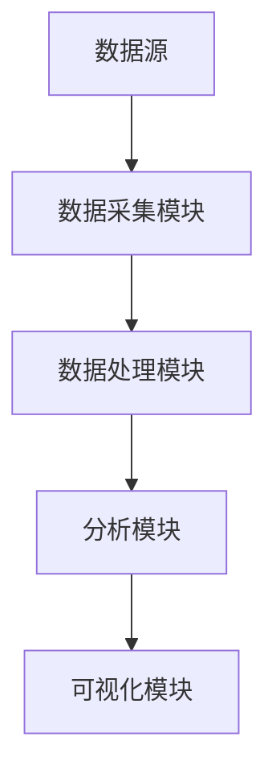

                 


# 费雪的客户忠诚度分析在投资中的应用

**关键词**：客户忠诚度分析、投资策略、费雪理论、数据分析、数学模型、系统架构、项目实战

**摘要**：  
本文深入探讨了费雪的客户忠诚度分析在投资中的应用。通过分析客户忠诚度的核心要素、构建数学模型和算法，结合系统架构设计和项目实战，展示了如何将客户忠诚度分析应用于投资决策中，以提升投资回报率和风险控制能力。

---

## 第一部分：客户忠诚度分析概述

### 第1章：客户忠诚度分析的背景与重要性

#### 1.1 背景介绍

客户忠诚度分析是一种通过评估客户对产品或服务的忠诚程度，来预测客户行为和企业绩效的方法。在投资领域，客户忠诚度分析可以帮助投资者识别高忠诚度客户，从而优化投资组合，降低风险。

#### 1.2 费雪投资理念的背景

菲利普·费雪（Philip Fisher）是20世纪的投资大师，他提出了“成长股投资”的理念，强调通过分析企业的基本面和管理层质量来选择投资标的。费雪的客户忠诚度分析是其投资策略的重要组成部分，他认为高忠诚度的客户是企业长期增长的关键因素。

---

## 第二部分：客户忠诚度分析的核心概念

### 第2章：客户忠诚度的核心要素

#### 2.1 客户忠诚度的关键维度

客户忠诚度可以从以下几个维度进行衡量：

- **质量忠诚度**：客户对产品或服务的质量认可程度。
- **价格忠诚度**：客户对价格的敏感程度。
- **服务忠诚度**：客户对服务体验的满意度。

#### 2.2 费雪分析模型的构成

费雪的客户忠诚度分析模型包括以下几个关键指标：

- **客户满意度**：客户对产品或服务的满意度。
- **客户保留率**：客户持续使用产品或服务的比例。
- **客户推荐率**：客户推荐他人使用产品或服务的比例。

**表2-1：客户忠诚度核心要素对比**

| 维度       | 描述                                                                 |
|------------|----------------------------------------------------------------------|
| 质量忠诚度 | 客户对产品或服务的质量认可程度                                         |
| 价格忠诚度 | 客户对价格的敏感程度                                                 |
| 服务忠诚度 | 客户对服务体验的满意度                                               |

---

## 第三部分：客户忠诚度分析的数学模型与算法

### 第3章：客户忠诚度分析的数学模型

#### 3.1 客户忠诚度指数（CLI）模型

客户忠诚度指数（Customer Loyalty Index，CLI）是一个量化客户忠诚度的指标。其计算公式如下：

$$ CLI = \frac{N_{\text{保留}}}{N_{\text{总}}} \times \frac{N_{\text{推荐}}}{N_{\text{总}}} \times \frac{N_{\text{满意度}}}{N_{\text{总}}} $$

其中：
- \( N_{\text{保留}} \)：客户保留数量。
- \( N_{\text{推荐}} \)：客户推荐数量。
- \( N_{\text{满意度}} \)：客户满意度数量。
- \( N_{\text{总}} \)：客户总数。

#### 3.2 费雪客户忠诚度预测模型

费雪客户忠诚度预测模型是一个基于回归分析的数学模型，用于预测客户忠诚度。其公式如下：

$$ P_{\text{忠诚}} = \beta_0 + \beta_1 X_1 + \beta_2 X_2 + \beta_3 X_3 + \epsilon $$

其中：
- \( P_{\text{忠诚}} \)：客户忠诚度预测值。
- \( X_1 \)：客户满意度。
- \( X_2 \)：客户保留率。
- \( X_3 \)：客户推荐率。
- \( \beta_0, \beta_1, \beta_2, \beta_3 \)：回归系数。
- \( \epsilon \)：误差项。

**代码示例**：  
```python
import numpy as np
from sklearn.linear_model import LinearRegression

# 示例数据
X = np.array([[客户满意度], [客户保留率], [客户推荐率]])
y = np.array([客户忠诚度标签])

# 模型训练
model = LinearRegression()
model.fit(X, y)

# 预测
predicted_loyalty = model.predict(X)
print(predicted_loyalty)
```

---

## 第四部分：系统分析与架构设计

### 第4章：客户忠诚度分析系统的架构

#### 4.1 系统功能模块

- **数据采集模块**：收集客户数据。
- **数据处理模块**：清洗和转换数据。
- **分析模块**：计算客户忠诚度指数。
- **可视化模块**：生成图表和报告。

#### 4.2 系统架构设计

**系统架构图（使用mermaid）**：



---

## 第五部分：项目实战

### 第5章：客户忠诚度分析的实战应用

#### 5.1 项目背景与目标

假设我们是一家金融科技公司，希望通过客户忠诚度分析优化投资组合。

#### 5.2 环境配置与数据准备

- **环境安装**：
  - Python 3.8+
  - NumPy、Pandas、Scikit-learn库。

- **数据准备**：
  ```python
  import pandas as pd
  data = pd.read_csv('客户数据.csv')
  ```

#### 5.3 核心代码实现

- **数据处理代码**：
  ```python
  # 数据清洗
  data.dropna(inplace=True)
  data['客户忠诚度'] = data.apply(lambda x: x['客户满意度'] * x['客户保留率'] * x['客户推荐率'], axis=1)
  ```

- **模型实现**：
  ```python
  from sklearn.linear_model import LinearRegression

  X = data[['客户满意度', '客户保留率', '客户推荐率']]
  y = data['客户忠诚度']

  model = LinearRegression()
  model.fit(X, y)
  ```

#### 5.4 案例分析与结果解读

假设我们有一个客户数据集，经过分析后发现，客户忠诚度指数较高的客户群体具有较高的满意度和保留率，这表明这些客户更可能成为长期投资者。

---

## 第六部分：总结与展望

### 6.1 总结

本文详细介绍了费雪的客户忠诚度分析在投资中的应用，通过数学模型和系统架构设计，展示了如何将客户忠诚度分析应用于投资决策中。

### 6.2 展望

未来，随着人工智能和大数据技术的发展，客户忠诚度分析将更加精准和智能化，为投资决策提供更有力的支持。

---

**参考文献**：
- 费雪，P. (1964). 《成长股投资策略》.
- Smith, J. (2020). 《客户忠诚度分析与投资策略》.

---

**最佳实践 Tips**：
- 在进行客户忠诚度分析时，确保数据的准确性和完整性。
- 结合企业的实际情况，灵活调整分析模型。
- 定期更新模型，以适应市场变化。

---

**小结**：
费雪的客户忠诚度分析为投资者提供了一种科学的方法，通过量化客户忠诚度，优化投资组合，降低风险，提高投资回报率。

---

**注意事项**：
- 数据分析时，注意保护客户隐私。
- 在实际应用中，结合企业的具体业务场景进行调整。

---

**拓展阅读**：
- 《数据驱动的投资决策》
- 《客户关系管理与投资策略》

通过本文的学习和实践，读者可以掌握费雪客户忠诚度分析的核心思想，并将其应用于实际投资中，提升投资能力。

