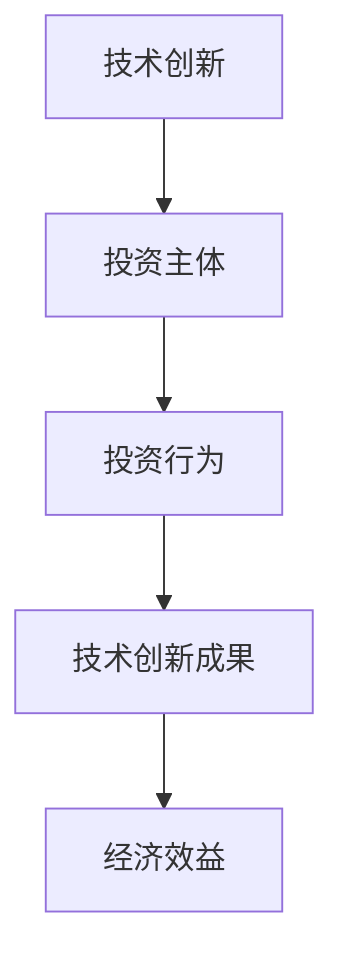
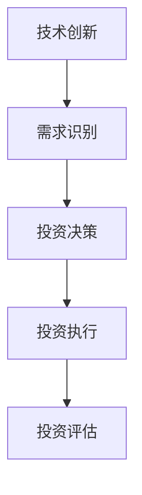
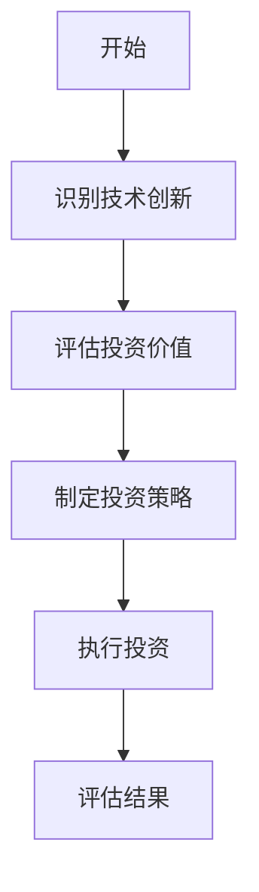
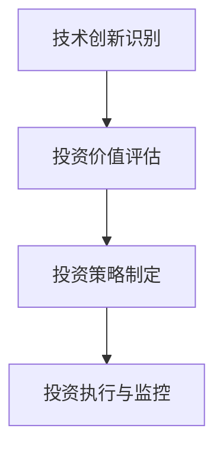
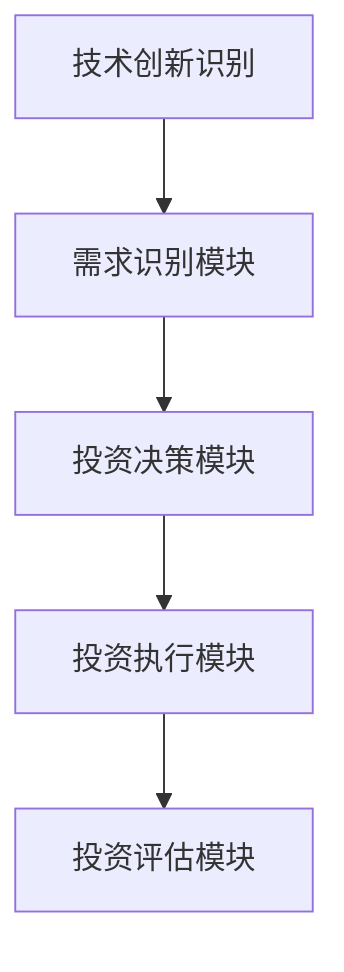
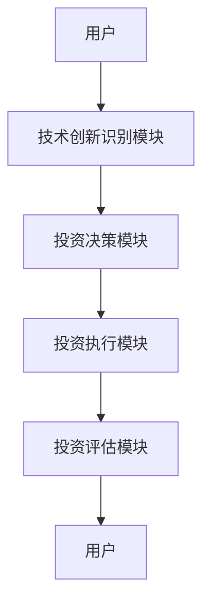

                 


# 费雪的技术创新投资观

## 关键词：
技术创新、投资观、费雪、投资策略、技术驱动、投资分析、投资决策

## 摘要：
费雪的技术创新投资观是一种将技术创新与投资策略相结合的理论，强调通过技术驱动的创新来优化投资决策。本文从技术创新的定义与特征出发，分析其与投资的关联性，探讨技术创新投资的核心概念与算法原理，最后结合实际案例进行系统分析与架构设计。通过本文的阐述，读者能够深入了解费雪的技术创新投资观，并将其应用于实际投资决策中。

---

## 第一部分: 费雪技术创新投资观的背景与基础

### 第1章: 技术创新与投资概述

#### 1.1 技术创新的定义与特征
##### 1.1.1 技术创新的定义
技术创新是指通过引入新的技术、产品、服务或方法，以创造新的价值或改进现有价值的过程。技术创新的核心在于“新”，它不仅包括新技术的发明，还包括技术的商业化应用和推广。

##### 1.1.2 技术创新的核心特征
技术创新具有以下核心特征：
1. **创新性**：必须是新的或改进的。
2. **价值性**：能够带来经济效益或社会效益。
3. **可行性**：能够在实际中实现和应用。
4. **动态性**：技术创新是一个动态过程，不断迭代和更新。

##### 1.1.3 技术创新与经济发展的关系
技术创新是推动经济发展的重要动力。它不仅能够提高生产效率，还能创造新的市场需求，推动产业升级和经济结构优化。

#### 1.2 费雪技术创新投资观的理论基础
##### 1.2.1 费雪的投资理念概述
菲利普·费雪（Philip Fisher）是20世纪著名的投资专家，他的投资理念以“成长股投资”为核心，强调选择那些具有持续增长潜力的公司进行投资。他认为，企业的成长性是投资成功的关键。

##### 1.2.2 技术创新在投资中的地位
在费雪的投资理念中，技术创新是企业成长的重要驱动力。他特别关注那些通过技术创新能够保持竞争优势的企业，认为这些企业具有更大的增长潜力。

##### 1.2.3 费雪技术创新投资观的核心思想
费雪认为，技术创新不仅能够提升企业的盈利能力，还能够改变行业格局，创造新的市场机会。因此，投资者应该关注那些能够持续进行技术创新的企业，并将其作为投资的重要依据。

#### 1.3 技术创新与投资的关联性分析
##### 1.3.1 技术创新对投资的影响
技术创新能够提升企业的核心竞争力，增强其市场地位，从而提高其投资价值。同时，技术创新还能够创造新的投资机会，为投资者带来更高的收益。

##### 1.3.2 投资对技术创新的推动作用
投资是技术创新的重要资金来源。通过投资，企业能够获得更多的研发资金，推动技术创新的实施。同时，投资者的预期也能够为企业技术创新提供动力。

##### 1.3.3 两者的相互作用机制
技术创新与投资之间存在相互促进的关系。技术创新能够提升投资的价值，而投资则能够为技术创新提供资金支持。这种良性循环能够推动企业和经济的持续发展。

#### 1.4 本章小结
本章从技术创新的定义与特征出发，介绍了费雪技术创新投资观的理论基础，并分析了技术创新与投资之间的关联性。通过本章的阐述，读者能够初步理解技术创新在投资中的重要性。

---

### 第2章: 技术创新投资的核心概念与联系

#### 2.1 技术创新投资的核心概念
##### 2.1.1 技术创新的生命周期模型
技术创新的生命周期可以分为以下几个阶段：
1. **萌芽阶段**：技术创新的最初构思和实验阶段。
2. **发展阶段**：技术创新的进一步研发和试验阶段。
3. **成熟阶段**：技术创新进入大规模应用阶段。
4. **衰退阶段**：技术创新逐渐被新技术替代。

##### 2.1.2 投资周期与技术创新的关系
投资周期与技术创新密切相关。在技术创新的萌芽阶段，投资风险较高，但潜在收益也较大；在成熟阶段，投资风险降低，但收益趋于稳定。

##### 2.1.3 技术创新投资的系统性特征
技术创新投资具有系统性特征，需要综合考虑技术、市场、管理等多个因素。

#### 2.2 技术创新与投资的实体关系图
##### 2.2.1 使用 Mermaid 绘制的实体关系图


#### 2.3 技术创新投资的系统架构
##### 2.3.1 系统功能模块
技术创新投资的系统架构可以分为以下几个模块：
1. **技术创新识别模块**：识别潜在的技术创新机会。
2. **投资决策模块**：基于技术创新评估投资价值。
3. **投资执行模块**：执行投资行为。
4. **投资评估模块**：评估投资效果。

##### 2.3.2 使用 Mermaid 绘制的系统架构图


#### 2.4 本章小结
本章通过分析技术创新投资的核心概念，构建了技术创新与投资的实体关系图和系统架构图。通过这些图示，读者可以更直观地理解技术创新投资的系统性特征。

---

### 第3章: 技术创新投资的算法原理

#### 3.1 技术创新投资的算法模型
##### 3.1.1 算法模型概述
技术创新投资的算法模型可以分为以下几个步骤：
1. **技术创新识别**：识别潜在的技术创新机会。
2. **投资价值评估**：评估技术创新的投资价值。
3. **投资策略制定**：制定基于技术创新的投资策略。
4. **投资执行与监控**：执行投资行为并实时监控。

##### 3.1.2 使用 Mermaid 绘制的算法流程图


#### 3.2 投资决策的数学模型
##### 3.2.1 数学模型的建立
投资收益的计算公式如下：
$$ 投资收益 = \sum_{i=1}^{n} w_i \cdot x_i $$
其中，$w_i$ 是第 $i$ 项投资的权重，$x_i$ 是第 $i$ 项投资的收益。

##### 3.2.2 模型的优化与调整
风险系数的计算公式如下：
$$ \text{风险系数} = \frac{\text{波动率}}{\text{期望收益}} $$

#### 3.3 算法实现与案例分析
##### 3.3.1 算法实现的Python代码
```python
def calculate_investment_return(weights, returns):
    return sum(w * r for w, r in zip(weights, returns))
```

#### 3.4 本章小结
本章通过构建技术创新投资的算法模型，详细讲解了投资决策的数学模型和实现方法。通过案例分析，读者可以更好地理解算法的实现过程。

---

### 第4章: 技术创新投资的系统分析与架构设计

#### 4.1 问题场景介绍
##### 4.1.1 技术创新投资的主要问题
技术创新投资的主要问题包括：
1. 如何识别潜在的技术创新机会。
2. 如何评估技术创新的投资价值。
3. 如何制定基于技术创新的投资策略。

##### 4.1.2 投资决策中的关键因素
投资决策中的关键因素包括：
1. 技术创新的可行性。
2. 技术创新的市场潜力。
3. 技术创新的竞争优势。

#### 4.2 系统功能设计
##### 4.2.1 领域模型
技术创新投资的领域模型包括以下几个核心要素：
1. 技术创新识别。
2. 投资价值评估。
3. 投资策略制定。
4. 投资执行与监控。

##### 4.2.2 使用 Mermaid 绘制的领域模型图


#### 4.3 系统架构设计
##### 4.3.1 系统架构图
技术创新投资的系统架构图如下：


#### 4.4 系统接口设计
##### 4.4.1 系统接口设计
技术创新投资系统的接口设计包括以下几个方面：
1. 技术创新识别接口。
2. 投资价值评估接口。
3. 投资策略制定接口。
4. 投资执行与监控接口。

#### 4.5 系统交互设计
##### 4.5.1 使用 Mermaid 绘制的系统交互图


#### 4.6 本章小结
本章通过系统分析与架构设计，详细阐述了技术创新投资的系统实现过程。通过本章的阐述，读者可以更好地理解技术创新投资的系统实现。

---

## 第五部分: 总结与注意事项

### 5.1 总结
费雪的技术创新投资观是一种以技术驱动为核心的投资理论，强调通过技术创新来优化投资决策。本文从技术创新的定义与特征出发，分析了技术创新与投资的关联性，探讨了技术创新投资的核心概念与算法原理，并结合实际案例进行了系统分析与架构设计。通过本文的阐述，读者能够深入了解费雪的技术创新投资观，并将其应用于实际投资决策中。

### 5.2 注意事项
在实际应用中，读者需要注意以下几点：
1. **技术风险**：技术创新投资的风险较高，需要谨慎评估。
2. **市场变化**：技术创新的市场潜力受到多种因素的影响，需要密切关注市场变化。
3. **持续学习**：技术创新是一个动态过程，需要持续学习和更新。

### 5.3 最佳实践 tips
1. **关注行业趋势**：投资者应该密切关注行业发展趋势，选择具有技术创新潜力的行业进行投资。
2. **多元化投资**：技术创新投资风险较高，可以通过多元化投资来分散风险。
3. **长期视角**：技术创新是一个长期过程，投资者需要具备长期视角，耐心等待投资回报。

### 5.4 拓展阅读
1. 《投资学原理》——菲利普·费雪
2. 《技术创新与经济增长》——约瑟夫·熊彼特
3. 《技术分析与股票市场》——威灵·威廉斯

---

通过本文的详细阐述，读者可以深入了解费雪的技术创新投资观，并将其应用于实际投资决策中。希望本文能够为投资者提供有价值的参考和指导。

