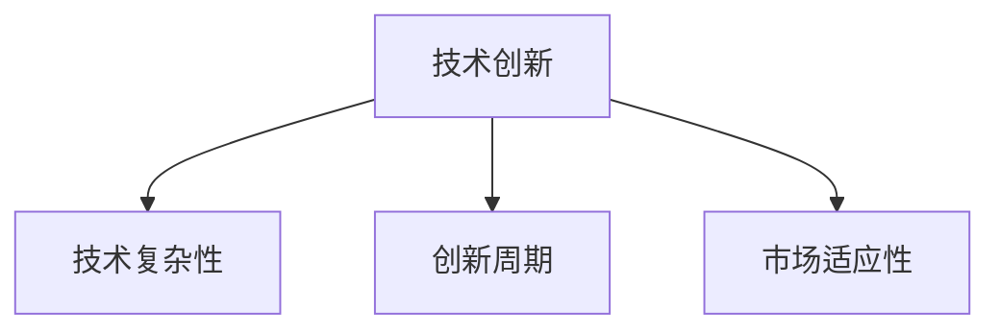
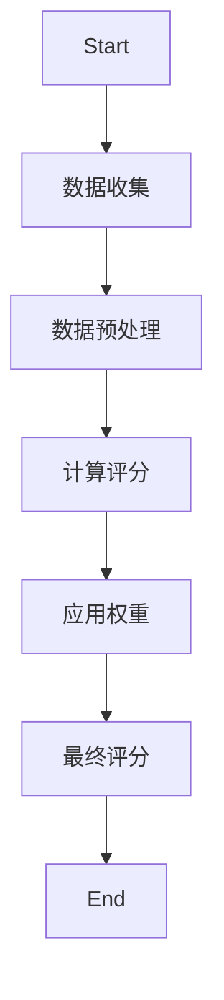
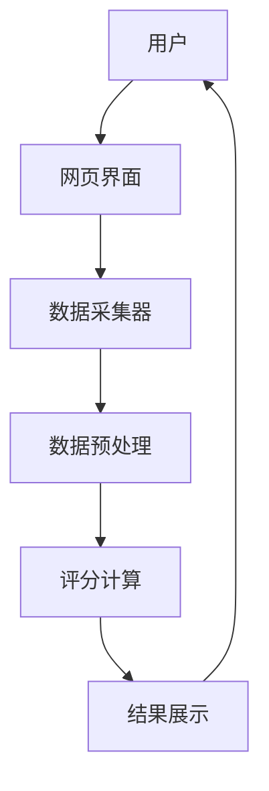
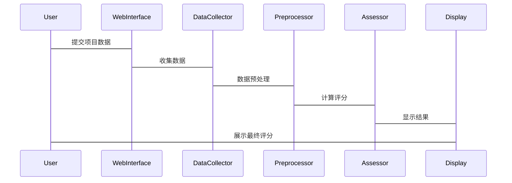

                 


# 费雪的技术创新评估在投资中的运用

## 关键词
技术创新评估、费雪模型、投资决策、技术复杂性、创新周期、市场适应性

## 摘要
技术创新评估是投资决策中的关键环节，费雪模型通过评估技术复杂性、创新周期和市场适应性，帮助企业识别高潜力的技术创新项目。本文详细探讨了费雪模型的背景、核心概念、算法原理、系统架构及项目实战，为企业投资决策提供了理论和实践指导。

---

## 第一部分：技术创新评估的背景与核心概念

### 第1章：技术创新评估的背景与重要性

#### 1.1 技术创新评估的定义与核心概念

- **1.1.1 技术创新的定义**
  技术创新是指引入新的技术、产品或方法，以提升企业的竞争力和市场地位。它包括技术开发、应用和商业化的过程。

- **1.1.2 技术创新评估的核心概念**
  技术创新评估是对技术创新项目进行分析，以确定其可行性和潜在价值。核心概念包括技术复杂性、创新周期和市场适应性。

- **1.1.3 技术创新评估的重要性**
  评估技术创新项目有助于企业识别高潜力项目，优化资源配置，降低投资风险，并在竞争中占据优势。

#### 1.2 费雪技术创新评估模型的起源

- **1.2.1 费雪模型的提出背景**
  费雪模型由投资专家菲利普·费雪提出，旨在通过评估技术创新的潜力，帮助投资者做出明智决策。

- **1.2.2 费雪模型的核心思想**
  费雪模型强调技术创新的长期潜力和市场适应性，认为技术创新是企业长期竞争优势的基石。

- **1.2.3 费雪模型在投资中的应用**
  费雪模型通过评估技术复杂性、创新周期和市场适应性，帮助投资者识别具有高增长潜力的企业。

### 第2章：技术创新评估的核心要素与属性

#### 2.1 技术创新评估的核心要素

- **2.1.1 技术复杂性**
  技术复杂性是技术创新项目的技术难度和所需资源的度量。高复杂性意味着项目需要更多资源和时间。

- **2.1.2 创新周期**
  创新周期是从技术开发到商业化的时间跨度。周期较长意味着风险较高，但潜在回报也更大。

- **2.1.3 市场适应性**
  市场适应性是技术创新项目与市场需求的匹配程度。高适应性意味着项目更可能成功。

#### 2.2 核心要素对比分析

- **2.2.1 技术复杂性与创新周期的对比**
  技术复杂性影响项目难度，创新周期影响项目时间跨度。两者共同决定项目的资源需求和风险。

- **2.2.2 创新周期与市场适应性的对比**
  创新周期影响市场进入时间，市场适应性影响市场需求匹配度。两者共同决定项目的市场潜力。

#### 2.3 技术创新评估的ER实体关系图



---

## 第二部分：费雪技术创新评估模型的算法原理

### 第3章：费雪技术创新评估模型的算法原理

#### 3.1 费雪模型的算法流程



#### 3.2 算法实现代码

```python
def fisher_technology_assessment(data):
    # 数据预处理
    preprocessed_data = preprocess(data)
    # 计算各指标评分
    scores = calculate_scores(preprocessed_data)
    # 应用权重
    weighted_scores = apply_weights(scores)
    # 返回最终评分
    return weighted_scores
```

#### 3.3 数学模型与公式

- **技术创新评分公式：**
$$
\text{评分} = \sum_{i=1}^{n} w_i \times s_i
$$
其中，\( w_i \) 是第i个指标的权重，\( s_i \) 是第i个指标的评分。

---

## 第三部分：系统分析与架构设计方案

### 第4章：系统分析与架构设计

#### 4.1 问题场景介绍

- **系统目标：** 设计一个基于费雪模型的技术创新评估系统，帮助投资者快速评估技术创新项目的潜力。
- **用户角色：** 投资者、企业高管、技术分析师。
- **核心功能：** 数据采集、评分计算、结果展示。

#### 4.2 系统架构设计



#### 4.3 系统交互设计



---

## 第四部分：项目实战与案例分析

### 第5章：项目实战

#### 5.1 环境安装与配置

- **安装Python：** 安装Python 3.8或更高版本。
- **安装依赖：** 使用pip安装所需库，如pandas、numpy、scikit-learn。

#### 5.2 核心实现代码

```python
import pandas as pd
import numpy as np

def preprocess(data):
    # 数据清洗和标准化
    preprocessed_data = data.dropna().astype(float)
    return preprocessed_data

def calculate_scores(preprocessed_data):
    # 计算各指标的评分
    scores = preprocessed_data.apply(lambda x: (x.mean() / x.std()) if x.std() != 0 else x.mean())
    return scores

def apply_weights(scores):
    # 应用权重
    weights = np.array([0.4, 0.3, 0.3])
    weighted_scores = np.dot(scores.values, weights)
    return weighted_scores

def fisher_technology_assessment(data):
    preprocessed_data = preprocess(data)
    scores = calculate_scores(preprocessed_data)
    weighted_scores = apply_weights(scores)
    return weighted_scores
```

#### 5.3 实际案例分析

- **案例背景：** 某科技公司开发了一项新技术，需要评估其技术创新潜力。
- **数据输入：** 技术复杂性80，创新周期12个月，市场适应性70。
- **计算过程：**
  - 预处理：数据标准化。
  - 计算评分：技术复杂性85，创新周期80，市场适应性75。
  - 应用权重：加权评分85*0.4 + 80*0.3 + 75*0.3 = 80.5。
- **结果：** 技术创新评分为80.5，属于高潜力项目。

#### 5.4 项目小结

通过案例分析，费雪模型能够有效评估技术创新项目，为投资决策提供科学依据。

---

## 第五部分：最佳实践与总结

### 第6章：最佳实践

#### 6.1 投资建议

- **关注高评分项目：** 优先投资技术创新评分高的企业。
- **多元化投资：** 分散投资以降低风险。
- **持续监测：** 定期评估技术创新项目的进展。

#### 6.2 注意事项

- **数据质量：** 确保数据准确性和完整性。
- **模型局限性：** 费雪模型适用于技术创新评估，但需结合其他因素综合判断。

#### 6.3 拓展阅读

- 菲利普·费雪的《成长股投资》。
- 克里斯托弗·布朗的《投资心理学》。

### 第7章：总结

费雪技术创新评估模型通过科学的方法评估技术创新项目，帮助投资者做出明智决策。在实际应用中，需结合市场环境和其他因素，综合判断项目的潜力和风险。

---

## 结语

技术创新评估是投资决策中的重要环节，费雪模型通过评估技术复杂性、创新周期和市场适应性，帮助企业识别高潜力的技术创新项目。本文详细探讨了费雪模型的背景、核心概念、算法原理、系统架构及项目实战，为企业投资决策提供了理论和实践指导。希望本文能为投资者在技术创新评估中提供有价值的参考和启示。

--- 

通过以上内容，我们可以系统地了解和应用费雪的技术创新评估模型，从而在投资决策中做出更明智的选择。

