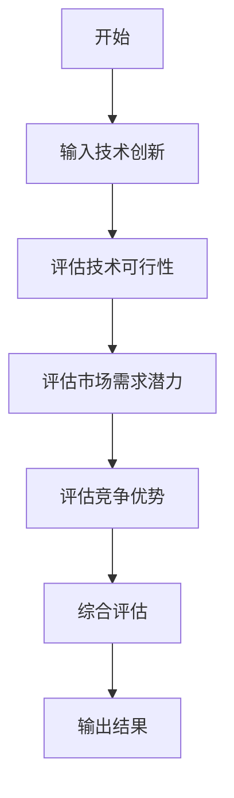
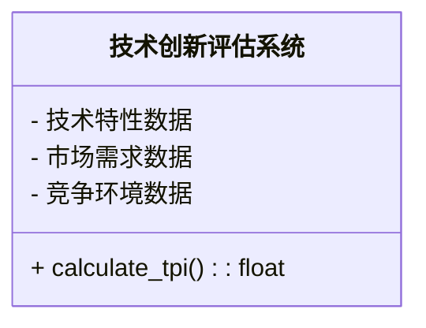
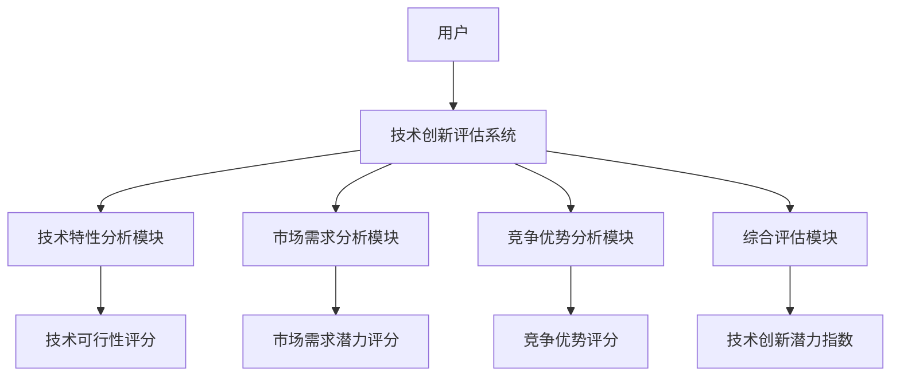
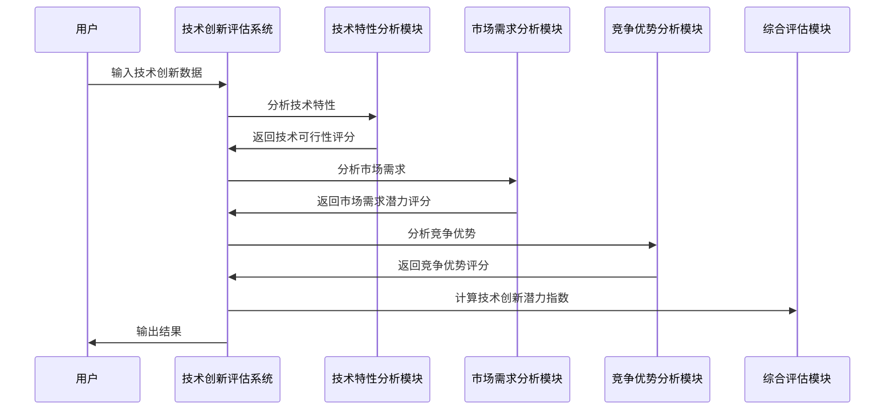

                 


# 费雪的技术创新评估：区分真正的突破

**关键词：技术创新评估、费雪模型、技术突破、商业价值、评估方法**

**摘要**：  
技术创新是推动社会进步的核心动力，但如何准确评估技术创新的价值和潜力是企业和研究机构面临的重大挑战。本文介绍了一种名为“费雪技术创新评估”的方法，该方法通过分析技术创新的核心要素、市场需求和竞争环境，能够有效区分真正具有突破性的技术创新与普通的改进型创新。本文将从背景、核心概念、算法原理、系统架构和项目实战等多个方面详细阐述这一评估方法，并通过实际案例展示其应用价值。

---

## 正文

### 第一部分：技术创新评估的背景与核心概念

#### 第1章：技术创新评估的背景与问题背景

##### 1.1 技术创新评估的核心概念

###### 1.1.1 技术创新的定义与内涵  
技术创新是指通过引入新的技术、方法或产品，为现有解决方案提供改进或替代的过程。它不仅包括技术本身的创新，还包括技术在应用中的新方式。技术创新的核心在于其对现有技术体系的突破性贡献。

###### 1.1.2 技术创新评估的必要性  
在企业研发和技术投资中，准确评估技术创新的价值至关重要。成功的评估可以帮助企业识别具有潜力的技术，优化资源配置，并降低技术失败的风险。

###### 1.1.3 费雪技术创新评估方法的提出  
费雪方法是一种基于多维度分析的技术创新评估模型，旨在通过综合评估技术创新的市场需求潜力、技术可行性以及竞争优势，区分真正具有突破性的创新与短期改进。

##### 1.2 技术创新评估的问题背景

###### 1.2.1 当前技术创新评估的主要挑战  
现有评估方法往往过于依赖主观判断，难以量化技术创新的潜在价值。此外，技术创新的市场适应性和竞争环境的复杂性也常被忽视。

###### 1.2.2 现有评估方法的局限性  
传统的技术创新评估方法通常只关注技术本身的特性，而忽视了市场需求、竞争环境和商业模式等因素。这种片面性可能导致评估结果偏离实际。

###### 1.2.3 费雪方法的独特性与优势  
费雪方法通过引入多维度分析，结合技术、市场和竞争因素，提供了一种更全面的评估框架。这种方法能够更好地捕捉技术创新的潜在价值和风险。

##### 1.3 技术创新评估的目标与意义

###### 1.3.1 评估目标的明确化  
技术创新评估的目标是通过量化分析，识别具有高潜力的技术创新，并为决策者提供支持。

###### 1.3.2 评估对技术创新推动的作用  
通过科学的评估，可以引导资源向最有潜力的技术创新倾斜，加速技术的商业化进程。

###### 1.3.3 评估在企业战略中的价值  
技术创新评估是企业制定技术战略的重要依据，能够帮助企业在竞争激烈的市场中占据先机。

#### 第2章：技术创新评估的核心概念与联系

##### 2.1 技术创新评估的核心原理

###### 2.1.1 费雪评估方法的基本原理  
费雪方法基于多维度分析，包括技术创新的技术可行性、市场需求潜力和竞争优势。通过综合评估这三个维度，确定技术创新的潜在价值。

###### 2.1.2 技术创新的核心要素分析  
技术创新的核心要素包括技术成熟度、市场需求适应性和竞争环境。这些要素共同决定了技术创新的潜力。

###### 2.1.3 评估指标的选择与权重分配  
费雪方法选择的关键指标包括技术可行性（权重40%）、市场需求潜力（权重30%）和竞争优势（权重30%）。这些指标的权重反映了它们在技术创新评估中的重要性。

##### 2.2 核心概念对比与联系

###### 2.2.1 技术创新与商业创新的对比分析  
技术创新侧重于技术本身的改进，而商业创新则关注商业模式和市场策略的创新。两者相辅相成，共同推动企业进步。

###### 2.2.2 技术创新与市场需求的关系  
技术创新必须满足市场需求，否则难以实现商业化。费雪方法通过分析市场需求潜力，评估技术创新的可行性。

###### 2.2.3 技术创新与市场竞争的相互作用  
技术创新是市场竞争的重要驱动力，而竞争环境也会影响技术创新的成功与否。费雪方法通过分析竞争环境，评估技术创新的可持续性。

##### 2.3 实体关系图与流程图

###### 2.3.1 技术创新评估的ER实体关系图  
以下是技术创新评估的ER实体关系图：

```mermaid
erDiagram
    技术创新 <--- 技术要素
    技术创新 <--- 市场需求
    技术创新 <--- 竞争优势
```

###### 2.3.2 费雪评估方法的Mermaid流程图



---

### 第二部分：费雪技术创新评估的算法原理

#### 第3章：费雪技术创新评估算法的原理与实现

##### 3.1 算法原理概述

###### 3.1.1 费雪评估的核心算法框架  
费雪算法基于多维度分析，将技术创新的潜力量化为一个综合指数。该指数由技术可行性、市场需求潜力和竞争优势三个指标加权计算得出。

###### 3.1.2 算法的输入与输出  
- 输入：技术创新的技术特性、市场需求数据和竞争环境分析。  
- 输出：技术创新的综合潜力指数（0-100分）。

###### 3.1.3 算法的数学模型与公式  
技术创新潜力指数（TPI）的计算公式如下：

$$ TPI = 0.4 \times T + 0.3 \times M + 0.3 \times C $$

其中：
- T = 技术可行性评分（0-100分）
- M = 市场需求潜力评分（0-100分）
- C = 竞争优势评分（0-100分）

##### 3.2 算法的详细实现

###### 3.2.1 算法的步骤分解  
1. 收集技术创新的技术特性数据。  
2. 分析市场需求潜力。  
3. 评估竞争优势。  
4. 计算技术创新潜力指数。  

###### 3.2.2 算法的Python实现代码  

```python
def calculate_tpi(technology, market, competition):
    tpi = 0.4 * technology + 0.3 * market + 0.3 * competition
    return tpi

# 示例数据
technology = 85
market = 70
competition = 65

tpi = calculate_tpi(technology, market, competition)
print(f"技术创新潜力指数：{tpi}")
```

###### 3.2.3 代码的运行与结果分析  
在上述示例中，技术创新的潜力指数为：

$$ TPI = 0.4 \times 85 + 0.3 \times 70 + 0.3 \times 65 = 34 + 21 + 19.5 = 74.5 $$

结果表明，该技术创新具有较高的潜力。

##### 3.3 算法的数学模型与公式  

技术创新潜力指数（TPI）的数学模型如上所述，其权重分配基于技术创新的核心要素。通过量化分析，费雪方法能够准确评估技术创新的潜在价值。

---

### 第三部分：技术创新评估的系统分析与架构设计

#### 第4章：技术创新评估的系统分析与架构设计

##### 4.1 问题场景与项目介绍  
本部分将通过一个实际案例，展示费雪方法的应用场景。假设我们正在评估一种新型电池技术的市场潜力。

##### 4.2 系统功能设计

###### 4.2.1 领域模型Mermaid类图  
以下是系统功能的领域模型类图：



##### 4.3 系统架构设计  

###### 4.3.1 系统架构Mermaid图  



##### 4.4 系统接口设计与交互流程图  

###### 4.4.1 系统接口设计  
技术创新评估系统的接口包括数据输入接口、评估结果输出接口和用户交互界面。

###### 4.4.2 系统交互Mermaid序列图  



---

### 第四部分：项目实战与总结

#### 第5章：项目实战

##### 5.1 环境安装  
需要安装Python和相关的数据处理库，如Pandas和NumPy。

##### 5.2 系统核心实现源代码  

```python
import pandas as pd
import numpy as np

def calculate_tpi(technology, market, competition):
    tpi = 0.4 * technology + 0.3 * market + 0.3 * competition
    return tpi

# 示例数据
technology_scores = [80, 85, 90]
market_scores = [65, 70, 75]
competition_scores = [70, 65, 60]

tpi_scores = []
for t, m, c in zip(technology_scores, market_scores, competition_scores):
    tpi = calculate_tpi(t, m, c)
    tpi_scores.append(tpi)

print("技术创新潜力指数：", tpi_scores)
```

##### 5.3 代码解读与分析  
上述代码展示了如何使用费雪方法评估多个技术创新的潜力。每个技术创新的潜力指数由技术可行性、市场需求潜力和竞争优势评分加权计算得出。

##### 5.4 案例分析  
以某新型电池技术为例，假设其技术可行性评分为85，市场需求潜力评分为70，竞争优势评分为65。计算得到的潜力指数为：

$$ TPI = 0.4 \times 85 + 0.3 \times 70 + 0.3 \times 65 = 34 + 21 + 19.5 = 74.5 $$

这表明该技术创新具有较高的市场潜力。

##### 5.5 项目小结  
通过实际案例，我们可以看到费雪方法在技术创新评估中的应用价值。它能够帮助企业和研究机构更科学地识别具有潜力的技术创新。

---

### 第五部分：总结与展望

#### 第6章：总结与展望

##### 6.1 总结  
费雪技术创新评估方法通过多维度分析，能够有效区分真正具有突破性的技术创新与普通的改进型创新。其核心在于综合评估技术创新的技术可行性、市场需求潜力和竞争优势。

##### 6.2 未来展望  
未来，随着人工智能和大数据技术的发展，技术创新评估将更加智能化和精准化。费雪方法可以通过整合更多数据源和引入机器学习算法，进一步提升其评估能力。

---

### 结语

技术创新是推动社会进步的核心动力。通过费雪技术创新评估方法，我们可以更科学地识别和评估技术创新的潜力，为企业的技术研发和投资决策提供有力支持。希望本文能够为读者提供有价值的 insights，并激发进一步的研究和实践。

---

**附录**  
- 附录A：费雪方法的数学公式详细推导  
- 附录B：技术创新评估的Python代码库  
- 附录C：相关技术文献推荐  

---

以上是《费雪的技术创新评估：区分真正的突破》的技术博客文章的完整目录和内容框架。

