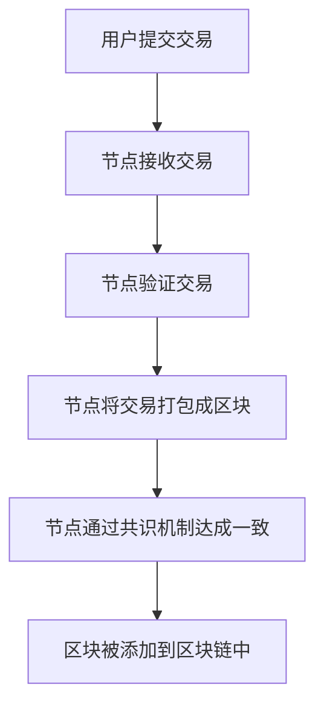

                 


# 费雪的技术创新评估：区块链技术的投资潜力分析

## 关键词：区块链，技术创新，投资潜力，共识机制，哈希函数，智能合约，去中心化

## 摘要：  
区块链技术作为一种革命性的分布式账本技术，正在迅速改变多个行业的运作方式。本文通过费雪的技术创新评估框架，深入分析区块链技术的核心原理、创新点及其投资潜力。文章从区块链的基本概念、技术创新评估的核心要素、算法原理、系统架构设计、项目实战以及投资策略等方面展开，旨在为投资者和技术创新者提供有价值的分析和建议。通过对区块链技术的全面解读，本文将帮助读者更好地理解其投资潜力，并为未来的技术创新提供方向。

---

## 第1章: 区块链技术概述

### 1.1 区块链的基本概念

#### 1.1.1 区块链的定义与特点
区块链是一种分布式账本技术，通过去中心化的方式记录和验证数据，确保数据的不可篡改性和透明性。其特点包括去中心化、不可篡改、透明性、安全性高和高效性。

#### 1.1.2 区块链的核心技术原理
区块链的核心技术包括去中心化、共识机制、哈希函数和加密算法。去中心化确保了数据的分布式存储，共识机制保证了所有节点对数据的一致性达成协议，哈希函数提供了数据的唯一标识，而加密算法则保证了数据的安全性。

#### 1.1.3 区块链与传统数据库的对比分析
与传统数据库相比，区块链具有去中心化、不可篡改和透明性等特点，能够有效避免数据篡改和单点故障问题。

### 1.2 区块链的技术架构

#### 1.2.1 分布式账本技术
分布式账本通过多个节点共同维护一个账本，确保数据的一致性和安全性。

#### 1.2.2 共识机制的实现原理
共识机制是区块链的核心技术之一，常见的共识机制包括工作量证明（PoW）、权益证明（PoS）和拜占庭容错（BFT）。这些机制通过不同的方式确保网络中的节点能够达成一致。

#### 1.2.3 加密算法与安全性分析
区块链中的加密算法（如RSA、椭圆曲线加密）用于保护数据的安全性，防止数据被篡改或泄露。

### 1.3 区块链的分类与应用场景

#### 1.3.1 公有链、私有链与联盟链的区别
公有链是任何人都可以参与的区块链，私有链仅限于特定组织内部使用，联盟链则由多个机构共同管理。

#### 1.3.2 区块链在金融、供应链等领域的应用实例
区块链在金融领域的应用包括跨境支付、智能合约；在供应链领域的应用包括货物追踪和溯源。

#### 1.3.3 区块链技术的创新潜力分析
区块链技术的创新潜力主要体现在智能合约、去中心化金融（DeFi）和物联网等领域。

### 1.4 区块链技术的经济价值

#### 1.4.1 区块链技术对投资的影响
区块链技术的广泛应用可能对现有金融体系和商业模式产生深远影响，为投资者带来新的投资机会。

#### 1.4.2 区块链技术的市场潜力与投资机会
随着区块链技术的成熟，市场对区块链相关技术和应用的需求将大幅增加，投资潜力巨大。

#### 1.4.3 区块链技术的长期发展趋势
区块链技术的长期发展趋势包括技术的不断优化、应用领域的拓展以及与其他前沿技术的融合。

---

## 第2章: 技术创新评估的核心概念

### 2.1 技术创新评估的基本框架

#### 2.1.1 技术创新的定义与内涵
技术创新是指在现有技术基础上，通过改进或创新，提出新的技术解决方案或模式。

#### 2.1.2 技术创新评估的指标体系
技术创新评估的指标体系包括技术可行性、商业模式创新性、市场接受度和潜在投资回报率等。

#### 2.1.3 技术创新与投资潜力的关系
技术创新是投资潜力的重要组成部分，技术创新越强，项目的投资潜力越大。

### 2.2 区块链技术创新的核心要素

#### 2.2.1 技术可行性分析
技术可行性分析包括技术的成熟度、实现难度和潜在风险。

#### 2.2.2 商业模式创新
商业模式创新是区块链技术成功应用的关键，包括如何通过区块链技术创造新的商业价值。

#### 2.2.3 市场接受度与用户需求
市场接受度和用户需求是区块链技术创新能否成功的重要因素，需要通过市场调研和用户反馈来评估。

### 2.3 技术创新评估的方法与工具

#### 2.3.1 技术评估矩阵
技术评估矩阵是一种通过多维度指标对技术进行评估的方法。

#### 2.3.2 技术生命周期分析
技术生命周期分析可以帮助评估技术创新的成熟度和潜在价值。

#### 2.3.3 技术风险评估模型
技术风险评估模型用于分析技术创新可能面临的风险，并制定相应的应对策略。

---

## 第3章: 区块链技术创新的核心算法与数学模型

### 3.1 共识机制的算法原理

#### 3.1.1 工作量证明（PoW）算法
工作量证明是一种通过计算哈希值来验证区块的算法，常见于比特币等区块链系统。

#### 3.1.2 权益证明（PoS）算法
权益证明是一种通过持有代币的数量来决定验证区块的权力的算法，相比PoW更加高效和节能。

#### 3.1.3 拜占庭容错（BFT）算法
拜占庭容错是一种通过投票机制达成共识的算法，适用于节点较少的区块链系统。

### 3.2 区块链加密算法的数学模型

#### 3.2.1 哈希函数的数学原理
哈希函数是一种将任意长度的输入映射为固定长度输出的函数，常用于数据的唯一标识。

#### 3.2.2 加密算法的安全性分析
加密算法的安全性取决于密钥的长度和算法的复杂性，常用的加密算法包括AES和RSA。

#### 3.2.3 数学模型在区块链中的应用
数学模型在区块链中的应用包括哈希函数的设计、加密算法的实现以及共识机制的优化。

### 3.3 区块链算法的实现与代码示例

#### 3.3.1 使用mermaid绘制共识机制流程图


#### 3.3.2 Python代码实现简单区块链系统
```python
import hashlib

class Block:
    def __init__(self, index, timestamp, data, previous_hash):
        self.index = index
        self.timestamp = timestamp
        self.data = data
        self.previous_hash = previous_hash
        self.hash = self.compute_hash()

    def compute_hash(self):
        return hashlib.sha256(str(self.index) + str(self.timestamp) + str(self.data) + str(self.previous_hash)).hexdigest()

# 创建区块链
def create_block_chain():
    genesis_block = Block(0, "2023-01-01", "Genesis Block", "0")
    print("Genesis Block Hash:", genesis_block.hash)
    return genesis_block

# 运行区块链系统
create_block_chain()
```

---

## 第4章: 区块链投资分析系统的系统分析与架构设计

### 4.1 系统应用场景

#### 4.1.1 投资者如何通过区块链技术进行投资分析
投资者可以通过区块链技术分析交易数据、智能合约的执行情况以及项目的透明度。

#### 4.1.2 区块链技术在投资分析中的优势
区块链技术能够提供透明的数据记录、高效的交易处理和安全的数据存储，为投资分析提供有力支持。

### 4.2 系统功能设计

#### 4.2.1 领域模型设计
```mermaid
classDiagram
    class 区块链投资分析系统 {
        + 数据采集模块
        + 数据存储模块
        + 数据分析模块
        + 用户界面模块
    }
    区块链投资分析系统 -> 数据采集模块: 采集区块链数据
    数据采集模块 -> 数据存储模块: 存储数据
    数据存储模块 -> 数据分析模块: 分析数据
    数据分析模块 -> 用户界面模块: 显示结果
```

#### 4.2.2 系统架构设计


### 4.3 系统接口设计

#### 4.3.1 数据接口设计
系统需要提供数据接口，用于与其他区块链节点或数据源进行交互。

#### 4.3.2 API设计
系统提供RESTful API接口，供其他系统或应用程序调用区块链投资分析数据。

### 4.4 系统交互设计

#### 4.4.1 使用mermaid绘制系统交互序列图
```mermaid
sequenceDiagram
    用户 --> 数据采集模块: 请求数据
    数据采集模块 --> 数据存储模块: 存储数据
    数据存储模块 --> 数据分析模块: 分析数据
    数据分析模块 --> 用户界面模块: 显示结果
    用户 <-- 用户界面模块: 结果
```

---

## 第5章: 区块链投资分析系统的项目实战

### 5.1 环境安装与配置

#### 5.1.1 安装Python与相关库
安装Python和必要的库（如 hashlib、requests）。

#### 5.1.2 安装区块链开发框架
可以选择安装Solidity（智能合约开发）、Web3.py（以太坊开发框架）等工具。

### 5.2 系统核心功能实现

#### 5.2.1 数据采集模块实现
编写代码采集区块链上的交易数据。

#### 5.2.2 数据分析模块实现
通过数据分析模块对采集的数据进行处理和分析，生成投资分析报告。

### 5.3 项目实战案例分析

#### 5.3.1 智能合约的实现与分析
编写智能合约并部署到以太坊测试网络，分析其运行情况。

#### 5.3.2 投资策略的制定与实施
根据区块链数据分析结果，制定投资策略并实施。

### 5.4 项目小结

#### 5.4.1 项目实现的关键点
智能合约的编写、数据采集与分析模块的实现、系统架构设计等。

#### 5.4.2 项目中的问题与解决方案
数据采集延迟、数据存储效率低下等问题，以及相应的优化方案。

---

## 第6章: 区块链技术投资的最佳实践

### 6.1 投资策略建议

#### 6.1.1 理性投资与风险控制
投资者应保持理性，避免盲目跟风，注重风险控制。

#### 6.1.2 关注技术创新与应用场景
投资时应关注区块链项目的技术创新和实际应用场景。

#### 6.1.3 长期持有与价值挖掘
区块链技术的长期价值巨大，投资者应注重长期持有优质项目。

### 6.2 注意事项与风险提示

#### 6.2.1 技术风险
区块链技术尚处于发展阶段，存在技术不成熟和安全性问题。

#### 6.2.2 市场风险
区块链市场波动较大，投资者需警惕市场风险。

#### 6.2.3 法律风险
不同国家和地区对区块链技术的法律法规不同，投资者需关注相关政策。

### 6.3 拓展阅读

#### 6.3.1 推荐书籍与文章
推荐一些优秀的区块链技术书籍和文章，供读者深入学习。

#### 6.3.2 技术社区与论坛
加入区块链技术社区和论坛，与其他技术爱好者交流经验。

---

## 第7章: 结语

### 7.1 总结
区块链技术作为一种革命性的技术，具有广阔的投资潜力。通过技术创新评估，投资者可以更好地识别和选择优质的区块链项目。

### 7.2 展望
随着技术的不断进步和应用的不断拓展，区块链技术将在更多领域发挥重要作用，技术创新评估也将成为投资决策的重要工具。

### 7.3 致谢
感谢读者的耐心阅读和对区块链技术的支持。

---

通过以上内容，我们对区块链技术的投资潜力有了全面的了解。从技术创新评估到实际应用案例分析，再到系统的实现与优化，区块链技术的投资潜力分析为我们提供了丰富的视角和方法。希望本文能够为投资者和技术创新者提供有价值的参考和启发。

