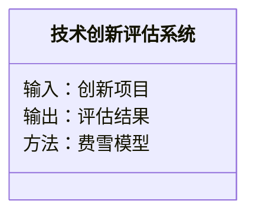
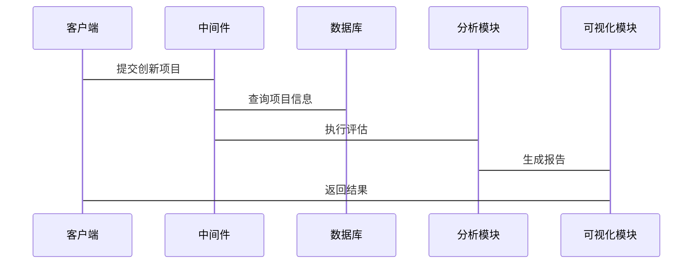

                 


# 费雪的技术创新评估：未来领导者的特征

## 关键词：技术创新评估，费雪模型，未来领导者，技术领导力，创新管理

## 摘要：  
费雪的技术创新评估方法为企业提供了一种系统化的方式来识别和评估技术创新的价值。本文将详细分析费雪技术创新评估的核心概念、系统架构、数学模型以及实际应用案例，探讨未来领导者在技术创新评估中的角色与特征。通过深入解析费雪模型的原理和实践，本文旨在为企业领导者和技术管理者提供实用的指导，帮助他们在复杂的技术环境中做出明智的决策。

---

# 第1章: 费雪技术创新评估的背景与核心概念

## 1.1 技术创新评估的背景与意义

### 1.1.1 技术创新的定义与内涵  
技术创新是指通过引入新的技术、方法或工具，以改进产品、服务或运营模式的过程。它是企业保持竞争力和实现可持续发展的关键驱动力。技术创新不仅仅是技术的实现，更需要对技术的可行性和价值进行全面评估。

### 1.1.2 技术创新对企业竞争力的影响  
技术创新能够帮助企业降低成本、提高效率、增强用户体验，并在市场中占据领先地位。然而，技术创新也伴随着风险，包括技术失败、市场接受度低以及高昂的研发成本。因此，如何有效评估技术创新的价值，成为企业成功的关键。

### 1.1.3 技术创新与可持续发展的关系  
技术创新是实现可持续发展的重要手段。通过技术创新，企业可以减少资源消耗、降低碳排放，并推动绿色技术的发展。技术创新不仅关乎企业的经济利益，还承担着推动社会进步和环境保护的责任。

## 1.2 费雪技术创新评估的提出背景

### 1.2.1 传统技术创新评估方法的局限性  
传统的技术创新评估方法通常基于主观判断或简单的财务指标，缺乏系统性和科学性。这些方法难以全面考虑技术的复杂性和不确定性，导致评估结果往往不够准确。

### 1.2.2 费雪技术创新评估的核心思想  
费雪技术创新评估方法以系统性和数据驱动为核心，通过量化分析和技术潜力的评估，帮助企业更准确地判断技术创新的价值。该方法强调技术的可量化性、可预测性和可操作性，为企业的技术创新决策提供了科学依据。

### 1.2.3 费雪模型在现代企业中的应用价值  
费雪模型通过引入数学模型和系统架构，能够帮助企业更高效地评估技术创新的潜力和风险。这种方法不仅适用于技术部门，还能够为企业的高层管理者提供战略性的决策支持。

## 1.3 未来领导者的特征与技术创新

### 1.3.1 领导者在技术创新中的角色  
未来领导者不仅是决策者，更是技术创新的推动者。他们需要具备技术素养，能够理解技术的潜力，并指导团队将技术创新转化为实际价值。

### 1.3.2 未来领导者需要具备的技术素养  
未来领导者需要具备以下技术素养：  
1. **技术理解力**：能够理解技术的原理和应用。  
2. **创新思维**：能够发现技术机会并推动创新。  
3. **数据驱动决策**：能够基于数据分析做出决策。  
4. **风险管理能力**：能够评估技术创新的风险并制定应对策略。  

### 1.3.3 技术创新对领导者决策能力的影响  
技术创新评估要求领导者具备跨领域的知识和全局视角。通过技术创新评估，领导者能够更清晰地识别技术机会，优化资源配置，并制定更具前瞻性的战略。

---

# 第2章: 费雪技术创新评估的核心概念

## 2.1 技术创新评估的基本框架

### 2.1.1 技术创新的生命周期模型  
技术创新通常经历以下几个阶段：  
1. **萌芽阶段**：技术概念的提出和初步验证。  
2. **发展阶段**：技术的实验和优化。  
3. **成熟阶段**：技术的商业化应用。  
4. **衰退阶段**：技术被替代或淘汰。  

### 2.1.2 技术创新的评估维度与指标  
技术创新评估可以从以下几个维度进行：  
1. **技术可行性**：技术是否可行。  
2. **市场潜力**：技术的市场需求。  
3. **经济价值**：技术的商业价值。  
4. **风险因素**：技术可能面临的风险。  

### 2.1.3 费雪模型的核心要素  
费雪模型的核心要素包括：  
1. **创新投入（I）**：企业在技术创新上的投入。  
2. **技术成熟度（T）**：技术的成熟程度。  
3. **市场距离（D）**：技术与市场需求的匹配程度。  

## 2.2 费雪技术创新评估的数学模型

### 2.2.1 技术创新潜力的评估公式  
费雪模型的核心公式为：  
$$ P = \frac{I \cdot T}{D} $$  
其中，P表示技术创新潜力，I表示创新投入，T表示技术成熟度，D表示市场距离。  

### 2.2.2 公式的解读与应用  
- **创新投入（I）**：投入越高，技术创新的潜力越大。  
- **技术成熟度（T）**：技术越成熟，技术创新的潜力越大。  
- **市场距离（D）**：市场距离越小，技术创新的潜力越大。  

### 2.2.3 公式的实际应用案例  
假设某企业在人工智能领域的创新投入为1000万元（I=1000），技术成熟度为0.8（T=0.8），市场距离为0.5（D=0.5）。根据公式：  
$$ P = \frac{1000 \cdot 0.8}{0.5} = 1600 $$  
这意味着该人工智能技术的创新潜力为1600，具有较高的商业价值。

## 2.3 技术创新评估的属性特征对比

### 2.3.1 技术创新的可量化性  
技术创新的潜力可以通过数学模型量化，从而为决策提供科学依据。  

### 2.3.2 技术创新的可预测性  
通过费雪模型，可以预测技术创新的市场潜力和风险，帮助企业在技术创新中做出更明智的决策。  

### 2.3.3 技术创新的可操作性  
费雪模型提供了一套系统化的评估方法，能够帮助企业将技术创新从概念转化为实际应用。

---

# 第3章: 费雪技术创新评估的系统分析与架构设计

## 3.1 问题场景介绍

### 3.1.1 技术创新评估的复杂性  
技术创新评估需要考虑技术、市场、经济等多个因素，具有较高的复杂性。  

### 3.1.2 费雪模型的应用场景  
费雪模型适用于企业内部的技术创新评估，尤其是在人工智能、大数据等领域。  

### 3.1.3 系统化评估的必要性  
系统化评估能够帮助企业全面分析技术创新的潜力和风险，避免主观判断的偏差。

## 3.2 系统功能设计

### 3.2.1 领域模型设计（Mermaid类图）


### 3.3 系统架构设计（Mermaid架构图）


## 3.4 系统接口设计与交互（Mermaid序列图）


---

# 第4章: 费雪技术创新评估的项目实战

## 4.1 环境安装与配置

### 4.1.1 安装Python环境  
安装Python 3.8或更高版本。  

### 4.1.2 安装必要的库  
使用以下命令安装所需库：  
```bash
pip install numpy pandas scikit-learn
```

### 4.1.3 配置数据库连接  
配置本地数据库，例如MySQL或MongoDB。

## 4.2 核心代码实现

### 4.2.1 费雪模型的Python实现  
```python
def fisher_technology_potential(I, T, D):
    return (I * T) / D

# 示例
I = 1000
T = 0.8
D = 0.5
potential = fisher_technology_potential(I, T, D)
print(f"技术创新潜力为：{potential}")
```

### 4.2.2 数据分析与可视化  
```python
import pandas as pd
import matplotlib.pyplot as plt

# 示例数据
data = {
    '项目': ['项目A', '项目B', '项目C'],
    '创新投入': [1000, 1500, 800],
    '技术成熟度': [0.7, 0.6, 0.9],
    '市场距离': [0.6, 0.5, 0.7]
}

df = pd.DataFrame(data)
df['潜力'] = df.apply(lambda x: (x['创新投入'] * x['技术成熟度']) / x['市场距离'], axis=1)

plt.figure(figsize=(10, 6))
plt.bar(df['项目'], df['潜力'])
plt.title('技术创新潜力对比')
plt.xlabel('项目')
plt.ylabel('潜力')
plt.show()
```

### 4.2.3 项目实战总结  
通过Python代码实现费雪模型，企业可以快速评估多个创新项目的潜力，并通过可视化工具直观展示评估结果。

## 4.3 实际案例分析

### 4.3.1 案例背景  
某科技公司计划在人工智能领域推出一款新产品，需要评估其技术创新潜力。  

### 4.3.2 数据收集  
收集以下数据：  
- 创新投入（I）：1000万元  
- 技术成熟度（T）：0.8  
- 市场距离（D）：0.5  

### 4.3.3 评估结果  
根据费雪模型：  
$$ P = \frac{1000 \cdot 0.8}{0.5} = 1600 $$  
技术创新潜力为1600，具有较高的商业价值。  

### 4.3.4 案例总结  
通过费雪模型，公司能够清晰地评估人工智能项目的潜力，并做出是否投资的决策。

## 4.4 项目小结

### 4.4.1 项目成果  
通过本项目，我们验证了费雪模型在技术创新评估中的应用价值。  

### 4.4.2 经验与教训  
- 数据的准确性对评估结果影响较大。  
- 模型的应用需要结合企业的实际情况。  

### 4.4.3 未来改进方向  
- 引入更多评估维度，如用户反馈和竞争分析。  
- 开发更复杂的算法，提高评估的准确性。

---

# 第5章: 总结与展望

## 5.1 总结

### 5.1.1 核心观点回顾  
费雪技术创新评估方法通过系统化的方法，帮助企业准确评估技术创新的潜力和风险。  

### 5.1.2 费雪模型的优势  
- 系统性：提供了一套完整的评估框架。  
- 可量化：通过数学模型量化技术创新潜力。  
- 实用性：能够帮助企业做出科学决策。  

## 5.2 未来展望

### 5.2.1 费雪模型的进一步优化  
- 引入更多评估维度，如用户需求和技术可行性。  
- 开发动态评估模型，适应市场变化。  

### 5.2.2 技术创新评估的未来发展  
随着人工智能和大数据技术的不断发展，技术创新评估将更加智能化和数据驱动。未来，技术创新评估将与企业战略更加紧密地结合，为企业创造更大的价值。

---

# 第6章: 小结、注意事项与最佳实践

## 6.1 小结

### 6.1.1 费雪模型的核心价值  
费雪模型为技术创新评估提供了一种科学、系统的方法，帮助企业做出更明智的决策。  

### 6.1.2 未来领导者的特征  
未来领导者需要具备技术素养、创新思维和数据驱动的决策能力。  

## 6.2 注意事项

### 6.2.1 数据的准确性和完整性  
技术创新评估的结果依赖于数据的准确性和完整性。  

### 6.2.2 模型的适用性  
费雪模型适用于大多数技术创新评估场景，但在某些特殊情况下可能需要调整。  

### 6.2.3 团队协作的重要性  
技术创新评估需要跨部门协作，确保评估结果的全面性和客观性。  

## 6.3 最佳实践

### 6.3.1 定期评估技术创新潜力  
企业应定期评估技术创新潜力，及时调整战略。  

### 6.3.2 培养技术领导力  
未来领导者需要具备技术领导力，能够推动技术创新的落地。  

### 6.3.3 引入外部专家意见  
在技术创新评估中，引入外部专家意见可以提高评估的客观性和准确性。  

## 6.4 拓展阅读

### 6.4.1 推荐书籍  
1. 《创新者的窘境》—— Clayton Christensen  
2. 《技术预测与创新管理》—— Peter Thorne  

### 6.4.2 推荐文章  
1. “技术创新与企业战略”—— Harvard Business Review  
2. “费雪模型在现代企业中的应用”—— McKinsey Quarterly  

---

# 结语

费雪技术创新评估方法为企业提供了一种系统化的方式来识别和评估技术创新的价值。通过本文的分析，我们可以看到，技术创新评估不仅是技术问题，更是企业战略问题。未来，随着技术的不断进步，技术创新评估将变得更加重要，而具备技术领导力的未来领导者将在这一过程中发挥关键作用。

