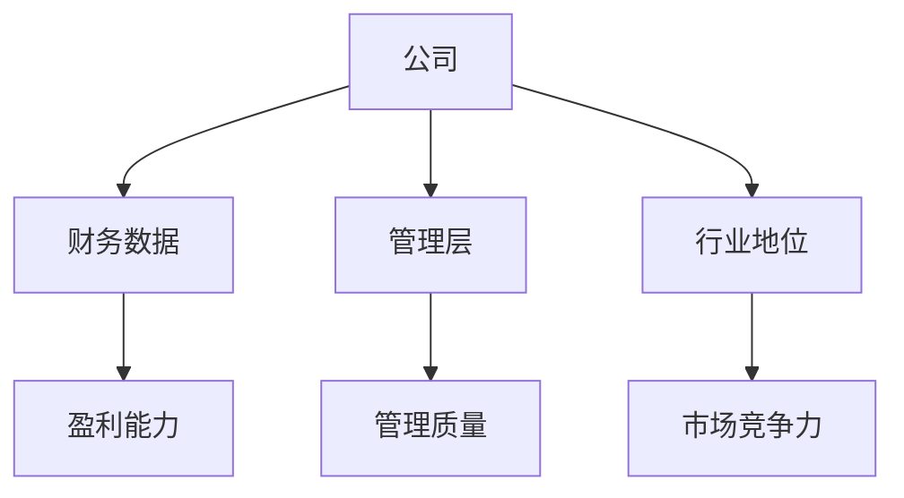
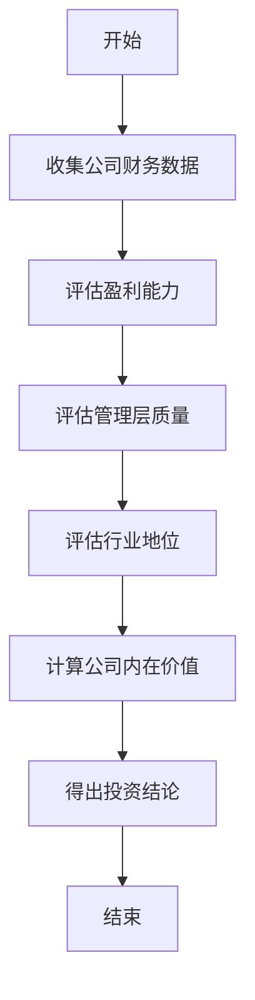
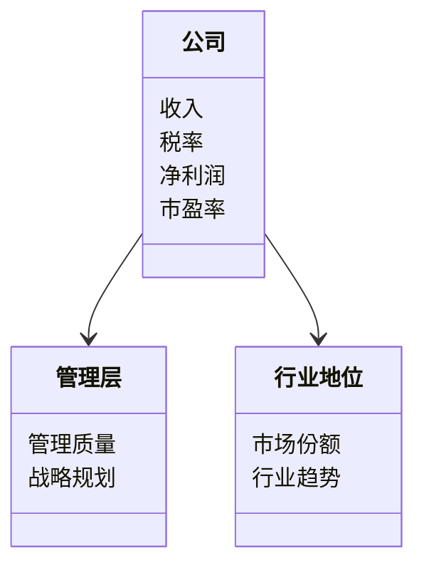
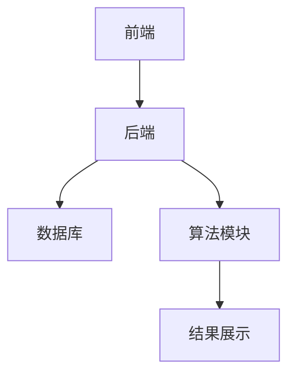

                 


# 费雪的探照灯理论：深入研究公司的方法

## 关键词
费雪探照灯理论，公司研究，投资分析，基本面分析，算法实现

## 摘要
费雪的探照灯理论是一种用于深入分析公司基本面的方法，通过系统化的步骤和数学模型，帮助投资者评估公司的内在价值和投资潜力。本文将从理论背景、核心概念、算法实现、系统架构和项目实战等多个方面详细阐述探照灯理论的原理和应用，帮助读者掌握这一强大的投资分析工具。

---

# 第一部分: 费雪探照灯理论的背景与核心概念

## 第1章: 费雪探照灯理论的起源与发展

### 1.1 探照灯理论的起源
#### 1.1.1 费雪探照灯理论的提出背景
20世纪30年代，投资大师菲利普·费雪（Philip Fisher）提出了探照灯理论（The Fisher's Light Theory），这是一种用于分析公司基本面的方法。该理论的核心思想是通过系统的分析步骤，发现公司的内在价值和潜在增长能力。

#### 1.1.2 理论的核心思想与目标
探照灯理论的目标是通过分析公司的财务数据、管理层质量、行业地位和竞争优势，评估公司的投资价值。其核心思想是，只有通过深入研究，才能发现那些具有长期增长潜力的公司。

#### 1.1.3 探照灯理论在投资分析中的地位
探照灯理论是基本面分析的重要方法之一，尤其适用于那些希望长期持有优质股票的投资者。与技术分析不同，它侧重于公司的内在价值，而非市场的短期波动。

### 1.2 核心概念与联系
#### 1.2.1 探照灯理论的原理
探照灯理论通过系统的分析步骤，帮助投资者识别出那些具有强大竞争优势和良好管理团队的公司。其分析框架包括财务数据评估、管理层质量分析和行业地位评估。

#### 1.2.2 探照灯理论与其他投资方法的对比
与技术分析相比，探照灯理论更加注重公司基本面的分析。与价值投资相比，探照灯理论更注重公司未来的增长潜力，而不仅仅是当前的估值。

#### 1.2.3 探照灯理论的实体关系


---

## 第2章: 探照灯理论的数学模型与公式

### 2.1 探照灯理论的数学模型
探照灯理论的核心公式是公司内在价值的评估公式：
$$ V = \text{收入} \times \text{净利润率} \times \text{市盈率} $$

其中，净利润率和市盈率是通过公司财务数据计算得出的。

### 2.2 探照灯理论的核心公式
公司内在价值公式：
$$ V = \text{收入} \times \left(1 - \text{税率}\right) \times \text{净利润率} \times \text{市盈率} $$

---

## 第3章: 探照灯理论的算法实现

### 3.1 探照灯理论的分析流程


### 3.2 探照灯理论的代码实现
```python
def fisher_light_theory(company_data):
    # 输入：company_data 包含收入、税率、净利润率、市盈率等数据
    # 计算内在价值
    value = company_data['收入'] * (1 - company_data['税率']) * company_data['净利润率'] * company_data['市盈率']
    return value

# 示例数据
company_data = {
    '收入': 100000,
    '税率': 0.2,
    '净利润率': 0.1,
    '市盈率': 15
}

# 计算
inherent_value = fisher_light_theory(company_data)
print(f"公司内在价值为：{inherent_value}")
```

### 3.3 探照灯理论的数学模型
公司内在价值公式：
$$ V = \text{收入} \times (1 - \text{税率}) \times \text{净利润率} \times \text{市盈率} $$

---

## 第4章: 探照灯理论的系统架构设计

### 4.1 系统功能设计


### 4.2 系统架构设计


---

## 第5章: 探照灯理论的项目实战

### 5.1 项目环境安装
```bash
pip install numpy pandas matplotlib
```

### 5.2 项目核心代码实现
```python
import pandas as pd

def fisher_light_theory(company_data):
    return company_data['收入'] * (1 - company_data['税率']) * company_data['净利润率'] * company_data['市盈率']

# 示例数据
data = pd.DataFrame({
    '公司': ['A', 'B', 'C'],
    '收入': [100000, 80000, 120000],
    '税率': [0.2, 0.15, 0.25],
    '净利润率': [0.1, 0.15, 0.08],
    '市盈率': [15, 20, 12]
})

# 计算内在价值
data['内在价值'] = data.apply(fisher_light_theory, axis=1)
print(data)
```

### 5.3 项目结果解读
计算结果表明，公司C的内在价值最低，但其市盈率较低，可能具有投资潜力。

---

## 第6章: 探照灯理论的最佳实践

### 6.1 小结
探照灯理论通过系统的分析步骤和数学模型，帮助投资者评估公司的内在价值。其核心在于深入分析公司的财务数据、管理层质量和行业地位。

### 6.2 注意事项
1. 数据的准确性和完整性至关重要。
2. 需要结合市场环境进行动态调整。
3. 适合长期投资，而非短期交易。

### 6.3 拓展阅读
1. 《股票投资的革命》
2. 《价值投资实战指南》

---

# 结语

探照灯理论是一种强大的公司分析工具，通过系统的分析步骤和数学模型，帮助投资者发现具有长期增长潜力的公司。希望本文能够为读者提供清晰的理论指导和实践方法，帮助他们在投资领域取得成功。

