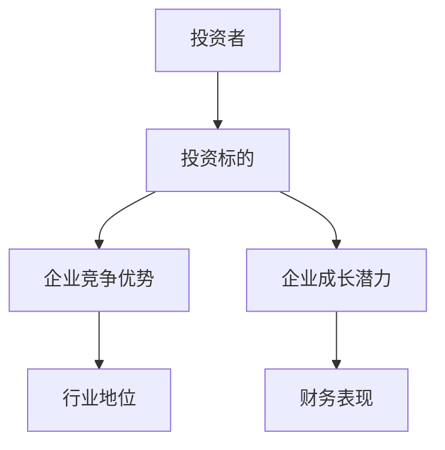
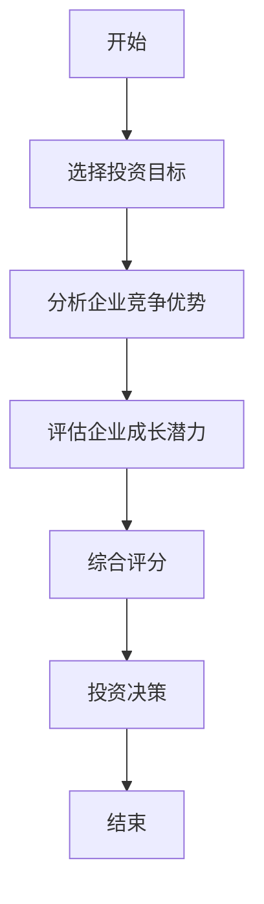
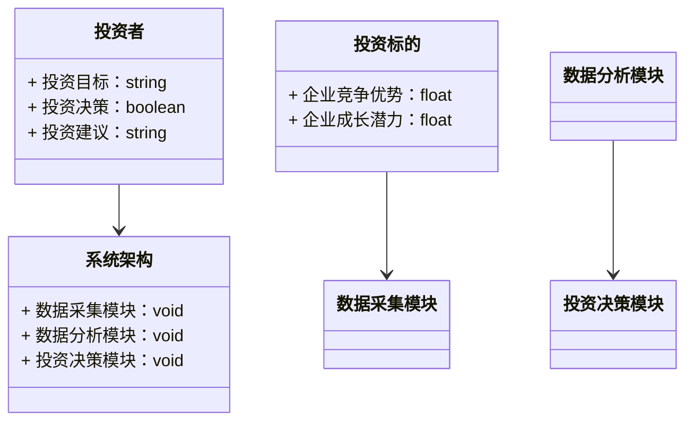
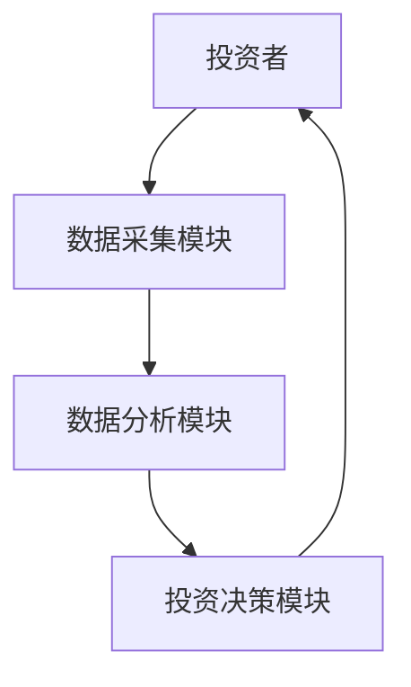
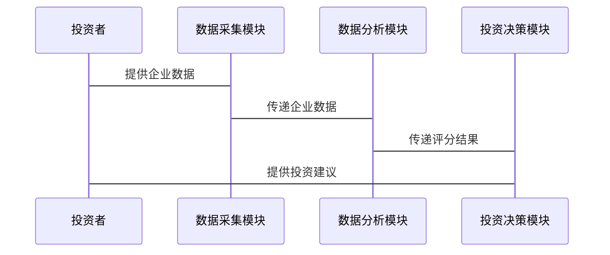

                 


# 费雪的探路者投资法：寻找未来的赢家

> 关键词：费雪投资法, 投资策略, 企业竞争优势, 成长潜力, 投资决策, 股票分析

> 摘要：本文深入分析了费雪的探路者投资法，探讨其核心理念、算法原理、系统架构及实际应用案例。通过详细讲解投资方法的数学模型和系统架构，帮助投资者掌握如何在复杂的投资环境中识别和选择具有长期竞争优势和成长潜力的企业，从而制定科学的投资策略。

---

# 第一部分：探路者投资法的背景与核心理念

## 第1章：投资环境的现状与挑战

### 1.1 当前投资环境的复杂性

#### 1.1.1 经济全球化与投资机会的多样性
- 全球化带来的投资机会：科技、医疗、绿色能源等领域的快速发展。
- 多元化的投资工具：股票、债券、基金、ETF等。

#### 1.1.2 传统投资方法的局限性
- 价值投资的局限：仅关注市盈率和市净率，忽视企业成长性。
- 技术分析的局限：依赖价格波动，缺乏对企业基本面的深入分析。

#### 1.1.3 投资者面临的挑战与困惑
- 信息过载：海量数据难以筛选。
- 短期波动与长期价值的平衡：如何在短期波动中把握长期趋势。

### 1.2 费雪投资法的起源与演变

#### 1.2.1 费雪投资法的提出背景
- 费雪的投资理念：注重企业成长，而非短期价格波动。
- 投资法的核心思想：选择具有竞争优势和成长潜力的企业。

#### 1.2.2 费雪投资法的核心思想
- 专注于企业基本面分析。
- 寻找具有可持续竞争优势的企业。

#### 1.2.3 费雪投资法与其他投资方法的对比
- 与价值投资的对比：价值投资关注价格与价值的偏离，而费雪投资法更关注企业的成长性。
- 与技术分析的对比：技术分析关注价格走势，而费雪投资法关注企业基本面。

### 1.3 探路者投资法的核心理念

#### 1.3.1 投资的本质与目标
- 投资的本质：通过分析企业基本面，选择具有长期竞争优势和成长潜力的企业。
- 投资的目标：实现资产的长期稳定增长。

#### 1.3.2 探路者投资法的核心原则
- 选择具有竞争优势的企业。
- 选择具有成长潜力的企业。
- 长期持有优质企业股票。

#### 1.3.3 探路者投资法的适用场景
- 适用于长期投资者。
- 适用于对企业发展有深入了解的投资者。

---

## 第2章：探路者投资法的核心概念与联系

### 2.1 核心概念原理

#### 2.1.1 投资标的的选择标准
- 企业的竞争优势：市场地位、技术优势、成本优势等。
- 企业的成长潜力：净利润增长率、营业收入增长率、研发投入占比等。

#### 2.1.2 企业竞争优势的分析
- 行业地位：企业的市场占有率和行业影响力。
- 技术创新：企业的研发投入和技术储备。
- 成本优势：企业的生产效率和成本控制能力。

#### 2.1.3 企业成长潜力的评估
- 市场需求：行业的增长空间和未来发展潜力。
- 管理能力：企业的管理团队和公司治理。
- 财务健康：企业的盈利能力、资产负债率和现金流状况。

### 2.2 核心概念属性特征对比表格

| 概念         | 属性特征 |
|--------------|----------|
| 企业竞争优势 | 独特性、可持续性、可扩展性 |
| 企业成长潜力 | 市场需求、管理能力、财务健康 |

### 2.3 ER实体关系图架构



---

## 第3章：探路者投资法的算法原理

### 3.1 算法原理流程图



### 3.2 算法数学模型与公式

#### 3.2.1 企业竞争优势评分模型
$$ \text{竞争优势评分} = \frac{(\text{行业地位} + \text{市场份额}) \times 0.5 + \text{技术创新能力} \times 0.3}{1} $$

#### 3.2.2 企业成长潜力评分模型
$$ \text{成长潜力评分} = \text{净利润增长率} \times 0.4 + \text{营业收入增长率} \times 0.3 + \text{研发投入占比} \times 0.3 $$

### 3.3 算法实现与案例分析

#### 3.3.1 投资标的选择与分析
- 选择具有竞争优势和成长潜力的企业。
- 通过数学模型对企业的竞争优势和成长潜力进行评分。

#### 3.3.2 投资决策的数学模型应用
- 通过公式计算企业的竞争优势评分和成长潜力评分。
- 根据评分结果进行投资决策。

#### 3.3.3 实际案例分析与总结
- 以某科技公司为例，计算其竞争优势评分和成长潜力评分。
- 根据评分结果，评估其是否符合探路者投资法的要求。

---

## 第4章：探路者投资法的系统分析与架构设计

### 4.1 问题场景介绍

#### 4.1.1 项目介绍
- 本项目旨在构建一个基于费雪探路者投资法的投资决策系统。

#### 4.1.2 系统功能设计
- 数据采集：收集企业的财务数据、行业数据和竞争数据。
- 数据分析：对企业竞争优势和成长潜力进行评分。
- 投资决策：根据评分结果，生成投资建议。

#### 4.1.3 领域模型（mermaid类图）



#### 4.1.4 系统架构设计（mermaid架构图）



#### 4.1.5 系统接口设计
- 数据采集模块接口：接受企业数据输入。
- 数据分析模块接口：接受企业数据，计算竞争优势评分和成长潜力评分。
- 投资决策模块接口：根据评分结果，生成投资建议。

#### 4.1.6 系统交互设计（mermaid序列图）



---

## 第5章：探路者投资法的项目实战

### 5.1 环境安装

#### 5.1.1 安装Python环境
- 使用Anaconda安装Python 3.8或更高版本。

#### 5.1.2 安装必要的Python库
- 导入必要的库：pandas、numpy、scikit-learn。

### 5.2 系统核心实现源代码

#### 5.2.1 数据采集模块
```python
import pandas as pd
import numpy as np

def collect_data(company_name):
    # 数据采集逻辑
    return pd.DataFrame({'行业地位': [np.nan], '市场份额': [np.nan], '技术创新能力': [np.nan]})
```

#### 5.2.2 数据分析模块
```python
def analyze_competition(company_data):
    # 竞争优势评分计算
    competition_score = (company_data['行业地位'] + company_data['市场份额']) * 0.5 + company_data['技术创新能力'] * 0.3
    return competition_score

def analyze_growth(company_data):
    # 成长潜力评分计算
    growth_score = company_data['净利润增长率'] * 0.4 + company_data['营业收入增长率'] * 0.3 + company_data['研发投入占比'] * 0.3
    return growth_score

def get_scores(company_data):
    competition_score = analyze_competition(company_data)
    growth_score = analyze_growth(company_data)
    return {'竞争

