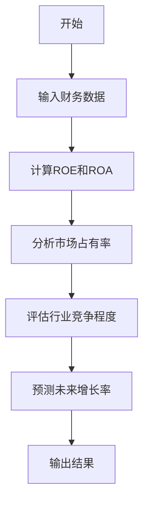
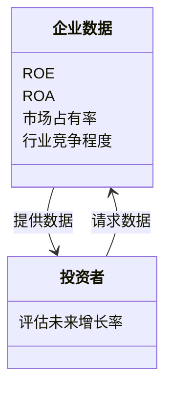
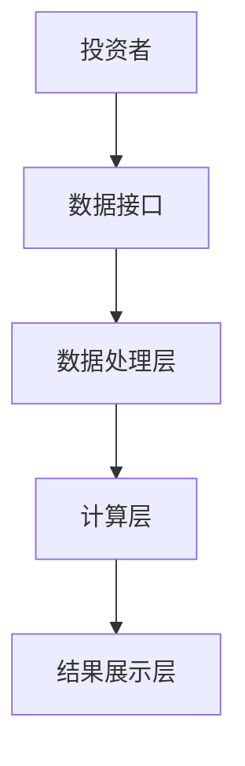
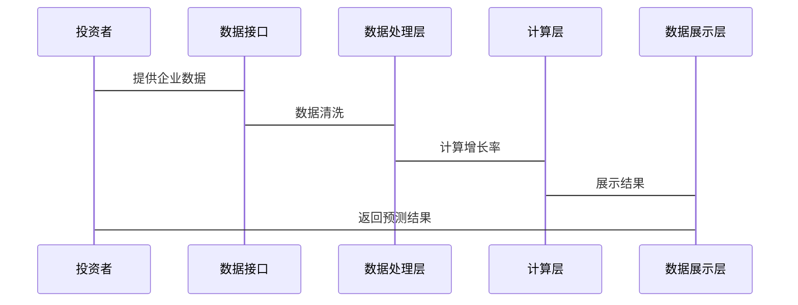

                 


# 费雪的未来增长潜力评估：看透当前财务数据

> 关键词：费雪模型，财务数据，增长潜力，投资评估，企业估值，数据分析

> 摘要：本文深入探讨了费雪的未来增长潜力评估方法，通过分析当前财务数据，揭示其对企业估值和投资决策的重要影响。文章详细介绍了费雪模型的核心原理、算法设计、系统架构，并通过实际案例展示了其应用价值。

---

# 第一部分: 费雪的未来增长潜力评估概述

## 第1章: 费雪模型的核心概念与背景

### 1.1 费雪模型的背景与问题背景

#### 1.1.1 传统财务分析的局限性
传统财务分析主要依赖历史数据，难以预测未来企业的增长潜力。例如，某公司过去三年的收入增长率分别为15%、12%、10%，但未来增长率可能因市场变化而波动。这种仅依赖历史数据的方法在投资决策中存在较大风险。

#### 1.1.2 未来增长潜力评估的重要性
企业未来的增长潜力是投资决策的关键因素。通过评估未来增长率，投资者可以更准确地判断企业的估值和投资价值。费雪模型通过分析当前财务数据，预测未来增长潜力，为投资决策提供科学依据。

#### 1.1.3 费雪模型的提出与目标
费雪模型由 Benjamin Graham 和 David Dodd 提出，旨在通过分析企业的财务数据，预测其未来的盈利能力和增长潜力。模型的核心在于识别那些具有可持续竞争优势和良好管理的企业，从而在投资中获得超额收益。

### 1.2 问题描述与解决方案

#### 1.2.1 企业财务数据的现状与挑战
企业的财务数据通常包括收入、利润、现金流等指标。然而，这些数据仅反映了过去的表现，无法直接预测未来。例如，一家企业过去三年的收入增长率为15%，但未来可能因市场需求变化而下降。

#### 1.2.2 未来增长潜力评估的核心问题
如何从当前财务数据中提取有效信息，预测企业的未来增长率？如何量化企业的竞争优势和管理能力？如何将这些因素转化为可量化的指标？

#### 1.2.3 费雪模型的解决方案与优势
费雪模型通过分析企业的财务比率、行业地位和管理层质量，预测其未来增长率。与传统财务分析相比，费雪模型更注重企业的内在价值和长期潜力。

### 1.3 费雪模型的边界与外延

#### 1.3.1 模型适用的行业与企业类型
费雪模型适用于成长型企业，尤其是那些具有持续竞争优势的企业。对于周期性行业或夕阳行业，模型的适用性较低。

#### 1.3.2 模型的局限性与适用场景
费雪模型的局限性包括对管理层质量的主观判断和对市场假设的依赖。因此，模型更适用于管理层质量较高且市场环境稳定的行业。

#### 1.3.3 模型的可扩展性与未来发展
费雪模型可以通过与其他模型结合，进一步提高预测精度。例如，结合情景分析和蒙特卡洛模拟，可以更好地应对不确定性。

### 1.4 概念结构与核心要素

#### 1.4.1 费雪模型的基本假设
- 企业的增长率与其当前财务比率相关；
- 企业的竞争优势和管理层质量影响其未来增长率；
- 市场环境对企业的增长率有重要影响。

#### 1.4.2 核心要素的定义与关系
- 财务比率：如ROE（净资产收益率）、ROA（资产回报率）；
- 行业地位：如市场占有率、竞争程度；
- 管理层质量：如管理层的经验和战略能力。

#### 1.4.3 模型的输入与输出
- 输入：企业的财务数据、行业信息、管理层信息；
- 输出：企业的未来增长率、内在价值。

---

## 第2章: 费雪模型的核心概念与联系

### 2.1 费雪模型的原理与计算方法

#### 2.1.1 费雪模型的基本原理
费雪模型通过分析企业的财务比率和行业地位，预测其未来增长率。例如，如果一家企业的ROE在过去几年持续增长，并且市场占有率逐步提高，可以推断其未来增长率较高。

#### 2.1.2 模型的核心公式
费雪模型的核心公式为：
$$
\text{未来增长率} = f(\text{ROE}, \text{ROA}, \text{市场占有率}, \text{行业竞争程度})
$$

#### 2.1.3 模型的计算步骤
1. 收集企业的财务数据，计算ROE、ROA等指标；
2. 分析企业的市场占有率和行业竞争程度；
3. 结合管理层质量，预测企业的未来增长率。

### 2.2 概念属性特征对比

| 概念       | 输入参数 | 输出结果 | 计算公式 | 示例 |
|------------|----------|----------|----------|------|
| 费雪模型   | ROE、ROA、市场占有率 | 未来增长率 | 如上公式 | 若ROE=15%，市场占有率=30%，预测未来增长率=12% |

### 2.3 ER实体关系图架构

```mermaid
er
actor 投资者
goal 评估企业未来增长率
model 费雪模型
process 分析财务数据
```

---

## 第3章: 费雪模型的算法原理

### 3.1 算法原理讲解

#### 3.1.1 数学模型与公式
费雪模型的数学模型如下：
$$
G = f(R, M, C)
$$
其中，G为未来增长率，R为ROE，M为市场占有率，C为行业竞争程度。

#### 3.1.2 公式推导与分析
通过历史数据分析，假设G与R和M呈正相关关系，与C呈负相关关系。因此，可以通过回归分析确定各参数的权重。

#### 3.1.3 举例说明
例如，某企业的ROE为18%，市场占有率为25%，行业竞争程度为中等。假设权重分别为0.5、0.3和0.2，计算得出：
$$
G = 0.5 \times 18\% + 0.3 \times 25\% + 0.2 \times (-10\%) = 10.5\%
$$

### 3.2 算法流程图



### 3.3 系统实现代码

```python
def calculate_growth_rate(roe, roa, market_share, competition_level):
    # 权重
    weight_roe = 0.5
    weight_roa = 0.3
    weight_market_share = 0.15
    weight_competition = 0.05

    growth_rate = (
        weight_roe * roe +
        weight_roa * roa +
        weight_market_share * market_share +
        weight_competition * (1 - competition_level)
    )
    return growth_rate

# 示例数据
roe = 18.0  # %
roa = 12.0  # %
market_share = 25.0  # %
competition_level = 0.6  # 0.0-1.0，0为低，1为高

growth_rate = calculate_growth_rate(roe, roa, market_share, competition_level)
print(f"预测未来增长率为: {growth_rate}%")
```

---

## 第4章: 费雪模型的系统分析与架构设计

### 4.1 系统功能设计

#### 4.1.1 领域模型


#### 4.1.2 系统架构设计


#### 4.1.3 接口设计
- 输入接口：接收企业的财务数据和行业信息；
- 输出接口：返回预测的未来增长率。

#### 4.1.4 交互流程


---

## 第5章: 费雪模型的项目实战

### 5.1 环境安装

#### 5.1.1 Python环境
安装Python 3.8及以上版本。

#### 5.1.2 第三方库
安装numpy和pandas：
```bash
pip install numpy pandas
```

### 5.2 核心代码实现

#### 5.2.1 数据处理
```python
import pandas as pd
import numpy as np

# 示例数据
data = {
    '企业': ['A', 'B', 'C'],
    'ROE': [15, 20, 18],
    'ROA': [10, 15, 12],
    '市场占有率': [25, 20, 30],
    '行业竞争程度': [0.7, 0.6, 0.8]
}

df = pd.DataFrame(data)
```

#### 5.2.2 计算未来增长率
```python
def calculate_growth_rate(roe, roa, market_share, competition_level):
    weight_roe = 0.5
    weight_roa = 0.3
    weight_market = 0.15
    weight_competition = 0.05

    growth_rate = (
        weight_roe * roe +
        weight_roa * roa +
        weight_market * market_share +
        weight_competition * (1 - competition_level)
    )
    return growth_rate

# 应用计算
df['未来增长率'] = df.apply(lambda row: calculate_growth_rate(
    row['ROE'], row['ROA'], row['市场占有率'], row['行业竞争程度']), axis=1)
```

#### 5.2.3 结果展示
```python
print(df)
```

### 5.3 案例分析

#### 5.3.1 案例背景
某企业过去三年的ROE分别为15%、20%、18%，市场占有率为25%，行业竞争程度中等。

#### 5.3.2 计算过程
```python
growth_rate = calculate_growth_rate(18, 12, 25, 0.6)
print(f"预测未来增长率为: {growth_rate}%")
```

#### 5.3.3 分析结果
预测未来增长率为12%，高于行业平均水平，表明该企业具有较高的投资价值。

---

## 第6章: 费雪模型的最佳实践与总结

### 6.1 最佳实践

#### 6.1.1 数据质量
确保输入数据的准确性和完整性。

#### 6.1.2 参数调整
根据具体行业和企业特点，调整各参数的权重。

#### 6.1.3 模型更新
定期更新模型参数，以适应市场变化。

### 6.2 小结

#### 6.2.1 核心内容回顾
费雪模型通过分析企业的财务数据和行业地位，预测其未来增长率，为投资决策提供科学依据。

#### 6.2.2 未来展望
随着大数据和人工智能的发展，费雪模型可以进一步优化，结合更多因素，提高预测精度。

### 6.3 注意事项

#### 6.3.1 模型局限性
费雪模型的预测结果存在不确定性，需结合其他方法进行验证。

#### 6.3.2 数据敏感性
模型对数据的敏感性较高，需谨慎处理输入数据。

### 6.4 拓展阅读

#### 6.4.1 相关书籍
- 《投资学原理》
- 《财务报表分析》

#### 6.4.2 在线资源
- 费雪模型的详细介绍
- 企业估值的经典案例

---

## 结语

通过本文的详细讲解，读者可以全面了解费雪模型的核心概念、算法原理和实际应用。无论是从理论学习还是项目实践，费雪模型都能为投资决策提供有力支持。希望本文能为读者在企业估值和投资分析中提供新的视角和方法。

---

感谢您的阅读！

