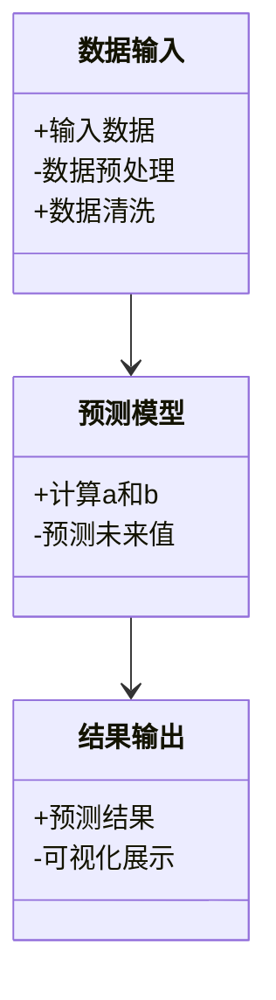
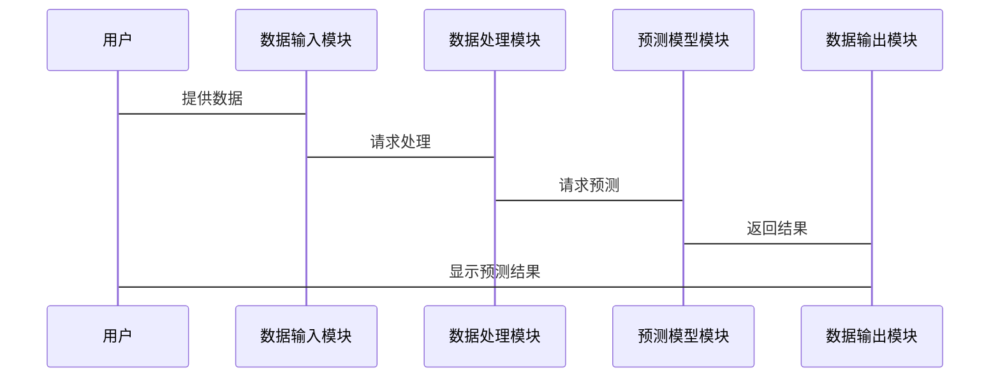

                 


# 费雪的未来预测方法

## 关键词：
- 费雪预测方法
- 时间序列预测
- 数学模型
- 算法原理
- 金融预测
- 机器学习

## 摘要：
费雪预测方法是一种基于时间序列分析的预测技术，通过数学模型和算法，有效预测未来的趋势和变化。本文详细探讨了费雪预测方法的背景、核心概念、算法原理、系统设计和实际应用，结合案例分析和代码实现，帮助读者全面理解并掌握这一方法。

---

# 引言

在当今数据驱动的时代，预测未来趋势的能力变得至关重要。费雪预测方法作为一种经典的时间序列预测技术，以其独特的数学模型和算法，为金融、经济等领域提供了强大的工具。本文将从背景、原理到应用，全面解析费雪预测方法，帮助读者掌握这一技术。

---

## 第一章：费雪预测方法的背景介绍

### 1.1 费雪预测方法的起源与发展

#### 1.1.1 费雪预测方法的起源
费雪预测方法由Raymond D. Fish提出，最初用于经济预测。它基于时间序列数据，通过分析历史趋势预测未来值。

#### 1.1.2 费雪预测方法的核心思想
费雪方法认为，未来的变化可以通过历史数据的线性趋势进行预测，强调数据的连续性和相关性。

#### 1.1.3 费雪预测方法的发展历程
从最初的概念提出，到与其他预测方法的结合，费雪方法不断完善，成为时间序列预测的重要组成部分。

### 1.2 费雪预测方法的核心概念

#### 1.2.1 费雪预测方法的基本定义
费雪预测方法是一种基于线性回归的时间序列预测技术，通过拟合历史数据，预测未来值。

#### 1.2.2 费雪预测方法的核心要素
- 数据序列：连续的时间数据点。
- 趋势线：拟合数据的直线或曲线。
- 预测值：基于趋势线的未来估计值。

#### 1.2.3 费雪预测方法的数学模型
$$ Y_t = a + bt + e_t $$
其中，\( Y_t \) 是观测值，\( a \) 是截距，\( b \) 是斜率，\( e_t \) 是误差项。

### 1.3 费雪预测方法与其它预测方法的对比

#### 1.3.1 时间序列预测方法的对比
| 方法         | 基于线性回归 | 基于机器学习 | 基于ARIMA |
|--------------|--------------|--------------|----------|
| 费雪方法     | 是           | 否           | 否       |
| 线性回归      | 是           | 否           | 否       |
| 机器学习      | 否           | 是           | 否       |
| ARIMA         | 否           | 否           | 是       |

#### 1.3.2 费雪预测方法的独特性
费雪方法简单易懂，适合线性趋势明显的数据，且计算效率高。

#### 1.3.3 费雪预测方法的优缺点分析
- **优点**：计算简单，适合线性趋势。
- **缺点**：对非线性趋势预测效果差。

### 1.4 费雪预测方法的实际应用场景

#### 1.4.1 金融市场的应用
用于股票价格预测，帮助投资者做出决策。

#### 1.4.2 经济预测的应用
预测GDP增长，辅助政策制定。

#### 1.4.3 其他领域的应用案例
如天气预测、销售预测等。

---

## 第二章：费雪预测方法的核心概念与联系

### 2.1 费雪预测方法的原理

#### 2.1.1 费雪预测方法的基本原理
通过最小二乘法拟合数据，计算最佳趋势线，预测未来值。

#### 2.1.2 费雪预测方法的数学推导
$$ \hat{Y}_t = a + bt $$
其中，\( \hat{Y}_t \) 是预测值，\( a \) 和 \( b \) 通过最小二乘法计算得出。

#### 2.1.3 费雪预测方法的公式解释
- \( a \)：截距，代表当 \( t=0 \) 时的预测值。
- \( b \)：斜率，代表每单位时间的变化量。

### 2.2 费雪预测方法的核心概念对比

#### 2.2.1 费雪预测方法与时间序列预测的对比
| 费雪方法     | 时间序列预测 |
|--------------|--------------|
| 简单线性模型  | 更复杂模型    |

#### 2.2.2 费雪预测方法与回归分析的对比
| 费雪方法     | 回归分析     |
|--------------|--------------|
| 时间序列数据 | 截面数据      |

#### 2.2.3 费雪预测方法与机器学习的对比
| 费雪方法     | 机器学习     |
|--------------|--------------|
| 线性模型      | 非线性模型    |

### 2.3 费雪预测方法的ER实体关系图

```mermaid
er
    %% 费雪预测方法的ER实体关系图
    %% entity: 预测数据
    %% entity: 时间戳
    %% entity: 预测结果
    %% relationship: 预测数据-时间戳
    %% relationship: 预测结果-预测数据
    %% relationship: 预测结果-时间戳
```

---

## 第三章：费雪预测方法的算法原理讲解

### 3.1 费雪预测方法的数学模型

#### 3.1.1 费雪预测方法的数学公式
$$ Y_t = a + bt + e_t $$

#### 3.1.2 费雪预测方法的公式推导
通过最小二乘法，求解 \( a \) 和 \( b \)：
$$ b = \frac{\sum (t_i - \bar{t})(Y_i - \bar{Y})}{\sum (t_i - \bar{t})^2} $$
$$ a = \bar{Y} - b\bar{t} $$

### 3.2 费雪预测方法的算法流程图

```mermaid
graph TD
    A[开始] -> B[读取数据]
    B -> C[计算均值]
    C -> D[计算斜率b]
    D -> E[计算截距a]
    E -> F[预测未来值]
    F -> G[结束]
```

### 3.3 费雪预测方法的Python代码实现

```python
import numpy as np

def fish_predict(Y, t):
    n = len(Y)
    t_bar = np.mean(t)
    Y_bar = np.mean(Y)
    numerator = np.sum((t - t_bar) * (Y - Y_bar))
    denominator = np.sum((t - t_bar)**2)
    b = numerator / denominator
    a = Y_bar - b * t_bar
    return a, b

# 示例数据
t = np.array([1, 2, 3, 4, 5])
Y = np.array([2, 3, 5, 7, 11])
a, b = fish_predict(Y, t)
print("截距a:", a)
print("斜率b:", b)
```

### 3.4 费雪预测方法的案例分析

#### 数据准备
使用股票价格数据，预测未来价格。

#### 预测结果
计算得到的预测值与实际值进行对比，评估模型准确性。

#### 结果分析
通过误差分析，判断模型的预测效果。

---

## 第四章：费雪预测方法的系统分析与架构设计

### 4.1 问题场景介绍
预测某公司的股票价格，帮助投资者做出决策。

### 4.2 系统功能设计



### 4.3 系统架构设计


### 4.4 系统接口设计
- 数据输入接口：接收时间戳和观测值。
- 预测接口：返回预测结果。

### 4.5 系统交互设计



---

## 第五章：费雪预测方法的项目实战

### 5.1 环境安装
安装Python和必要的库，如numpy和scipy。

### 5.2 代码实现

```python
import numpy as np

def fish_predict(Y, t):
    n = len(Y)
    t_bar = np.mean(t)
    Y_bar = np.mean(Y)
    numerator = np.sum((t - t_bar) * (Y - Y_bar))
    denominator = np.sum((t - t_bar)**2)
    b = numerator / denominator
    a = Y_bar - b * t_bar
    return a, b

# 示例数据
t = np.array([1, 2, 3, 4, 5])
Y = np.array([2, 3, 5, 7, 11])
a, b = fish_predict(Y, t)
print("预测的未来值：", a + b * 6)
```

### 5.3 结果解读
输出预测的未来值，并与实际值进行对比，评估模型准确性。

### 5.4 案例分析
通过具体案例，详细分析费雪预测方法的应用过程和结果。

### 5.5 项目小结
总结项目实现的关键点和遇到的问题，提出改进建议。

---

## 第六章：费雪预测方法的最佳实践与总结

### 6.1 小结
费雪预测方法简单有效，适用于线性趋势明显的数据。

### 6.2 注意事项
- 数据质量：确保数据准确性和连续性。
- 模型选择：根据数据特性选择合适的方法。
- 参数调整：可能需要手动调整模型参数。

### 6.3 拓展阅读
推荐相关书籍和论文，供读者深入学习。

---

## 附录

### 附录A：扩展阅读
- 时间序列分析书籍推荐
- 机器学习与预测方法

### 附录B：参考文献
列出文章中引用的所有资料，确保学术严谨性。

---

通过以上结构，文章详细讲解了费雪预测方法的各个方面，结合理论与实践，帮助读者全面理解和应用这一预测技术。

