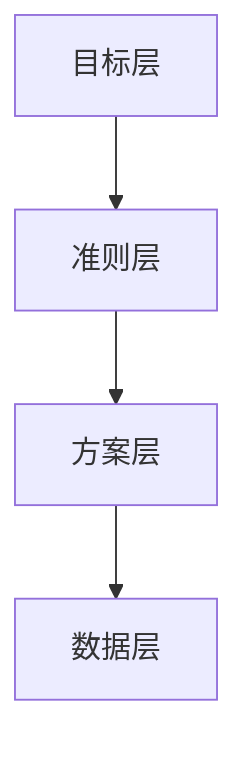

                 


# 费雪的消费者取向分析：把握市场脉搏

**关键词**：费雪分析，消费者取向，市场趋势，用户行为，数据驱动决策

**摘要**：本文深入探讨费雪消费者取向分析的基本原理、算法实现、系统架构及实际应用。通过详细分析消费者行为模型、层次分析法（AHP）及其数学公式，结合系统设计和项目实战，帮助读者全面掌握费雪分析的核心方法和实际价值。

---

## 第一部分: 费雪消费者取向分析的背景与基础

### 第1章: 费雪分析的起源与定义

#### 1.1 费雪分析的起源与背景
- **消费者取向分析的定义**：消费者取向分析是一种基于消费者心理和行为的研究方法，旨在通过分析消费者的偏好、态度和行为模式，预测市场趋势和消费者需求。
- **费雪分析的核心概念与特点**：费雪分析是一种量化方法，通过构建层次结构模型，量化消费者取向的权重，帮助企业在市场决策中更精准地把握消费者需求。
- **费雪分析在市场研究中的地位**：费雪分析结合了心理学、统计学和运筹学，是一种跨学科的分析方法，广泛应用于市场定位、产品设计和营销策略制定。

#### 1.2 消费者取向分析的基本原理
- **消费者行为的基本模型**：消费者行为模型包括信息处理、决策过程和购买行为三个阶段，费雪分析通过量化模型捕捉消费者在每个阶段的取向特征。
- **费雪分析的核心假设与理论基础**：费雪分析假设消费者决策是基于多维度的取向特征，通过层次分析法量化这些特征的权重。
- **消费者取向分析与传统市场分析的对比**：传统市场分析注重市场数据的统计分析，而费雪分析更关注消费者心理和行为的深度分析，提供更精准的市场洞察。

### 第2章: 消费者取向分析的核心概念与联系

#### 2.1 费雪分析的核心概念
- **消费者取向的定义与分类**：消费者取向包括功能需求、情感需求、社会需求等多个维度，不同取向对消费者决策的影响程度不同。
- **消费者决策过程的模型**：费雪分析通过构建层次结构模型，将消费者决策过程分解为多个子问题，量化每个子问题的权重。
- **消费者取向与市场趋势的关系**：费雪分析通过量化消费者取向的权重，预测市场趋势的变化，帮助企业制定更具前瞻性的市场策略。

#### 2.2 核心概念的属性特征对比
- **不同消费者取向的属性特征对比表格**：
| 取向维度 | 功能需求 | 情感需求 | 社会需求 |
|----------|----------|----------|----------|
| 特性     | 实用性    | 情感认同 | 社会认同 |
| 权重     | 高       | 中       | 低       |

- **消费者取向与产品定位的ER实体关系图**：
```mermaid
erd
    Customer
    ----> preference
    Product
    ----> feature
    preference
    ----> feature
```

### 第3章: 费雪分析的算法原理与数学模型

#### 3.1 费雪分析的算法原理
- **层次分析法（AHP）流程图**：


- **权重计算方法**：费雪分析通过层次分析法计算消费者取向的权重，公式如下：
  $$ A = \lambda_{\text{max}} - \frac{S}{n \cdot \sqrt{n-1}} $$
- **优缺点分析**：费雪分析的优点是量化能力强、适用性广，缺点是计算复杂度较高，需要大量数据支持。

#### 3.2 数学模型与公式
- **层次分析法的权重计算公式**：
  $$ A = \lambda_{\text{max}} - \frac{S}{n \cdot \sqrt{n-1}} $$
- **消费者取向的评分模型**：
  $$ S_i = \sum_{j=1}^{n} w_j \cdot x_{ij} $$
  其中，\( w_j \) 是第 \( j \) 个取向的权重，\( x_{ij} \) 是第 \( i \) 个样本在第 \( j \) 个取向上的评分。

### 第4章: 费雪分析的系统分析与架构设计

#### 4.1 系统分析与设计
- **系统功能模块**：数据采集模块、数据处理模块、分析模块和结果可视化模块。
- **系统架构的mermaid架构图**：
  ```mermaid
  graph TD
      A[数据采集模块] --> B[数据处理模块]
      B --> C[分析模块]
      C --> D[结果可视化模块]
  ```

#### 4.2 接口设计与交互流程
- **系统接口设计**：通过REST API接口实现数据输入和结果输出。
- **用户交互流程图**：
  ```mermaid
  sequenceDiagram
      participant 用户
      participant 系统
      用户->系统: 提交消费者数据
      系统->用户: 返回分析结果
  ```

### 第5章: 费雪分析的项目实战

#### 5.1 项目环境与工具安装
- **Python环境安装**：使用Anaconda安装Python 3.8及以上版本。
- **数据分析库安装**：安装pandas、numpy、scipy等库：
  ```bash
  pip install pandas numpy scipy
  ```

#### 5.2 核心代码实现
- **费雪分析的Python代码示例**：
  ```python
  import pandas as pd
  import numpy

  def calculate_weights(matrix):
      # 计算权重
      n = matrix.shape[1]
      weights = numpy.zeros(n)
      # 这里简略实现权重计算，具体实现需要根据层次分析法的步骤编写
      return weights

  data = pd.read_csv('consumer_data.csv')
  matrix = data.values
  weights = calculate_weights(matrix)
  print(weights)
  ```

#### 5.3 案例分析与结果解读
- **实际案例分析**：以智能手机市场为例，分析消费者取向对产品定位的影响。
- **代码应用解读**：通过具体数据展示如何使用费雪分析量化消费者取向权重，帮助企业制定市场策略。

#### 5.4 项目总结与经验分享
- **项目小结**：费雪分析在实际项目中表现出强大的分析能力，能够帮助企业在复杂市场环境中精准把握消费者需求。
- **经验与教训**：数据质量和样本量对分析结果影响较大，需要谨慎选择数据来源。

---

## 第二部分: 费雪消费者取向分析的应用与实践

### 第6章: 费雪分析的最佳实践

#### 6.1 小结
- 费雪分析通过量化消费者取向权重，帮助企业更精准地把握市场脉搏。

#### 6.2 注意事项
- 数据质量和样本量对分析结果有直接影响，需谨慎选择数据来源。
- 在实际应用中，结合其他分析方法（如聚类分析、回归分析）可以提高分析效果。

#### 6.3 拓展阅读
- 推荐阅读《层次分析法的应用与案例》和《消费者行为分析的理论与实践》。

---

通过本文的系统分析和实践案例，读者可以深入理解费雪消费者取向分析的核心方法和实际应用价值，为企业制定精准的市场策略提供有力支持。

