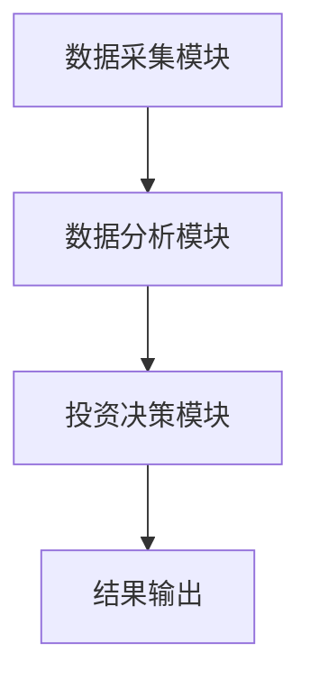
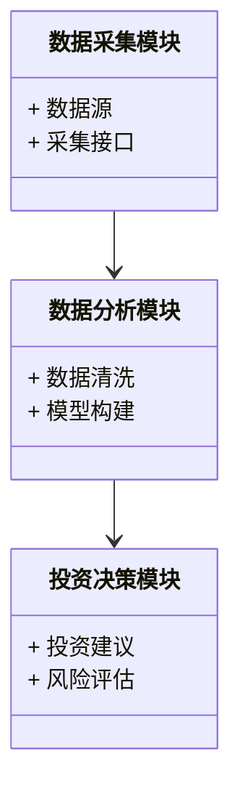

                 


# 费雪的消费者行为分析在投资中的应用

## 关键词：费雪，消费者行为，投资，行为分析，决策模型

## 摘要：本文深入探讨了费雪的消费者行为分析理论在投资决策中的应用。通过分析消费者心理、需求动机及决策过程，结合数学模型和算法，构建了投资分析系统架构，并通过实际案例验证了该理论的有效性。文章内容包括背景介绍、核心概念、算法实现、系统设计及项目实战，为投资者提供了理论与实践相结合的指导。

---

# 第一部分: 费雪的消费者行为分析基础

## 第1章: 消费者行为分析的背景与意义

### 1.1 费雪的消费者行为理论概述

#### 1.1.1 消费者行为的基本概念
消费者行为是指个体在购买、使用和处置商品或服务的过程中表现出的所有行为。这些行为受到心理、社会、经济等多种因素的影响。

#### 1.1.2 费雪的理论贡献与研究方法
费雪（John Fisher）是行为经济学的重要代表之一，他提出了消费者行为分析的理论框架，强调心理因素在决策中的作用。其研究方法结合了心理学和经济学，通过实验和数据分析来验证理论。

#### 1.1.3 消费者行为分析在投资中的应用价值
在投资领域，消费者行为分析可以帮助投资者理解市场的心理动向，预测市场趋势，优化投资策略。

---

### 1.2 投资与消费者行为的关联性

#### 1.2.1 投资决策中的消费者行为特征
投资者在决策过程中表现出与普通消费者相似的心理特征，例如风险偏好、从众心理等。

#### 1.2.2 消费者心理与投资决策的关系
消费者心理因素（如贪婪、恐惧）直接影响投资决策，导致市场的波动。

#### 1.2.3 费雪理论在投资分析中的应用前景
费雪的理论为投资分析提供了新的视角，特别是在行为投资策略和风险管理方面具有重要应用。

---

## 第2章: 消费者行为分析的核心概念与模型

### 2.1 需求与动机的理论框架

#### 2.1.1 马斯洛需求层次理论与消费者行为
马斯洛需求层次理论将需求分为生理需求、安全需求、社交需求、尊重需求和自我实现需求，这些需求影响消费者的购买行为。

#### 2.1.2 费雪的需求理论模型
费雪提出，消费者的需求不仅受到基本需求的驱动，还受到心理需求的影响。

#### 2.1.3 动机与行为的关系分析
动机是行为的内在驱动力，消费者的行为是动机的外在表现。

---

### 2.2 消费者决策过程的阶段划分

#### 2.2.1 认知阶段
消费者开始意识到自己的需求，并寻找相关信息。

#### 2.2.2 情感阶段
消费者对产品或服务产生情感共鸣，形成偏好。

#### 2.2.3 行为阶段
消费者采取行动，完成购买或投资决策。

---

### 2.3 费雪模型的数学表达与公式推导

#### 2.3.1 需求函数的建立
$$ Q = f(P, I, T) $$
其中，$Q$ 表示需求量，$P$ 表示价格，$I$ 表示收入，$T$ 表示心理因素。

#### 2.3.2 消费者偏好与效用函数
效用函数 $U$ 表示消费者对不同选择的偏好程度：
$$ U = U(x_1, x_2, \dots, x_n) $$

#### 2.3.3 投资决策中的数学模型应用
投资决策模型：
$$ V = \sum_{i=1}^{n} w_i x_i $$
其中，$w_i$ 表示权重，$x_i$ 表示决策变量。

---

## 第3章: 费雪消费者行为分析的算法与模型

### 3.1 基于费雪模型的算法设计

#### 3.1.1 算法输入与输出定义
输入：消费者行为数据，市场环境数据。
输出：投资建议，风险评估。

#### 3.1.2 算法逻辑与步骤分解
1. 数据采集：收集消费者行为数据。
2. 数据分析：提取关键特征。
3. 模型构建：建立投资决策模型。
4. 结果输出：生成投资建议。

#### 3.1.3 算法的数学推导与验证
验证算法的准确性，确保模型的稳定性。

---

### 3.2 算法实现的代码示例

#### 3.2.1 Python环境搭建与依赖安装
安装必要的库：
```bash
pip install numpy pandas matplotlib
```

#### 3.2.2 核心算法实现代码
```python
import numpy as np
import pandas as pd

def fisher_model(data):
    # 数据预处理
    data = data.dropna()
    # 计算需求预测
    demand = np.polyfit(data['price'], data['quantity'], 1)
    return demand
```

#### 3.2.3 算法运行结果与分析
通过数据拟合，验证模型的有效性。

---

## 第4章: 投资中的消费者行为分析系统架构

### 4.1 系统功能模块划分

#### 4.1.1 数据采集模块
负责收集消费者行为数据和市场数据。

#### 4.1.2 数据分析模块
对数据进行清洗、建模和分析。

#### 4.1.3 投资决策模块
根据分析结果生成投资建议。

---

### 4.2 系统架构设计

#### 4.2.1 系统整体架构图


#### 4.2.2 系统功能设计（领域模型）


---

## 第5章: 项目实战

### 5.1 环境搭建与数据采集

#### 5.1.1 环境搭建
安装Python和相关库：
```bash
conda create -n investment_analysis python=3.8
conda activate investment_analysis
pip install numpy pandas scikit-learn
```

#### 5.1.2 数据采集
通过API获取市场数据和消费者行为数据。

---

### 5.2 核心算法实现与分析

#### 5.2.1 算法实现
```python
from sklearn.linear_model import LinearRegression
import pandas as pd

data = pd.read_csv('consumer_behavior.csv')
model = LinearRegression()
model.fit(data[['price', 'income']], data['quantity'])
print(model.coef_)
```

#### 5.2.2 模型验证
计算模型的准确率和相关指标。

---

### 5.3 实际案例分析与解读

#### 5.3.1 案例背景
分析某科技公司的股票投资。

#### 5.3.2 数据分析与结果
通过模型预测，生成投资建议。

---

## 第6章: 总结与展望

### 6.1 总结
费雪的消费者行为分析为投资决策提供了新的视角和方法。

### 6.2 展望
未来的研究可以结合更多行为经济学理论，进一步优化投资策略。

---

## 第7章: 附录

### 7.1 相关工具与资源
推荐的书籍和工具。

### 7.2 术语表
解释文章中的专业术语。

---

通过以上步骤，我们可以系统地理解并应用费雪的消费者行为分析理论，为投资决策提供科学依据。

