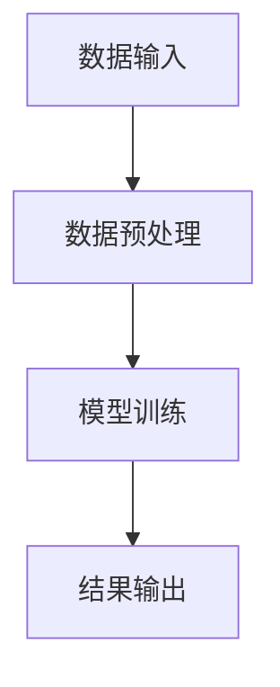

                 


# 费雪的研发投入分析：创新能力的指标

> 关键词：研发投入分析、创新能力、费雪模型、数据分析、创新指标

> 摘要：本文通过分析费雪的创新理论，探讨如何利用研发投入指标来衡量企业的创新能力。文章从研发投入的背景与意义出发，详细讲解了费雪模型的核心要素、数学表达及算法实现，并通过实际案例分析了模型的应用过程。最后，本文总结了研发投入分析的重要性及未来发展趋势。

---

## 第一章：研发投入分析的背景与意义

### 1.1 研发投入分析的背景

#### 1.1.1 研发投入的定义与范围
研发投入是指企业在研究与开发活动中投入的资金、人力和资源。这些投入主要用于开发新产品、改进现有产品和技术、探索新技术等领域。研发投入的范围包括基础研究、应用研究和试验发展三个层次。

#### 1.1.2 研发投入在企业创新中的重要性
研发投入是企业创新能力的核心驱动因素。通过增加研发投入，企业可以提升技术竞争力，开发更具市场竞争力的产品，从而在激烈的市场竞争中占据优势。此外，研发投入还能够吸引高端人才，增强企业的创新能力和品牌形象。

#### 1.1.3 研发投入分析的现状与挑战
当前，许多企业已经开始重视研发投入的分析，但如何科学地衡量研发投入对创新能力的影响仍是一个难题。传统的方法往往只关注研发投入的绝对值，而忽视了其与企业实际创新能力之间的关系。费雪的创新分析理论为我们提供了一种新的视角。

### 1.2 费雪的创新分析理论

#### 1.2.1 费雪的创新理论概述
威廉·费雪（William Fisher）是美国著名的经济学家和创新理论研究者。他认为，创新是推动经济增长的核心动力，而研发投入是实现创新的重要手段。费雪的理论强调了研发投入在企业创新中的关键作用，认为研发投入的强度和结构直接影响企业的创新能力。

#### 1.2.2 费雪对研发投入与创新能力关系的分析
费雪认为，研发投入与创新能力之间存在正相关关系。企业通过加大研发投入，可以提升技术储备，增强产品竞争力。同时，研发投入的结构也至关重要，例如将更多的资源投入到基础研究中，能够为企业未来的创新奠定坚实基础。

#### 1.2.3 费雪理论在现代企业中的应用
费雪的创新理论在现代企业中得到了广泛应用。许多企业在制定研发战略时，都会参考费雪的理论，将研发投入作为衡量创新能力的重要指标。例如，科技企业在制定研发预算时，会根据费雪模型分析不同研发项目的投入产出比，从而优化资源配置。

---

## 第二章：创新能力的指标体系

### 2.1 研发投入的核心指标

#### 2.1.1 研发投入强度
研发投入强度是指企业在一定时期内的研发投入占销售收入的比例。该指标能够反映企业对研发的重视程度，也是衡量企业创新能力的重要指标之一。

#### 2.1.2 研发人员数量与结构
研发人员的数量和结构直接影响企业的创新能力。拥有更多高素质研发人员的企业，通常具有更强的技术创新能力。因此，研发人员的结构也是研发投入分析的重要指标。

#### 2.1.3 研发资金分配与使用效率
研发资金的分配和使用效率是衡量企业创新能力的另一个重要指标。企业应根据战略目标合理分配研发资金，确保资金的使用效率最大化。

### 2.2 费雪模型的核心要素

#### 2.2.1 费雪模型的构建逻辑
费雪模型的核心在于将研发投入与创新能力联系起来，通过数学模型量化两者之间的关系。模型的主要输入包括企业的研发投入、研发人员数量、研发资金分配等，输出则是企业的创新能力指数。

#### 2.2.2 费雪模型的输入变量与输出指标
- **输入变量**：
  - 研发投入金额
  - 研发人员数量
  - 研发资金分配比例
- **输出指标**：
  - 创新能力指数
  - 技术进步指数

#### 2.2.3 费雪模型的适用场景与局限性
费雪模型适用于技术密集型行业，尤其是那些研发投入对创新能力影响较大的企业。然而，该模型也存在一定的局限性，例如对非技术因素的忽视，以及对模型参数的敏感性问题。

---

## 第三章：研发投入与创新能力的关联分析

### 3.1 研发投入对创新能力的影响机制

#### 3.1.1 研发投入与技术进步的关系
研发投入是技术进步的源泉。通过增加研发投入，企业可以开发新技术、改进现有技术，从而推动技术进步。

#### 3.1.2 研发投入与市场竞争力的关联
研发投入的增加能够提升企业的市场竞争力。具有更强技术能力的企业，更容易在市场中占据领先地位。

#### 3.1.3 研发投入与企业长期发展的关系
从长期来看，研发投入是企业可持续发展的关键。只有不断加大研发投入，企业才能在激烈的市场竞争中立于不败之地。

### 3.2 费雪模型的数学表达与公式推导

#### 3.2.1 费雪模型的基本公式
$$ \text{创新能力指数} = \alpha \times \text{研发投入强度} + \beta \times \text{研发人员数量} + \gamma \times \text{研发资金分配} $$

其中，$\alpha$、$\beta$、$\gamma$为模型的参数，需通过数据拟合确定。

#### 3.2.2 费雪模型的变量定义与假设条件
- **研发投入强度**：研发投入占销售收入的比例，记为$R$。
- **研发人员数量**：研发部门的员工数量，记为$N$。
- **研发资金分配**：研发资金分配到不同项目的比例，记为$A$。
- 假设条件：企业研发投入的结构合理，且模型参数$\alpha$、$\beta$、$\gamma$为常数。

#### 3.2.3 费雪模型的数学推导过程
通过回归分析，我们可以得到模型参数的最优解。假设我们有$m$组数据，每组数据包括研发投入强度$R_i$、研发人员数量$N_i$、研发资金分配$A_i$以及创新能力指数$I_i$。我们可以通过最小二乘法求解参数$\alpha$、$\beta$、$\gamma$：

$$ \min_{\alpha, \beta, \gamma} \sum_{i=1}^{m} (I_i - (\alpha R_i + \beta N_i + \gamma A_i))^2 $$

---

## 第四章：费雪模型的算法原理

### 4.1 费雪模型的算法流程

#### 4.1.1 数据输入与预处理
- 数据输入：收集企业的研发投入、研发人员数量、研发资金分配等数据。
- 数据预处理：对数据进行清洗、标准化处理，确保数据质量。

#### 4.1.2 模型参数初始化
- 初始化参数$\alpha$、$\beta$、$\gamma$的初始值，例如均设为0或小的随机数。

#### 4.1.3 模型训练与优化
- 使用回归分析或梯度下降算法优化模型参数，使得预测值与实际值的误差最小化。

#### 4.1.4 结果输出与解释
- 计算创新能力指数，输出结果并进行解释。

### 4.2 费雪模型的实现代码

#### 4.2.1 环境安装与配置
```python
import numpy as np
import pandas as pd
from sklearn.linear_model import LinearRegression
from sklearn.metrics import mean_squared_error
```

#### 4.2.2 数据加载与处理
```python
# 加载数据
data = pd.read_csv('研发投入.csv')
X = data[['R', 'N', 'A']]
y = data['I']
```

#### 4.2.3 模型定义与训练
```python
# 训练模型
model = LinearRegression()
model.fit(X, y)
```

#### 4.2.4 模型评估与结果分析
```python
# 预测结果
y_pred = model.predict(X)
print('预测结果:', y_pred)
print('均方根误差:', np.sqrt(mean_squared_error(y, y_pred)))
```

---

## 第五章：系统架构与接口设计

### 5.1 系统功能设计

#### 5.1.1 系统功能模块划分
- 数据输入与预处理模块
- 模型训练与优化模块
- 结果输出与解释模块

### 5.2 系统架构设计


### 5.3 系统接口设计
- 数据接口：数据输入模块与数据预处理模块之间的接口。
- 模型接口：模型训练模块与结果输出模块之间的接口。

---

## 第六章：项目实战与案例分析

### 6.1 项目实战

#### 6.1.1 环境安装与代码实现
```python
# 项目实战代码
import numpy as np
import pandas as pd
from sklearn.linear_model import LinearRegression
from sklearn.metrics import mean_squared_error

# 加载数据
data = pd.read_csv('研发投入.csv')
X = data[['R', 'N', 'A']]
y = data['I']

# 训练模型
model = LinearRegression()
model.fit(X, y)

# 预测结果
y_pred = model.predict(X)
print('预测结果:', y_pred)
print('均方根误差:', np.sqrt(mean_squared_error(y, y_pred)))
```

#### 6.1.2 代码解读与分析
- 代码首先加载数据，然后定义特征变量和目标变量。
- 使用线性回归模型进行训练，并输出预测结果和均方根误差。

### 6.2 案例分析
假设我们有一个企业的研发投入数据，如下所示：

| R    | N    | A    | I    |
|------|------|------|------|
| 0.1  | 100  | 0.3  | 0.7  |
| 0.15 | 150  | 0.4  | 0.8  |
| 0.2  | 200  | 0.5  | 0.9  |

通过上述代码，我们可以训练模型，并预测新的数据点的创新能力指数。

---

## 第七章：结论与展望

### 7.1 结论
本文通过分析费雪的创新理论，探讨了如何利用研发投入指标来衡量企业的创新能力。通过构建费雪模型，我们能够量化研发投入与创新能力之间的关系，为企业制定研发战略提供科学依据。

### 7.2 未来展望
未来，随着人工智能和大数据技术的不断发展，研发投入分析将更加精准和智能化。我们需要进一步优化费雪模型，引入更多的变量和因素，使其能够更好地适应复杂的市场环境。

---

## 附录：最佳实践与小结

### 附录1：最佳实践
- 数据预处理是模型训练的关键步骤，需确保数据质量。
- 模型的参数需根据实际情况进行调整和优化。
- 在实际应用中，可结合其他指标进行综合分析。

### 附录2：小结
费雪的研发投入分析为我们提供了一种科学的方法，帮助我们更好地衡量企业的创新能力。通过本文的分析和实践，我们能够更好地理解研发投入的重要性，并为企业制定研发战略提供有力支持。

---

以上是《费雪的研发投入分析：创新能力的指标》的完整目录和文章内容，涵盖了从理论到实践的各个方面，希望对您有所帮助！

