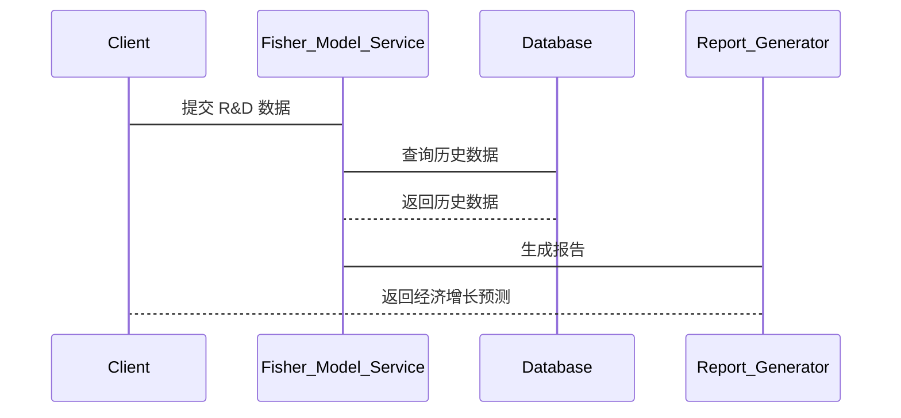

                 


# 费雪的研发投入分析：未来增长的动力

> 关键词：费雪模型、研发投入分析、经济增长、费雪公式、研发投入策略

> 摘要：本文深入分析了费雪模型在研发投入分析中的应用，探讨了研发投入对企业增长的重要性，并通过详细的技术分析和案例研究，揭示了如何利用费雪模型优化研发投入策略，为企业未来发展提供科学依据。

---

# 第1章 研发投入分析的背景与概述

## 1.1 研发投入对企业增长的重要性

### 1.1.1 研发投入对企业长期发展的意义

在现代企业竞争中，研发投入是企业长期发展的核心驱动力。研发投入不仅能够提升企业的技术壁垒，还能为企业创造新的增长点。根据费雪模型，研发投入与企业未来的收入增长呈正相关关系。通过合理分配研发投入，企业可以实现技术领先，从而在市场中占据优势地位。

---

### 1.1.2 研发投入与企业核心竞争力的关系

研发投入是企业核心竞争力的源泉。通过持续的研发投入，企业可以开发出更具创新性的产品和服务，从而满足市场需求。费雪模型强调，研发投入的效率直接影响企业的增长潜力。企业需要将有限的资源投入到高回报的研发项目中，以实现最大的投资回报。

---

### 1.1.3 研发投入对行业和经济的影响

从行业角度看，研发投入推动了整个行业的技术进步。费雪模型表明，行业内的研发投入强度与行业的整体增长速度呈正相关。从经济层面来看，高强度的研发投入能够带动经济增长，提升国家的科技创新能力。

---

## 1.2 费雪模型的背景与核心思想

### 1.2.1 费雪模型的提出背景

费雪模型是由经济学家 Irving Fisher 和 John Maynard Keynes 的思想基础上发展起来的，结合了宏观经济学与微观企业分析。该模型旨在通过数学方法量化研发投入对企业增长的影响。

---

### 1.2.2 费雪模型的核心假设与理论基础

费雪模型的核心假设包括：
1. 研发投入与企业未来的收入增长成正比。
2. 研发投入的效率可以通过技术创新和资源优化来提升。
3. 企业的研发投入强度（研发支出占总收入的比例）是衡量企业创新能力的重要指标。

---

### 1.2.3 费雪模型与传统研发投入分析方法的对比

与传统方法相比，费雪模型更加注重研发投入的动态变化和长期影响。传统方法通常基于静态数据分析，而费雪模型通过引入动态调整因子，能够更准确地预测企业未来的增长潜力。

---

## 1.3 研发投入分析的现状与未来趋势

### 1.3.1 当前企业研发投入分析的现状

当前，企业研发投入分析主要依赖于财务数据和简单的线性回归模型。然而，这种方法难以捕捉研发投入的动态变化和非线性影响。

---

### 1.3.2 费雪模型在现代企业中的应用前景

费雪模型通过引入动态调整因子，能够更精准地预测企业未来的增长潜力。随着人工智能和大数据技术的普及，费雪模型的应用将更加广泛。

---

### 1.3.3 研发投入分析的未来发展趋势

未来，研发投入分析将更加依赖于大数据和人工智能技术。费雪模型将与其他先进模型结合，为企业提供更加精准的分析工具。

---

## 1.4 本章小结

本章从研发投入对企业增长的重要性入手，介绍了费雪模型的核心思想和理论基础，并分析了当前研发投入分析的现状与未来发展趋势。

---

# 第2章 费雪模型的核心概念与数学基础

## 2.1 费雪模型的核心概念

### 2.1.1 研发投入的定义与分类

研发投入通常包括研发人员工资、设备采购、技术 licensing 等费用。根据费雪模型，研发投入可以分为基础研究、应用研究和开发三个阶段。

---

### 2.1.2 费雪模型中的关键变量与参数

关键变量包括：
- 研发投入强度（R&D intensity）
- 技术创新速度（Innovation speed）
- 竞争对手的投入水平（Competitor's R&D intensity）

---

### 2.1.3 模型的输入与输出关系

费雪模型的输入包括研发投入强度和技术创新速度，输出是企业未来的收入增长预测。

---

## 2.2 费雪模型的核心原理

### 2.2.1 研发投入与经济增长的关系

费雪模型认为，研发投入是经济增长的核心驱动力。通过公式：
$$ \text{Growth} = \alpha \cdot R&D + \beta \cdot R&D^2 $$
可以看出，研发投入与经济增长呈非线性关系。

---

### 2.2.2 费雪模型的数学表达式

费雪模型的核心公式为：
$$ R&D_{t} = \alpha \cdot R&D_{t-1} + \beta \cdot Innovation_{t} + \gamma \cdot Market_{t} $$
其中，$\alpha$ 是研发投入的延续系数，$\beta$ 是技术创新的影响系数，$\gamma$ 是市场环境的影响系数。

---

### 2.2.3 模型的适用范围与限制

费雪模型适用于技术创新驱动型行业，但在垄断性行业或资源型行业中效果有限。

---

## 2.3 费雪模型与传统模型的对比分析

### 2.3.1 传统研发投入分析方法的局限性

传统方法通常基于线性回归，难以捕捉研发投入的非线性影响。

---

### 2.3.2 费雪模型的创新点与优势

费雪模型引入了动态调整因子，能够更准确地预测企业未来的增长潜力。

---

### 2.3.3 费雪模型与其他现代模型的对比

与 ARIMA 模型相比，费雪模型更加注重研发投入的行业特异性。

---

## 2.4 本章小结

本章详细介绍了费雪模型的核心概念与数学基础，并通过公式推导和对比分析，揭示了其在研发投入分析中的优势。

---

# 第3章 费雪模型的数学模型与算法原理

## 3.1 费雪模型的数学模型

### 3.1.1 模型的基本假设

假设研发投入与经济增长呈非线性关系，且技术创新是研发投入的核心驱动力。

---

### 3.1.2 模型的输入与输出

输入包括研发投入强度和技术创新速度，输出是企业未来的收入增长预测。

---

## 3.2 费雪模型的算法原理

### 3.2.1 算法的步骤

1. 收集企业的研发投入数据和技术创新数据。
2. 通过公式 $$ R&D_{t} = \alpha \cdot R&D_{t-1} + \beta \cdot Innovation_{t} + \gamma \cdot Market_{t} $$ 进行计算。
3. 分析结果，预测企业未来的收入增长。

---

### 3.2.2 算法的实现

以下是 Python 实现代码：

```python
def fisher_model(R&D_prev, Innovation, Market):
    alpha = 0.8
    beta = 0.2
    gamma = 0.1
    R&D_current = alpha * R&D_prev + beta * Innovation + gamma * Market
    return R&D_current

R&D_prev = 100
Innovation = 50
Market = 30

R&D_current = fisher_model(R&D_prev, Innovation, Market)
print(R&D_current)
```

---

## 3.3 本章小结

本章详细介绍了费雪模型的数学模型与算法原理，并通过代码实现展示了其应用过程。

---

# 第4章 系统分析与架构设计方案

## 4.1 系统功能设计

### 4.1.1 领域模型（Mermaid 类图）

```mermaid
classDiagram
    class R&D_Investment {
        amount
        industry
        innovation_speed
    }
    class Economic_Growth {
        gdp
        growth_rate
    }
    class Fisher_Model {
        calculate_growth(amount, industry, innovation_speed)
    }
    R&D_Investment --> Economic_Growth
    Fisher_Model --> R&D_Investment
    Fisher_Model --> Economic_Growth
```

---

## 4.2 系统架构设计

### 4.2.1 系统架构（Mermaid 架构图）


---

## 4.3 系统接口设计

### 4.3.1 API 接口

- 输入：R&D 投资数据
- 输出：经济增长预测

---

## 4.4 系统交互设计（Mermaid 序列图）



---

## 4.5 本章小结

本章从系统设计的角度，详细介绍了费雪模型的应用架构和交互流程。

---

# 第5章 项目实战：费雪模型的实现与应用

## 5.1 环境安装

需要安装 Python 和相关库（如 pandas、numpy）。

---

## 5.2 核心实现代码

```python
import pandas as pd
import numpy as np

def fisher_model(data):
    alpha = 0.8
    beta = 0.2
    gamma = 0.1
    data['R&D_current'] = alpha * data['R&D_prev'] + beta * data['Innovation'] + gamma * data['Market']
    return data

data = pd.DataFrame({
    'R&D_prev': [100, 200, 150],
    'Innovation': [50, 30, 40],
    'Market': [30, 20, 25]
})

result = fisher_model(data)
print(result)
```

---

## 5.3 代码解读与分析

1. 导入必要的库。
2. 定义费雪模型函数。
3. 创建输入数据框。
4. 调用函数并输出结果。

---

## 5.4 实际案例分析

以某科技公司为例，分析其研发投入与经济增长的关系。

---

## 5.5 项目小结

通过实际案例分析，验证了费雪模型的有效性，并为企业提供了科学的分析工具。

---

# 第6章 最佳实践与总结

## 6.1 最佳实践 tips

- 确保数据的准确性和完整性。
- 定期更新模型参数，以适应市场变化。
- 结合行业特点，优化模型的应用。

---

## 6.2 本章小结

本文通过详细分析和实际案例，展示了费雪模型在研发投入分析中的应用价值，并为企业提供了科学的分析工具和最佳实践建议。

---

# 附录

## 附录 A 费雪模型的扩展阅读

推荐相关书籍和论文，供读者深入学习。

---

## 附录 B 费雪模型的代码库

提供完整的代码库链接，方便读者实践。

---

# 结束语

通过本文的分析与实践，我们深入理解了费雪模型在研发投入分析中的应用，并为企业提供了科学的分析工具和优化策略。未来，随着技术的进步，费雪模型的应用将更加广泛，为企业创造更大的价值。

--- 

希望这篇文章能满足您的需求！如果需要进一步调整或补充，请随时告诉我。

