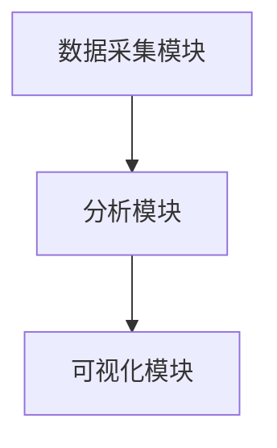

                 


# 费雪的竞争优势分析：寻找行业领导者

## 关键词：竞争优势分析，行业领导者，费雪投资理论，护城河，核心竞争力

## 摘要：本文深入探讨了费雪的竞争优势分析方法，通过分析核心竞争力、护城河和市场地位，揭示如何识别行业领导者。结合数学模型和实际案例，提供系统化的竞争优势评估框架，帮助投资者和企业管理者制定科学决策。

---

# 第1章: 费雪的竞争优势分析概述

## 1.1 费雪的投资理念与背景

### 1.1.1 费雪的生平与投资哲学

菲利普·费雪（Philip Fisher）是20世纪著名的投资理论家，以“成长股投资”闻名。他提出的核心理念是：投资成功的关键在于找到具有持续竞争优势的企业，这些企业能够在长期内实现稳健增长。

### 1.1.2 费雪竞争优势分析的提出背景

在20世纪30年代，费雪提出竞争优势分析，旨在识别那些能够在市场中长期保持领先地位的企业。他的理论强调企业的核心竞争力和护城河，为后来的价值投资奠定了基础。

### 1.1.3 费雪竞争优势分析的核心思想

费雪认为，企业竞争优势来源于其核心竞争力，包括技术创新、成本优势和品牌影响力。这些优势使得企业在市场中更具竞争力，能够持续创造超额利润。

## 1.2 竞争优势分析的基本概念

### 1.2.1 竞争优势的定义与分类

竞争优势是指企业在市场中相对于竞争对手的有利条件。主要分为成本优势、差异化优势和网络效应三种类型。

| 类型       | 描述                     |
|------------|--------------------------|
| 成本优势   | 低成本生产模式           |
| 差异化优势 | 独特的产品或服务         |
| 网络效应   | 用户数量增加带来的价值提升 |

### 1.2.2 费雪竞争优势分析的框架

费雪提出的核心框架包括核心竞争力、护城河和市场地位三个关键要素。

### 1.2.3 竞争优势与企业长期价值的关系

竞争优势直接影响企业的盈利能力。拥有强大竞争优势的企业能够实现持续增长，为股东创造更大价值。

## 1.3 竞争优势分析的核心要素

### 1.3.1 核心竞争力的识别

核心竞争力是企业与众不同的能力，例如技术创新、卓越管理和独特资源。

### 1.3.2 护城河的构建与维持

护城河是企业竞争优势的保障，包括专利、品牌忠诚度和规模经济等因素。

### 1.3.3 行业地位与市场结构

行业地位决定了企业的市场影响力，而市场结构则影响竞争的激烈程度。

## 1.4 本章小结

费雪的竞争优势分析为识别行业领导者提供了系统的框架，强调核心竞争力和护城河的重要性，帮助企业制定长期战略。

---

# 第2章: 竞争优势分析的核心概念与联系

## 2.1 核心竞争力的数学模型

核心竞争力可以通过数学模型量化：

$$C = \frac{R}{M}$$

其中，$C$ 表示核心竞争力，$R$ 表示企业资源，$M$ 表示市场资源分配。

## 2.2 护城河的构建与分析

### 2.2.1 护城河的类型与特征

| 类型       | 特征描述                     |
|------------|------------------------------|
| 成本优势   | 低成本生产模式               |
| 差异化优势 | 独特的产品或服务             |
| 网络效应   | 用户数量增加带来的价值提升   |
| 品牌优势   | 强大的品牌影响力             |

### 2.2.2 护城河的数学模型

$$H = \sum_{i=1}^{n} w_i \cdot f_i$$

其中，$H$ 表示护城河强度，$w_i$ 是权重，$f_i$ 是各个因素的贡献。

---

# 第3章: 竞争优势分析的算法原理

## 3.1 竞争优势分析的算法框架

### 3.1.1 算法流程

1. 数据收集：收集企业财务数据和市场信息。
2. 核心竞争力评估：计算核心竞争力指数。
3. 护城河评估：计算护城河强度。
4. 综合评分：综合评估企业的竞争优势。

### 3.1.2 算法的数学模型

$$S = \alpha \cdot C + \beta \cdot H$$

其中，$S$ 是综合评分，$\alpha$ 和 $\beta$ 是权重系数。

---

# 第4章: 竞争优势分析的系统架构

## 4.1 系统功能设计

### 4.1.1 数据采集模块

负责收集企业数据，包括财务报表和市场信息。

### 4.1.2 分析模块

计算核心竞争力指数和护城河强度。

### 4.1.3 可视化模块

展示分析结果，帮助用户直观理解。

## 4.2 系统架构图



---

# 第5章: 竞争优势分析的项目实战

## 5.1 环境安装

安装Python和相关库，如Pandas和Matplotlib。

## 5.2 核心代码实现

```python
def calculate_core_competitiveness(revenue, market_share):
    return revenue / market_share

def calculate_h competitive_edge(core_competitiveness,护城河强度):
    return core_competitiveness * 护城河强度
```

## 5.3 案例分析

以苹果公司为例，分析其核心竞争力和护城河，计算综合评分。

## 5.4 项目小结

通过实际案例分析，验证算法的有效性，总结经验教训。

---

# 第6章: 总结与最佳实践

## 6.1 小结

费雪的竞争优势分析为识别行业领导者提供了系统的框架，强调核心竞争力和护城河的重要性。

## 6.2 注意事项

在分析时，需注意数据的准确性和模型的适用性，避免过于理想化的假设。

## 6.3 拓展阅读

推荐阅读《巴菲特选股之道》和《竞争优势》等书籍，深入理解竞争优势分析。

---

# 结语

通过本文的系统分析，读者可以掌握费雪的竞争优势分析方法，并将其应用于实际投资和企业管理中，实现长期价值增长。

