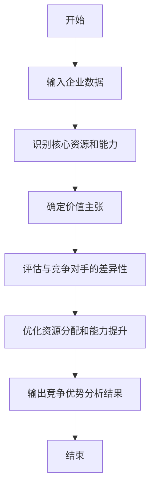
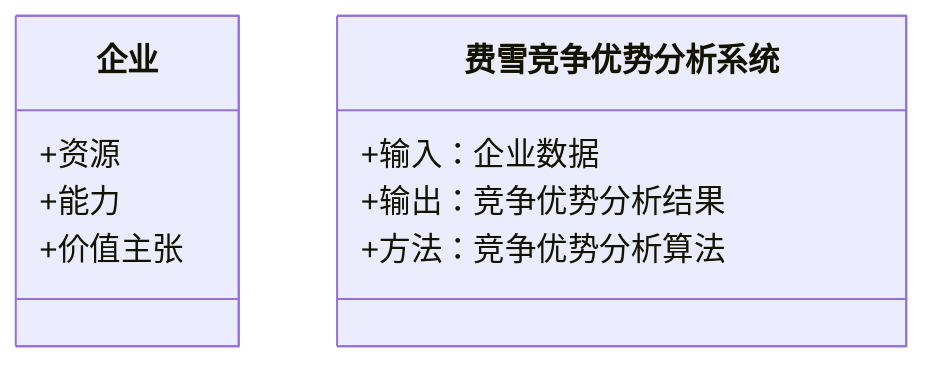
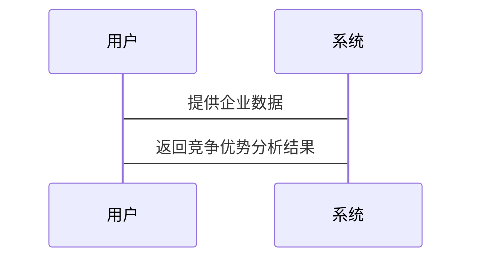

                 


# 费雪的竞争优势分析：持续成功的关键

> 关键词：竞争优势分析，企业战略，费雪，可持续成功，资源优化

> 摘要：本文深入探讨了费雪的竞争优势分析方法，分析其核心概念、算法原理、系统架构设计及实际应用案例，帮助读者理解如何通过竞争优势分析实现企业的持续成功。

---

# 第一部分: 费雪的竞争优势分析基础

## 第1章: 费雪竞争优势分析概述

### 1.1 费雪竞争优势分析的背景与意义

#### 1.1.1 企业持续成功的挑战
在当今竞争激烈的市场环境中，企业要实现持续成功，必须具备核心竞争优势。传统的竞争优势分析方法往往局限于资源和能力的评估，而费雪的竞争优势分析则引入了价值主张的概念，更加注重企业与客户之间的价值共创。

#### 1.1.2 费雪竞争优势分析的提出
费雪的竞争优势分析是一种基于企业内部资源和外部环境的综合分析方法，强调企业在市场中的独特定位和价值创造能力。这种方法不仅关注企业的内部能力，还注重与客户和合作伙伴的关系。

#### 1.1.3 费雪竞争优势分析的核心价值
通过费雪的竞争优势分析，企业能够识别和优化其核心竞争力，从而在市场中保持领先地位。这种方法不仅适用于传统制造业，还适用于现代服务业和高科技产业。

### 1.2 费雪竞争优势分析的定义与特点

#### 1.2.1 费雪竞争优势的定义
费雪的竞争优势是指企业在市场中提供独特价值主张的能力，这种优势不仅来源于企业的资源和能力，还来源于与客户和合作伙伴的协同效应。

#### 1.2.2 费雪竞争优势的核心特点
1. **动态性**：竞争优势不是静态的，而是随着市场环境的变化而不断调整。
2. **可持续性**：通过持续创新和优化，竞争优势可以长期保持。
3. **客户导向**：竞争优势的评估以客户价值为核心。

#### 1.2.3 费雪竞争优势与传统竞争优势的对比
传统的竞争优势分析主要关注企业的内部资源和能力，而费雪的竞争优势分析则更加注重企业与外部环境的互动，特别是与客户和合作伙伴的关系。

### 1.3 费雪竞争优势分析的理论基础

#### 1.3.1 费雪竞争优势的理论来源
费雪的竞争优势分析结合了资源基础观点（RBV）和价值链理论，强调企业在资源优化和价值创造中的双重作用。

#### 1.3.2 费雪竞争优势分析的逻辑框架
费雪的竞争优势分析框架包括以下步骤：
1. 识别企业的核心资源和能力。
2. 确定企业的价值主张。
3. 评估与竞争对手的差异性。
4. 优化资源分配和能力提升。

#### 1.3.3 费雪竞争优势分析的适用范围
这种方法适用于各种类型的企业，尤其是那些需要在复杂市场环境中寻找竞争优势的企业。

---

## 第2章: 费雪竞争优势分析的核心概念与联系

### 2.1 核心概念原理

#### 2.1.1 费雪竞争优势的构成要素
1. **资源**：包括人力资源、财务资源、技术资源等。
2. **能力**：企业的核心竞争力。
3. **价值主张**：企业提供的产品或服务的独特价值。

#### 2.1.2 费雪竞争优势的动态性
竞争优势不是一成不变的，而是随着市场环境的变化而不断调整。企业需要不断优化资源分配和能力提升，以保持竞争优势。

#### 2.1.3 费雪竞争优势的可持续性
通过持续创新和优化，竞争优势可以长期保持。企业需要关注长期价值创造，而不仅仅是短期利益。

### 2.2 核心概念属性特征对比表

| 特性       | 传统竞争优势 | 费雪竞争优势 |
|------------|--------------|--------------|
| 核心要素   | 资源、能力   | 价值主张、资源、能力 |
| 动态性     | 较低         | 较高         |
| 可持续性   | 有限         | 较强         |

### 2.3 ER实体关系图

```mermaid
er
actor 费雪竞争优势分析者
actor 企业
actor 价值主张
actor 资源
actor 能力
```

---

## 第3章: 费雪竞争优势分析的算法原理

### 3.1 算法原理概述

#### 3.1.1 费雪竞争优势分析的数学模型

费雪竞争优势分析的数学模型如下：

$$ \text{竞争优势} = \frac{\text{价值主张}}{\text{资源利用率}} $$

其中，价值主张是企业提供的产品或服务的独特价值，资源利用率是企业资源的使用效率。

#### 3.1.2 费雪竞争优势分析的流程图



#### 3.1.3 用Python实现竞争优势分析

以下是一个简单的Python代码示例，用于计算竞争优势：

```python
def calculate_competitive_edge(value_proposition, resource_utilization):
    return value_proposition / resource_utilization

# 示例
value_proposition = 100
resource_utilization = 50
competitive_edge = calculate_competitive_edge(value_proposition, resource_utilization)
print(f"竞争优势: {competitive_edge}")
```

---

## 第4章: 系统分析与架构设计

### 4.1 系统分析

#### 4.1.1 问题场景介绍
我们假设一家科技公司需要进行竞争优势分析，以优化其资源分配和能力提升。

#### 4.1.2 系统功能设计



#### 4.1.3 系统架构设计


#### 4.1.4 系统接口设计



---

## 第5章: 项目实战

### 5.1 环境安装

为了运行费雪竞争优势分析系统，需要安装以下工具：

- Python 3.x
- Mermaid
- Jupyter Notebook

### 5.2 核心代码实现

以下是一个Python代码示例，用于实现竞争优势分析：

```python
import pandas as pd
import numpy as np

def calculate_competitive_edge(value_proposition, resource_utilization):
    return value_proposition / resource_utilization

# 示例数据
data = {
    '企业': ['企业A', '企业B', '企业C'],
    '价值主张': [100, 150, 200],
    '资源利用率': [50, 70, 60]
}

df = pd.DataFrame(data)
df['竞争优势'] = df.apply(lambda x: calculate_competitive_edge(x['价值主张'], x['资源利用率']), axis=1)

print(df)
```

### 5.3 案例分析

以科技行业为例，分析苹果和三星的竞争优势：

- **苹果**：价值主张包括创新的产品设计和生态系统，资源利用率较高。
- **三星**：价值主张包括多样化的产品线，资源利用率也较高。

通过费雪的竞争优势分析，可以看出苹果在创新方面更具优势，而三星在产品多样性方面更具竞争力。

---

## 第6章: 最佳实践、小结、注意事项和拓展阅读

### 6.1 最佳实践

- **持续优化**：竞争优势不是一成不变的，企业需要不断优化资源分配和能力提升。
- **客户导向**：竞争优势的评估以客户价值为核心。

### 6.2 小结

费雪的竞争优势分析是一种系统化的分析方法，能够帮助企业识别和优化其核心竞争力。通过动态调整资源分配和能力提升，企业可以在竞争激烈的市场中保持领先地位。

### 6.3 注意事项

- **数据准确性**：竞争优势分析依赖于准确的数据，企业需要确保数据的准确性和完整性。
- **持续关注**：竞争优势需要持续关注和优化，企业不能只进行一次性的分析。

### 6.4 拓展阅读

- 《竞争优势：企业战略的核心》
- 《费雪竞争优势分析的实践与应用》
- 《资源基础观点（RBV）与竞争优势》

---

# 结语

费雪的竞争优势分析是一种强大的工具，能够帮助企业识别和优化其核心竞争力。通过动态调整资源分配和能力提升，企业可以在竞争激烈的市场中保持领先地位。希望本文能够为读者提供有价值的见解，并为实际应用提供指导。

