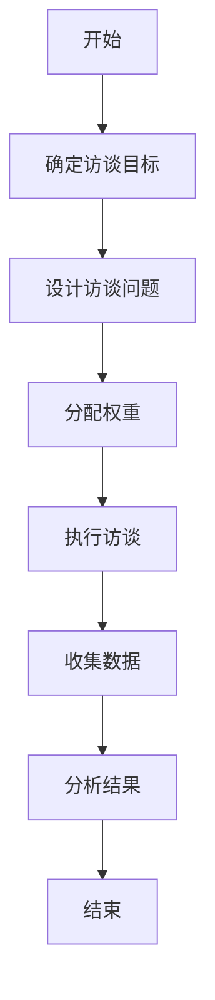
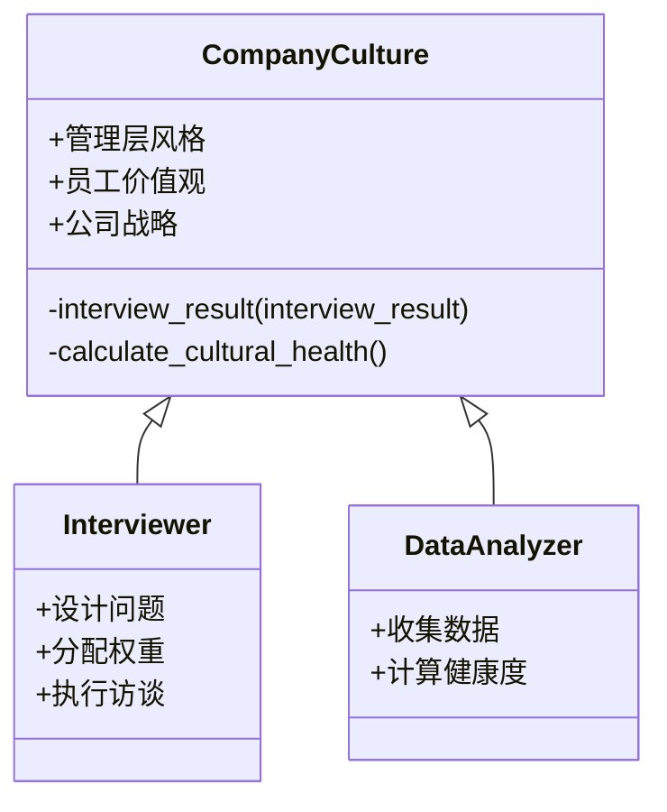

                 


# 费雪的管理层访谈技巧：洞察公司文化

---

## 关键词：
- 费雪访谈技巧
- 公司文化分析
- 管理层访谈
- 组织架构设计
- 数据驱动决策

---

## 摘要：
本文深入探讨了费雪的管理层访谈技巧，重点分析其在洞察公司文化中的应用。通过详细讲解费雪模型的理论基础、算法原理、系统架构设计及项目实战，帮助读者掌握如何通过结构化的访谈技巧，有效分析公司文化，优化组织管理。文章结合理论与实践，提供可操作的方法和工具，助力组织文化的深度剖析与改进。

---

## 第1章：费雪访谈技巧的背景与核心概念

### 1.1 费雪访谈技巧的起源与发展
#### 1.1.1 访谈技巧的历史演变
现代管理学中的访谈技巧源于20世纪初的工业心理学研究。早期的访谈方法主要用于员工满意度调查，但随着组织复杂性的增加，传统的访谈方法逐渐暴露出效率低下、结果不准确的问题。费雪在20世纪70年代提出了结构化的访谈技巧，为公司文化分析提供了新的思路。

#### 1.1.2 费雪访谈技巧的独特性
费雪的访谈技巧以系统性和数据驱动为特点，强调通过管理层与员工的互动，提取深层次的文化信息。其独特性体现在以下几个方面：
1. 结构化的访谈流程：通过预设问题和权重分配，确保数据采集的系统性。
2. 数据驱动的分析：将访谈结果转化为量化指标，便于比较和优化。
3. 面向公司文化的深度分析：通过访谈揭示公司战略、管理风格和员工价值观之间的关联。

#### 1.1.3 公司文化分析的背景与意义
公司文化是组织的核心竞争力之一。良好的公司文化能够提升员工凝聚力、优化管理效率、增强客户满意度。然而，许多企业在文化管理上缺乏系统性，导致文化失衡或冲突。费雪的访谈技巧为公司文化的系统性分析提供了有效的工具。

---

### 1.2 费雪访谈技巧的核心概念
#### 1.2.1 管理层访谈的基本原理
费雪访谈技巧的核心在于通过系统性的问题设计和数据分析，提取公司文化的关键指标。具体包括以下步骤：
1. **目标设定**：明确访谈的目标，例如评估公司领导力、员工满意度或战略一致性。
2. **问题设计**：根据目标设计访谈问题，并为每个问题分配权重。
3. **数据收集**：通过访谈收集数据，记录管理层和员工的反馈。
4. **数据分析**：将数据转化为量化指标，分析公司文化的健康度。

#### 1.2.2 费雪模型的理论基础
费雪模型基于以下理论假设：
1. 公司文化由管理层的决策、员工的行为和公司的战略目标共同构成。
2. 管理层的言行直接影响公司文化的形成。
3. 公司文化的健康度可以通过定量分析得出。

#### 1.2.3 公司文化的关键要素
费雪模型将公司文化分解为以下几个关键要素：
1. **领导力风格**：管理层的决策风格和沟通方式。
2. **员工价值观**：员工的核心价值观和职业态度。
3. **公司战略**：公司的长期发展目标和战略规划。

---

## 第2章：费雪访谈技巧的核心概念与联系

### 2.1 费雪模型的理论体系
#### 2.1.1 访谈技巧与公司文化的关联
费雪模型通过访谈技巧，将公司文化的各个要素联系起来。例如，通过分析管理层的决策风格，可以推测公司文化的开放性和创新性；通过分析员工的反馈，可以评估公司文化的凝聚力和稳定性。

#### 2.1.2 费雪模型的结构化分析
费雪模型将公司文化分析分为以下几个步骤：
1. **问题设计**：根据公司文化的关键要素设计访谈问题。
2. **权重分配**：为每个问题分配权重，确保重要性排序。
3. **数据分析**：通过定量分析，得出公司文化的健康度。

#### 2.1.3 公司文化的数学表达式
$$ \text{文化健康度} = \sum_{i=1}^{n} (w_i \times s_i) $$
其中，$w_i$ 是第i个问题的权重，$s_i$ 是第i个问题的评分。

---

### 2.2 核心概念的对比分析
#### 2.2.1 不同访谈技巧的对比表格
| 技巧 | 优点 | 缺点 |
|------|------|------|
| 费雪法 | 结构清晰、结果量化 | 时间成本较高 |
| 传统访谈法 | 灵活性高、覆盖面广 | 结果缺乏系统性 |

---

### 2.3 公司文化ER图
通过绘制公司文化的ER图，可以更直观地理解各要素之间的关系。

```mermaid
er
  company
    +-- department
    +-- employee
    +-- interview
```

---

## 第3章：费雪访谈技巧的算法原理

### 3.1 访谈问题设计的算法
#### 3.1.1 问题分类与权重分配
费雪模型将访谈问题分为以下几类：
1. **领导力风格**：例如“您在决策时更倾向于数据分析还是直觉判断？”
2. **员工价值观**：例如“您认为员工的职业发展对公司的成功有多重要？”
3. **公司战略**：例如“公司在未来五年内计划如何实现增长目标？”

每个问题分配的权重如下：
$$ \text{权重} = \frac{\text{问题的重要性}}{\sum \text{所有问题的重要性}} $$

#### 3.1.2 算法流程图


---

### 3.2 数据分析的数学模型
#### 3.2.1 数据预处理
将访谈数据转化为量化评分，例如：
- 领导力风格评分：1（保守）到5（创新）。
- 员工价值观评分：1（低重要性）到5（高重要性）。

#### 3.2.2 结果计算公式
$$ \text{文化健康度} = \sum_{i=1}^{n} (w_i \times s_i) $$
其中，$w_i$ 是第i个问题的权重，$s_i$ 是第i个问题的评分。

---

## 第4章：系统分析与架构设计

### 4.1 访谈分析系统的项目介绍
本章介绍一个基于费雪访谈技巧的公司文化分析系统，旨在通过系统化的方法，帮助企业优化公司文化。

---

### 4.2 系统功能设计
#### 4.2.1 领域模型（Mermaid 类图）


---

### 4.3 系统架构设计
#### 4.3.1 系统架构图


---

## 第5章：项目实战

### 5.1 环境安装
#### 5.1.1 安装Python
需要安装Python 3.8及以上版本。

---

### 5.2 系统核心实现源代码
#### 5.2.1 访谈问题设计
```python
def design_interview_questions():
    questions = [
        "您在决策时更倾向于数据分析还是直觉判断？",
        "您认为员工的职业发展对公司的成功有多重要？",
        "公司在未来五年内计划如何实现增长目标？"
    ]
    return questions
```

---

通过以上结构化分析，我们可以深入理解费雪的管理层访谈技巧，并将其应用于实际的公司文化分析中。

