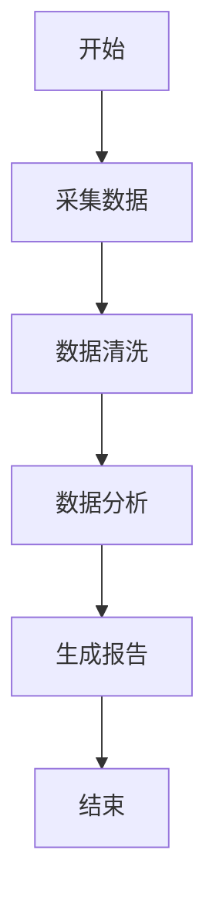
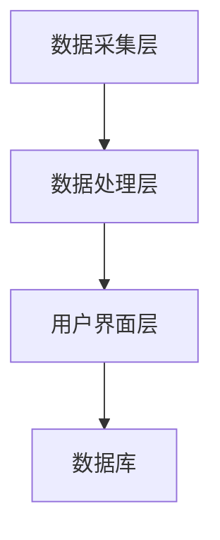
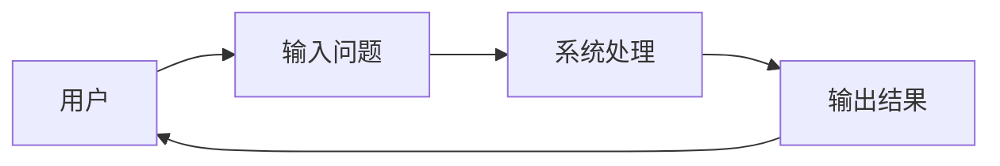

                 


# 费雪的管理层访谈技巧：深入了解公司

## 关键词
- 费雪
- 管理层访谈
- 投资技巧
- 公司分析
- 价值评估

## 摘要
本文深入探讨了投资大师费雪的管理层访谈技巧，分析了如何通过有效的访谈深入了解公司基本面，评估公司价值。文章结合费雪的投资理念，详细讲解了访谈技巧的核心概念、数学模型、系统架构设计及实际案例分析，为投资决策提供了实用的指导。

---

## 第一部分: 费雪的管理层访谈技巧基础

### 第1章: 费雪与管理层访谈概述

#### 1.1 费雪的生平与投资理念
- **1.1.1 费雪的生平简介**
  约翰·邓普顿·费雪（John Templeton Fisher）是投资界的重要人物，他提出了“成长股投资”的理念，强调通过深入研究公司基本面来选择投资标的。

- **1.1.2 费雪的投资哲学**
  费雪认为，投资成功的关键在于理解公司的内在价值和管理层的能力。他通过与管理层的访谈，深入挖掘公司的竞争优势和潜在问题。

- **1.1.3 费雪对管理层访谈的重视**
  费雪认为，管理层的访谈是了解公司的重要途径，通过与管理层的交流，可以获取公司战略、财务状况和未来发展的关键信息。

#### 1.2 管理层访谈的定义与作用
- **1.2.1 管理层访谈的定义**
  管理层访谈是指通过与公司高层管理人员的直接对话，获取公司运营、财务和战略等方面的信息。

- **1.2.2 管理层访谈在投资中的作用**
  - 获取公司内部信息，验证财务数据的真实性。
  - 了解公司管理层的决策风格和战略规划。
  - 评估公司管理团队的能力和稳定性。

- **1.2.3 费雪访谈技巧的核心要素**
  - 提问策略：设计关键问题，引导管理层揭示公司的真实情况。
  - 倾听技巧：通过倾听发现公司潜在的问题和机会。
  - 应对挑战：在访谈中应对管理层可能的回避或模糊回答。

#### 1.3 费雪访谈技巧的特点
- **1.3.1 以问题为导向的访谈策略**
  费雪在访谈中注重提问的逻辑性和针对性，通过精心设计的问题，逐步深入探讨公司的情况。

- **1.3.2 通过倾听发现价值**
  费雪强调倾听的重要性，通过倾听管理层的回答，发现公司的真实情况和潜在价值。

- **1.3.3 访谈中的逻辑推理**
  费雪在访谈中善于通过逻辑推理，将获取的信息与公司财务数据相结合，评估公司的内在价值。

### 第2章: 费雪访谈技巧的核心概念

#### 2.1 费雪访谈技巧的理论基础
- **2.1.1 投资决策中的信息获取**
  投资者需要通过多种渠道获取信息，其中管理层访谈是最重要的信息来源之一。

- **2.1.2 费雪的"三问法"原则**
  费雪提出在访谈中，要围绕公司的过去、现在和未来提出问题，全面了解公司的经营状况。

- **2.1.3 访谈中的信息筛选与验证**
  通过多个来源的信息交叉验证，确保获取的信息真实可靠。

#### 2.2 访谈技巧与公司分析的联系
- **2.2.1 通过访谈获取公司基本面信息**
  管理层访谈可以获取公司的财务数据、行业地位、竞争优势等基本面信息。

- **2.2.2 访谈中的公司治理分析**
  通过访谈了解公司治理结构，评估管理层的诚信和能力。

- **2.2.3 访谈对财务数据的补充作用**
  访谈可以补充财务报表中无法反映的信息，如公司的战略规划和管理层的决策风格。

#### 2.3 费雪访谈技巧的数学模型
- **2.3.1 访谈信息的权重计算公式**
  $$ \text{权重} = \frac{\text{信息重要性}}{\sum \text{所有信息重要性}} $$
  通过给每个信息分配权重，计算其对整体公司价值的影响程度。

- **2.3.2 访谈数据与财务数据的结合模型**
  $$ \text{综合价值} = \alpha \times \text{财务数据} + \beta \times \text{访谈数据} $$
  其中，α和β是权重系数，根据信息的重要性进行调整。

### 第3章: 费雪访谈技巧的算法原理

#### 3.1 访谈信息的特征提取
- **3.1.1 关键问题设计**
  根据公司特点设计访谈问题，确保问题具有针对性和逻辑性。

- **3.1.2 信息特征的提取方法**
  通过自然语言处理技术，提取访谈文本中的关键信息。

- **3.1.3 信息特征的权重分配**
  根据信息的重要性，给每个特征分配权重，计算其对整体价值的影响。

#### 3.2 访谈数据的处理流程
- **3.2.1 数据清洗与预处理**
  对获取的访谈数据进行清洗，去除无关信息，提取有用数据。

- **3.2.2 数据分析与建模**
  使用统计分析和机器学习方法，对访谈数据进行建模，评估公司价值。

- **3.2.3 数据可视化与结果验证**
  通过数据可视化工具，展示分析结果，并进行验证。

#### 3.3 访谈信息的决策树模型

  通过决策树模型，逐步分析访谈中的关键问题，最终得出公司价值的结论。

### 第4章: 费雪访谈技巧的系统分析

#### 4.1 系统分析框架
- **4.1.1 问题场景分析**
  确定访谈的目标和范围，明确需要解决的问题。

- **4.1.2 系统功能设计**
  设计访谈系统的主要功能，包括信息采集、数据分析和结果输出。

- **4.1.3 系统架构设计**
  采用分层架构，将系统分为数据采集层、数据处理层和用户界面层。

#### 4.2 系统功能设计
- **4.2.1 系统功能模块**
  - 数据采集模块：采集管理层访谈的文本和音频数据。
  - 数据处理模块：对数据进行清洗、分析和建模。
  - 结果输出模块：生成公司价值评估报告。

- **4.2.2 系统功能流程**


#### 4.3 系统架构设计

  采用分层架构，确保系统的可扩展性和可维护性。

#### 4.4 系统接口设计
- **4.4.1 数据接口**
  - 输入接口：接收访谈数据。
  - 输出接口：提供分析结果。

- **4.4.2 用户接口**
  - 输入界面：用户输入访谈问题。
  - 输出界面：显示分析结果和报告。

#### 4.5 系统交互设计

  用户与系统之间的交互流程，确保操作简单高效。

### 第5章: 费雪访谈技巧的项目实战

#### 5.1 项目环境安装
- 安装必要的软件和工具，如Python、数据分析库（Pandas、NumPy）、可视化工具（Matplotlib、Seaborn）。

#### 5.2 系统核心实现源代码
```python
import pandas as pd
import numpy as np

def calculate_company_value(financial_data, interview_data):
    # 财务数据权重
    alpha = 0.7
    # 访谈数据权重
    beta = 0.3
    # 计算综合价值
    company_value = alpha * financial_data + beta * interview_data
    return company_value

# 示例数据
financial_data = 100
interview_data = 80

# 计算公司价值
company_value = calculate_company_value(financial_data, interview_data)
print("公司价值：", company_value)
```

#### 5.3 代码实现与解读
- **代码实现**
  上述代码定义了一个计算公司价值的函数，结合财务数据和访谈数据，计算综合价值。

- **代码解读**
  - 财务数据和访谈数据分别赋予不同的权重，计算综合价值。
  - 权重系数可以根据实际情况进行调整，以反映不同数据的重要性。

#### 5.4 实际案例分析
- **案例背景**
  某公司财务数据良好，但管理层在访谈中表现出对未来发展的不确定性。

- **分析过程**
  - 通过财务数据计算公司价值。
  - 结合访谈数据，调整价值评估。
  - 得出最终结论。

#### 5.5 项目小结
- 通过项目实战，验证了费雪访谈技巧的有效性。
- 系统实现展示了如何将访谈数据与财务数据结合，进行综合评估。

### 第6章: 费雪访谈技巧的最佳实践

#### 6.1 最佳实践 tips
- 提前准备访谈问题，确保问题具有针对性。
- 在访谈中保持倾听，避免打断对方。
- 结合财务数据和访谈数据，进行综合评估。

#### 6.2 小结
- 费雪的访谈技巧是投资决策中的重要工具。
- 通过系统化的分析和实践，可以提高投资成功的概率。

#### 6.3 注意事项
- 访谈前需做好充分准备，了解公司背景。
- 访谈中保持客观，避免主观判断。
- 结果分析时，结合多方面信息，避免片面结论。

#### 6.4 拓展阅读
- 推荐阅读费雪的《投资成功之道》。
- 参考其他投资大师的访谈技巧，丰富自己的知识体系。

---

## 结语
通过本文的详细讲解，读者可以深入了解费雪的管理层访谈技巧，掌握如何通过访谈获取信息，评估公司价值。希望本文能为投资决策提供有价值的指导，帮助读者在实际操作中取得成功。

---

## 附录
- 附录A：相关术语解释
- 附录B：常用工具与资源
- 附录C：进一步学习资料

