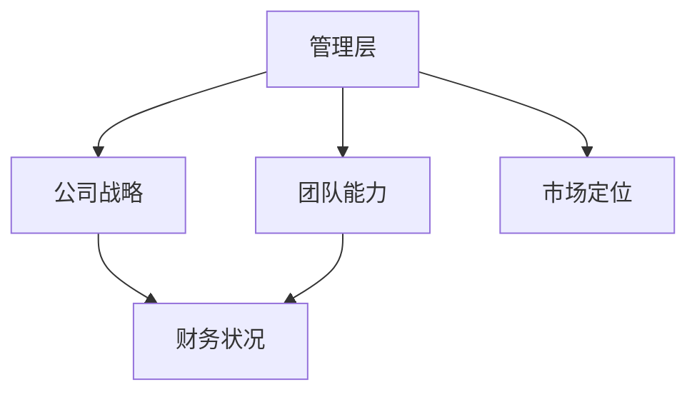
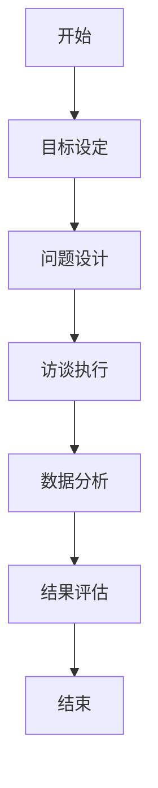
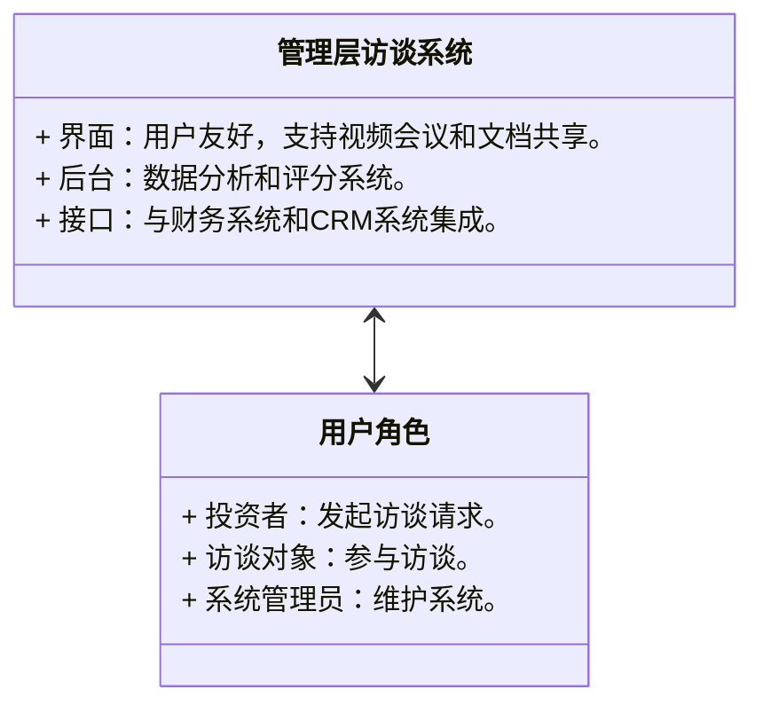
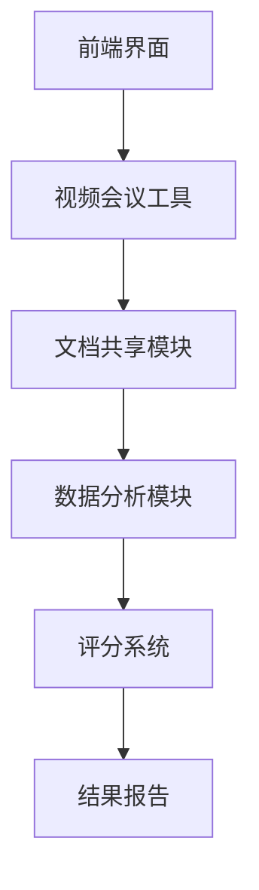

                 


# 费雪的管理层访谈技巧：远程尽职调查的新方法

## 关键词：费雪访谈技巧、远程尽职调查、管理层访谈、投资分析、企业评估

## 摘要：本文介绍了费雪的管理层访谈技巧，并探讨了其在远程尽职调查中的应用。通过结构化的方法，详细讲解了如何通过远程访谈有效评估企业价值和风险，为投资决策提供支持。

---

## 第一部分：背景介绍

### 第1章：尽职调查的基本概念

#### 1.1 问题背景

- **什么是尽职调查？**
  尽职调查（Due Diligence）是指在商业交易或投资前，对目标公司进行详细调查，以评估其价值、风险和潜在问题。

- **尽职调查的目的与意义**
  - 确保投资决策的准确性。
  - 降低商业风险。
  - 发现潜在问题并制定应对策略。

- **尽职调查的常见类型**
  - 财务尽职调查。
  - 法律尽职调查。
  - 业务尽职调查。
  - 内部控制尽职调查。

#### 1.2 问题描述

- **现有尽职调查方法的局限性**
  - 时间和成本较高。
  - 依赖现场考察，灵活性不足。
  - 依赖文件和数据，难以全面评估管理层能力。

- **远程尽职调查的需求与挑战**
  - 疫情影响下远程工作的普及。
  - 需要依赖技术手段进行评估。
  - 如何确保数据的真实性和完整性。

- **管理层访谈在尽职调查中的重要性**
  - 通过访谈直接了解公司战略、管理风格和团队能力。
  - 发现潜在问题，如管理不善或战略不清。

#### 1.3 问题解决

- **费雪访谈技巧的提出**
  费雪提出了一套结构化的访谈方法，通过特定的问题和分析技巧，评估管理层的能力和公司潜力。

- **远程尽职调查的新方法**
  利用视频会议、在线文档和数据分析工具，结合费雪的访谈技巧，进行远程评估。

- **费雪访谈技巧的核心优势**
  - 高效：通过结构化问题快速获取关键信息。
  - 深入：深入分析管理层的回答，发现潜在问题。
  - 灵活：适用于远程环境，减少现场考察的依赖。

#### 1.4 边界与外延

- **费雪访谈技巧的适用范围**
  - 适用于中高层管理岗位评估。
  - 适用于投资、并购等商业决策。
  - 适用于远程或面对面的访谈环境。

- **远程尽职调查的边界条件**
  - 需要可靠的网络和视频会议工具。
  - 访谈对象的配合度。
  - 数据安全和隐私保护。

- **费雪访谈技巧的可扩展性**
  可扩展到不同行业和规模的企业，适合不同类型的商业决策。

#### 1.5 概念结构与核心要素组成

- **尽职调查的流程模型**
  ```mermaid
  graph TD
    A[尽职调查] --> B[目标设定]
    B --> C[信息收集]
    C --> D[分析评估]
    D --> E[报告撰写]
  ```

- **管理层访谈的要素分解**
  - 访谈目标：明确访谈目的和关键问题。
  - 访谈对象：选择合适的管理层人员。
  - 访谈工具：使用结构化的问题列表和评分系统。
  - 访谈结果：分析回答，评估管理层能力。

---

## 第二部分：核心概念与联系

### 第2章：管理层访谈技巧的核心原理

#### 2.1 核心概念原理

- **费雪访谈法的核心要素**
  - 结构化问题：设计关键问题，涵盖战略、财务、团队等方面。
  - 深入分析：通过回答评估管理层的真实能力和潜在问题。
  - 定量与定性结合：使用评分系统和定性分析，确保评估的客观性。

- **远程访谈的技术支撑**
  - 视频会议工具：如Zoom、Teams，确保高质量的访谈。
  - 在线文档共享：如Google Docs，方便实时记录和分析。
  - 数据分析工具：如Excel或Power BI，进行数据整理和可视化。

- **管理层访谈的逻辑结构**
  ```mermaid
  graph TD
    A[管理层访谈] --> B[战略评估]
    B --> C[团队能力评估]
    C --> D[财务状况评估]
    D --> E[风险评估]
  ```

#### 2.2 核心概念属性对比

- **管理层访谈与传统尽职调查的对比**
  | 对比维度 | 管理层访谈 | 传统尽职调查 |
  |----------|------------|--------------|
  | 信息来源 | 口述 | 文件和数据 |
  | 时间效率 | 高 | 低 |
  | 深入程度 | 深 | 浅 |
  | 成本 | 低 | 高 |

- **费雪访谈法与其它访谈方法的对比**
  | 方法 | 费雪访谈法 | 其它方法 |
  |------|------------|----------|
  | 结构化 | 是 | 否 |
  | 定量评估 | 是 | 否 |
  | 深入分析 | 是 | 否 |

- **远程访谈与面对面访谈的对比**
  | 对比维度 | 远程访谈 | 面对面访谈 |
  |----------|----------|-------------|
  | 灵活性 | 高 | 低 |
  | 成本 | 低 | 高 |
  | 便利性 | 高 | 低 |

#### 2.3 ER实体关系图



---

## 第三部分：算法原理讲解

### 第3章：费雪访谈法的算法原理

#### 3.1 算法流程图



#### 3.2 核心算法代码示例

```python
def fisher_interview_analysis(responses):
    # 分数初始化
    score = 0
    # 问题权重
    weights = {
        '战略问题': 0.4,
        '财务问题': 0.3,
        '团队问题': 0.2,
        '风险问题': 0.1
    }
    # 计算总分
    for question, answer in responses.items():
        # 根据回答质量评分
        score += weights[question] * (1 - abs(0.5 - answer_score(answer)))
    return score

def answer_score(answer):
    # 根据回答内容评分，范围0-1
    # 假设答案是文本形式，需进行自然语言处理
    # 这里简化为示例
    if '优秀' in answer:
        return 0.9
    elif '良好' in answer:
        return 0.7
    else:
        return 0.3
```

#### 3.3 数学模型与公式

- **评分公式**
  $$ \text{总分} = \sum (\text{权重}_i \times \text{评分}_i) $$

- **风险评估公式**
  $$ \text{风险评分} = \sum (\text{权重}_j \times \text{风险因素}_j) $$

---

## 第四部分：系统分析与架构设计方案

### 第4章：远程尽职调查系统架构

#### 4.1 项目介绍

- **系统目标**
  - 提供一个远程访谈工具，支持结构化访谈和数据分析。
  - 通过技术手段辅助尽职调查，提高效率和准确性。

#### 4.2 系统功能设计



#### 4.3 系统架构设计



#### 4.4 系统交互流程

```mermaid
sequenceDiagram
    投资者 -> 系统：发起访谈请求
    系统 -> 访谈对象：发送邀请
    访谈对象 -> 系统：确认参与
    投资者 -> 系统：设计访谈问题
    系统 -> 访谈对象：开始视频会议
    访谈对象 -> 系统：回答问题
    系统 -> 数据分析模块：处理数据
    数据分析模块 -> 系统：生成评分报告
    系统 -> 投资者：提供报告
```

---

## 第五部分：项目实战

### 第5章：远程尽职调查的实际应用

#### 5.1 项目介绍

- **项目背景**
  某投资机构计划投资一家科技公司，采用费雪访谈法进行远程尽职调查。

#### 5.2 系统实现

- **环境配置**
  - 使用Zoom进行视频会议。
  - 使用Google Workspace进行文档共享和数据分析。

- **代码实现**
  ```python
  import pandas as pd
  import numpy as np

  # 模拟数据
  responses = pd.DataFrame({
      '问题': ['战略问题', '财务问题', '团队问题', '风险问题'],
      '回答': ['我们计划扩展市场', '去年收入增长20%', '团队有20人', '主要风险是市场竞争'],
      '评分': [0.8, 0.7, 0.6, 0.5]
  })

  # 计算总分
  weights = [0.4, 0.3, 0.2, 0.1]
  total_score = np.dot(responses['评分'], weights)
  print(f"总评分为：{total_score}")
  ```

- **代码解读**
  使用Pandas进行数据整理，NumPy进行评分计算，结合权重得出总分。

#### 5.3 案例分析

- **案例背景**
  某科技公司面临市场竞争加剧的问题，管理层访谈显示团队能力较强，但市场策略不够明确。

- **分析与结论**
  投资者决定调整投资策略，加强市场推广支持。

#### 5.4 项目小结

- **系统优势**
  - 高效：节省时间和成本。
  - 深入：通过结构化访谈和数据分析，全面评估公司状况。
  - 灵活：适用于远程和现场环境。

---

## 第六部分：最佳实践

### 第6章：总结与建议

#### 6.1 最佳实践 tips

- **工具选择**
  - 视频会议：Zoom、Teams。
  - 文档共享：Google Docs、Notion。
  - 数据分析：Excel、Power BI。

- **数据安全**
  - 使用加密传输。
  - 确保访问权限控制。

- **访谈技巧**
  - 提前设计问题列表。
  - 灵活应对回答中的潜在问题。

#### 6.2 小结

费雪的管理层访谈技巧为远程尽职调查提供了高效、深入的方法，结合技术手段，能够有效评估企业价值和风险，为投资决策提供可靠支持。

#### 6.3 注意事项

- **数据真实性**
  - 确保回答的真实性，可能需要交叉验证。
- **访谈对象选择**
  - 确保访谈对象具有代表性。
- **技术依赖**
  - 确保技术工具的稳定性和可靠性。

#### 6.4 拓展阅读

- **推荐书籍**
  - 《费雪投资哲学》
  - 《远程工作革命》
- **相关工具**
  - Zoom、Microsoft Teams、Notion、Excel

---

## 结语

费雪的管理层访谈技巧结合远程尽职调查的新方法，为现代投资和商业决策提供了有力的工具。通过结构化访谈、数据分析和系统支持，投资者能够更高效、更准确地评估目标公司，降低风险，抓住机遇。

---

**（全文完）**

