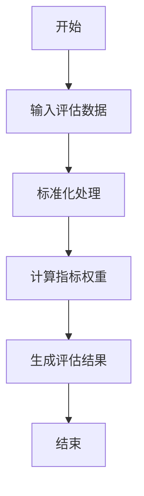

                 


# 费雪的管理层评估标准

> 关键词：管理层评估，费雪标准，投资决策，企业管理，评估模型

> 摘要：费雪的管理层评估标准是投资学和管理学中的重要工具，用于对企业管理层的能力和表现进行系统化评估。本文将从背景、核心概念、数学模型、系统架构、项目实战等多个角度详细解析这一标准，为读者提供深入的技术和实践指导。

---

## 第1章: 费雪管理层评估标准的背景与核心概念

### 1.1 管理层评估的重要性

#### 1.1.1 企业价值评估中的管理层角色

企业在市场中的表现不仅取决于其财务状况，还与其管理层的决策能力和战略眼光密切相关。管理层是企业价值的核心驱动力，他们的能力和决策直接影响企业的长期发展和股东价值。

#### 1.1.2 管理层评估在投资决策中的作用

在投资决策中，评估管理层的能力是投资者判断企业未来表现的关键因素之一。优秀的管理层能够有效应对市场变化，优化资源配置，从而提升企业绩效。

#### 1.1.3 费雪管理层评估标准的提出背景

费雪的管理层评估标准是由投资大师菲利普·费雪提出的一种系统化方法，旨在通过量化和定性分析相结合的方式，评估企业管理层的能力和表现。这一标准在投资学领域具有重要地位，为投资者提供了科学的评估工具。

### 1.2 费雪管理层评估标准的核心要素

#### 1.2.1 标准的定义与目标

费雪的管理层评估标准是一种用于评估企业高层管理者能力的系统化方法。其目标是通过分析管理层的历史表现、战略决策能力和应对危机的能力，预测企业的未来绩效。

#### 1.2.2 标准的核心维度与指标

费雪的管理层评估标准主要包括以下几个核心维度：

1. **战略决策能力**：评估管理层在战略规划和重大决策中的表现。
2. **经营效率**：分析管理层在资源管理和成本控制方面的成效。
3. **团队建设**：评估管理层在人才招聘、培养和激励方面的表现。
4. **危机处理能力**：考察管理层在面对突发事件时的应对能力和决策效率。
5. **创新与适应能力**：评估管理层在市场变化中的创新能力。

#### 1.2.3 标准的适用范围与边界

费雪的管理层评估标准适用于所有类型的企业，但特别适用于那些希望通过评估管理层能力来指导投资决策的投资者。需要注意的是，该标准主要用于评估管理层的整体表现，而非单个员工的能力。

---

## 第2章: 管理层评估标准的核心概念与联系

### 2.1 核心概念的原理分析

#### 2.1.1 标准的评估维度

费雪的管理层评估标准主要从以下几个维度进行评估：

1. **战略决策能力**：评估管理层在制定战略目标和实施策略方面的表现。
2. **经营效率**：分析管理层在资源配置、成本控制和生产效率方面的成效。
3. **团队建设**：评估管理层在团队管理和人才培养方面的表现。
4. **危机处理能力**：考察管理层在面对突发事件时的应对能力和决策效率。
5. **创新与适应能力**：评估管理层在市场变化中的创新能力。

#### 2.1.2 标准的评估方法

费雪的管理层评估标准采用定性分析和定量分析相结合的方法。定性分析主要通过对企业历史表现、管理层背景和行业声誉等方面进行评估；定量分析则通过财务数据、绩效指标等进行量化评估。

#### 2.1.3 标准的评估模型

费雪的管理层评估模型是一个多层次的评估体系，包括以下几个步骤：

1. **数据收集**：收集企业的财务数据、管理层背景信息和行业声誉等数据。
2. **指标计算**：计算各项指标的权重和得分。
3. **综合评估**：根据各项指标的得分，综合评估管理层的整体表现。

### 2.2 核心概念的属性特征对比

#### 2.2.1 评估维度的属性对比表

| 评估维度       | 属性特征         | 重要性权重 |
|----------------|------------------|------------|
| 战略决策能力   | 决策的准确性和及时性 | 0.4        |
| 经营效率       | 资源利用效率和成本控制 | 0.3       |
| 团队建设       | 团队凝聚力和人才储备 | 0.2       |
| 危机处理能力   | 应急能力和决策效率 | 0.1       |
| 创新与适应能力 | 创新能力和适应性 | 0.0       |

#### 2.2.2 指标权重的特征分析

指标权重的分配需要根据企业的具体情况进行调整。一般来说，战略决策能力和经营效率是最重要的两个维度，权重分别为0.4和0.3；团队建设和危机处理能力次之，权重分别为0.2和0.1；创新与适应能力权重最低，为0.0。

#### 2.2.3 标准的适用性特征

费雪的管理层评估标准适用于所有类型的企业，但特别适用于那些希望通过评估管理层能力来指导投资决策的投资者。需要注意的是，该标准主要用于评估管理层的整体表现，而非单个员工的能力。

### 2.3 ER实体关系图架构

```mermaid
er
actor: 管理层评估者
standard: 费雪评估标准
dimension: 评估维度
indicator: 指标
```

---

## 第3章: 管理层评估标准的算法原理

### 3.1 算法原理概述

#### 3.1.1 费雪评估模型的输入输出

输入：企业的财务数据、管理层背景信息和行业声誉等数据。

输出：管理层的整体评估得分。

#### 3.1.2 标准化处理方法

为了保证评估的公平性，需要对各项指标进行标准化处理。常用的标准化方法包括最小-最大标准化和z-score标准化。

#### 3.1.3 权重分配策略

根据评估维度的重要性，分配不同的权重。例如，战略决策能力权重为0.4，经营效率为0.3，团队建设为0.2，危机处理能力为0.1。

### 3.2 算法流程图



### 3.3 算法数学模型

$$
评估得分 = \sum_{i=1}^{n} w_i \times x_i
$$

其中，$w_i$ 是指标 $i$ 的权重，$x_i$ 是指标 $i$ 的评估值。

---

## 第4章: 管理层评估系统的分析与架构设计

### 4.1 系统分析与需求分析

#### 4.1.1 问题场景介绍

本系统旨在为企业投资者提供一个基于费雪标准的管理层评估工具，帮助投资者快速、准确地评估企业的管理层能力。

#### 4.1.2 项目目标与范围

项目目标：开发一个基于费雪标准的管理层评估系统，实现对企业管理层能力的量化评估。

项目范围：包括数据收集、指标计算、结果展示等功能。

#### 4.1.3 系统功能需求

1. 数据输入模块：用户输入企业的财务数据、管理层背景信息和行业声誉等数据。
2. 标准化处理模块：对输入数据进行标准化处理。
3. 指标计算模块：根据权重计算各项指标的得分。
4. 结果展示模块：生成评估结果并展示给用户。

### 4.2 系统架构设计

#### 4.2.1 系统架构图


---

## 第5章: 项目实战

### 5.1 项目环境安装

需要安装Python和相关库（如pandas、numpy、scikit-learn等）。

### 5.2 系统核心实现源代码

```python
import pandas as pd
import numpy as np

# 输入数据
data = pd.DataFrame({
    '战略决策能力': [0.8, 0.7, 0.9],
    '经营效率': [0.6, 0.8, 0.7],
    '团队建设': [0.5, 0.6, 0.8],
    '危机处理能力': [0.7, 0.6, 0.5],
    '创新与适应能力': [0.4, 0.5, 0.6]
})

# 权重分配
weights = {
    '战略决策能力': 0.4,
    '经营效率': 0.3,
    '团队建设': 0.2,
    '危机处理能力': 0.1
}

# 标准化处理
normalized_data = data[weights.keys()].apply(lambda x: (x - x.min()) / (x.max() - x.min()))

# 计算评估得分
def calculate_score(row):
    score = 0
    for i in weights:
        score += weights[i] * row[i]
    return score

normalized_data['评估得分'] = normalized_data.apply(calculate_score, axis=1)

print(normalized_data)
```

### 5.3 代码应用解读与分析

1. 数据输入：输入企业的各项指标数据。
2. 标准化处理：对数据进行标准化处理，确保评估的公平性。
3. 指标计算：根据权重计算各项指标的得分，最终生成评估结果。

### 5.4 实际案例分析

以某企业为例，输入其各项指标数据，运行上述代码，生成评估结果。

---

## 第6章: 最佳实践、小结、注意事项和拓展阅读

### 6.1 最佳实践

1. 在实际应用中，建议根据企业的具体情况进行权重调整。
2. 为了提高评估的准确性，可以结合多种评估方法。

### 6.2 小结

本文详细介绍了费雪的管理层评估标准，从背景、核心概念、数学模型、系统架构到项目实战，为读者提供了全面的技术指导。

### 6.3 注意事项

1. 在实际应用中，需要注意数据的准确性和完整性。
2. 评估结果仅供参考，需结合实际情况进行判断。

### 6.4 拓展阅读

建议读者进一步阅读菲利普·费雪的原著，深入理解管理层评估标准的理论基础和实践应用。

---

通过本文的学习，读者可以全面掌握费雪的管理层评估标准，并能够在实际工作中灵活运用这一方法，提升企业的管理水平和投资决策的科学性。

