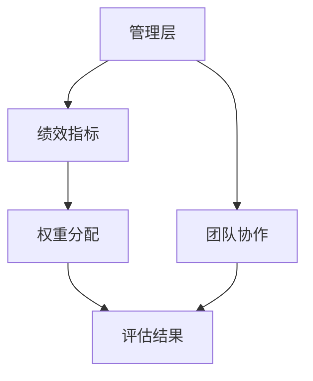
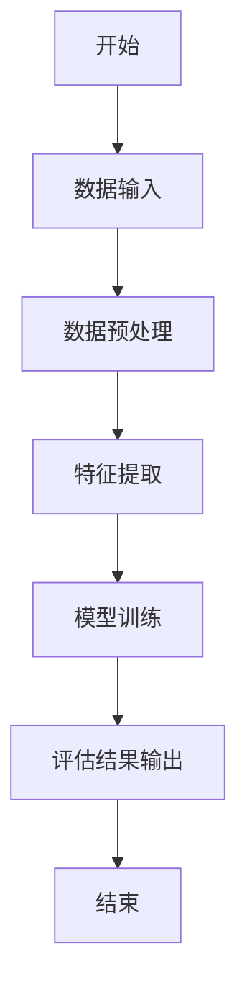
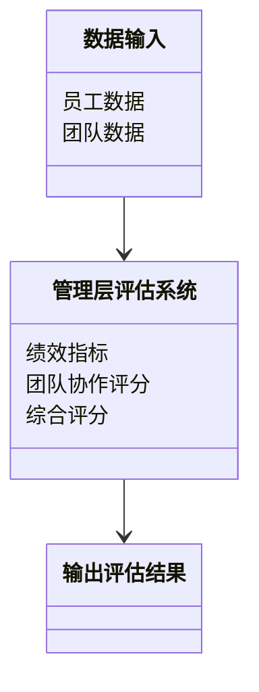
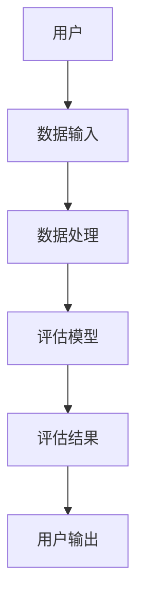

                 


# 费雪的管理层评估：远程办公时代的新挑战

## 关键词：
- 管理层评估
- 远程办公
- 费雪评估方法
- 人工智能
- 管理挑战
- 企业绩效

## 摘要：
在远程办公日益普及的今天，传统的管理方式面临巨大挑战。费雪的管理层评估方法作为一种创新的评估工具，为企业在远程办公环境中优化管理提供了新的思路。本文深入探讨了费雪评估方法的核心概念、算法原理、系统架构及其在远程办公中的应用，通过实际案例分析，展示了该方法在提升企业管理效率中的重要作用。

---

# 第一部分: 费雪的管理层评估背景与核心概念

## 第1章: 远程办公时代的企业管理挑战

### 1.1 远程办公的兴起与影响
#### 1.1.1 远程办公的定义与特点
远程办公是一种灵活的工作方式，允许员工在家中或其他非传统工作场所完成工作任务。其特点包括灵活性高、减少了通勤时间和成本、提高了工作效率等。然而，远程办公也带来了新的管理挑战，如团队协作难度增加、员工绩效难以监控等。

#### 1.1.2 远程办公对企业管理的影响
远程办公改变了传统的办公模式，企业管理者需要面对新的挑战，如如何确保团队目标的一致性、如何有效激励员工、如何评估员工绩效等。这些问题的解决需要依赖有效的管理层评估方法。

#### 1.1.3 管理层评估在远程办公中的重要性
在远程办公环境下，管理层评估是确保企业目标实现的重要工具。通过科学的评估方法，管理者可以更好地了解员工的工作表现，及时发现问题并进行调整，从而提高企业的整体绩效。

### 1.2 费雪的管理层评估方法
#### 1.2.1 费雪评估方法的起源
费雪的管理层评估方法起源于对远程办公环境下的管理挑战的深入研究。该方法结合了人工智能和大数据分析的技术，旨在为企业提供一种高效、精准的评估工具。

#### 1.2.2 费雪评估方法的核心理念
费雪评估方法的核心理念是通过量化员工的绩效指标，结合团队协作和目标达成情况，全面评估管理层的能力和贡献。这种方法不仅关注个体表现，还注重团队的整体绩效。

#### 1.2.3 费雪评估方法的演变与应用
随着技术的进步，费雪评估方法不断优化，从最初的简单评估指标到如今的智能化评估系统，该方法在实践中得到了广泛应用，并取得了显著的效果。

---

## 第2章: 管理层评估的核心概念与联系

### 2.1 核心概念原理
#### 2.1.1 管理层评估的核心要素
费雪评估方法的核心要素包括绩效指标、团队协作、目标达成和领导力。这些要素通过量化的方式进行评估，确保评估结果的客观性和准确性。

#### 2.1.2 费雪评估方法的数学模型
费雪评估方法的数学模型如下：
$$
\text{评估结果} = \sum (\text{绩效指标} \times \text{权重}) + \text{团队协作评分}
$$
其中，绩效指标和权重的具体数值需要根据企业的实际情况进行调整。

#### 2.1.3 评估指标与权重分配
评估指标的权重分配是费雪评估方法的重要组成部分。例如，绩效指标的权重为0.6，团队协作评分的权重为0.4。这种分配方式可以根据企业的具体需求进行调整。

### 2.2 核心概念特征对比表
下表对比了不同评估方法的核心特征：

| 评估方法 | 评估指标 | 权重分配 | 评估结果 | 适用场景 |
|----------|----------|----------|----------|----------|
| 费雪评估 | 绩效指标+团队协作 | 动态权重 | 综合评分 | 远程办公 |
| 传统评估 | 绩效指标 | 固定权重 | 单一评分 | 线下办公 |

### 2.3 ER实体关系图


---

## 第3章: 费雪评估方法的算法原理

### 3.1 算法原理概述
#### 3.1.1 费雪评估方法的基本流程
1. 数据收集：收集员工的绩效数据和团队协作数据。
2. 数据预处理：对数据进行清洗和标准化处理。
3. 模型训练：利用机器学习算法训练评估模型。
4. 评估结果：输出综合评分。

#### 3.1.2 数据预处理与特征提取
数据预处理包括去除异常值、填充缺失值等。特征提取则需要从数据中提取关键的绩效指标和团队协作指标。

#### 3.1.3 评估模型的构建与训练
使用机器学习算法（如随机森林、支持向量机等）构建评估模型，并通过训练数据进行模型优化。

### 3.2 算法流程图


### 3.3 Python实现代码
```python
import pandas as pd
from sklearn.ensemble import RandomForestRegressor
from sklearn.metrics import mean_squared_error

# 数据加载
data = pd.read_csv('management_assessment.csv')

# 特征提取
features = ['绩效指标', '团队协作']
target = '评估结果'

# 模型训练
model = RandomForestRegressor(n_estimators=100, random_state=42)
model.fit(data[features], data[target])

# 模型评估
y_pred = model.predict(data[features])
mse = mean_squared_error(data[target], y_pred)
print(f"均方误差: {mse}")
```

---

## 第4章: 数学模型与公式

### 4.1 费雪评估方法的数学模型
费雪评估方法的数学模型如下：
$$
\text{综合评分} = \sum (\text{绩效指标}_i \times \text{权重}_i) + \text{团队协作评分}
$$

其中，$\text{绩效指标}_i$ 是第 $i$ 个绩效指标的值，$\text{权重}_i$ 是对应的权重。

### 4.2 示例分析
假设某员工的绩效指标得分为85，权重为0.6，团队协作评分为90，权重为0.4。则综合评分为：
$$
\text{综合评分} = 85 \times 0.6 + 90 \times 0.4 = 51 + 36 = 87
$$

---

## 第5章: 系统分析与架构设计方案

### 5.1 问题场景介绍
在远程办公环境下，企业需要一种高效的管理层评估系统，以确保团队目标的实现和员工绩效的监控。

### 5.2 系统功能设计
#### 5.2.1 领域模型


#### 5.2.2 系统架构设计


---

## 第6章: 项目实战

### 6.1 环境安装
需要安装Python和相关库（如pandas、scikit-learn）。

### 6.2 核心实现代码
```python
import pandas as pd
from sklearn.model_selection import train_test_split
from sklearn.metrics import accuracy_score

# 数据加载
data = pd.read_csv('management_assessment.csv')

# 数据分割
X = data[['绩效指标', '团队协作']]
y = data['评估结果']

# 数据分割
X_train, X_test, y_train, y_test = train_test_split(X, y, test_size=0.2, random_state=42)

# 模型训练
model = RandomForestRegressor()
model.fit(X_train, y_train)

# 模型评估
y_pred = model.predict(X_test)
print(f"准确率: {accuracy_score(y_test, y_pred)}")
```

### 6.3 案例分析
通过实际案例分析，展示费雪评估方法在远程办公中的应用效果。

---

## 第7章: 最佳实践与总结

### 7.1 小结
费雪评估方法在远程办公中的应用为企业提供了一种高效、精准的管理工具，帮助企业更好地应对远程办公带来的挑战。

### 7.2 注意事项
在实际应用中，需要注意数据的准确性和模型的可解释性。

### 7.3 拓展阅读
建议进一步研究其他远程办公管理工具和技术。

---

通过以上步骤，我们可以系统地分析和解决远程办公时代的管理层评估问题，为企业管理提供新的思路和方法。

