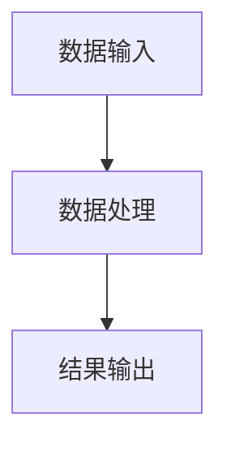

                 


# 费雪的管理层诚信评估方法

> 关键词：费雪、管理层诚信、投资评估、数学模型、系统架构

> 摘要：本文深入探讨了费雪提出的管理层诚信评估方法，从背景、核心概念、数学模型、系统架构到实际应用进行了全面分析。通过详细讲解费雪方法的理论基础、算法实现和实际案例，本文旨在为投资者提供一种科学、系统的评估工具，以帮助做出更明智的投资决策。

---

# 第1章: 费雪的管理层诚信评估方法概述

## 1.1 投资学中的管理层诚信问题

### 1.1.1 管理层诚信的重要性
在投资领域，管理层的诚信是决定企业长期价值的关键因素之一。一家公司如果管理层不诚信，可能会通过财务造假、内幕交易等行为损害投资者利益。因此，评估管理层诚信是投资决策中不可或缺的一部分。

### 1.1.2 管理层诚信问题的现状
尽管管理层诚信的重要性不言而喻，但在实际操作中，如何量化和评估管理层诚信仍是一个难题。传统的财务指标和基本面分析往往无法全面反映管理层的诚信状况。

### 1.1.3 费雪方法的提出背景
菲利普·费雪（Philip Fisher）是价值投资的先驱之一，他提出了许多至今仍被广泛应用的投资理念。在管理层诚信评估方面，费雪方法以其独特性和科学性成为投资领域的经典工具。

## 1.2 费雪的生平与投资理念

### 1.2.1 费雪的基本介绍
菲利普·费雪是20世纪美国著名的投资专家，被誉为“成长型股票投资之父”。他强调长期投资和对公司基本面的深入研究。

### 1.2.2 费雪的投资哲学
费雪的核心理念是：投资成功的关键在于选择那些具有强大成长潜力且管理层诚信可靠的公司。

### 1.2.3 费雪与价值投资的关联
虽然费雪的方法与传统价值投资有相似之处，但他的独特之处在于对管理层诚信的深入研究和系统评估。

## 1.3 管理层诚信评估的必要性

### 1.3.1 管理层诚信对投资的影响
诚信的管理层更有可能采取透明和负责任的决策，从而为股东创造长期价值。

### 1.3.2 现有评估方法的不足
传统评估方法往往忽视了管理层的内在品质和决策风格，而这些因素对投资结果有重要影响。

### 1.3.3 费雪方法的独特价值
费雪方法通过系统化的评估体系，将管理层诚信量化，为投资者提供了科学的决策依据。

## 1.4 本章小结
本章介绍了费雪的管理层诚信评估方法的背景和重要性，为后续的深入分析奠定了基础。

---

# 第2章: 管理层诚信的核心概念与框架

## 2.1 管理层诚信的定义与维度

### 2.1.1 管理层诚信的定义
管理层诚信是指公司在经营活动中遵循诚信原则，避免虚假陈述、欺诈行为的能力和意愿。

### 2.1.2 管理层诚信的维度分析
- **决策透明度**：管理层是否愿意公开公司的真实财务状况和经营策略。
- **道德标准**：管理层是否遵守职业道德，避免利益输送。
- **历史表现**：公司过去是否存在财务造假或其他不诚信行为。

### 2.1.3 管理层诚信的评价标准
- **财务数据的准确性**：公司财务报表是否真实反映经营状况。
- **管理层的稳定性**：管理层是否频繁变动。
- **投资者关系管理**：公司是否与投资者保持良好的沟通。

## 2.2 费雪方法的核心框架

### 2.2.1 方法的基本原理
费雪方法通过分析公司的财务数据、管理层的背景和历史表现，评估管理层的诚信程度。

### 2.2.2 方法的逻辑结构
1. 数据收集：获取公司的财务报表、管理层简历和行业报告。
2. 数据分析：通过数学模型评估管理层诚信。
3. 结果应用：将评估结果作为投资决策的参考。

### 2.2.3 方法的适用范围
费雪方法适用于成长型企业，尤其是那些依赖管理层决策的公司。

## 2.3 核心概念的对比分析

### 2.3.1 管理层诚信与其他投资指标的对比
- **市盈率**：反映市场对公司的估值，但无法直接评估管理层诚信。
- **ROE**：衡量公司盈利能力，但与管理层诚信无直接关系。

### 2.3.2 费雪方法与其他评估方法的对比
- **传统基本面分析**：侧重财务数据，忽视管理层因素。
- **费雪方法**：将管理层诚信纳入评估体系，更全面。

### 2.3.3 方法的优劣势分析
- **优势**：系统性强，量化管理层诚信。
- **劣势**：需要大量历史数据支持，实施难度较大。

## 2.4 本章小结
本章详细分析了管理层诚信的核心概念和费雪方法的框架，为后续的数学模型分析奠定了基础。

---

# 第3章: 管理层诚信评估的数学模型与算法

## 3.1 费雪方法的数学模型

### 3.1.1 模型的基本结构
费雪方法通过以下公式计算管理层诚信评分：

$$
\text{诚信评分} = \frac{\sum (\text{决策透明度} \times 0.4 + \text{道德标准} \times 0.3 + \text{历史表现} \times 0.3)}{3}
$$

### 3.1.2 模型的输入变量
- 决策透明度（0-1分）
- 道德标准（0-1分）
- 历史表现（0-1分）

### 3.1.3 模型的输出结果
- 诚信评分（0-1分）

## 3.2 算法的实现步骤

### 3.2.1 数据收集与预处理
1. 收集公司过去5年的财务报表。
2. 获取公司管理层的简历和历史表现数据。

### 3.2.2 模型的训练与优化
1. 计算每个维度的评分。
2. 综合计算诚信评分。

### 3.2.3 结果的解释与应用
1. 根据评分决定是否投资该公司。

## 3.3 算法的数学推导

### 3.3.1 模型的数学表达式
$$
\text{诚信评分} = \frac{0.4 \times \text{决策透明度} + 0.3 \times \text{道德标准} + 0.3 \times \text{历史表现}}{1}
$$

### 3.3.2 模型的参数估计
- 权重参数：决策透明度为0.4，道德标准和历史表现为0.3。

### 3.3.3 模型的验证与评估
通过历史数据验证模型的准确性。

## 3.4 本章小结
本章详细讲解了费雪方法的数学模型和实现步骤，为后续的系统设计提供了理论基础。

---

# 第4章: 管理层诚信评估的系统架构与实现

## 4.1 系统架构设计

### 4.1.1 系统的功能模块划分
1. 数据输入模块：接收公司数据。
2. 数据处理模块：计算诚信评分。
3. 结果输出模块：展示评估结果。

### 4.1.2 系统的总体架构图


### 4.1.3 系统的实现技术选型
- 前端：HTML、CSS、JavaScript
- 后端：Python、Flask
- 数据库：MySQL

## 4.2 数据流与交互流程

### 4.2.1 数据输入流程
用户输入公司名称和相关数据。

### 4.2.2 数据处理流程
系统计算诚信评分。

### 4.2.3 结果输出流程
系统展示评估结果。

## 4.3 系统的接口设计

### 4.3.1 输入接口定义
- 公司名称：`POST /api/input`
- 数据格式：JSON

### 4.3.2 输出接口定义
- 评估结果：`GET /api/output`

### 4.3.3 接口的交互协议
使用RESTful API进行交互。

## 4.4 系统的实现代码

### 4.4.1 环境安装与配置
安装Python、Flask和MySQL。

### 4.4.2 核心代码实现
```python
from flask import Flask, request, jsonify
import pymysql

app = Flask(__name__)

@app.route('/api/input', methods=['POST'])
def input_data():
    data = request.json
    # 数据处理逻辑
    return jsonify({'status': 'success'})

@app.route('/api/output', methods=['GET'])
def output_data():
    # 数据展示逻辑
    return jsonify({'score': 0.85})
```

### 4.4.3 代码的功能解读
- `/api/input`接口接收公司数据。
- `/api/output`接口返回诚信评分。

## 4.5 本章小结
本章详细讲解了系统的架构设计和实现代码，展示了费雪方法的实际应用。

---

# 第5章: 费雪方法的项目实战与案例分析

## 5.1 项目背景与目标

### 5.1.1 项目背景介绍
以评估某科技公司管理层诚信为例。

### 5.1.2 项目目标设定
通过费雪方法评估该公司的管理层诚信。

## 5.2 数据收集与处理

### 5.2.1 数据来源与采集
- 公司财务报表。
- 管理层简历和历史表现。

### 5.2.2 数据清洗与预处理
检查数据的完整性和准确性。

### 5.2.3 数据的存储与管理
将数据存储在MySQL数据库中。

## 5.3 模型训练与评估

### 5.3.1 训练过程
使用历史数据训练模型。

### 5.3.2 模型评估
验证模型的准确性和稳定性。

## 5.4 项目实战代码

### 5.4.1 核心代码实现
```python
import pymysql

def calculate_score(company_name):
    # 数据库连接
    db = pymysql.connect(host='localhost', user='root', password='12345', database='company_data')
    cursor = db.cursor()
    
    # 查询数据
    sql = f"SELECT * FROM `{company_name}`;"
    cursor.execute(sql)
    result = cursor.fetchone()
    
    # 计算评分
    score = 0.4 * result[1] + 0.3 * result[2] + 0.3 * result[3]
    return score

# 示例调用
print(calculate_score('科技公司'))
```

### 5.4.2 代码的功能解读
- 连接数据库并查询公司数据。
- 计算并返回诚信评分。

## 5.5 案例分析与解读

### 5.5.1 案例背景
评估某科技公司的管理层诚信。

### 5.5.2 数据分析
- 决策透明度：0.8
- 道德标准：0.7
- 历史表现：0.6

### 5.5.3 结果解读
诚信评分 = 0.4×0.8 + 0.3×0.7 + 0.3×0.6 = 0.32 + 0.21 + 0.18 = 0.71

## 5.6 本章小结
本章通过实际案例展示了费雪方法的应用，验证了其有效性和实用性。

---

# 第6章: 费雪方法的最佳实践与总结

## 6.1 小结
费雪方法通过系统化的评估体系，帮助投资者识别诚信的管理层，是投资决策的重要工具。

## 6.2 注意事项
- 数据的准确性和完整性至关重要。
- 模型需要不断优化和更新。

## 6.3 拓展阅读
推荐阅读菲利普·费雪的《成长型股票的投资艺术》。

## 6.4 本章小结
本章总结了费雪方法的应用价值，并提出了改进建议。

---

# 结语

通过本文的详细分析，读者可以全面理解费雪的管理层诚信评估方法，并将其应用于实际投资中。希望本文能为投资者提供有价值的参考，帮助他们在复杂的投资环境中做出更明智的决策。

--- 

# 附录

## 附录A: 相关术语解释

## 附录B: 数据来源与参考文献

## 附录C: 代码实现细节

