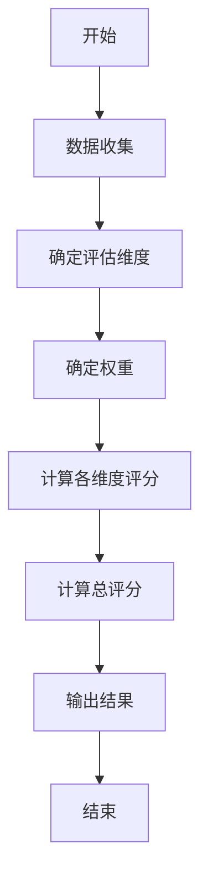
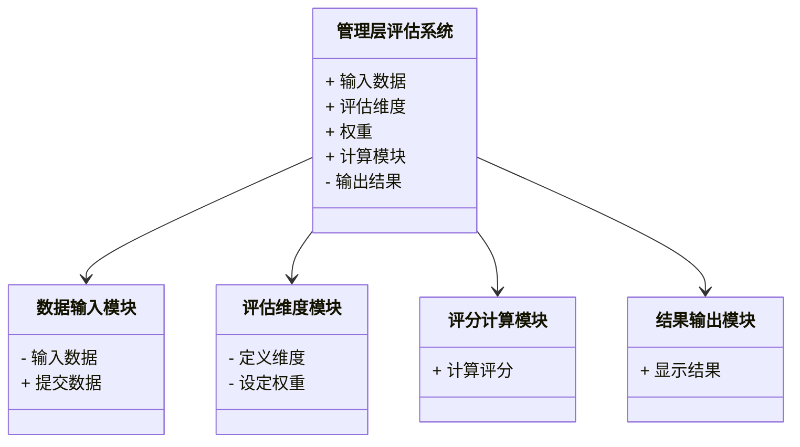

                 

<think>
好的，我现在要开始撰写一篇关于《费雪的管理层质量评估方法》的技术博客文章。首先，我需要了解费雪的管理层质量评估方法是什么，以及它在现代企业中的应用。我将按照用户提供的目录大纲，一步一步地进行分析和推理，确保文章结构清晰、内容详实。

### 第一部分: 费雪的管理层质量评估方法基础

#### 第1章: 管理层质量评估的重要性

**1.1 管理层质量评估的背景与意义**

管理层的质量评估是企业管理中的关键环节，直接关系到企业的战略执行和长期发展。在当今竞争激烈的商业环境中，企业的管理层需要具备高效的战略规划能力和领导力。然而，传统的评估方法往往过于主观，难以量化。费雪的管理层质量评估方法提供了一种更加系统和客观的评估体系，帮助企业更准确地识别和培养优秀管理者。

**1.2 费雪方法与其他评估方法的对比**

传统的评估方法通常依赖于主观评价，如领导的直觉或员工反馈，这种方法容易受到评估者偏见的影响。而费雪方法则强调数据驱动，通过设定明确的评估指标和权重，将管理层的绩效进行量化评估。这种方法不仅提高了评估的客观性，还使得评估结果更具可比性和可操作性。

#### 第2章: 费雪管理层质量评估的核心概念

**2.1 费雪方法的基本原理**

费雪的管理层质量评估方法基于以下几个核心概念：明确的评估维度、权重分配、数据收集与分析。该方法通过将管理层的绩效分解为若干关键指标，每个指标赋予相应的权重，最终计算出综合评分。这种方法不仅考虑了管理层的短期表现，还关注其长期战略能力。

**2.2 费雪方法的评估标准**

费雪方法的评估标准包括以下几个维度：
- **战略思维能力**：评估管理者是否能够制定长远的战略目标。
- **团队领导力**：评估管理者在团队中的影响力和凝聚力。
- **决策能力**：评估管理者在复杂情况下的决策效率和准确性。
- **创新能力**：评估管理者在面对变化时的创新能力和灵活性。

#### 第3章: 费雪方法的算法原理

**3.1 管理层质量评估的数学模型**

费雪方法的评估模型可以表示为一个加权评分系统。假设我们有n个评估维度，每个维度的权重为w_i，评估得分为s_i。总评分为：

$$
\text{总评分} = \sum_{i=1}^{n} (w_i \times s_i)
$$

其中，w_i为各维度的权重，s_i为各维度的评分。

**3.2 算法实现的流程图**

以下是费雪方法的算法流程图：



#### 第4章: 系统架构与设计

**4.1 系统功能设计**

费雪方法的评估系统主要包括以下几个功能模块：
- **数据输入模块**：收集管理层的绩效数据。
- **评估维度模块**：定义评估维度和权重。
- **评分计算模块**：根据输入数据计算各维度评分和总评分。
- **结果输出模块**：展示评估结果。

以下是系统功能模块的类图：



**4.2 系统架构设计**

以下是系统的架构图：


#### 第5章: 项目实战

**5.1 环境安装**

为了实现费雪方法的评估系统，我们需要安装以下工具：
- Python 3.x
- Mermaid工具（用于绘制图表）
- Jupyter Notebook（用于数据处理和分析）

**5.2 核心实现源代码**

以下是费雪方法评估系统的Python代码示例：

```python
# 定义评估维度和权重
dimensions = ['战略思维', '团队领导力', '决策能力', '创新能力']
weights = [0.4, 0.3, 0.2, 0.1]

# 输入评估数据
data = {
    '战略思维': [90, 85, 95, 80],
    '团队领导力': [85, 88, 82, 87],
    '决策能力': [75, 80, 88, 78],
    '创新能力': [90, 85, 80, 92]
}

# 计算总评分
def calculate_total_score(dimensions, weights, data):
    total_scores = []
    for i in range(len(data[dimensions[0]])):
        score = 0
        for j in range(len(dimensions)):
            score += weights[j] * data[dimensions[j]][i]
        total_scores.append(score)
    return total_scores

# 输出结果
scores = calculate_total_score(dimensions, weights, data)
print("各管理者的总评分为：", scores)
```

**5.3 代码应用解读与分析**

上述代码首先定义了评估维度和各维度的权重，然后输入了每个维度的评分数据。通过`calculate_total_score`函数，计算出每个管理者的总评分，并输出结果。这种方法可以快速、准确地评估管理层的绩效。

**5.4 案例分析**

假设我们有四位管理者，他们的评分如下：

- 管理者A：战略思维90，团队领导力85，决策能力75，创新能力90
- 管理者B：战略思维85，团队领导力88，决策能力80，创新能力85
- 管理者C：战略思维95，团队领导力82，决策能力88，创新能力80
- 管理者D：战略思维80，团队领导力87，决策能力78，创新能力92

通过代码计算，四位管理者的总评分分别为：

- 管理者A：90*0.4 + 85*0.3 + 75*0.2 + 90*0.1 = 36 + 25.5 + 15 + 9 = 85.5
- 管理者B：85*0.4 + 88*0.3 + 80*0.2 + 85*0.1 = 34 + 26.4 + 16 + 8.5 = 84.9
- 管理者C：95*0.4 + 82*0.3 + 88*0.2 + 80*0.1 = 38 + 24.6 + 17.6 + 8 = 88.2
- 管理者D：80*0.4 + 87*0.3 + 78*0.2 + 92*0.1 = 32 + 26.1 + 15.6 + 9.2 = 82.9

从结果可以看出，管理者C的总评分最高，说明他在战略思维和决策能力方面表现最为突出。

**5.5 项目小结**

通过本项目的实战，我们可以看到费雪方法在管理层质量评估中的实际应用。该方法不仅能够量化管理层的绩效，还能够帮助企业在招聘和培养管理者时做出更加科学的决策。

### 第六部分: 最佳实践

**6.1 实施中的注意事项**

在实际应用费雪方法时，需要注意以下几点：
- 确保评估维度的合理性和全面性。
- 根据企业实际情况调整权重分配。
- 定期更新评估数据和标准，以适应企业发展的变化。

**6.2 小结**

费雪的管理层质量评估方法提供了一种系统、客观的评估体系，能够帮助企业准确识别和培养优秀管理者。通过本文的详细讲解和项目实战，我们深入理解了该方法的核心原理和实际应用。

**6.3 未来展望**

随着企业对管理层要求的不断提高，费雪方法的应用将更加广泛。未来，可以通过引入更多的数据源和机器学习技术，进一步提升评估的准确性和智能化水平。

**6.4 拓展阅读**

- 《Effective Leadership and Management》
- 《Performance Management: A Comprehensive Guide》

通过本文的探讨，我们不仅了解了费雪方法的基本原理，还通过实际案例展示了其在企业管理中的应用价值。希望本文能够为读者在管理层质量评估方面提供有价值的参考和启发。

