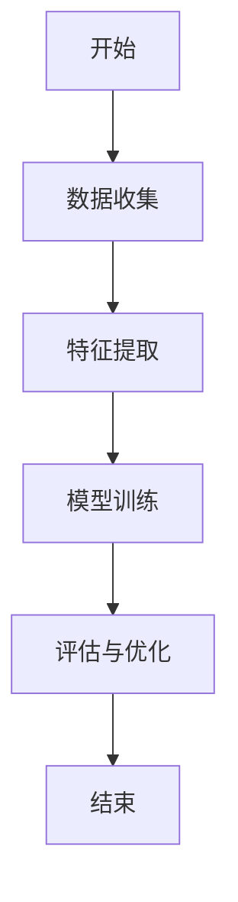
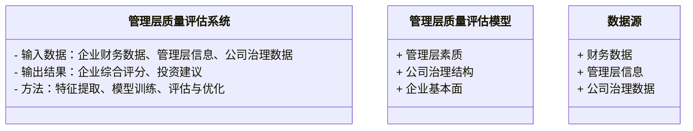
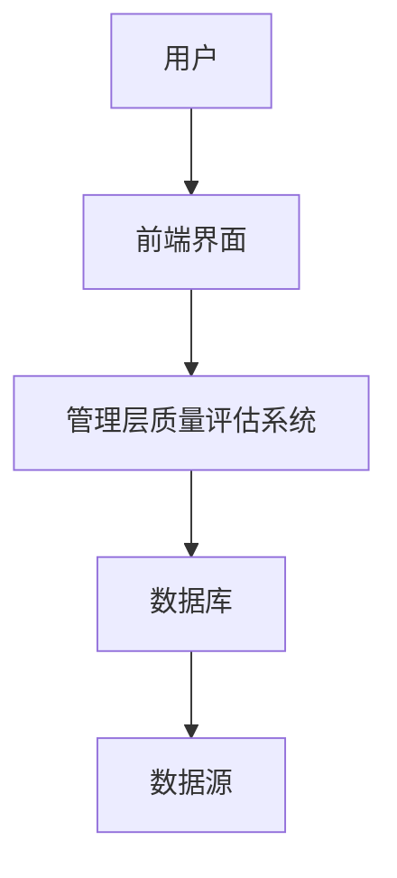
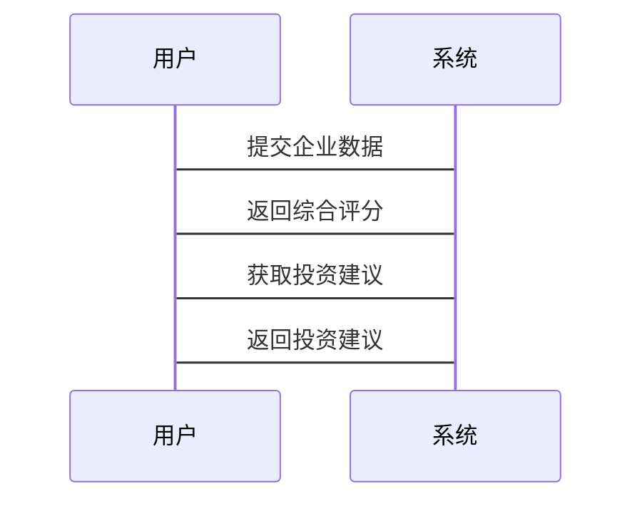

                 


# 费雪的管理层质量评估：公司治理在投资决策中的作用

> **关键词**：管理层质量评估，公司治理，投资决策，费雪，风险管理

> **摘要**：  
本文系统地探讨了费雪的管理层质量评估方法及其在投资决策中的重要性。通过分析管理层质量评估的核心概念、算法原理、系统架构以及实际案例，本文揭示了公司治理在投资决策中的关键作用，为投资者提供了基于管理层质量评估的决策支持框架。文章结合理论与实践，详细阐述了如何通过科学的方法和工具，提升投资决策的准确性和可靠性。

---

## 第1章: 费雪的管理层质量评估概述

### 1.1 管理层质量评估的重要性

#### 1.1.1 投资决策中的管理层角色
管理层是公司运营的核心，其决策直接影响企业的长期发展和短期业绩。在投资决策中，管理层的质量是决定企业价值的关键因素之一。  
- **管理层的角色**：制定战略、分配资源、应对风险。  
- **管理层能力的影响**：高效管理团队能提升企业盈利能力，反之则可能导致价值损失。  

#### 1.1.2 管理层质量对投资回报的影响
管理层的质量直接影响企业的运营效率和市场表现。优秀管理层能：  
1. 提升企业利润率。  
2. 优化资产配置。  
3. 应对市场变化的能力更强。  
4. 降低投资风险。  

#### 1.1.3 公司治理在现代企业中的核心地位
公司治理是确保管理层高效运作的关键机制，包括董事会结构、股权分配、内部监督等。良好的公司治理能：  
- 提升企业透明度。  
- 防范管理层滥用职权。  
- 保护投资者利益。  

### 1.2 费雪投资理论的背景与核心思想

#### 1.2.1 费雪投资理论的起源
菲德烈·费雪（Philip Fisher）是20世纪的投资大师，他提出“成长股投资”理论，强调投资于具有持续增长潜力的企业。费雪认为，企业的管理层质量是决定企业能否持续增长的关键因素。  

#### 1.2.2 费雪对管理层质量的重视
费雪提出，优秀的企业管理层应具备以下特征：  
1. **战略眼光**：能识别市场机会并制定长期战略。  
2. **执行力**：能高效执行战略并解决问题。  
3. **透明度**：能与股东保持良好沟通。  
4. **创新能力**：能适应市场变化并创新。  

#### 1.2.3 费雪理论与现代投资理论的联系
尽管现代投资理论（如现代资产组合理论）强调分散化和风险调整回报，但费雪的理论为基本面分析提供了重要参考。费雪的管理层质量评估方法与基本面分析结合，为投资者提供了更全面的决策工具。

### 1.3 公司治理在投资决策中的作用

#### 1.3.1 公司治理的基本概念
公司治理是通过董事会、股东和其他利益相关者对企业进行监督和管理的机制。有效的公司治理能确保管理层行为符合企业目标，并保护投资者利益。

#### 1.3.2 公司治理与投资回报的关系
研究表明，良好的公司治理与较高的投资回报密切相关。具体表现在：  
- 提高企业透明度，降低信息不对称。  
- 减少代理成本，提升管理层效率。  
- 提升企业信誉，吸引更多投资。  

#### 1.3.3 费雪理论中的公司治理框架
费雪强调，投资者应选择具有优秀管理层和良好公司治理的企业。具体包括：  
1. 董事会结构合理，独立董事占比高。  
2. 管理层与股东利益一致。  
3. 信息披露及时且透明。  

---

## 第2章: 管理层质量评估的核心概念与联系

### 2.1 核心概念原理

#### 2.1.1 管理层质量评估的维度
管理层质量评估可以从以下几个维度进行：  
1. **战略能力**：管理层是否能制定清晰的战略并执行。  
2. **管理能力**：管理层是否能高效运营企业。  
3. **创新能力**：管理层是否能适应市场变化并创新。  
4. **团队稳定性**：管理层是否稳定且经验丰富。  

#### 2.1.2 费雪模型的核心要素
费雪模型的核心要素包括：  
- **管理层素质**：包括领导力、决策能力和创新能力。  
- **公司治理结构**：包括董事会结构、股权分配和信息披露。  
- **企业基本面**：包括盈利能力、成长性和财务健康状况。  

#### 2.1.3 公司治理与管理层质量的相互作用
公司治理是管理层质量的保障机制，而管理层质量则是公司治理有效性的核心。两者相互作用，共同影响企业价值和投资回报。

### 2.2 管理层质量评估模型的属性对比

#### 2.2.1 模型属性特征对比表格

| 属性                | 费雪模型           | 其他模型           |
|---------------------|------------------|------------------|
| **评估维度**        | 管理层素质、公司治理、企业基本面 | 财务指标、市场表现       |
| **评估方法**        | 定性分析为主，结合定量分析 | 以定量分析为主         |
| **评估目标**        | 选择优质企业进行投资 | 评估企业整体风险与收益 |
| **适用场景**        | 长期投资、成长股投资 | 短期投资、价值投资     |

#### 2.2.2 模型的适用场景与限制
- **适用场景**：适用于长期投资和成长股投资。  
- **限制**：定性分析主观性强，难以量化。  

### 2.3 ER实体关系图架构

```mermaid
erd
    title 管理层质量评估模型的实体关系图
    管理层质量评估模型
        --> 管理层素质
        --> 公司治理结构
        --> 企业基本面
    管理层素质
        --> 领导力
        --> 决策能力
        --> 创新能力
    公司治理结构
        --> 董事会结构
        --> 独立董事
        --> 股权分配
    企业基本面
        --> 盈利能力
        --> 成长性
        --> 财务健康状况
```

---

## 第3章: 管理层质量评估的算法原理

### 3.1 算法原理概述

#### 3.1.1 管理层质量评估的步骤
1. **数据收集**：收集企业的财务数据、管理层信息和公司治理数据。  
2. **特征提取**：提取关键特征，如盈利能力、创新能力和董事会结构。  
3. **模型训练**：使用机器学习算法训练评估模型。  
4. **评估与优化**：根据评估结果优化模型。

#### 3.1.2 算法的核心逻辑
- 管理层质量评估算法基于费雪模型，结合定量和定性分析，对企业进行综合评分。  
- 算法通过加权评分的方式，将各个评估维度的重要性进行量化。

#### 3.1.3 算法的输入与输出
- **输入**：企业的财务数据、管理层信息和公司治理数据。  
- **输出**：企业综合评分和投资建议。

### 3.2 算法流程图



### 3.3 算法实现

#### 3.3.1 管理层质量评估算法的Python代码示例

```python
import pandas as pd
import numpy as np
from sklearn.metrics import accuracy_score

# 数据加载
data = pd.read_csv('management_quality.csv')

# 特征提取
features = ['profitability', 'growth', 'governance']
target = 'quality_score'

# 模型训练
from sklearn.ensemble import RandomForestClassifier
model = RandomForestClassifier()
model.fit(data[features], data[target])

# 模型评估
predictions = model.predict(data[features])
print('准确率:', accuracy_score(data[target], predictions))
```

#### 3.3.2 算法的数学模型

$$
\text{综合评分} = \sum_{i=1}^{n} w_i \cdot x_i
$$

其中：  
- \( w_i \) 是第 \( i \) 个特征的权重。  
- \( x_i \) 是第 \( i \) 个特征的值。  

---

## 第4章: 系统分析与架构设计方案

### 4.1 问题场景介绍

#### 4.1.1 问题描述
- 投资者需要一个系统化的工具，基于管理层质量评估模型进行投资决策。  
- 传统的投资分析方法依赖于主观判断，缺乏系统性和科学性。  

#### 4.1.2 问题解决
通过构建一个基于费雪模型的管理系统，投资者可以：  
- 自动化评估企业管理层质量。  
- 提供数据驱动的投资建议。  

### 4.2 系统功能设计

#### 4.2.1 领域模型



### 4.3 系统架构设计



### 4.4 系统接口设计

#### 4.4.1 系统交互序列图



---

## 第5章: 项目实战

### 5.1 环境安装

#### 5.1.1 Python环境配置
- 安装Python 3.8或更高版本。  
- 安装必要的库：pandas、numpy、scikit-learn。  

#### 5.1.2 数据集准备
- 下载企业数据集，包括财务数据、管理层信息和公司治理数据。  

### 5.2 核心代码实现

#### 5.2.1 数据清洗与特征提取

```python
import pandas as pd
import numpy as np

# 加载数据
data = pd.read_csv('management_quality.csv')

# 删除缺失值
data.dropna(inplace=True)

# 转换分类变量
data = pd.get_dummies(data)
```

#### 5.2.2 模型训练与评估

```python
from sklearn.ensemble import RandomForestClassifier
from sklearn.metrics import accuracy_score

# 训练模型
model = RandomForestClassifier()
model.fit(data[features], data[target])

# 评估模型
predictions = model.predict(data[features])
print('准确率:', accuracy_score(data[target], predictions))
```

### 5.3 案例分析与总结

#### 5.3.1 实际案例分析
- 选择一家企业，进行数据清洗、特征提取和模型评估。  
- 输出企业综合评分和投资建议。  

#### 5.3.2 经验总结
- 数据清洗和特征提取是关键步骤，直接影响模型性能。  
- 模型评估结果需结合实际情况进行调整和优化。  

---

## 第6章: 最佳实践、小结与展望

### 6.1 最佳实践

#### 6.1.1 数据驱动的决策
- 依赖数据驱动的方法，而非主观判断。  

#### 6.1.2 持续优化模型
- 定期更新模型，适应市场变化。  

#### 6.1.3 结合多因素分析
- 结合其他因素（如市场周期、宏观经济指标）进行综合分析。  

### 6.2 小结

- 本文系统地介绍了费雪的管理层质量评估方法及其在投资决策中的作用。  
- 通过理论分析、算法实现和案例实践，为投资者提供了科学的决策工具。  

### 6.3 展望

- 未来的研究可以进一步优化算法，引入更多因素（如环境、社会和治理（ESG）因素）。  
- 开发更高效的系统，提升评估效率和准确性。  

---

## 参考文献

1. 费雪， Philip. *Common Stocks and Uncommon Profits*.  
2. 现代投资组合理论相关文献。  
3. 公司治理相关研究论文。  

---

通过本文的系统分析和实践，读者可以更好地理解费雪的管理层质量评估方法，并将其应用于实际投资决策中。

