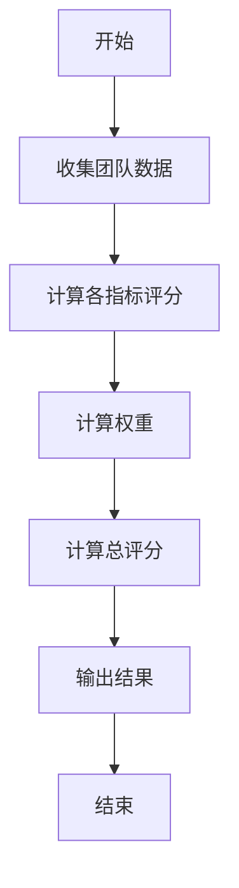
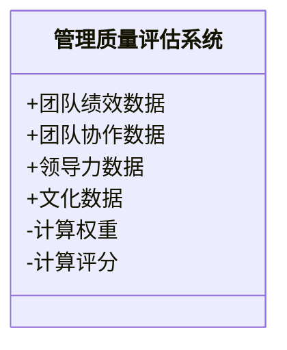
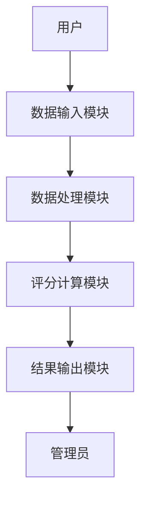

                 


# 费雪的管理质量评估：优秀团队的重要性

> 关键词：费雪管理质量评估、优秀团队、管理质量、团队绩效、管理质量评分

> 摘要：本文深入探讨了费雪的管理质量评估方法，重点分析了优秀团队在管理质量评估中的重要性。通过理论分析、算法原理、系统设计和实际案例，全面阐述了如何通过费雪的管理质量评估方法来提升团队绩效和企业竞争力。文章内容包括背景介绍、核心概念、算法原理、系统分析、项目实战和最佳实践等部分，旨在为读者提供一个全面的视角来理解和应用费雪的管理质量评估方法。

---

# 第一部分: 费雪的管理质量评估基础

## 第1章: 管理质量评估的核心概念

### 1.1 管理质量评估的定义与背景

#### 1.1.1 管理质量评估的基本概念
管理质量评估是一种通过系统化的方法对管理过程和结果进行量化评估的技术。它关注的是管理活动的效果和效率，旨在通过数据分析和指标衡量，发现管理中的问题并提出改进建议。费雪的管理质量评估方法是一种典型的管理质量评估方法，它以团队绩效为核心，强调优秀团队在管理质量中的关键作用。

#### 1.1.2 费雪管理质量评估的理论背景
费雪（Herb A. Feit）是质量和生产管理领域的知名专家，他的管理质量评估方法结合了统计学、系统工程和管理学的原理。费雪认为，管理质量的核心在于团队的协作、领导力和文化氛围。优秀团队是实现高质量管理的基础，因此，团队绩效与管理质量评估密不可分。

#### 1.1.3 优秀团队在管理质量评估中的重要性
优秀团队是企业竞争力的关键因素。一个优秀的团队能够高效地完成任务，同时具备良好的协作能力和创新精神。在管理质量评估中，优秀团队的表现往往能够反映出管理过程中的问题，从而为管理改进提供依据。

---

### 1.2 费雪管理质量评估的框架

#### 1.2.1 费雪管理质量评估的四个维度
费雪的管理质量评估方法将管理质量分为四个维度：
1. **团队绩效**：团队完成任务的质量和效率。
2. **团队协作**：团队成员之间的协作程度。
3. **团队领导力**：领导者的管理能力和决策能力。
4. **团队文化**：团队内部的文化氛围和价值观。

#### 1.2.2 管理质量评估的指标体系
管理质量评估的指标体系包括以下内容：
- **团队绩效**：任务完成率、质量达标率、按时交付率。
- **团队协作**：协作效率、信息传递速度、冲突解决能力。
- **团队领导力**：领导决策的准确率、团队成员的满意度。
- **团队文化**：团队凝聚力、创新氛围、员工满意度。

#### 1.2.3 优秀团队的核心特征
优秀团队的核心特征包括：
1. **明确的目标**：团队成员对目标有共同的理解。
2. **高效的协作**：团队成员之间能够高效配合。
3. **强大的领导力**：领导者具备良好的沟通和决策能力。
4. **积极的文化氛围**：团队内部具备积极向上的文化氛围。

---

### 1.3 管理质量评估的实施步骤

#### 1.3.1 评估目标的确定
在实施管理质量评估之前，需要明确评估的目标。例如，评估的目标可能是提高团队绩效、优化团队协作或提升领导力。

#### 1.3.2 数据收集与分析
数据收集是管理质量评估的基础。需要收集团队绩效、协作、领导力和文化氛围的相关数据。例如，可以通过问卷调查、绩效报告和团队会议记录等方式收集数据。

#### 1.3.3 评估结果的应用
评估结果的应用是管理质量评估的关键。根据评估结果，可以发现团队中的问题，并制定改进计划。例如，如果评估结果显示团队协作效率低下，可以通过优化沟通流程来提高协作效率。

---

## 第2章: 费雪管理质量评估的理论基础

### 2.1 费雪管理质量评估的核心原理

#### 2.1.1 管理质量评估的系统性
费雪的管理质量评估方法强调系统的观点。管理质量不是一个独立的事件，而是由多个因素共同作用的结果。团队绩效、协作、领导力和文化氛围等因素相互关联，共同影响管理质量。

#### 2.1.2 团队绩效与管理质量的关系
团队绩效是管理质量的重要体现。一个绩效优秀的团队通常具备较高的管理质量。反之，管理质量高的团队也更容易实现高绩效。

#### 2.1.3 费雪管理质量评估的数学模型
费雪管理质量评估的数学模型可以表示为：

$$ Q = \sum_{i=1}^{n} w_i \cdot S_i $$

其中，$Q$ 是管理质量评分，$w_i$ 是第 $i$ 个指标的权重，$S_i$ 是第 $i$ 个指标的评分。

---

### 2.2 费雪管理质量评估的数学模型

#### 2.2.1 模型的基本假设
1. 管理质量是由多个因素共同决定的。
2. 每个因素都有一个权重，权重反映了该因素对管理质量的影响程度。

#### 2.2.2 模型的公式推导
假设我们有 $n$ 个评估指标，每个指标的权重为 $w_i$，评分范围为 1 到 10 分。管理质量评分的计算公式为：

$$ Q = \sum_{i=1}^{n} w_i \cdot S_i $$

其中，$Q$ 的取值范围为 1 到 100 分，分数越高表示管理质量越好。

---

### 2.3 费雪管理质量评估的属性对比表

| 指标 | 输入 | 输出 | 权重 |
|------|------|------|------|
| 团队绩效 | 团队表现数据 | 管理质量评分 | 0.4 |
| 团队协作 | 协作数据 | 管理质量评分 | 0.3 |
| 团队领导力 | 领导力数据 | 管理质量评分 | 0.2 |
| 团队文化 | 文化数据 | 管理质量评分 | 0.1 |

---

## 第3章: 费雪管理质量评估的算法原理

### 3.1 费雪管理质量评估的算法流程



---

### 3.2 费雪管理质量评估的Python实现

#### 3.2.1 算法代码实现

```python
def fisher_management_quality_assessment(team_performance, team_collaboration, leadership, culture):
    # 定义权重
    weights = [0.4, 0.3, 0.2, 0.1]
    # 计算总评分
    total_score = 0
    for i in range(len(team_performance)):
        total_score += weights[i] * team_performance[i]
        total_score += weights[i] * team_collaboration[i]
        total_score += weights[i] * leadership[i]
        total_score += weights[i] * culture[i]
    return total_score

# 示例数据
team_performance = [8, 7, 8, 9]
team_collaboration = [7, 8, 6, 8]
leadership = [9, 7, 8, 7]
culture = [6, 7, 7, 8]

# 计算总评分
score = fisher_management_quality_assessment(team_performance, team_collaboration, leadership, culture)
print("管理质量评分：", score)
```

#### 3.2.2 算法流程图


---

## 第4章: 费雪管理质量评估的系统分析

### 4.1 系统功能设计

#### 4.1.1 领域模型



#### 4.1.2 系统架构设计



---

## 第5章: 费雪管理质量评估的项目实战

### 5.1 项目背景

#### 5.1.1 项目介绍
某制造企业希望通过对团队的管理质量评估来优化团队绩效。企业选择费雪的管理质量评估方法作为实施工具。

---

#### 5.1.2 实施步骤

1. **数据收集**：收集团队绩效、协作、领导力和文化数据。
2. **计算评分**：使用费雪管理质量评估模型计算管理质量评分。
3. **结果分析**：根据评分结果制定改进计划。
4. **实施改进**：优化团队协作和领导力。
5. **效果评估**：评估改进效果。

---

## 第6章: 费雪管理质量评估的最佳实践

### 6.1 小结

费雪的管理质量评估方法是一种有效的管理工具。通过量化评估团队绩效、协作、领导力和文化氛围，可以帮助企业发现管理中的问题并提出改进建议。

### 6.2 注意事项

1. **数据准确性**：确保数据的准确性和完整性。
2. **权重设置**：根据实际情况调整权重。
3. **持续改进**：定期进行评估并持续改进。

### 6.3 拓展阅读

1. 《全面质量管理》——戴明
2. 《高效能团队的七个习惯》——史蒂芬·柯维

---

通过本文的分析，我们深入探讨了费雪的管理质量评估方法，特别是在优秀团队的重要性方面。希望本文能够为读者在管理质量评估领域提供有价值的参考。

