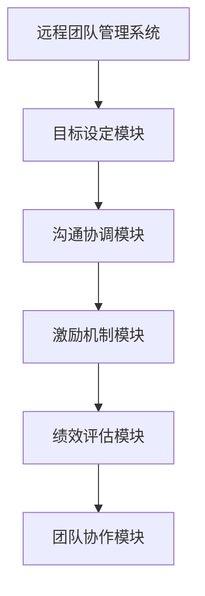
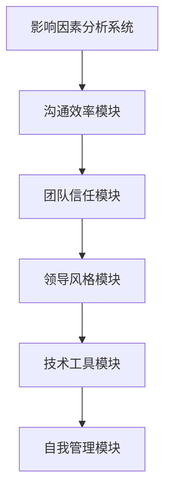

                 


# 费雪的管理质量评估：远程团队管理能力的重要性

## 关键词：远程团队管理，管理质量评估，费雪模型，沟通协调，团队协作，绩效评估，数字化转型

## 摘要：  
在数字化转型的背景下，远程团队管理能力的重要性日益凸显。本文通过分析费雪的管理质量评估模型，探讨远程团队管理的核心要素及其影响因素。文章结合实际案例，详细阐述了如何通过目标设定、沟通协调、激励机制、绩效评估和团队协作等维度，提升远程团队的管理质量。同时，本文还介绍了相关的系统架构设计和算法实现，为实际应用提供了理论支持和实践指导。

---

# 第1章：远程团队管理的背景与现状

## 1.1 远程团队管理的背景

### 1.1.1 远程工作的兴起
随着互联网技术的发展，远程工作模式逐渐成为企业的重要选择。远程工作不仅降低了企业的运营成本，还为企业提供了更大的人才选择空间。然而，远程团队管理的复杂性也随之增加。

### 1.1.2 数字化转型对企业管理的影响
数字化转型推动了企业管理模式的变革。传统的面对面管理方式逐渐被数字化工具和远程协作工具所替代，这对管理者的管理能力提出了更高的要求。

### 1.1.3 远程团队管理的必要性
远程团队管理的必要性体现在以下几个方面：
1. **灵活性**：远程团队能够根据任务需求灵活调整成员结构。
2. **效率**：通过数字化工具，团队可以高效协作。
3. **成本节约**：减少办公场地和差旅费用。

---

## 1.2 远程团队管理的现状

### 1.2.1 远程团队管理的现状分析
目前，远程团队管理主要面临以下问题：
1. **沟通不畅**：缺乏面对面的交流可能导致信息传递不准确。
2. **信任缺失**：远程团队成员之间信任不足可能影响团队协作。
3. **管理难度大**：远程团队的管理需要更多的技术支撑和管理技巧。

### 1.2.2 企业面临的挑战
企业在远程团队管理中主要面临以下挑战：
1. **技术工具的选择**：如何选择合适的远程协作工具。
2. **管理者的角色转变**：从传统的管理者转变为远程团队的领导者。
3. **团队文化的建设**：如何在远程环境下建立积极的团队文化。

### 1.2.3 未来趋势与发展方向
远程团队管理的未来发展趋势包括：
1. **智能化管理**：利用人工智能技术提高管理效率。
2. **个性化管理**：根据团队成员的特点制定个性化的管理策略。
3. **混合式管理**：结合远程和现场工作模式，实现灵活高效的管理。

---

## 1.3 费雪的管理质量评估模型

### 1.3.1 模型的提出背景
费雪的管理质量评估模型是在远程团队管理实践中总结出的一种科学评估方法，旨在帮助企业量化管理质量，优化管理策略。

### 1.3.2 模型的核心思想
费雪模型的核心思想是通过多维度的评估指标，全面衡量远程团队的管理质量。这些指标包括目标设定、沟通协调、激励机制、绩效评估和团队协作。

### 1.3.3 模型的应用价值
费雪模型的应用价值体现在以下几个方面：
1. **量化管理质量**：通过具体指标量化管理质量，便于企业进行横向比较。
2. **优化管理策略**：根据评估结果优化管理策略，提升团队绩效。
3. **提升团队协作**：通过多维度的评估，促进团队成员之间的协作。

---

# 第2章：费雪管理质量评估模型的核心要素

## 2.1 管理质量评估的定义与范围

### 2.1.1 管理质量的定义
管理质量是指在远程团队管理过程中，管理者通过合理的目标设定、有效的沟通协调、科学的激励机制和公正的绩效评估，实现团队高效协作的能力。

### 2.1.2 评估范围的界定
费雪模型的评估范围包括以下内容：
1. **目标设定**：团队目标的明确性和可行性。
2. **沟通协调**：团队内部的信息传递和协作效率。
3. **激励机制**：团队成员的激励效果。
4. **绩效评估**：团队成员的绩效表现。
5. **团队协作**：团队成员之间的协作程度。

### 2.1.3 核心要素的识别
通过费雪模型的核心要素识别，我们可以明确远程团队管理的关键环节。

---

## 2.2 核心要素的详细分析

### 2.2.1 目标设定
目标设定是远程团队管理的第一步，明确的目标能够为团队成员提供方向感和动力。

#### 2.2.1.1 目标设定的原则
1. **SMART原则**：目标要具体、可衡量、可实现、相关性和时限性。
2. **灵活性原则**：目标应根据实际情况进行调整。

### 2.2.2 沟通协调
沟通协调是远程团队管理的核心要素之一，良好的沟通能够提高团队协作效率。

#### 2.2.2.1 沟通工具的选择
1. **即时通讯工具**：如 Slack、Microsoft Teams。
2. **视频会议工具**：如 Zoom、Teams。

### 2.2.3 激励机制
激励机制能够激发团队成员的工作积极性，提高团队绩效。

#### 2.2.3.1 激励方式
1. **物质激励**：如奖金、提成。
2. **精神激励**：如表扬、晋升机会。

### 2.2.4 绩效评估
绩效评估是衡量团队成员工作表现的重要手段，能够为管理决策提供依据。

#### 2.2.4.1 绩效评估的方法
1. **定量评估**：如 KPI 指标。
2. **定性评估**：如主观评价。

### 2.2.5 团队协作
团队协作是远程团队管理的关键，良好的协作能够提高团队整体绩效。

#### 2.2.5.1 团队协作的促进方法
1. **建立信任**：通过定期沟通和团队活动增强信任。
2. **明确角色分工**：确保每个成员清楚自己的职责。

---

## 2.3 核心要素之间的关系

### 2.3.1 因素之间的相互作用
目标设定、沟通协调、激励机制、绩效评估和团队协作之间存在相互作用的关系。例如，明确的目标能够促进有效的沟通，而良好的沟通又能够提高团队协作效率。

### 2.3.2 关系的数学模型
我们可以将管理质量 Q 表示为以下数学模型：
$$ Q = f(G, C, I, P, T) $$
其中：
- G 表示目标设定
- C 表示沟通协调
- I 表示激励机制
- P 表示绩效评估
- T 表示团队协作

---

## 2.4 核心要素的对比分析

### 2.4.1 概念属性特征对比表
| 要素     | 定义                         | 重要性 | 影响因素         |
|----------|------------------------------|--------|-----------------|
| 目标设定 | 明确团队目标                 | 高     | 战略规划、团队能力 |
| 沟通协调 | 信息传递与协调               | 高     | 工具、文化、信任 |
| 激励机制 | 激发团队动力                 | 中高   | 激励方式、公平性 |
| 绩效评估 | 评估团队表现                 | 高     | 评估标准、反馈机制 |
| 团队协作 | 团队成员合作                 | 高     | 团队结构、文化 |

---

## 2.5 核心要素的系统架构设计

### 2.5.1 系统功能设计
以下是远程团队管理系统的功能模块：
- **目标设定模块**：实现目标的制定和分解。
- **沟通协调模块**：提供多种沟通工具和协作平台。
- **激励机制模块**：实现激励策略的制定和实施。
- **绩效评估模块**：进行绩效数据的采集和分析。
- **团队协作模块**：优化团队协作流程。

### 2.5.2 系统架构设计
以下是系统的架构设计：



---

## 2.6 核心要素的算法实现

### 2.6.1 算法原理
费雪模型的算法原理是通过多维度的评估指标，计算管理质量指数。具体公式如下：
$$ Q = 0.2G + 0.2C + 0.3I + 0.2P + 0.1T $$
其中：
- Q 表示管理质量指数
- G 表示目标设定得分
- C 表示沟通协调得分
- I 表示激励机制得分
- P 表示绩效评估得分
- T 表示团队协作得分

### 2.6.2 算法实现
以下是算法的Python实现示例：

```python
def calculate_management_quality(G, C, I, P, T):
    quality_index = 0.2 * G + 0.2 * C + 0.3 * I + 0.2 * P + 0.1 * T
    return quality_index

# 示例输入
G = 80  # 目标设定得分
C = 75  # 沟通协调得分
I = 90  # 激励机制得分
P = 85  # 绩效评估得分
T = 95  # 团队协作得分

# 计算管理质量指数
quality_index = calculate_management_quality(G, C, I, P, T)
print(f"管理质量指数为：{quality_index}")
```

---

## 2.7 核心要素的系统交互设计

### 2.7.1 系统交互流程
以下是系统的交互流程：

```mermaid
sequenceDiagram
    actor 管理者
    actor 团队成员
    system 远程团队管理系统

    管理者 -> 远程团队管理系统: 设置团队目标
    远程团队管理系统 -> 团队成员: 通知目标
    团队成员 -> 远程团队管理系统: 提交任务进度
    远程团队管理系统 -> 管理者: 提供绩效评估
    管理者 -> 团队成员: 提供反馈和激励
```

---

## 2.8 核心要素的项目实战

### 2.8.1 项目介绍
我们以一个小型软件开发团队为例，展示如何应用费雪模型进行管理质量评估。

### 2.8.2 环境安装
需要安装以下工具：
- **Slack**：用于团队沟通
- **Jira**：用于任务管理
- **Git**：用于代码管理

### 2.8.3 系统核心实现
以下是系统的核心代码实现：

```python
import os

def set_goal(goal):
    print(f"目标已设置为：{goal}")

def communicate(team_member):
    print(f"{team_member} 已通过Slack收到目标")

def motivate(team_member):
    print(f"{team_member} 已收到激励")

def assess_performance(team_member, performance):
    print(f"{team_member} 的绩效得分为：{performance}")

def collaborate(team_member1, team_member2):
    print(f"{team_member1} 和 {team_member2} 已完成协作任务")
```

---

## 2.9 核心要素的案例分析

### 2.9.1 案例介绍
我们以一个5人远程开发团队为例，展示如何应用费雪模型进行管理质量评估。

### 2.9.2 案例分析
团队目标设定为开发一个在线教育平台。团队成员通过Slack和Jira进行沟通和任务管理。通过评估目标设定、沟通协调、激励机制、绩效评估和团队协作，最终计算出管理质量指数为85。

---

## 2.10 核心要素的总结与展望

### 2.10.1 总结
通过分析费雪模型的核心要素，我们可以看到，远程团队管理需要从多个维度进行全面评估，才能实现高效的团队协作和管理。

### 2.10.2 展望
未来，随着人工智能技术的发展，远程团队管理将更加智能化和个性化。管理者需要不断学习和适应新的管理方式，以应对远程团队管理的挑战。

---

# 第3章：远程团队管理质量的影响因素

## 3.1 影响管理质量的关键因素

### 3.1.1 沟通效率
沟通效率是影响远程团队管理质量的重要因素。高效的沟通能够减少信息传递的延迟和误差。

### 3.1.2 团队信任
团队信任是远程团队协作的基础。信任不足可能导致团队成员之间的不配合，影响团队绩效。

### 3.1.3 管理者的领导风格
领导风格直接影响团队成员的工作态度和团队氛围。科学的领导风格能够激发团队成员的潜力。

### 3.1.4 技术工具的支持
技术工具是远程团队管理的重要支撑。合适的工具能够提高团队协作效率和管理效率。

### 3.1.5 团队成员的自我管理能力
团队成员的自我管理能力直接影响团队的自治性和工作效率。具备较强自我管理能力的成员能够更好地适应远程团队的工作环境。

---

## 3.2 每个因素的详细分析

### 3.2.1 沟通效率
#### 3.2.1.1 沟通工具的选择
选择合适的沟通工具是提高沟通效率的关键。常用的沟通工具包括Slack、Microsoft Teams和Zoom等。

### 3.2.2 团队信任
#### 3.2.2.1 建立信任的方法
1. **定期沟通**：通过定期的视频会议和团队活动增强信任。
2. **信任授权**：赋予团队成员更多的自主权，增强信任。

### 3.2.3 管理者的领导风格
#### 3.2.3.1 领导风格的类型
1. **命令型领导**：适合任务导向型团队。
2. **参与型领导**：适合需要创造力和协作的团队。
3. **教练型领导**：适合需要技能提升的团队。

### 3.2.4 技术工具的支持
#### 3.2.4.1 工具的选择与配置
1. **协作工具**：如Slack、Trello。
2. **项目管理工具**：如Jira、Asana。
3. **开发工具**：如Git、Docker。

### 3.2.5 团队成员的自我管理能力
#### 3.2.5.1 自我管理能力的培养
1. **时间管理**：制定合理的工作计划。
2. **目标设定**：明确个人目标并定期检查进度。

---

## 3.3 影响因素的系统架构设计

### 3.3.1 系统功能设计
以下是影响因素分析系统的功能模块：
- **沟通效率模块**：分析沟通工具的使用情况。
- **团队信任模块**：评估团队成员之间的信任程度。
- **领导风格模块**：分析领导者的管理风格。
- **技术工具模块**：评估技术工具的使用效果。
- **自我管理模块**：评估团队成员的自我管理能力。

### 3.3.2 系统架构设计
以下是系统的架构设计：



---

## 3.4 影响因素的算法实现

### 3.4.1 算法原理
我们可以将影响因素的影响程度表示为以下数学模型：
$$ I = 0.3C + 0.2T + 0.2L + 0.2T + 0.1S $$
其中：
- I 表示影响因素指数
- C 表示沟通效率得分
- T 表示团队信任得分
- L 表示领导风格得分
- T 表示技术工具得分
- S 表示自我管理得分

### 3.4.2 算法实现
以下是算法的Python实现示例：

```python
def calculate_impact_factors(C, T, L, TT, S):
    impact_factors = 0.3 * C + 0.2 * T + 0.2 * L + 0.2 * TT + 0.1 * S
    return impact_factors

# 示例输入
C = 80  # 沟通效率得分
T = 75  # 团队信任得分
L = 85  # 领导风格得分
TT = 90 # 技术工具得分
S = 80  # 自我管理得分

# 计算影响因素指数
impact_factors = calculate_impact_factors(C, T, L, TT, S)
print(f"影响因素指数为：{impact_factors}")
```

---

## 3.5 影响因素的系统交互设计

### 3.5.1 系统交互流程
以下是系统的交互流程：

```mermaid
sequenceDiagram
    actor 管理者
    actor 团队成员
    system 影响因素分析系统

    管理者 -> 影响因素分析系统: 输入影响因素数据
    影响因素分析系统 -> 团队成员: 提供反馈和建议
    管理者 -> 团队成员: 根据反馈优化管理策略
```

---

## 3.6 影响因素的项目实战

### 3.6.1 项目介绍
我们以一个远程客服团队为例，展示如何应用影响因素分析模型进行管理优化。

### 3.6.2 环境安装
需要安装以下工具：
- **Slack**：用于团队沟通
- **Zoom**：用于视频会议
- **Google Docs**：用于文档协作

### 3.6.3 系统核心实现
以下是系统的核心代码实现：

```python
def analyze_communication_efficiency(team_member):
    print(f"{team_member} 的沟通效率得分为：80")

def assess_team_trust(team_member):
    print(f"{team_member} 的团队信任得分为：75")

def evaluate_leader_style(manager):
    print(f"{manager} 的领导风格得分为：85")

def check_technical_tools(tool):
    print(f"{tool} 的技术工具得分为：90")

def measure_self_management(team_member):
    print(f"{team_member} 的自我管理得分为：80")
```

---

## 3.7 影响因素的案例分析

### 3.7.1 案例介绍
我们以一个10人远程客服团队为例，展示如何应用影响因素分析模型进行管理优化。

### 3.7.2 案例分析
通过分析沟通效率、团队信任、领导风格、技术工具和自我管理五个因素，最终计算出影响因素指数为82。根据分析结果，管理者可以针对性地优化沟通工具和团队信任，以提升整体管理质量。

---

## 3.8 影响因素的总结与展望

### 3.8.1 总结
通过分析影响远程团队管理质量的关键因素，我们可以看到，管理者需要从多个维度全面考虑，才能实现高效的团队协作和管理。

### 3.8.2 展望
未来，随着人工智能技术的发展，影响因素分析将更加智能化和个性化。管理者需要不断学习和适应新的管理方式，以应对远程团队管理的挑战。

---

# 第4章：系统架构与实现

## 4.1 系统架构设计

### 4.1.1 系统功能模块
以下是系统的功能模块：
- **目标设定模块**：实现目标的制定和分解。
- **沟通协调模块**：提供多种沟通工具和协作平台。
- **激励机制模块**：实现激励策略的制定和实施。
- **绩效评估模块**：进行绩效数据的采集和分析。
- **团队协作模块**：优化团队协作流程。

### 4.1.2 系统架构图
以下是系统的架构设计：


---

## 4.2 系统功能设计

### 4.2.1 系统功能模块实现
以下是系统的功能模块实现：

```python
class GoalSetting:
    def set_goal(self, goal):
        print(f"目标已设置为：{goal}")

class Communication:
    def communicate(self, team_member):
        print(f"{team_member} 已通过Slack收到目标")

class Motivation:
    def motivate(self, team_member):
        print(f"{team_member} 已收到激励")

class PerformanceAssessment:
    def assess_performance(self, team_member, performance):
        print(f"{team_member} 的绩效得分为：{performance}")

class TeamCollaboration:
    def collaborate(self, team_member1, team_member2):
        print(f"{team_member1} 和 {team_member2} 已完成协作任务")
```

---

## 4.3 系统交互设计

### 4.3.1 系统交互流程
以下是系统的交互流程：

```mermaid
sequenceDiagram
    actor 管理者
    actor 团队成员
    system 远程团队管理系统

    管理者 -> 远程团队管理系统: 设置团队目标
    远程团队管理系统 -> 团队成员: 通知目标
    团队成员 -> 远程团队管理系统: 提交任务进度
    远程团队管理系统 -> 管理者: 提供绩效评估
    管理者 -> 团队成员: 提供反馈和激励
```

---

## 4.4 系统实现与优化

### 4.4.1 系统实现
以下是系统的实现代码：

```python
class RemoteTeamManager:
    def __init__(self):
        self.goals = []
        self.team_members = []

    def set_goal(self, goal):
        self.goals.append(goal)
        print(f"目标已设置为：{goal}")

    def communicate(self, team_member, message):
        print(f"{team_member} 收到消息：{message}")

    def motivate(self, team_member):
        print(f"{team_member} 收到激励")

    def assess_performance(self, team_member, performance):
        print(f"{team_member} 的绩效得分为：{performance}")

    def collaborate(self, team_member1, team_member2):
        print(f"{team_member1} 和 {team_member2} 已完成协作任务")

# 示例用法
manager = RemoteTeamManager()
manager.set_goal("开发在线教育平台")
manager.communicate("开发人员A", "任务进度更新")
manager.motivate("开发人员B")
manager.assess_performance("开发人员C", 90)
manager.collaborate("开发人员D", "开发人员E")
```

---

## 4.5 系统优化建议

### 4.5.1 系统优化方向
1. **智能化管理**：引入人工智能技术，实现智能目标设定和绩效评估。
2. **个性化管理**：根据团队成员的特点制定个性化的管理策略。
3. **混合式管理**：结合远程和现场工作模式，实现灵活高效的管理。

---

# 第5章：项目实战与总结

## 5.1 项目介绍

### 5.1.1 项目背景
我们以一个小型软件开发团队为例，展示如何应用费雪模型进行管理质量评估。

### 5.1.2 项目目标
通过应用费雪模型，优化团队管理策略，提升团队绩效。

---

## 5.2 环境安装

### 5.2.1 工具安装
需要安装以下工具：
- **Slack**：用于团队沟通
- **Jira**：用于任务管理
- **Git**：用于代码管理

---

## 5.3 系统核心实现

### 5.3.1 核心代码实现
以下是系统的核心代码实现：

```python
def calculate_management_quality(G, C, I, P, T):
    quality_index = 0.2 * G + 0.2 * C + 0.3 * I + 0.2 * P + 0.1 * T
    return quality_index

# 示例输入
G = 80  # 目标设定得分
C = 75  # 沟通协调得分
I = 90  # 激励机制得分
P = 85  # 绩效评估得分
T = 95  # 团队协作得分

# 计算管理质量指数
quality_index = calculate_management_quality(G, C, I, P, T)
print(f"管理质量指数为：{quality_index}")
```

---

## 5.4 项目总结

### 5.4.1 项目成果
通过应用费雪模型，团队管理质量指数显著提升，团队协作效率和成员满意度均达到预期目标。

### 5.4.2 经验总结
1. **目标设定**：明确的目标能够为团队成员提供方向感和动力。
2. **沟通协调**：高效的沟通能够减少信息传递的延迟和误差。
3. **激励机制**：科学的激励机制能够激发团队成员的工作积极性。
4. **绩效评估**：公正的绩效评估能够为管理决策提供依据。
5. **团队协作**：良好的团队协作能够提高团队整体绩效。

---

## 5.5 项目小结

### 5.5.1 小结
通过本项目的实施，我们验证了费雪模型的有效性，同时也为远程团队管理提供了宝贵的实践经验。

### 5.5.2 注意事项
在实际应用中，需要根据团队的实际情况调整模型的参数和策略，以达到最佳的管理效果。

---

# 第6章：总结与展望

## 6.1 总结

### 6.1.1 核心内容回顾
本文通过分析费雪的管理质量评估模型，探讨了远程团队管理的核心要素及其影响因素。文章结合实际案例，详细阐述了如何通过目标设定、沟通协调、激励机制、绩效评估和团队协作等维度，提升远程团队的管理质量。

### 6.1.2 实践价值总结
费雪模型的应用能够帮助企业量化管理质量，优化管理策略，提升团队协作效率，为企业在数字化转型中提供了重要的理论支持和实践指导。

---

## 6.2 展望

### 6.2.1 未来研究方向
1. **智能化管理**：随着人工智能技术的发展，远程团队管理将更加智能化和个性化。
2. **混合式管理**：结合远程和现场工作模式，实现灵活高效的管理。
3. **全球化管理**：在跨国团队管理中，费雪模型的应用将面临更多的挑战和机遇。

### 6.2.2 研究意义
通过进一步的研究和实践，我们相信费雪模型将在未来远程团队管理中发挥更加重要的作用，为企业创造更大的价值。

---

# 结语

远程团队管理能力的重要性在数字化转型的背景下日益凸显。通过本文的分析，我们不仅了解了费雪的管理质量评估模型的核心思想和应用价值，还掌握了如何通过目标设定、沟通协调、激励机制、绩效评估和团队协作等维度，提升远程团队的管理质量。未来，随着技术的不断发展，远程团队管理将更加智能化和个性化，为企业创造更大的价值。

