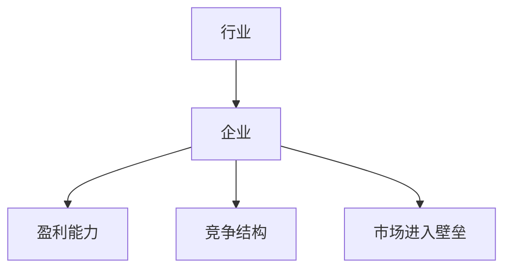
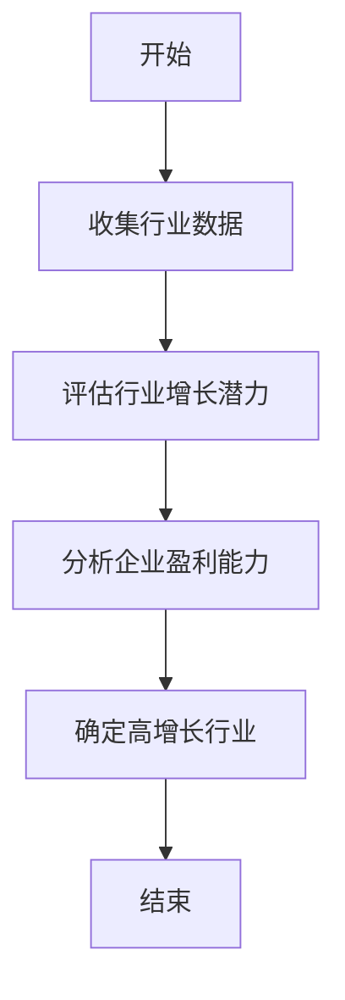
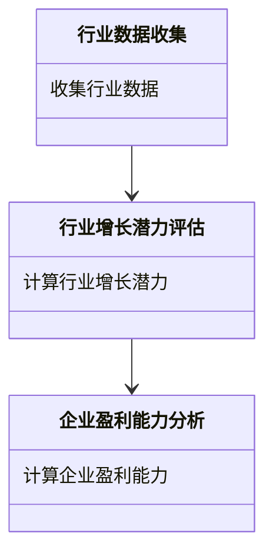
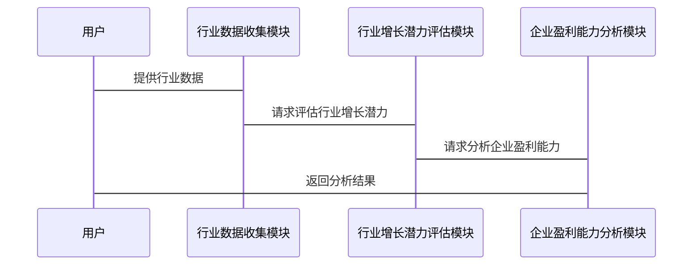

                 


# 费雪的行业分析方法：寻找高增长机会

> 关键词：行业分析，高增长行业，费雪方法，投资决策，企业盈利能力

> 摘要：本文系统地介绍了费雪的行业分析方法，从背景、核心概念、算法原理、系统架构设计到项目实战，全面剖析了如何通过该方法寻找高增长行业和企业。文章结合实际案例，详细解释了模型的数学公式和系统架构，为读者提供了实用的指导。

---

# 第一部分: 费雪的行业分析方法概述

## 第1章: 费雪的行业分析方法背景介绍

### 1.1 行业分析的重要性

#### 1.1.1 行业分析的定义与作用
行业分析是通过对行业内部结构、发展趋势、竞争状况和市场潜力的研究，评估行业的健康状况和投资价值。它是企业制定战略决策和投资者选择投资方向的重要依据。

#### 1.1.2 费雪分析方法的起源与背景
菲利普·费雪（Philip Fisher）是20世纪著名的投资家，他提出了一系列投资理论，其中包括行业分析方法。费雪认为，投资成功的关键在于选择那些处于高增长行业中的优秀企业。

#### 1.1.3 行业分析在投资决策中的地位
行业分析能够帮助投资者识别出那些具有持续增长潜力的行业，从而在投资决策中占据主动性。通过行业分析，投资者可以更好地评估企业的长期发展潜力。

### 1.2 费雪行业分析方法的核心概念

#### 1.2.1 高增长行业的定义与特征
高增长行业是指那些在未来较长一段时间内，能够保持高于行业平均水平的增长率的行业。其特征包括高增长潜力、稳定的市场需求、较高的利润率和较低的市场进入壁垒。

#### 1.2.2 费雪分析模型的构成要素
费雪分析模型主要包括以下几个要素：
1. **行业收入增长率**：行业的总收入增长速度。
2. **行业利润增长率**：行业的净利润增长速度。
3. **企业的盈利能力**：企业在行业中的盈利水平。
4. **行业竞争结构**：行业内的竞争状况和市场进入壁垒。

#### 1.2.3 行业增长与企业增长的关系
行业增长是企业增长的基础，而企业的增长又反过来影响行业的整体增长。高增长行业为优秀企业提供了更大的发展空间，而优秀的企业则能够推动行业的进一步发展。

### 1.3 费雪分析方法与其他行业分析方法的对比

#### 1.3.1 费雪分析方法的特点
费雪分析方法注重从行业整体增长的角度出发，结合企业的盈利能力，寻找具有持续增长潜力的行业和企业。

#### 1.3.2 其他行业分析方法的概述
其他常见的行业分析方法包括PEST分析、五力分析等，但它们更多关注外部环境和竞争结构，而费雪方法更注重行业增长潜力和企业盈利能力。

#### 1.3.3 费雪分析方法的优势与局限性
- **优势**：能够准确识别高增长行业，帮助企业制定长期战略。
- **局限性**：对行业数据的依赖性较高，且难以预测行业突变情况。

### 1.4 本章小结
本章介绍了费雪行业分析方法的背景和核心概念，明确了高增长行业的定义和特征，为后续的分析奠定了基础。

---

## 第2章: 费雪行业分析的核心概念与联系

### 2.1 费雪分析模型的原理

#### 2.1.1 行业生命周期理论
行业生命周期包括导入期、成长期、成熟期和衰退期。费雪分析方法主要关注成长期和成熟期的行业，因为这些阶段的行业具有较高的增长潜力。

#### 2.1.2 高增长行业的识别标准
- **收入增长率**：年均收入增长率高于行业平均水平。
- **利润增长率**：年均利润增长率高于行业平均水平。
- **市场进入壁垒**：行业具有较高的市场进入壁垒。

#### 2.1.3 行业增长与企业增长的关系
行业增长为企业提供了发展空间，而企业的增长又推动了行业的整体增长。两者相互依存，共同促进。

### 2.2 核心概念对比分析

#### 2.2.1 行业增长潜力与企业盈利能力的对比
- **行业增长潜力**：行业未来收入和利润的增长能力。
- **企业盈利能力**：企业在行业中的盈利水平。

| 比较维度 | 行业增长潜力 | 企业盈利能力 |
|----------|---------------|---------------|
| 计算方式 | 收入增长率 + 利润增长率 | 净利润 / 营业收入 |
| 侧重点 | 行业整体表现 | 企业个体表现 |

#### 2.2.2 行业竞争结构与市场进入壁垒的对比
- **行业竞争结构**：行业内竞争状况和市场集中度。
- **市场进入壁垒**：新进入者进入行业的障碍。

| 比较维度 | 行业竞争结构 | 市场进入壁垒 |
|----------|---------------|---------------|
| 核心要素 | 企业数量、市场份额 | 技术壁垒、资金壁垒 |
| 影响因素 | 竞争政策、行业标准 | 规模经济、品牌忠诚度 |

#### 2.2.3 行业周期性与行业稳定性的对比
- **行业周期性**：行业随经济周期波动的特性。
- **行业稳定性**：行业在经济波动中的稳定性。

| 比较维度 | 行业周期性 | 行业稳定性 |
|----------|-------------|------------|
| 特性 | 波动性高 | 波动性低 |
| 代表行业 | 制造业 | 公用事业 |

### 2.3 实体关系图（ER图）



### 2.4 本章小结
本章详细分析了费雪分析模型的核心概念，并通过对比分析和实体关系图，明确了各要素之间的关系。

---

## 第3章: 费雪分析方法的算法原理

### 3.1 费雪分析模型的算法流程



### 3.2 算法实现的数学模型

#### 行业增长潜力计算公式
$$ \text{行业增长潜力} = \frac{\text{行业收入增长率} + \text{行业利润增长率}}{2} $$

#### 企业盈利能力评估公式
$$ \text{企业盈利能力} = \frac{\text{净利润}}{\text{营业收入}} $$

### 3.3 举例说明

#### 示例1: 高科技行业增长潜力分析
假设高科技行业过去五年的收入增长率为15%，利润增长率为20%，则行业增长潜力为：
$$ \text{行业增长潜力} = \frac{15\% + 20\%}{2} = 17.5\% $$

#### 示例2: 传统制造业盈利能力评估
某传统制造企业的净利润为1000万元，营业收入为5000万元，则企业盈利能力为：
$$ \text{企业盈利能力} = \frac{1000}{5000} = 20\% $$

### 3.4 本章小结
本章通过流程图和数学公式，详细阐述了费雪分析方法的算法原理，并通过具体例子说明了如何应用这些公式进行行业分析。

---

## 第4章: 费雪分析方法的系统架构设计

### 4.1 系统分析与架构设计

#### 系统功能模块


### 4.2 系统接口设计

#### 数据输入接口
```mermaid
graph TD
    用户 -> 行业数据收集模块: 提供行业数据
```

#### 数据处理接口
```mermaid
graph TD
    行业数据收集模块 -> 行业增长潜力评估模块: 请求评估行业增长潜力
```

#### 结果输出接口
```mermaid
graph TD
    行业增长潜力评估模块 -> 用户: 返回评估结果
```

### 4.3 系统交互流程



### 4.4 本章小结
本章从系统架构设计的角度，详细描述了费雪分析方法的实现过程，包括功能模块、接口设计和交互流程。

---

## 第5章: 项目实战——费雪分析方法的应用

### 5.1 环境安装
为了应用费雪分析方法，首先需要收集相关行业数据，可以通过行业报告、企业财报等渠道获取。

### 5.2 系统核心实现源代码

```python
def calculate_industry_growth_potential(revenue_growth, profit_growth):
    return (revenue_growth + profit_growth) / 2

def calculate_profitability(net_profit, revenue):
    return net_profit / revenue

# 示例数据
high_tech_revenue_growth = 15
high_tech_profit_growth = 20
traditional_manufacturing_profitability = calculate_profitability(1000, 5000)

print(f"高科技行业增长潜力: {calculate_industry_growth_potential(high_tech_revenue_growth, high_tech_profit_growth)}%")
print(f"传统制造业盈利能力: {traditional_manufacturing_profitability}%")
```

### 5.3 代码应用解读与分析
上述代码定义了两个函数，分别用于计算行业增长潜力和企业盈利能力。通过输入具体的行业数据，可以快速得出分析结果。

### 5.4 实际案例分析
以高科技行业为例，假设其收入增长率为15%，利润增长率为20%，则行业增长潜力为17.5%。同时，某高科技企业的净利润为2000万元，营业收入为8000万元，则企业盈利能力为25%。

### 5.5 本章小结
本章通过实际案例，详细展示了如何应用费雪分析方法进行行业分析，并通过代码实现计算过程。

---

## 第6章: 总结与最佳实践

### 6.1 总结
费雪分析方法通过评估行业增长潜力和企业盈利能力，帮助投资者识别高增长行业和企业。本文从背景、核心概念、算法原理、系统架构设计到项目实战，全面介绍了该方法的应用。

### 6.2 最佳实践 tips
- **数据收集**：确保行业数据的准确性和全面性。
- **模型应用**：结合具体行业特点，灵活应用模型。
- **持续监测**：定期更新行业数据，跟踪行业变化。

### 6.3 注意事项
- 费雪分析方法依赖于行业数据的准确性，数据误差可能影响分析结果。
- 行业分析结果需结合其他分析方法进行综合判断。

### 6.4 拓展阅读
- 《投资最重要的少数事》——菲利普·费雪
- 《竞争优势：创造价值的策略》——迈克尔·波特

### 6.5 本章小结
本章总结了费雪分析方法的应用价值，并提供了实用的建议和注意事项，帮助读者更好地应用该方法进行行业分析。

---

# 结语

通过本文的详细介绍，读者可以全面掌握费雪的行业分析方法，并将其应用到实际的行业分析和投资决策中。无论是从理论学习还是实际操作，费雪分析方法都为寻找高增长行业和企业提供了有力的工具。希望本文能够为读者的行业分析工作提供有价值的参考。

