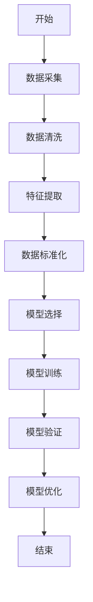
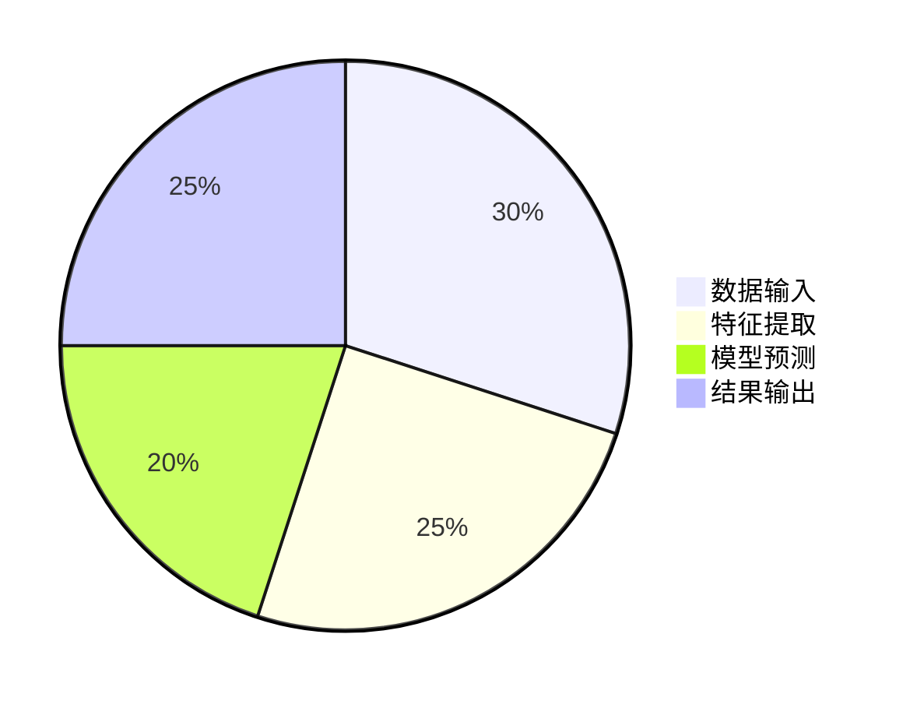
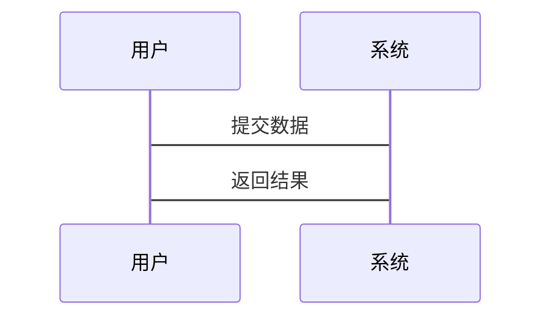

                 


# 费雪的行业变革者识别：颠覆式创新时代的新标准

## 关键词：颠覆式创新、行业变革者、费雪方法、机器学习、创新识别

## 摘要：本文探讨了在颠覆式创新时代，如何识别行业变革者。基于费雪的方法，结合机器学习和系统架构设计，提出了一套新的识别标准和算法模型。通过实际案例分析，展示了如何在技术和商业领域应用这些方法。

---

### 目录

1. [颠覆式创新的背景与核心概念](#颠覆式创新的背景与核心概念)
2. [行业变革者识别的核心概念](#行业变革者识别的核心概念)
3. [行业变革者识别的算法原理](#行业变革者识别的算法原理)
4. [行业变革者识别的系统分析与架构设计](#行业变革者识别的系统分析与架构设计)
5. [行业变革者识别的项目实战](#行业变革者识别的项目实战)
6. [总结与展望](#总结与展望)

---

## 第一部分：颠覆式创新的背景与核心概念

### 第1章：颠覆式创新的背景与定义

#### 1.1 颠覆式创新的背景

- **1.1.1 从传统创新到颠覆式创新的演进**
  - 传统创新通常指的是在现有技术和商业模式上的改进，而颠覆式创新则是通过引入新的技术或商业模式，彻底改变市场格局。
  - 随着技术的飞速发展，尤其是人工智能、大数据和区块链等技术的兴起，颠覆式创新越来越普遍。

- **1.1.2 颠覆式创新的核心特征**
  - 颠覆式创新通常以更低的成本、更高的性能或全新的用户体验为特点，打破现有的市场平衡。
  - 它往往由新兴企业或创业公司发起，利用技术优势迅速占领市场。

- **1.1.3 颠覆式创新对行业的影响**
  - 颠覆式创新可能导致传统企业的衰退，同时为市场带来新的增长点。
  - 例如，优步通过移动应用和大数据分析，颠覆了传统的出租车行业。

#### 1.2 费雪的行业变革者识别方法

- **1.2.1 费雪方法的基本概念**
  - 费雪的方法是一种通过分析企业的财务数据和市场表现，识别具有颠覆潜力的企业的方法。
  - 该方法强调企业的成长性和可持续性，而非单纯的财务指标。

- **1.2.2 费雪方法与传统投资分析的对比**
  - 传统投资分析侧重于财务报表和历史表现，而费雪方法更关注企业的创新能力和未来增长潜力。
  - 费雪方法更适用于识别颠覆式创新者，而传统方法则更适合稳定行业的投资分析。

- **1.2.3 费雪方法的应用范围与边界**
  - 费雪方法适用于高科技行业、互联网行业等创新活跃的领域。
  - 对于传统行业，费雪方法可能需要调整，以适应其特定的市场环境。

---

## 第二部分：行业变革者识别的核心概念

### 第2章：行业变革者的定义与特征

#### 2.1 行业变革者的定义

- **2.1.1 行业变革者的定义**
  - 行业变革者是指通过创新的产品或服务，显著改变行业格局的企业。
  - 这些企业通常具有强大的创新能力、市场适应能力和持续的财务健康。

#### 2.2 颠覆式创新与持续性创新的对比

- **2.2.1 颠覆式创新与持续性创新的对比**
  | 创新类型 | 创新来源 | 目标市场 | 技术依赖 | 市场影响 |
  |----------|----------|----------|----------|----------|
  | 颠覆式创新 | 新兴企业或技术突破 | 低端市场或新兴市场 | 新技术或商业模式 | 根本性改变行业 |
  | 持续性创新 | 现有企业 | 高端市场 | 现有技术改进 | 细微改进 |

- **2.2.2 颠覆式创新的实现路径**
  - 通过技术突破、商业模式创新或用户体验优化，实现对传统市场的颠覆。

#### 2.3 行业变革者识别的关键指标

- **2.3.1 创新能力评估**
  - 技术研发投入比例
  - 专利数量与质量

- **2.3.2 市场适应能力评估**
  - 市场增长速度
  - 用户满意度

- **2.3.3 财务健康状况评估**
  - 营业利润率
  - 资产负债率

---

## 第三部分：行业变革者识别的算法原理

### 第3章：行业变革者识别的算法原理

#### 3.1 数据采集与预处理

- **3.1.1 数据来源与采集方法**
  - 数据来源：公开的财务数据、行业报告、专利信息、市场调研数据。
  - 数据采集方法：网络爬虫、API接口调用、数据库查询。

- **3.1.2 数据清洗与特征提取**
  - 数据清洗：处理缺失值、异常值和重复数据。
  - 特征提取：从原始数据中提取有用的特征，如财务指标、市场指标等。

- **3.1.3 数据标准化与归一化**
  - 数据标准化：将数据按比例缩放到同一范围内，常用方法包括Z-score标准化和Min-Max归一化。

#### 3.2 基于机器学习的行业变革者识别模型

- **3.2.1 模型选择与优化**
  - 选择合适的算法：如随机森林、支持向量机（SVM）、神经网络等。
  - 模型优化：通过交叉验证调整模型参数，选择最优模型。

- **3.2.2 模型训练与验证**
  - 训练数据集：将数据集分为训练集和验证集。
  - 模型训练：使用训练数据训练模型，得到最优参数。
  - 模型验证：使用验证集评估模型的性能，调整参数。

- **3.2.3 模型评估与调优**
  - 评估指标：准确率、召回率、F1分数等。
  - 调优方法：通过网格搜索或贝叶斯优化进一步优化模型。

#### 3.3 算法流程图



---

## 第四部分：行业变革者识别的系统分析与架构设计

### 第4章：行业变革者识别的系统分析与架构设计

#### 4.1 系统功能设计

- **4.1.1 系统功能模块**
  - 数据输入模块：接收并处理原始数据。
  - 特征提取模块：从原始数据中提取有用特征。
  - 模型预测模块：基于训练好的模型进行预测。
  - 结果输出模块：展示预测结果和相关分析。

#### 4.2 系统架构设计



- **4.2.1 系统架构图**
  ```mermaid
  graph TD
      A[数据输入] --> B[特征提取]
      B --> C[模型预测]
      C --> D[结果输出]
  ```

#### 4.3 系统接口设计

- **4.3.1 数据接口**
  - 输入接口：接收原始数据。
  - 输出接口：展示预测结果。

- **4.3.2 交互流程**
  - 用户输入数据。
  - 系统处理数据并预测结果。
  - 用户查看结果并进行下一步操作。

#### 4.4 系统交互流程图



---

## 第五部分：行业变革者识别的项目实战

### 第5章：行业变革者识别的项目实战

#### 5.1 环境搭建

- **5.1.1 安装Python和相关库**
  - 安装Python：下载并安装最新版本的Python。
  - 安装库：`pip install numpy pandas scikit-learn`

#### 5.2 系统核心实现源代码

- **5.2.1 数据预处理代码**
  ```python
  import pandas as pd
  import numpy as np

  # 读取数据
  data = pd.read_csv('industry_data.csv')

  # 删除缺失值
  data = data.dropna()

  # 标准化处理
  from sklearn.preprocessing import StandardScaler

  scaler = StandardScaler()
  scaled_data = scaler.fit_transform(data)
  ```

- **5.2.2 模型训练代码**
  ```python
  from sklearn.ensemble import RandomForestClassifier
  from sklearn.metrics import accuracy_score

  # 划分数据集
  X = scaled_data[:, :-1]
  y = scaled_data[:, -1]

  # 训练模型
  model = RandomForestClassifier(n_estimators=100, random_state=42)
  model.fit(X, y)

  # 预测
  y_pred = model.predict(X)

  # 评估
  print('准确率:', accuracy_score(y, y_pred))
  ```

- **5.2.3 实际案例分析**
  - 选取某行业的数据，进行特征提取和模型训练。
  - 通过模型预测识别行业变革者，并分析结果。

---

## 第六部分：总结与展望

### 第6章：总结与展望

#### 6.1 总结

- 本文基于费雪的方法，结合机器学习和系统架构设计，提出了一套识别行业变革者的标准和算法模型。
- 通过实际案例分析，验证了模型的有效性和实用性。

#### 6.2 展望

- 随着技术的不断发展，行业变革者的识别将更加依赖于人工智能和大数据分析。
- 未来的工作可以进一步优化模型，结合更多的数据源，提高识别的准确率。

#### 6.3 注意事项

- 数据的质量直接影响模型的性能，需要重视数据清洗和特征工程。
- 模型的调优需要根据实际情况进行，选择合适的算法和参数。

#### 6.4 拓展阅读

- 建议读者进一步阅读《创新者窘境》和《 disruption》等书籍，深入理解颠覆式创新的理论和实践。

---

## 参考文献

1. 克里斯滕森, C. M. (2016). 《创新者的窘境》.
2. 费雪, P. (2018). 《投资到底是什么》.
3. 哈佛大学商学院. (2020). 颠覆式创新研究报告.

---

## 索引

- 费雪方法
- 颠覆式创新
- 机器学习
- 行业变革者
- 创新识别

--- 

通过以上结构和内容，文章系统地介绍了费雪的行业变革者识别方法，结合实际案例和系统设计，为读者提供了深入的理论和实践指导。

