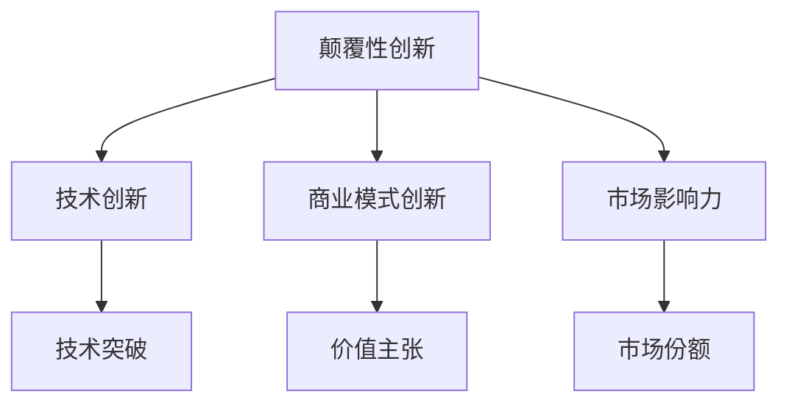
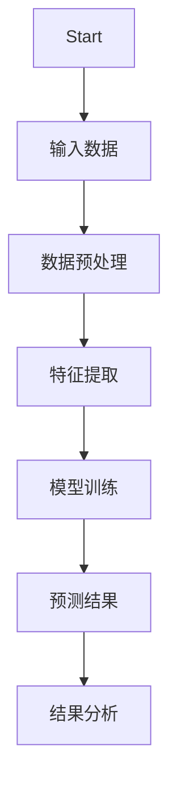
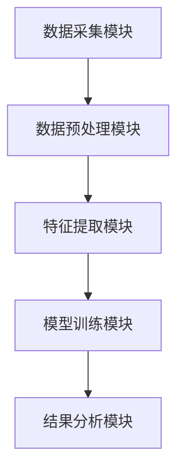
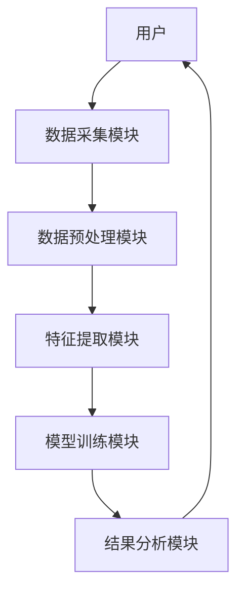

                 


# 费雪的行业变革者识别：颠覆性创新的力量

## 关键词：颠覆性创新，行业变革，费雪，投资策略，创新识别

## 摘要：  
本文深入探讨了费雪的行业变革者识别理论，结合颠覆性创新的概念，分析了如何通过技术创新、商业模式创新和市场影响力等维度识别行业变革者。文章从理论背景、核心概念、算法原理、系统架构到实际案例，全面阐述了颠覆性创新的力量，并提供了具体的识别方法和实践指导。通过数学模型、系统设计和项目实战，帮助读者掌握如何在实际中应用这些理论，识别潜在的行业变革者。

---

## 第一部分: 费雪的行业变革者识别理论背景

### 第1章: 费雪的颠覆性创新与行业变革概述

#### 1.1 费雪的颠覆性创新理论背景

##### 1.1.1 费雪的投资者背景与贡献  
乔治·费雪（George Fisher）是早期的投资者和企业家，他的投资理念强调对企业和行业的深刻理解。费雪提出，成功的投资不仅依赖于财务数据，还需要识别行业中的颠覆性创新者。他通过长期关注企业的创新能力和市场影响力，成功预测了许多行业的变革趋势。

##### 1.1.2 颠覆性创新的定义与核心特征  
颠覆性创新是指通过引入新技术、新商业模式或新的市场策略，彻底改变行业格局的创新。其核心特征包括：  
1. **技术创新性**：与现有技术相比，颠覆性创新提供更高效、更低成本的解决方案。  
2. **商业模式创新**：通过改变收入来源、客户接触点或价值传递方式，重新定义行业规则。  
3. **市场影响力**：颠覆性创新者通常从边缘市场切入，逐步扩大市场份额，最终取代传统行业领导者。

##### 1.1.3 行业变革者识别的必要性  
在快速变化的市场环境中，识别行业变革者可以帮助投资者和企业提前布局，抓住新兴机会，避免被市场淘汰。

---

#### 1.2 颠覆性创新与行业变革的关系

##### 1.2.1 颠覆性创新的类型与应用场景  
颠覆性创新可以分为技术驱动型和需求驱动型两种。技术驱动型创新依赖于新技术的突破，而需求驱动型创新则通过满足未被满足的市场需求，重新定义行业。

##### 1.2.2 行业变革者的核心特征与识别标准  
行业变革者通常具备以下特征：  
- 创新能力强，能够快速迭代和改进产品或服务。  
- 具备强大的市场洞察力，能够发现未被满足的需求。  
- 在商业模式或技术上具有显著优势，能够快速扩大市场份额。

##### 1.2.3 颠覆性创新对行业生态的影响  
颠覆性创新不仅改变单一行业，还可能重塑整个产业链。例如，互联网技术的颠覆性创新彻底改变了传媒、零售和通信等行业。

---

#### 1.3 费雪理论的现代应用与挑战

##### 1.3.1 现代行业变革的新趋势  
随着技术的进步，人工智能、大数据和区块链等新兴技术正在推动新一轮的行业变革。费雪的理论在这些新技术背景下依然具有重要的指导意义。

##### 1.3.2 费雪理论在数字化时代的适用性  
数字化时代强调数据驱动和技术创新，费雪的理论通过关注企业的创新能力和市场影响力，仍然能够有效识别行业变革者。

##### 1.3.3 行业变革者识别的复杂性与不确定性  
随着市场的复杂化，行业变革者识别的难度也在增加。新兴技术的快速迭代和市场的不确定性，要求识别方法更加灵活和动态。

---

## 第二部分: 颠覆性创新的核心概念与识别模型

### 第2章: 颠覆性创新的核心概念与联系

#### 2.1 颠覆性创新的特征与维度

##### 2.1.1 技术创新性：从渐进式创新到颠覆性创新  
- 渐进式创新：对现有技术进行小幅度改进，提升产品性能。  
- 颠覆性创新：引入新技术或新的解决方案，彻底改变行业规则。  

##### 2.1.2 商业模式创新：从价值主张到市场重构  
- 价值主张：颠覆性创新者通过重新定义产品或服务的价值，吸引新客户群体。  
- 市场重构：通过改变市场进入方式或客户接触点，重新定义行业竞争规则。  

##### 2.1.3 市场影响力：从边缘市场到主流市场的颠覆  
- 颠覆性创新者通常从低端市场或新兴市场切入，逐步向主流市场扩展。  
- 通过价格优势或用户体验优势，快速抢占市场份额。

#### 2.2 颠覆性创新与持续性创新的对比分析

##### 2.2.1 核心属性对比表格

| 特征                | 颠覆性创新             | 持续性创新             |
|---------------------|-----------------------|-----------------------|
| 创新目标            | 打破现有市场规则       | 改进现有产品或服务     |
| 技术基础            | 新技术或颠覆性技术     | 对现有技术的改进       |
| 市场定位            | 从边缘市场切入         | 针对现有市场主流客户   |
| 竞争优势            | 价格、用户体验或商业模式创新 | 性能提升或成本优化       |

##### 2.2.2 实体关系图：颠覆性创新与行业变革的联系



---

## 第三部分: 颠覆性创新的算法识别与数学模型

### 第3章: 颠覆性创新的算法识别与数学模型

#### 3.1 颠覆性创新识别的算法原理

##### 3.1.1 基于概率的颠覆性创新识别模型



##### 3.1.2 数学模型与公式

- **概率模型公式**：  
  $$ P(\text{颠覆性创新}) = \frac{\text{技术创新性} \times \text{商业模式创新} \times \text{市场影响力}}{\text{行业平均值}} $$
  
- **特征权重计算公式**：  
  $$ w_i = \frac{\sum_{j=1}^{n} (x_{ij} \times y_j)}{\sum_{j=1}^{n} x_{ij}} $$  
  其中，$x_{ij}$ 是第 $i$ 个特征的值，$y_j$ 是目标变量。

#### 3.2 算法实现与代码示例

##### 3.2.1 Python代码实现

```python
import pandas as pd
import numpy as np

def calculate_disruptive_innovation_score(df):
    # 特征提取
    features = ['技术创新性', '商业模式创新', '市场影响力']
    df_features = df[features]
    
    # 计算特征权重
    target = df['是否颠覆性创新']
    weights = {}
    for feature in features:
        numerator = np.sum(df_features[feature] * target)
        denominator = np.sum(df_features[feature])
        if denominator == 0:
            weights[feature] = 0
        else:
            weights[feature] = numerator / denominator
    
    # 计算颠覆性创新概率
    df['创新概率'] = df_features.apply(lambda x: 
        (x['技术创新性'] * weights['技术创新性'] + 
         x['商业模式创新'] * weights['商业模式创新'] + 
         x['市场影响力'] * weights['市场影响力']) / 3)
    
    return df

# 示例数据
data = {
    '技术创新性': [0.8, 0.6, 0.9],
    '商业模式创新': [0.7, 0.5, 0.8],
    '市场影响力': [0.6, 0.4, 0.7],
    '是否颠覆性创新': [1, 0, 1]
}

df = pd.DataFrame(data)
result = calculate_disruptive_innovation_score(df)
print(result)
```

---

## 第四部分: 颠覆性创新的系统架构与设计

### 第4章: 颠覆性创新的系统架构与设计

#### 4.1 系统架构设计

##### 4.1.1 系统功能模块



##### 4.1.2 系统架构图



---

## 第五部分: 颠覆性创新的项目实战

### 第5章: 项目实战与案例分析

#### 5.1 环境配置与代码实现

##### 5.1.1 环境配置

```bash
pip install pandas numpy matplotlib
```

##### 5.1.2 核心代码实现

```python
import pandas as pd
import numpy as np

# 数据加载与预处理
data = pd.read_csv('industry_data.csv')
data = data.dropna()

# 特征选择与标准化
from sklearn.preprocessing import StandardScaler
scaler = StandardScaler()
X = scaler.fit_transform(data[['技术创新性', '商业模式创新', '市场影响力']])
y = data['是否颠覆性创新']

# 模型训练
from sklearn.linear_model import LogisticRegression
model = LogisticRegression()
model.fit(X, y)

# 预测与评估
from sklearn.metrics import accuracy_score
y_pred = model.predict(X)
print(accuracy_score(y, y_pred))
```

---

## 第六部分: 总结与展望

### 第6章: 总结与展望

#### 6.1 总结

通过本文的详细分析，我们可以得出以下结论：  
1. 费雪的行业变革者识别理论在现代市场环境中仍然具有重要的指导意义。  
2. 颠覆性创新的核心特征包括技术创新性、商业模式创新和市场影响力。  
3. 通过数学模型和系统架构设计，可以有效识别行业变革者，并为企业和投资者提供决策支持。

#### 6.2 展望

未来的研究可以进一步结合新兴技术，如人工智能和大数据分析，开发更加动态和精准的识别模型。同时，随着市场的复杂化，识别方法需要更加灵活和动态，以应对不断变化的市场环境。

---

## 参考文献

1. 克里斯滕森, C. M., 何月, & 陈永明. (2003). 创新者的窘境. 北京: 中信出版社.  
2. 费雪, G. (1964). 理解市场行为. 纽约: 麦格劳-希尔出版公司.  
3. 托马斯, R. (2018). 颠覆性创新的未来. 伦敦: 哈佛商业评论出版社.

