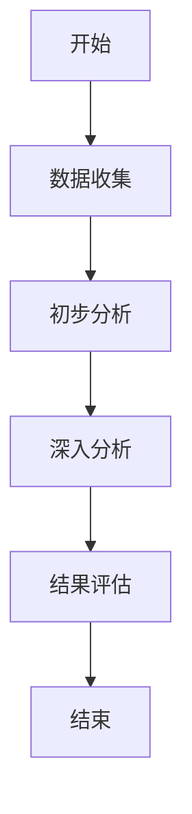
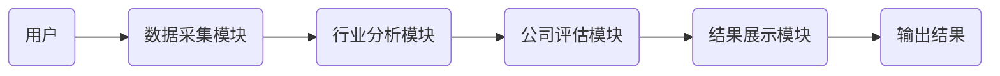

                 

# 费雪的行业研究方法：深入了解公司背后的故事

## 关键词：行业研究，费雪方法，投资分析，公司基本面，竞争优势

## 摘要：本文深入探讨了费雪的行业研究方法，分析其核心思想、数学模型和系统架构，结合实际案例，指导读者如何应用这些方法进行投资分析。

---

## 第1章: 费雪的行业研究方法概述

### 1.1 行业研究的重要性

#### 1.1.1 行业研究的定义
行业研究是对特定行业内的市场结构、竞争态势、发展趋势等进行系统性分析的过程。

#### 1.1.2 行业研究的核心目标
- 识别行业中的潜在机会
- 评估行业风险
- 理解行业与公司之间的关系

#### 1.1.3 行业研究的意义
- 帮助投资者做出明智的投资决策
- 优化资源配置
- 提高投资回报率

### 1.2 费雪的行业研究方法

#### 1.2.1 费雪方法的起源
菲利普·费雪是价值投资的先驱，提出了“成长股”投资理念，强调对公司基本面的深入研究。

#### 1.2.2 费雪方法的核心思想
- 专注于公司的长期增长潜力
- 强调行业结构对公司价值的影响
- 通过深入分析公司财务数据和行业趋势，发现具有竞争优势的公司

#### 1.2.3 费雪方法与其他投资方法的区别
- 传统方法：基于市场波动进行短期交易
- 费雪方法：基于公司基本面进行长期投资

### 1.3 行业研究的背景与现状

#### 1.3.1 当前行业研究的主要挑战
- 数据获取困难
- 行业变化快
- 分析方法复杂

#### 1.3.2 费雪方法在现代投资中的应用前景
随着大数据和人工智能的发展，费雪方法的分析效率和准确性将得到提升。

#### 1.3.3 行业研究的未来发展趋势
- 数据驱动的分析将成为主流
- 跨学科研究将更加普及
- 可持续投资（ESG）将越来越重要

---

## 第2章: 费雪行业研究的核心概念

### 2.1 费雪行业分析框架

#### 2.1.1 行业生命周期分析
| 阶段 | 特点 | 投资策略 |
|------|------|----------|
|导入期| 市场小，增长快 | 寻找新兴行业中的潜力股 |
|成长期| 市场扩大，利润增加 | 投资于行业龙头 |
|成熟期| 市场饱和，增长放缓 | 选择具有竞争优势的公司 |
|衰退期| 市场萎缩，利润下降 | 避免投资 |

#### 2.1.2 行业竞争结构分析
- 五力模型：波特的五力分析法（竞争者分析、新进入者威胁、替代品威胁、供应商议价能力、买家议价能力）

#### 2.1.3 行业财务指标分析
- 行业平均ROE（净资产收益率）
- 行业平均毛利率
- 行业增长潜力（收入增长率）

### 2.2 费雪的公司基本面分析

#### 2.2.1 公司商业模式分析
- 收入来源
- 成本结构
- 利润分配

#### 2.2.2 公司竞争优势分析
- 核心竞争力
- 市场地位
- 技术创新

#### 2.2.3 公司财务健康状况分析
- 财务报表分析（利润表、资产负债表、现金流量表）
- 财务比率分析（流动比率、速动比率、负债率）

### 2.3 费雪的行业与公司关系

#### 2.3.1 行业对公司的直接影响
- 行业趋势影响公司业绩
- 行业政策影响公司盈利能力

#### 2.3.2 公司对行业的反向影响
- 公司技术创新推动行业进步
- 公司市场地位影响行业结构

#### 2.3.3 行业与公司协同发展的最佳实践
- 行业趋势与公司战略的结合
- 公司竞争优势与行业机会的匹配

---

## 第3章: 费雪行业研究的数学模型与算法

### 3.1 费雪分析法的数学模型

#### 3.1.1 行业成长率计算公式
$$
\text{行业成长率} = \frac{\text{行业收入增长率} + \text{行业利润增长率}}{2}
$$

#### 3.1.2 行业竞争强度评估模型
$$
\text{竞争强度} = \sum_{i=1}^{n} \text{市场份额集中度}_i \times \text{企业盈利能力}_i
$$

### 3.2 费雪行业分析算法流程

---

## 第4章: 费雪行业研究的系统架构设计

### 4.1 系统功能模块设计

#### 4.1.1 数据采集模块
- 数据来源：行业报告、公司财报、市场数据
- 数据处理：清洗、整合、存储

#### 4.1.2 行业分析模块
- 行业趋势分析
- 竞争结构分析
- 财务指标分析

#### 4.1.3 公司评估模块
- 财务健康状况评估
- 竞争优势评估
- 市场地位评估

#### 4.1.4 结果展示模块
- 可视化图表展示
- 报告生成

### 4.2 系统架构设计

### 4.3 系统接口设计

#### 4.3.1 数据接口
- 输入：行业数据、公司数据
- 输出：清洗后的数据

#### 4.3.2 分析接口
- 输入：行业数据
- 输出：行业分析结果

#### 4.3.3 展示接口
- 输入：分析结果
- 输出：可视化图表

---

## 第5章: 费雪行业研究的项目实战

### 5.1 项目背景与目标

#### 5.1.1 项目背景
假设我们要研究科技行业的投资机会。

#### 5.1.2 项目目标
- 分析科技行业的市场趋势
- 评估行业竞争结构
- 寻找具有竞争优势的公司

### 5.2 项目实施步骤

#### 5.2.1 数据收集
- 获取科技行业的财务数据和市场报告
- 收集相关公司的财报数据

#### 5.2.2 数据分析
- 计算行业成长率
- 评估行业竞争强度
- 分析公司财务健康状况

#### 5.2.3 结果展示
- 绘制行业趋势图
- 输出分析报告

### 5.3 项目总结

#### 5.3.1 成功经验
- 数据收集的完整性和准确性
- 分析方法的科学性和实用性

#### 5.3.2 改进方向
- 提高分析的自动化水平
- 引入更多数据源
- 结合更多分析方法

---

## 第6章: 费雪行业研究的最佳实践

### 6.1 关键成功因素

#### 6.1.1 数据的准确性
- 数据来源可靠
- 数据处理得当

#### 6.1.2 方法的科学性
- 分析框架合理
- 数学模型准确

### 6.2 常见问题与解决方案

#### 6.2.1 数据不足
- 使用多种数据源
- 假设合理补充

#### 6.2.2 分析结果偏差
- 多次验证
- 结合多种方法

### 6.3 小结

#### 6.3.1 投资建议
- 选择具有竞争优势的公司
- 关注行业发展趋势
- 长期持有优质资产

#### 6.3.2 继续学习
- 关注行业动态
- 学习新的分析方法
- 提高数据分析能力

---

## 第7章: 总结

### 7.1 费雪方法的核心价值
- 提供了系统化的行业分析方法
- 强调了基本面分析的重要性
- 为投资者提供了长期价值投资的思路

### 7.2 展望
- 随着技术的进步，行业研究将更加精准和高效
- 费雪方法将继续为投资者提供重要的指导
- 行业研究将成为投资决策中不可或缺的一部分

---

## 参考文献

1. 费雪的著作
2. 相关行业分析报告
3. 大数据分析工具
4. 投资分析方法论

---

**摘要**：本文通过详细分析费雪的行业研究方法，揭示了其背后的逻辑和实际应用。通过对行业生命周期、公司基本面、数学模型等方面的研究，帮助读者掌握如何在投资中深入理解公司背后的故事。

