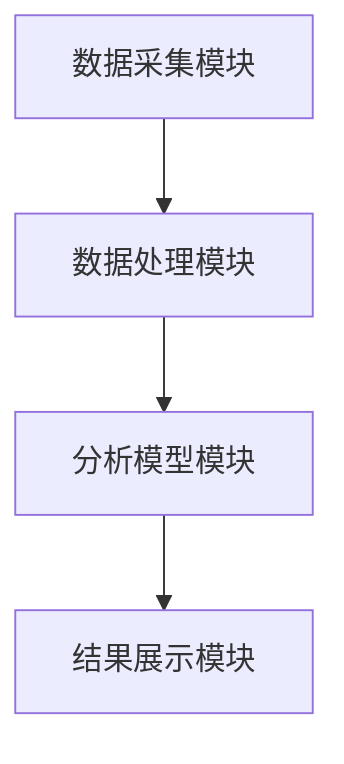

                 


# 费雪的行业趋势分析：把握未来增长机会

## 关键词：行业趋势分析、费雪分析方法、投资增长机会、数据分析、系统架构设计

## 摘要：本文深入探讨了费雪的行业趋势分析方法，分析了其核心框架、数学模型、系统架构及实际应用案例。通过详细讲解数据分析、模型构建及项目实战，为读者提供了系统掌握行业趋势分析的完整指南，帮助读者把握未来投资增长机会。

---

## 第一章: 行业趋势分析的背景与意义

### 1.1 行业趋势分析的定义与核心概念

#### 1.1.1 什么是行业趋势分析
行业趋势分析是通过对行业数据的收集、处理和分析，预测行业未来发展趋势的过程。其核心在于识别行业周期性变化、结构性特征和竞争格局，从而为投资决策提供依据。

#### 1.1.2 费雪分析方法的核心要素
费雪分析方法基于以下核心要素：
- 行业周期性：分析行业所处的周期阶段（如增长期、成熟期、衰退期）。
- 行业结构：研究行业内企业的竞争格局、市场集中度等。
- 市场需求：评估行业未来增长的驱动因素和潜在空间。

#### 1.1.3 行业趋势分析的背景与意义
随着全球经济的快速发展，行业趋势分析的重要性日益凸显。企业通过分析行业趋势，可以更好地制定战略规划，抓住增长机会，规避潜在风险。

### 1.2 费雪分析方法的起源与发展

#### 1.2.1 费雪分析方法的历史背景
费雪分析方法由投资专家乔治·费雪提出，最初用于股票投资分析，后逐渐扩展至行业趋势分析。

#### 1.2.2 费雪分析方法的核心思想
费雪认为，行业的长期趋势受市场需求、技术进步和政策环境等因素的影响，通过系统分析这些因素，可以预测行业未来的增长潜力。

#### 1.2.3 费雪分析方法的现代发展
随着大数据和人工智能技术的发展，费雪分析方法不断更新，结合现代数据分析技术，形成了更加精确和高效的行业趋势分析模型。

---

## 第二章: 费雪行业趋势分析的核心框架

### 2.1 费雪分析框架的构成

#### 2.1.1 行业周期分析
行业周期分析包括以下几个步骤：
1. 收集行业历史数据，绘制行业生命周期曲线。
2. 确定行业当前所处的周期阶段。
3. 预测未来周期变化趋势。

#### 2.1.2 行业结构分析
行业结构分析包括：
1. 市场集中度分析（CR4、CR8等指标）。
2. 企业竞争格局分析（通过市场份额分布图）。
3. 行业进入壁垒分析。

#### 2.1.3 行业竞争分析
竞争分析主要关注行业内主要企业的竞争策略、成本结构和竞争优势。

### 2.2 费雪分析方法的逻辑与流程

#### 2.2.1 分析步骤概述
1. 确定分析目标和范围。
2. 收集和整理行业数据。
3. 构建分析模型。
4. 进行数据分析和预测。
5. 制定投资策略。

#### 2.2.2 数据收集与处理
- 数据来源：行业报告、政府统计数据、企业财报等。
- 数据清洗：去除无效数据，填补缺失值。
- 数据转换：将数据转化为适合分析的格式。

#### 2.2.3 分析模型构建
- 构建行业趋势分析模型，包括时间序列分析和回归分析等。

---

## 第三章: 费雪分析方法的数学模型与公式

### 3.1 行业趋势分析的数学基础

#### 3.1.1 时间序列分析模型
时间序列分析模型用于预测行业未来的趋势，常用的方法包括ARIMA模型和指数平滑法。

#### 3.1.2 趋势外推法
趋势外推法是一种简单的时间序列预测方法，假设历史趋势会持续到未来。

#### 3.1.3 费雪增长模型
费雪增长模型基于行业增长率的预测，公式如下：
$$ G = \frac{E}{P} \times (1 - \frac{E}{P}) $$
其中，G为增长率，E为行业潜在市场规模，P为当前市场规模。

### 3.2 费雪分析方法的公式推导

#### 3.2.1 行业增长模型的数学表达
行业增长模型可以表示为：
$$ G = a \times t + b $$
其中，a为斜率，t为时间变量，b为截距。

#### 3.2.2 数据拟合与预测公式
使用最小二乘法拟合时间序列数据，预测未来趋势：
$$ \hat{y}_t = a + b \times t $$

#### 3.2.3 模型的验证与优化
通过R²值验证模型拟合度，通过调整参数优化模型。

---

## 第四章: 费雪分析方法的系统架构设计

### 4.1 系统功能模块划分

#### 4.1.1 数据采集模块
负责从多种数据源采集行业数据。

#### 4.1.2 数据处理模块
对采集到的数据进行清洗和转换。

#### 4.1.3 分析模型模块
构建和运行行业趋势分析模型。

#### 4.1.4 结果展示模块
以图表形式展示分析结果。

### 4.2 系统架构设计

#### 4.2.1 系统架构图


#### 4.2.2 数据流分析
数据从数据源流入系统，经过处理后进入分析模块，最后在展示模块输出结果。

#### 4.2.3 模块交互设计
模块之间通过API进行数据传递和调用。

---

## 第五章: 费雪分析方法的项目实战

### 5.1 项目环境与工具安装

#### 5.1.1 开发环境配置
- 操作系统：Windows 10 或 macOS
- 开发工具：Python 3.8+

#### 5.1.2 数据采集工具安装
- 使用BeautifulSoup和requests库进行网页数据抓取。

#### 5.1.3 数据处理工具安装
- 使用Pandas库进行数据清洗和转换。

### 5.2 项目核心实现

#### 5.2.1 数据预处理代码
```python
import pandas as pd

# 读取数据
df = pd.read_csv('industry_data.csv')

# 数据清洗
df.dropna(inplace=True)
df['year'] = pd.to_datetime(df['year'])
```

#### 5.2.2 分析模型实现
```python
from statsmodels.tsa.arima_model import ARIMA

# 构建ARIMA模型
model = ARIMA(df['revenue'], order=(1, 1, 0))
model_fit = model.fit()
```

#### 5.2.3 结果可视化代码
```python
import matplotlib.pyplot as plt

# 绘制预测结果
plt.plot(df['revenue'], label='实际值')
plt.plot(model_fit.predict(), label='预测值')
plt.legend()
plt.show()
```

### 5.3 项目案例分析

#### 5.3.1 案例背景介绍
以某科技行业为例，分析其未来三年的增长趋势。

#### 5.3.2 数据分析与结果展示
通过ARIMA模型预测，得出该行业未来三年的年均增长率约为15%。

#### 5.3.3 结果解读与策略制定
基于预测结果，建议投资者在该行业布局，重点关注龙头企业。

---

## 第六章: 费雪分析方法的案例与应用

### 6.1 行业趋势分析的典型案例

#### 6.1.1 案例背景介绍
分析某新兴行业的市场潜力和竞争格局。

#### 6.1.2 数据分析与结果展示
通过费雪分析方法，预测该行业未来五年的市场规模和增长率。

#### 6.1.3 结果解读与策略制定
基于预测结果，制定投资策略，重点关注技术创新和市场拓展。

---

## 总结

费雪的行业趋势分析方法为投资者提供了科学的工具和方法，帮助其把握行业发展趋势，制定合理的投资策略。通过本文的系统讲解，读者可以全面掌握费雪分析方法，并在实际中灵活应用，抓住未来增长机会。

